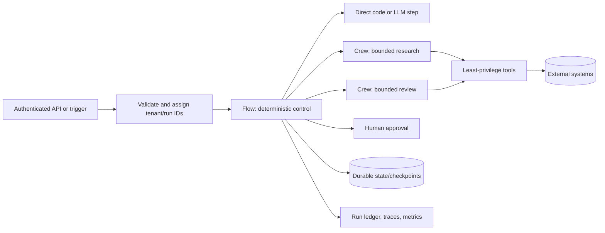

# CrewAI Production Engineering

> **Research date:** 2026-08-31  
> **Primary framework baseline:** CrewAI `1.15.18` (`4bc5d2924218e892bd0bc91b46352b49b0d3a740`)  
> **Status:** Current, source-verified, pass-two reviewed deep dive

CrewAI provides two complementary orchestration layers: **Crews** assign bounded tasks to role-oriented agents, while **Flows** make control, state, routing, persistence, and human pauses explicit. The safest production default is a Flow that owns the workflow and invokes small Crews only where multi-agent collaboration earns its cost.

This area goes beyond the [short CrewAI overview](../crewai.md). It documents current behavior, failure boundaries, operating practices, and version-sensitive limitations. Claims about runtime semantics were checked against the `1.15.18` source, not inferred from examples alone.

CrewAI-specific state, checkpoint, and event behavior should be interpreted through the repository's application-owned [agent state and event contract](../../runtime/agent-state-and-event-contracts.md). Framework persistence is an adapter to that contract, not its replacement.

## Start Here

| Need | Guide |
|---|---|
| Understand the runtime and choose Crews, Flows, or both | [Runtime and architecture](runtime-and-architecture.md) |
| Configure agents, tasks, guardrails, and Crew processes | [Agents, tasks, and Crews](agents-tasks-and-crews.md) |
| Build deterministic stateful orchestration | [Flows, events, and state](flows-events-and-state.md) |
| Connect tools, hooks, Skills, MCP servers, and retrieval corpora safely | [Tools, hooks, Skills, MCP, and knowledge](tools-mcp-and-knowledge.md) |
| Use the unified Memory API without confusing it with knowledge | [Memory and context](memory-and-context.md) |
| Survive restarts, fork runs, and operate HITL | [Persistence, resume, fork, and HITL](persistence-resume-fork-and-hitl.md) |
| Bound delegation and remote agent collaboration | [Delegation, processes, and A2A](delegation-processes-and-a2a.md) |
| Instrument and validate behavior | [Observability, testing, debugging, and evals](observability-testing-debugging-and-evals.md) |
| Control retries, concurrency, timeouts, and side effects | [Reliability, async, concurrency, and retries](reliability-async-concurrency-and-retries.md) |
| Enforce authorization, isolation, and data controls | [Security, permissions, and tenancy](security-permissions-and-tenancy.md) |
| Deploy and scale OSS or CrewAI AMP | [Deployment, scaling, and cost](deployment-scaling-and-cost.md) |
| Upgrade safely and decide when another design fits better | [Versions, migrations, limitations, and alternatives](versions-migrations-limitations-and-alternatives.md) |

The underlying evidence, bounded issue review, and refresh triggers are in the [CrewAI deep-dive research packet](../../research/packets/crewai-deep-dive.md).

## A Practical Adoption Path

Do not enable every CrewAI feature at once. Build one vertical slice and add autonomy only when a test demonstrates value:

1. **Prove the task with ordinary code or one Agent.** Define one typed input, one typed output, a deadline, and a cost ceiling.
2. **Put control in a typed Flow.** Add explicit routes, terminal outcomes, and an application-owned run ID before adding persistence.
3. **Add one read-only tool.** Enforce authorization and output limits inside the tool, then test timeout, malformed data, and dependency failure.
4. **Add a small sequential Crew only if it beats the one-agent baseline.** Compare quality, latency, cost, tool calls, and failure rate on the same eval set.
5. **Add state persistence or runtime checkpoints for a named recovery objective.** Run kill-and-resume tests; do not infer recovery from a happy-path demo.
6. **Put writes behind proposal, policy, approval, and idempotent execution stages.** Reconcile timeout ambiguity against the target system.
7. **Load-test and canary the exact pinned runtime.** Include provider throttling, exporter failure, duplicate webhooks, and schema migration.

This sequence deliberately leaves Memory, hierarchical processing, delegation, A2A, and broad tool sets off until a measured requirement justifies them. The repository's canonical [evaluation-driven development](../../evaluation/evaluation-driven-development.md), [tool contracts](../../tools/tool-contracts.md), [durable execution](../../runtime/durable-execution.md), and [agent threat model](../../security/agent-threat-model.md) guides provide the framework-independent acceptance criteria.

## The Production Shape

Keep five responsibilities separate:

1. **Control:** Flow methods and routers decide what is eligible to run.
2. **Reasoning:** agents and Crews solve bounded, non-deterministic subproblems.
3. **Effects:** tools perform explicitly authorized reads or writes.
4. **Durability:** state snapshots or runtime checkpoints make recovery possible.
5. **Operations:** an application-owned ledger, metrics, traces, and approvals establish what actually happened.

## Core Decisions

| Decision | Production default | Change it when |
|---|---|---|
| Outer orchestrator | Typed Flow | One short Crew is the entire job |
| Crew process | Sequential | A manager genuinely improves dynamic work allocation |
| State | Pydantic model with schema version | A throwaway prototype has no resume/upgrade need |
| Persistence | Explicitly selected and tested | The run is synchronous, short, and safely restartable |
| Tools | Narrow typed wrappers, deny by default | Never for privileged writes |
| Tool failure policy | Raise for required effects | Degraded output is explicitly modeled and accepted |
| Memory | Off until a measured need exists | Repeated runs benefit from learned, governed facts |
| Delegation | Disabled for specialists | A bounded lead agent needs a small collaboration graph |
| Concurrency | Admission-controlled | Provider, tool, and effect budgets prove higher capacity |
| Human review | Before irreversible/high-impact effects | Policy permits fully automatic execution |

## Important Boundaries

- `@persist` saves **Flow state**. It does not by itself prove that a partially completed method or external side effect will not run again.
- runtime `CheckpointConfig` captures **framework execution state** for Crew, Flow, or Agent resume/fork. It is still not an exactly-once transaction with an external API.
- task context, knowledge, and memory solve different problems: explicit dependencies, authored retrieval, and learned run history respectively.
- output schemas and guardrails constrain representation; they do not establish factual truth, caller authorization, or permission to perform a side effect.
- event-bus records and traces improve diagnosis; neither should be the authoritative business ledger.
- local JSON, SQLite, LanceDB, and Chroma paths are local durability mechanisms, not automatic multi-replica or tenant-isolated infrastructure.
- AMP adds a managed control plane. Its deployment, RBAC, tracing, and HITL features do not remove the need for application-level authorization and effect idempotency.

## Minimum Production Checklist

### Design

- [ ] The outer workflow and every irreversible effect are explicit.
- [ ] Each Crew has a bounded deliverable, deadline, iteration limit, and budget.
- [ ] Parallel branches do not race on shared mutable state or the same effect key.
- [ ] Memory, knowledge, and task context each have a documented purpose.

### Reliability

- [ ] Inputs, state, task outputs, and tool arguments are typed and validated.
- [ ] Every write tool accepts an application idempotency key.
- [ ] Retry ownership is singular and retryable errors are classified.
- [ ] Crash points before and after effects/checkpoints are tested.
- [ ] Resume and fork behavior is verified on the exact pinned version.

### Security

- [ ] The application authenticates callers and derives tenant identity server-side.
- [ ] Tool credentials are scoped per environment and tenant where required.
- [ ] Remote content, MCP metadata, memory, and A2A messages are untrusted input.
- [ ] Retrieval filters and storage namespaces enforce isolation before model access.
- [ ] Traces, checkpoints, prompts, and outputs have redaction and retention policies.

### Operations

- [ ] Framework version, model, prompt/config revision, and tool revision are recorded.
- [ ] A durable run/effect ledger exists outside framework logs.
- [ ] Token, latency, tool, memory, checkpoint, approval, and error signals are monitored.
- [ ] Quality regression, contract, failure-injection, and restore tests gate releases.

## Version Posture

The `1.14`–`1.15` series changed checkpointing, executor internals, JSON-first projects, Flow runtime structure, tool caching, security behavior, and conversational Flows. Pin the exact CrewAI and provider dependency set, keep a lockfile, and test migrations against real persisted fixtures. The current package declares Python `>=3.10,<3.14` and pins `crewai-core` and `crewai-cli` to the same `1.15.18` version.

Earlier `1.15.x` material called conversational Flows experimental; `1.15.18` promotes them to stable. Revalidate the pinned API, persistence, and same-session concurrency behavior before treating that maturity label as a production guarantee.

## Primary Sources

- [CrewAI `1.15.18` changelog](https://github.com/crewAIInc/crewAI/blob/1.15.18/docs/v1.15.18/en/changelog.mdx)
- [CrewAI Flows documentation, version `1.15.18`](https://github.com/crewAIInc/crewAI/blob/1.15.18/docs/v1.15.18/en/concepts/flows.mdx)
- [CrewAI Crews documentation, version `1.15.18`](https://github.com/crewAIInc/crewAI/blob/1.15.18/docs/v1.15.18/en/concepts/crews.mdx)
- [CrewAI production architecture guide, version `1.15.18`](https://github.com/crewAIInc/crewAI/blob/1.15.18/docs/v1.15.18/en/concepts/production-architecture.mdx)
- [CrewAI source at tag `1.15.18`](https://github.com/crewAIInc/crewAI/tree/1.15.18)
