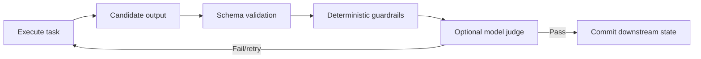
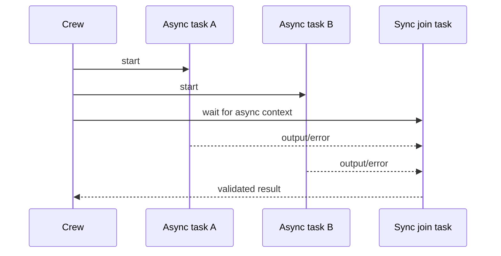

# Agents, Tasks, and Crews

> **Research date:** 2026-08-31  
> **Baseline:** CrewAI `1.15.18`

## Bottom Line

An Agent is a bounded reasoning and tool-use loop, a Task is its explicit contract, and a Crew is the execution policy over tasks. Production quality comes from narrow responsibilities, typed outputs, explicit context, least-privilege tools, and budgets—not elaborate role stories.

## Agent Contract

The familiar `role`, `goal`, and `backstory` fields shape prompting. They do not enforce authorization or determinism. The consequential controls are:

| Control | Use |
|---|---|
| `tools` | Small capability set required by the role |
| `max_iter` | Bound the reasoning/tool loop; default is 20 |
| `max_execution_time` | Attempt a wall-clock bound; see timeout limitation below |
| `max_rpm` | Per-agent request pacing; combine with global limits |
| `max_retry_limit` | Bound agent-level execution error retries; default is 2 |
| `allow_delegation` | Keep false for specialists; default is false |
| `respect_context_window` | Default summarization behavior when context grows |
| `planning_config` | Current Agent planning/replanning controls; set explicit attempt, step, replan, and timeout bounds |
| `planning` | Convenience flag; bare `True` maps to low-effort planning with one attempt in `1.15.18` |
| `reasoning` / `max_reasoning_attempts` | Deprecated compatibility fields; migrate to `planning_config` |
| `knowledge_sources` | Agent-specific authored retrieval corpus |
| `memory` | Agent-specific learned memory or inherited Crew memory |

Use one role per permission envelope. If an agent can both approve and execute a privileged action, prompt separation does not provide separation of duties.

## Agent Planning Versus Crew Planning

CrewAI exposes two different planning surfaces:

| Surface | What it changes | Production posture |
|---|---|---|
| Agent `planning_config` | Creates/refines a task plan and can observe/replan between steps | Use explicit bounds and the Agent's own or an explicitly selected planner LLM |
| Agent `planning=True` | Shortcut to `PlanningConfig(reasoning_effort="low", max_attempts=1)` at this baseline | Useful for a bounded experiment; still adds a planning call |
| Crew `planning=True` | Runs `CrewPlanner` before Crew task execution and appends the plan to tasks | Treat as a separate model stage with its own model, prompt, cost, and failure budget |
| Deprecated `reasoning=True` | Compatibility path that constructs `PlanningConfig` | Migrate; `max_reasoning_attempts=None` can leave refinement unbounded |

Bound planning explicitly rather than assuming `max_iter` covers every planner and observer call:

```python
from crewai import Agent
from crewai.agent.planning_config import PlanningConfig

researcher = Agent(
    role="Evidence researcher",
    goal="Return a small, cited evidence set for one question",
    backstory="A careful researcher who distinguishes evidence from inference.",
    planning_config=PlanningConfig(
        reasoning_effort="low",
        max_attempts=2,
        max_steps=6,
        max_replans=1,
        max_step_iterations=6,
        step_timeout=30,
    ),
    max_iter=8,
    allow_delegation=False,
)
```

`step_timeout` is checked by the step loop; it is not a process kill boundary for a blocking provider or tool. Keep transport deadlines and worker isolation below it.

There is versioned documentation drift at `1.15.18`: the Crew planning guide says its implicit planner is `gpt-4o-mini`, while tagged `CrewPlanner` source defaults to `gpt-5.4-mini`. Set `planning_llm` explicitly and record it with the run. Do not allow a hidden planner default to change provider, data residency, cost, or model behavior.

## Task Contract

A production Task should state:

- an observable deliverable in `description`;
- an unambiguous `expected_output`;
- the assigned agent;
- only the required tools;
- explicit upstream `context` tasks;
- a Pydantic or JSON output schema where downstream code consumes it;
- validation/guardrails;
- a timeout and retry/effect policy at the owning layer.

```python
class Finding(BaseModel):
    claim: str
    source_url: HttpUrl
    confidence: float = Field(ge=0, le=1)


class Findings(BaseModel):
    items: list[Finding]


research = Task(
    description="Find evidence for {question}; cite every material claim.",
    expected_output="A validated list of findings with source URLs.",
    agent=researcher,
    output_pydantic=Findings,
    tools=[read_only_search],
    guardrails=[sources_are_allowed, confidence_is_calibrated],
)
```

Wrapping the list in a Pydantic model keeps the Task output contract compatible with the documented `BaseModel`-based surface.

### Context is an explicit data edge

`context=[task_a]` supplies upstream task output to a downstream task. It is preferable to hoping that shared memory recovers a same-run dependency. Keep the dependency graph acyclic and inspect how much upstream output is inserted into prompts.

## Structured Output and Guardrails

`output_pydantic` and `output_json` validate shape. They do not establish truth, provenance, safety, or authority. Add deterministic validation for business rules and provenance.

Task guardrails can be callables or LLM-backed descriptions. Multiple guardrails run sequentially. When a guardrail rejects output, CrewAI can rerun the task up to `guardrail_max_retries` (default 3). That retry may repeat tool calls and writes.



Make tasks that perform side effects idempotent before enabling validation retries. A safer pattern separates proposal generation, validation/approval, and effect execution into different Flow methods.

Use schema validation to reject malformed output and deterministic guardrails for invariants. Use an LLM guardrail only for genuinely subjective criteria. Multiple `guardrails` run in order and the output from one can feed the next; if both `guardrail` and `guardrails` are set, the plural field takes precedence. Version and test that transformation chain like application code.

## Crew Processes

CrewAI currently exposes two main processes:

| Process | Behavior | Recommended use |
|---|---|---|
| `sequential` | Tasks follow declared order, with async task groups where configured | Default; auditable pipelines |
| `hierarchical` | A manager plans/delegates and validates worker output | Dynamic decomposition with measured benefit |

Hierarchical mode requires a manager LLM or custom manager agent. It adds another model-controlled loop, delegation paths, prompts, and cost. Bound manager iterations and give workers non-overlapping capabilities. The old “consensual” process found in historical material is not a current process option.

## Synchronous and Asynchronous Tasks

`async_execution=True` allows task work to overlap until a later synchronous task creates a barrier. Parallel tasks must not mutate the same Flow object, file, row, or external resource without coordination.



The native async path starts concurrent tasks but collects a group in task order. Verify sibling cancellation and partial effects under failure; do not infer transaction semantics from `async_execution`.

## Output and Failure Inspection

Crew outputs expose raw/structured task results, usage metrics, and tool-failure information. Tool failures can be configured to warn instead of fail the whole Crew, so a nonempty output is not necessarily a clean success. Inspect `has_tool_failures`/`tool_failures` and map them into the application's outcome model.

Define outcomes such as:

- `SUCCEEDED`: required output validated and all required effects confirmed;
- `DEGRADED`: explicitly optional capability failed, with safe partial result;
- `WAITING`: durable human or external dependency pending;
- `FAILED_RETRYABLE`: no unsafe effect ambiguity;
- `FAILED_AMBIGUOUS`: an effect may have happened and must be reconciled;
- `REJECTED`: policy or approval denied.

## Timeouts Are Not Hard Cancellation

In `1.15.18`, synchronous agent timeout execution uses a `ThreadPoolExecutor`, calls `future.cancel()` on timeout, and exits the executor context. Python cannot cancel a thread that is already running, and executor shutdown waits by default. Therefore `max_execution_time` is not a reliable kill boundary for blocking providers or tools and may leave effects running or delay return.

Use transport-level timeouts, cooperative cancellation, idempotent writes, and—when hard isolation is required—a worker process/container that can be terminated. Treat [issue #4135](https://github.com/crewAIInc/crewAI/issues/4135) as a still-relevant source-level limitation even though the report was closed as not planned.

## Crew Design Pattern

Keep Crews small:

1. a researcher with read-only retrieval;
2. an analyst with no external write tools;
3. optionally a reviewer using deterministic checks plus a model judge;
4. return one typed artifact to the Flow;
5. let the Flow authorize and invoke the write.

Avoid giving every agent every tool, enabling delegation everywhere, or asking one Crew to own a long business lifecycle.

Use the framework-independent [delegation and shared-state guide](../../orchestration/delegation-handoffs-and-shared-state.md) to decide whether another agent is warranted, and the [trajectory and reliability evaluation guide](../../evaluation/trajectory-and-reliability-evaluation.md) to test the resulting tool path rather than judging only the final prose.

## Production Checklist

- [ ] Each agent maps to one narrow responsibility and capability set.
- [ ] Every task has a typed, testable deliverable.
- [ ] Same-run dependencies use task context or Flow state, not memory discovery.
- [ ] Guardrail retries cannot duplicate uncontrolled side effects.
- [ ] Tool failures are checked even when kickoff returns output.
- [ ] Async tasks have independent state/effect keys and bounded fan-out.
- [ ] Hierarchical mode has a benchmarked advantage over sequential or one-agent design.
- [ ] Provider and tool timeouts exist below the agent-level timeout.

## Primary Sources

- [Agents documentation](https://github.com/crewAIInc/crewAI/blob/1.15.18/docs/v1.15.18/en/concepts/agents.mdx)
- [Tasks documentation](https://github.com/crewAIInc/crewAI/blob/1.15.18/docs/v1.15.18/en/concepts/tasks.mdx)
- [Crews documentation](https://github.com/crewAIInc/crewAI/blob/1.15.18/docs/v1.15.18/en/concepts/crews.mdx)
- [Processes documentation](https://github.com/crewAIInc/crewAI/blob/1.15.18/docs/v1.15.18/en/concepts/processes.mdx)
- [Agent timeout source](https://github.com/crewAIInc/crewAI/blob/1.15.18/lib/crewai/src/crewai/agent/core.py)
- [Agent planning configuration source](https://github.com/crewAIInc/crewAI/blob/1.15.18/lib/crewai/src/crewai/agent/planning_config.py)
- [Crew planning implementation](https://github.com/crewAIInc/crewAI/blob/1.15.18/lib/crewai/src/crewai/utilities/planning_handler.py)
