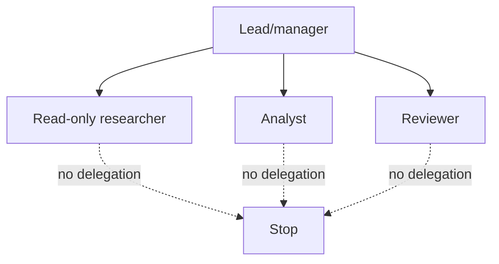

# Delegation, Processes, and A2A

> **Research date:** 2026-08-31  
> **Baseline:** CrewAI `1.15.18`

## Bottom Line

Delegation expands an agent's control graph and permission surface. Use it only when dynamic work allocation produces a measured quality gain. Keep specialists non-delegating, bound every conversation, validate remote output, and treat A2A agent cards and messages as untrusted network input.

## Local Collaboration

When `allow_delegation=True`, CrewAI equips an agent with collaboration tools to delegate work to and ask questions of coworkers. The model chooses when and how to use them. This is not deterministic routing.

Recommended topology:

- one lead or manager may delegate;
- specialists have `allow_delegation=False`;
- workers expose non-overlapping, least-privilege tools;
- the Flow owns deadlines, effects, approval, and terminal status;
- iteration, request, token, and wall-clock budgets cap the whole graph.

Allowing every agent to delegate can create cycles, repeated work, opaque ownership, and multiplicative cost. Role text does not prevent one worker from convincing another to use a privileged tool.

## Sequential Versus Hierarchical

Sequential Crews execute a declared task graph and are the default. Hierarchical Crews add a manager agent/LLM that allocates and validates work.

| Dimension | Sequential | Hierarchical |
|---|---|---|
| Control | Declared order/barriers | Model-directed manager loop |
| Predictability | Higher | Lower |
| Dynamic decomposition | Limited | Stronger |
| Cost and latency | Easier to bound | Additional manager calls/delegation |
| Debugging | Direct task graph | Requires manager decision trace |
| Recommended | Most production Crews | Open-ended decomposition with eval evidence |

Before adopting a hierarchy, compare it with a Flow router plus small sequential Crews. Explicit routing is often cheaper and easier to approve.

## Delegation Contract

Every delegated unit should contain:

- objective and expected typed result;
- allowed data classification and tenant scope;
- tool/capability allowlist;
- deadline and remaining budget;
- provenance/correlation ID;
- failure and escalation rule;
- prohibition on downstream delegation unless explicitly allowed.

Never delegate ambient credentials. Issue short-lived, audience-scoped capability tokens or keep effects behind an authorizing service.

## A2A Client

Install the optional A2A dependencies and use `A2AClientConfig` to connect an Agent to a remote agent card. The older `A2AConfig` is deprecated for removal in v2.0; use `A2AClientConfig` and `A2AServerConfig`.

Important client defaults:

| Setting | `1.15.18` default/meaning |
|---|---|
| `timeout` | 120 seconds |
| `max_turns` | 10 |
| `fail_fast` | `True`; connection/setup failure stops rather than silently omitting remote agent |
| `trust_remote_completion_status` | `False`; local logic retains completion control |
| `response_model` | Sends requested schema metadata and validates returned data locally |

A response schema is a request and parsing contract, not proof that the remote agent followed policy or used trustworthy data.

### Update mechanisms

A2A can receive progress through streaming, polling, or push notifications depending on configuration and server capabilities. For any mechanism:

- use one durable local task/run correlation ID;
- handle duplicates, reordering, and late updates;
- authenticate callbacks and validate signatures where supported;
- cap wait time and polling rate;
- query final state after uncertain transport failure;
- separate remote progress from locally accepted completion.

Keep `trust_remote_completion_status=False` unless the remote party and protocol semantics are explicitly trusted and verified.

## Agent Cards Are Supply-Chain Metadata

The remote card advertises endpoints, capabilities, skills, and security schemes. Validate:

- the original and redirected URL against an allowlist;
- TLS and hostname;
- card size/schema/version;
- advertised endpoint origins;
- expected authentication scheme and audience;
- capability/skill identifiers against local policy;
- cache TTL and rotation behavior.

Do not render a card's descriptions into a privileged model context without sanitization and policy filtering. Do not accept a card-provided token endpoint or callback destination outside allowed origins.

## A2A Authentication and Authorization

CrewAI supports client schemes including bearer, API key, OAuth2, and HTTP authentication, plus server-side authentication options. Authentication only establishes an identity according to that scheme; the receiving application must still authorize tasks, files, resources, and effects.

Avoid bearer token passthrough between services. Use token exchange or client credentials with explicit audience and scope. Propagate tenant and end-user context through signed, validated claims, not model-authored text.

Files sent through A2A become remote inputs. Enforce type, size, malware/content scanning, tenant policy, retention, and egress rules before transmission.

## Exposing an A2A Server

`A2AServerConfig` can expose an Agent with a card, server capabilities, skills, authentication, and optional push notifications. Production requirements include:

- explicit server authentication; never depend on a development token default;
- per-principal authorization and quotas;
- request body/file limits;
- bounded agent/tool execution and concurrency;
- signed outbound callbacks with destination allowlists;
- stable task IDs and idempotent submission;
- no sensitive details in public card skills;
- separate authenticated extended cards only when policy permits.

An A2A server turns an agent into a network service. Apply ordinary API gateway, abuse prevention, vulnerability management, and incident response controls.

## Local A2A Versus CrewAI AMP

The OSS client/server integration and AMP's A2A offering are separate operational surfaces. AMP documentation advertises distributed state, enterprise authentication, gRPC transport, and horizontal scaling. Do not attribute those guarantees to a local CrewAI process. Validate the current managed-service contract, region, retention, and identity integration before relying on them.

## Failure Model

| Failure | Required behavior |
|---|---|
| Card unavailable/invalid | Fail or use an explicitly approved fallback |
| Auth failure | Do not retry blindly; rotate/refresh through the owning auth flow |
| Timeout after submit | Reconcile by stable task ID; do not create duplicate work |
| Malformed output | Reject locally; preserve raw response under retention policy |
| Remote “completed” but validation fails | Local failure/review, not success |
| Duplicate push update | Idempotent state transition |
| Remote agent attempts new delegation | Enforce local policy/capability boundary |

Do not pass an A2A response directly into an effect tool. Normalize it into a local acceptance envelope containing remote task ID, remote agent/card revision, received timestamp, content hash, requested schema revision, local validation result, policy decision, and provenance references. Only the local Flow may convert that envelope into an approved next state.

Use the repository's [delegation, handoffs, and shared-state](../../orchestration/delegation-handoffs-and-shared-state.md) and [state/event contract](../../runtime/agent-state-and-event-contracts.md) guides to define that local envelope and monotonic update rules.

## Production Checklist

- [ ] Delegation has a benchmarked benefit and a bounded graph.
- [ ] Only lead/manager agents may delegate; specialists cannot.
- [ ] Whole-graph token, turn, time, and tool budgets exist.
- [ ] Remote cards/endpoints are allowlisted and validated.
- [ ] Credentials are audience-scoped and tenant claims are signed.
- [ ] Remote output is locally parsed, policy-checked, and treated as untrusted.
- [ ] A2A submit/update/resume paths are idempotent.
- [ ] OSS and managed AMP guarantees are documented separately.

## Primary Sources

- [Agent collaboration documentation](https://github.com/crewAIInc/crewAI/blob/1.15.18/docs/v1.15.18/en/concepts/collaboration.mdx)
- [Processes documentation](https://github.com/crewAIInc/crewAI/blob/1.15.18/docs/v1.15.18/en/concepts/processes.mdx)
- [A2A agent delegation guide](https://github.com/crewAIInc/crewAI/blob/1.15.18/docs/v1.15.18/en/learn/a2a-agent-delegation.mdx)
- [A2A implementation source](https://github.com/crewAIInc/crewAI/tree/1.15.18/lib/crewai/src/crewai/a2a)
- [CrewAI AMP A2A documentation](https://docs-platform.crewai.com/platform/en/features/a2a)
