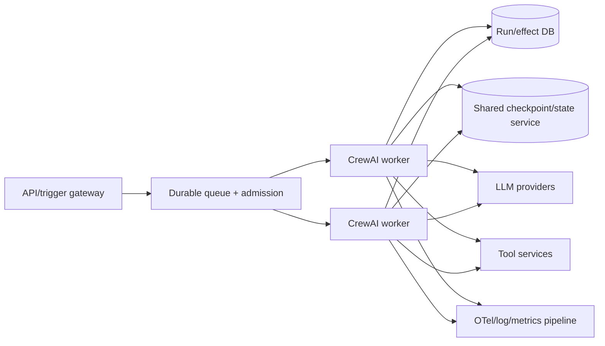
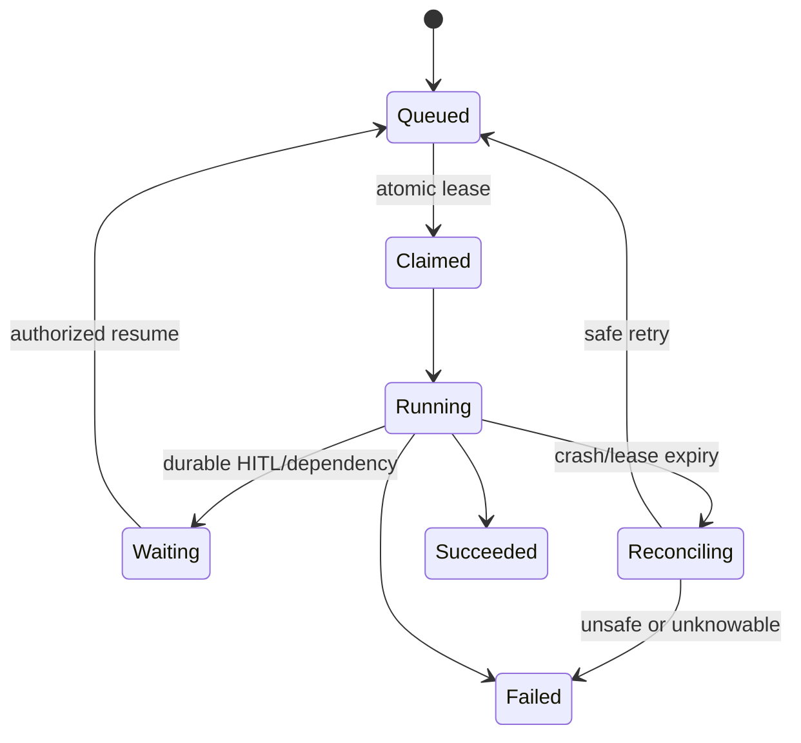

# Deployment, Scaling, and Cost

> **Research date:** 2026-08-31  
> **Baseline:** CrewAI `1.15.18`; current CrewAI AMP/Platform docs

## Bottom Line

Scale CrewAI as bounded run-scoped workers behind admission control. Move business truth and shared durability into operated services, keep local framework stores for development/single-host use, and budget model/tool fan-out before adding agents. CrewAI AMP provides a managed deployment/control plane, but application-level reliability and authorization still apply.

## Self-Managed Runtime



Recommended worker properties:

- one Flow/Crew runtime instance per run/session;
- bounded process concurrency and per-tenant quotas;
- no reliance on local replay/cache/state after rescheduling;
- graceful shutdown that stops admission, drains or checkpoints, and reconciles effects;
- independent transport timeouts and circuit breakers;
- immutable image and lockfile;
- egress allowlists and scoped credentials;
- health checks that distinguish process health from dependency readiness.

The queue owns delivery; the application owns run identity. Use a stable application `run_id` and a lease/claim record so redelivery does not create a second logical run. Lease expiry means “the previous worker is no longer trusted,” not “its external requests definitely stopped.” A replacement worker must load the ledger/checkpoint, reconcile `STARTED` or `AMBIGUOUS` effects, and only then resume eligible work.



## Local Storage Limits

Defaults such as JSON checkpoints, SQLite Flow/checkpoint storage, LanceDB Memory, and Chroma Knowledge are useful for development and some single-host services. Horizontal replicas need an explicitly designed shared or partitioned storage strategy.

Do not mount one local SQLite/JSON directory across arbitrary network filesystems without testing locking, atomicity, backup, latency, and corruption recovery. A managed database/run ledger should remain the authoritative system.

## Capacity Model

Estimate before load testing:

```text
run model calls
  = flow direct calls
  + sum(task attempts × agent iterations × calls/iteration)
  + manager/delegation calls
  + guardrail judge/retry calls
  + memory encode/recall calls
  + eval/tracing enrichment calls

run cost
  = input tokens × input price
  + output tokens × output price
  + embeddings
  + tool/MCP/A2A charges
  + storage/egress/observability
```

Concurrency capacity is limited by the tightest provider RPM/TPM, tool connection pool, database/checkpoint throughput, worker CPU/thread count, and tenant budget. Model latency has a long tail; size queues from measured distributions, not mean latency.

## Cost Levers

In order of impact:

1. remove unnecessary agents/tasks/delegation;
2. route simple cases to deterministic code or one direct call;
3. reduce context and structured output size;
4. use smaller models where evals prove adequate;
5. bound iterations, retries, turns, and parallel fan-out;
6. cache only safe stable reads;
7. use shallow memory recall unless deeper recall is justified;
8. sample diagnostic payloads while preserving errors/high-risk effects;
9. batch embeddings and offline evaluation;
10. canary model/prompt changes for cost and quality together.

## CrewAI AMP Deployment

AMP calls both Crews and Flows **automations**. Current documented deployment methods are:

- CrewAI CLI after `crewai login`;
- GitHub-connected web deployment;
- Crew Studio;
- API-triggered redeployment for CI/CD.

The platform requires a correct project structure and `uv.lock`. JSON-first Crew projects keep `crew.jsonc`, `agents/`, and optional `tools/`, `knowledge/`, and `skills/` at project root. Flow projects use their `src/<project>/main.py` entry point and embedded Crews. `[tool.crewai] type` must match.

The deployment API surface exposes `/inputs`, `/kickoff`, and `/status/{kickoff_id}` on the generated HTTPS endpoint, protected by a bearer token. Place it behind your own authenticated gateway when you need end-user identity, tenant mapping, quotas, request validation, or response policy.

AMP also documents execution history, metrics, traces, managed environment variables/LLM connections, tool repositories, SSO/RBAC, webhook streaming, and Flow HITL management. Verify plan/region/self-hosted Factory features and contractual SLO/retention separately.

## Webhook and Polling Integration

AMP webhook streaming can send batched or realtime events. Realtime mode sends each event immediately at a documented performance cost. HTTP delivery order is not guaranteed.

Consumer design:

- durable queue before processing;
- event and execution ID deduplication;
- monotonic state machine tolerant of reordering;
- signature/bearer verification and replay window;
- bounded payload size and redaction;
- retry/dead-letter policy;
- final `/status` reconciliation;
- no webhook event as sole proof of an external business effect.

Polling is simpler but needs backoff, maximum elapsed time, and stable kickoff IDs. A polling timeout does not mean the remote run stopped.

## Release and Rollback

Store a deployment manifest:

```text
CrewAI/CLI/core versions and Python version
lockfile/image digest
Flow/Crew/config/prompt/tool revisions
model provider and model revisions
state/checkpoint/memory/knowledge schema versions
feature flags and policy revision
deployment/tenant/environment identifiers
```

Use:

- offline migrations and restore fixtures;
- staged/canary deployment;
- shadow evaluation for behavior changes;
- drain before replacing workers;
- rollback only when persisted schemas remain compatible;
- forward-fix/migration when old code cannot read new state;
- reconciler for runs active during rollout.

Redeploying code from a Git-connected AMP automation pulls the latest configured repository state. Prefer immutable release refs and an explicit promotion workflow over deploying an unreviewed moving branch.

## Scaling HITL and Long Runs

Never keep a worker blocked for hours waiting on a person. Use non-blocking Flow feedback providers/pending state or AMP HITL. Store SLA/expiry and release compute resources. Resume through a queued, idempotent handler under the pinned revision or a tested compatible migration.

Long runs also need checkpoint retention, state-size limits, reconciliation, model/tool version posture, and a cancellation API that distinguishes “requested” from “all effects stopped.”

## Operational Readiness

| Area | Readiness evidence |
|---|---|
| Load | Measured p50/p95/p99 latency and rate-limit behavior |
| Durability | Kill/restart/restore tests and checkpoint failure alerts |
| Effects | Idempotency and ambiguity reconciliation |
| Data | Backup, restore, retention, deletion, tenant isolation |
| Security | Egress, credentials, RBAC plus application authorization |
| Cost | Per-run/tenant budget and anomaly alerts |
| Quality | Canary evals and rollback threshold |
| Dependencies | Circuit breaker, fallback, and dependency SLO |

The repository's [deployment, release, and incident-response](../../operations/deployment-release-and-incident-response.md), [model routing/cost/latency](../../operations/model-routing-cost-and-latency.md), and [durable execution](../../runtime/durable-execution.md) guides define the surrounding queue, release, and provider-control plane.

## Production Checklist

- [ ] Workers are run-scoped, bounded, drainable, and replaceable.
- [ ] Shared business/durability state is designed for replica topology.
- [ ] Admission control respects provider, tool, storage, and tenant limits.
- [ ] Lockfile/image/config/model revisions are immutable and recorded.
- [ ] AMP APIs sit behind application identity/tenant policy when required.
- [ ] Webhooks/polling are idempotent and reconciled with final state.
- [ ] Upgrade/rollback is proven with persisted fixtures and active runs.
- [ ] Quality, reliability, latency, and total cost all gate scaling changes.

## Primary Sources

- [CrewAI production architecture guide](https://github.com/crewAIInc/crewAI/blob/1.15.18/docs/v1.15.18/en/concepts/production-architecture.mdx)
- [CrewAI package metadata](https://github.com/crewAIInc/crewAI/blob/1.15.18/lib/crewai/pyproject.toml)
- [AMP deployment guide](https://docs-platform.crewai.com/platform/en/guides/deploy-to-amp)
- [AMP deployment preparation](https://docs-platform.crewai.com/platform/en/guides/prepare-for-deployment)
- [AMP introduction](https://docs.crewai.com/enterprise/introduction)
- [AMP webhook streaming](https://docs-platform.crewai.com/platform/en/features/webhook-streaming)
- [AMP OpenTelemetry export](https://docs-platform.crewai.com/platform/en/guides/capture_telemetry_logs)
