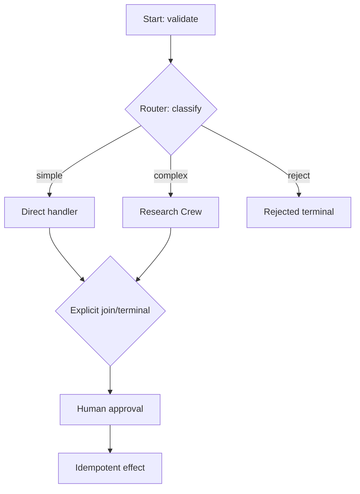

# Flows, Events, and State

> **Research date:** 2026-08-31  
> **Baseline:** CrewAI `1.15.18`

## Bottom Line

A Flow is CrewAI's explicit control plane. Use typed state, make routing conditions deterministic, model joins deliberately, and assume parallel listeners may finish in any order. The final return value is not a substitute for a named terminal result stored in state.

## Flow Primitives

| Primitive | Meaning |
|---|---|
| `@start()` | Entry method; multiple unconditional starts may run concurrently |
| `@listen(method)` | Runs after a method/event condition is satisfied |
| `@router(method)` | Runs after its trigger and emits a route label |
| `and_(...)` | Waits for all named conditions |
| `or_(...)` | Runs when a named condition wins |
| `@persist` | Saves Flow state after selected methods or every decorated method |
| `@human_feedback` | Pauses for a human response and persists pending context |

Routers for a completed method are evaluated sequentially before ordinary listeners, while eligible ordinary listeners can run in parallel. This ordering is useful for control decisions but does not serialize all downstream work.



## Typed State

Prefer Pydantic state for every resumable Flow:

```python
class WorkflowState(BaseModel):
    state_schema_version: int = 2
    id: UUID = Field(default_factory=uuid4)
    tenant_id: str
    input: Request
    route: Literal["simple", "complex", "reject"] | None = None
    findings: list[Finding] = Field(default_factory=list)
    terminal: TerminalResult | None = None
```

CrewAI creates an `id` when state lacks one. In production, explicitly model identity, tenant, schema version, and terminal outcome. Never store live clients, file handles, credentials, or unbounded raw model transcripts in state.

Pydantic state also protects schema evolution better than unstructured dict state. A current open regression, [issue #6706](https://github.com/crewAIInc/crewAI/issues/6706), reports that dict-state restore clears newly initialized defaults before applying old persisted data. Treat state migrations as application code and test old snapshots.

## Event Conditions and Joins

Flow conditions refer to method completion events and router labels. Route labels and method names share a condition namespace. In conversational Flows, name handlers `handle_*` rather than reusing the route label; direct self-listening is rejected.

### Do not rely on completion order

When multiple listeners become eligible, they can run concurrently. The Flow runtime's overall returned value can be the result of whichever method completes last. That is nondeterministic when branch latency varies.

Use an explicit join/terminal method and store a typed terminal result:

```python
@listen(and_(risk_review, policy_review))
def finalize(self):
    self.state.terminal = TerminalResult(
        status="ready",
        risk=self.state.risk,
        policy=self.state.policy,
    )
    return self.state.terminal
```

### OR conditions need effect discipline

Some racing listener paths start candidates concurrently and cancel remaining tasks when one succeeds. Cancellation is cooperative; it does not undo completed or blocking side effects. Use OR races only for read-only/speculative work, or make every candidate effect independently idempotent and compensatable.

## Multiple Starts

Multiple unconditional `@start()` methods may run in parallel unless the definition orders them. They must not mutate overlapping state. Prefer one deterministic validation start that fans out after immutable inputs are established.

## Error Propagation

Current runtime source re-raises listener exceptions. Do not rely on old docstrings or historical examples suggesting listener errors are swallowed. However, parallel siblings may already have run, and cancellation does not create rollback. Convert exceptions to a typed failure only at a boundary that can distinguish retryable, rejected, and ambiguous-effect outcomes.

The runtime applies a default `max_method_calls` of 100 to bound accidental loops. This is a safety ceiling, not a business retry policy. Set a lower appropriate bound and make intended cycles explicit.

## Events Are Signals, Not Commands

Flow method completion and route labels drive the internal graph. The broader `CrewAIEventsBus` emits framework events for observers. Event handlers can be synchronous or asynchronous; handler exceptions are logged rather than propagated into the workflow. Therefore:

- do not use an event handler as the only path for a required business write;
- do not assume handler completion before a run is declared successful unless explicitly awaited and tested;
- make exporters non-blocking and bounded;
- use event IDs for diagnostics, not as business transaction IDs;
- redact payloads before export.

## Usage Metrics

After a Flow kickoff, `flow.usage_metrics` aggregates LLM usage across direct calls and nested Crews observed during that run. The counters reset on the next kickoff. A returned Crew output's token usage may describe only that Crew/output path, so use the Flow aggregate for end-to-end cost and combine it with provider invoices.

For a session that pauses across processes, confirm how pre-pause usage is carried. The conversational runtime documents a limitation: pending context does not persist pre-pause usage totals for aggregation after resume.

## Streaming Contract

CrewAI `1.15.18` has two streaming surfaces that should not be conflated:

| Surface | Entrypoints | Output | Use |
|---|---|---|---|
| Runtime frame streaming | Flow `stream_events`/`astream`, direct LLM `stream_events`, conversational `stream_turn` | Ordered `StreamFrame` values with `llm`, `flow`, `tools`, and `messages` channel projections | UIs, service bridges, audit-friendly progress adapters |
| Crew chunk streaming | `Crew(stream=True).kickoff()` | `CrewStreamingOutput` chunks | Existing Crew token/chunk consumers |

The frame stream is one ordered observation timeline. Channel projections filter it without turning a diagnostic frame into authoritative workflow state.

```python
flow = Workflow()

with flow.stream_events(
    inputs={"tenant_id": tenant_id, "input": request.model_dump()}
) as stream:
    for sequence, frame in enumerate(
        stream.interleave(["flow", "tools", "llm"]), start=1
    ):
        publish_progress(
            run_id=str(flow.state.id),
            sequence=sequence,
            source_event_id=frame.id,
            channel=frame.channel,
            event_type=frame.type,
            content=redact(frame.content),
        )

terminal_result = stream.result
```

Consume the stream before reading `stream.result`; early access raises `RuntimeError` because the run may still be producing frames. Use the stream as a context manager, or call `close()`/`aclose()` when a client disconnects. Closing requests cancellation and releases stream resources; it does not roll back a tool call or prove all remote effects stopped.

Design the client boundary explicitly:

1. assign an application run ID before starting the Flow;
2. attach a monotonic application sequence when forwarding frames;
3. treat reconnect as “read snapshot, then resume events after sequence,” not “start the Flow again”;
4. persist terminal state in the run ledger separately from streamed text;
5. redact and bound tool/model content before fan-out;
6. reconcile the final result after disconnect or worker failure.

Map public UI events through the repository's canonical [state and event contract](../../runtime/agent-state-and-event-contracts.md) and [agent-user interaction protocol](../../protocols/agent-user-interaction-protocol.md); do not expose CrewAI's internal event objects as a permanent external API.

## Conversational Flows

Conversational Flows became stable in `1.15.18`; earlier `1.15.x` material correctly used an experimental namespace. Current APIs include `ConversationConfig`, `ConversationState`, `handle_turn`, and `stream_turn`, plus built-in routing, conversation, and end behavior.

Key operating rules:

- reuse one Flow instance only for one controlled conversation session;
- use `handle_turn` for complete turns and `stream_turn` for ordered stream frames;
- persist only at terminal turn boundaries when a canonical complete-turn snapshot is required;
- finalize deferred traces in a `finally` path with `finalize_session_traces()`;
- bound transcript growth and retain only policy-permitted content;
- never infer tenant identity from chat text or persisted state supplied by the caller.

Class-level `@persist` can save intermediate conversational state within a turn. That can be useful for recovery, but consumers must distinguish an incomplete checkpoint from a canonical completed turn.

## Declarative Flows

The declarative API compiles definitions into the same Flow runtime. It helps configuration-driven systems but does not remove runtime concurrency or security concerns. Validate definitions, reject unknown methods/routes, pin referenced components, and treat generated definitions as reviewed code.

## State Machine Review

For each method, document:

| Question | Required answer |
|---|---|
| Trigger | Exact start/listen/router condition |
| State reads | Fields and versions consumed |
| State writes | Fields written and conflict policy |
| External calls | Provider/tool plus timeout |
| Effects | Idempotency and reconciliation key |
| Failure | Retryable, terminal, waiting, or ambiguous |
| Persistence | Snapshot/checkpoint boundary |
| Observability | Run/method/effect correlation fields |

## Production Checklist

- [ ] A single start validates immutable identity and input fields.
- [ ] State is Pydantic, schema-versioned, bounded, and secret-free.
- [ ] Parallel methods do not write the same fields without a merge policy.
- [ ] All branch graphs have an explicit terminal/join result.
- [ ] OR races are read-only or cancellation-safe.
- [ ] Router labels cannot collide accidentally with method names.
- [ ] Event handlers are observational and their failures are monitored.
- [ ] Conversational turns persist at deliberate, documented boundaries.

## Primary Sources

- [Flows documentation](https://github.com/crewAIInc/crewAI/blob/1.15.18/docs/v1.15.18/en/concepts/flows.mdx)
- [Conversational Flows guide](https://github.com/crewAIInc/crewAI/blob/1.15.18/docs/v1.15.18/en/guides/flows/conversational-flows.mdx)
- [Flow runtime source](https://github.com/crewAIInc/crewAI/blob/1.15.18/lib/crewai/src/crewai/flow/runtime/__init__.py)
- [Flow DSL source](https://github.com/crewAIInc/crewAI/tree/1.15.18/lib/crewai/src/crewai/flow/dsl)
- [Event bus source](https://github.com/crewAIInc/crewAI/blob/1.15.18/lib/crewai/src/crewai/events/event_bus.py)
- [Streaming overview](https://github.com/crewAIInc/crewAI/blob/1.15.18/docs/v1.15.18/en/concepts/streaming.mdx)
- [Streaming runtime contract](https://github.com/crewAIInc/crewAI/blob/1.15.18/docs/v1.15.18/en/learn/streaming-runtime-contract.mdx)
