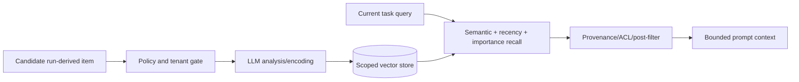
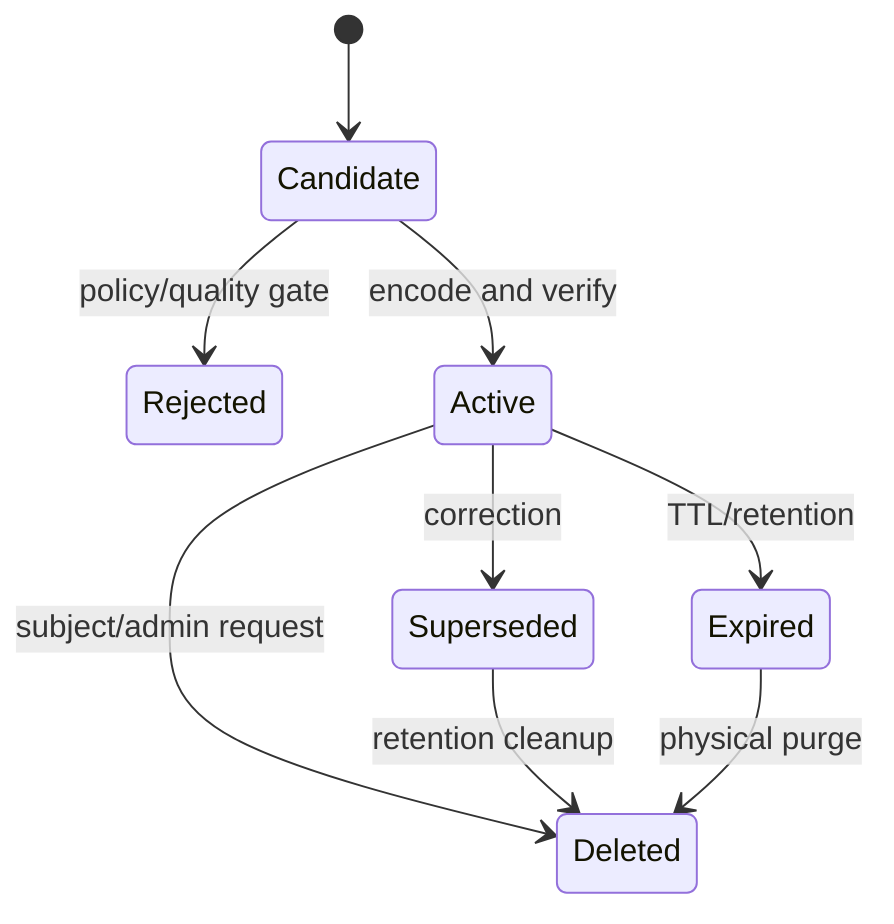

# Memory and Context

> **Research date:** 2026-08-31  
> **Baseline:** CrewAI `1.15.18` unified Memory API

## Bottom Line

Memory is an LLM-mediated, cross-run information system—not a transcript dump, database of record, authorization store, or guaranteed fact base. Start without it. Add only measured memories with provenance, tenant scope, retention, correction, and failure behavior.

## Current Memory Model

The unified `Memory` API supersedes the older short-term, long-term, entity, and external-memory model. It analyzes items at save time, derives metadata such as scope/category/importance, stores embeddings, and combines semantic similarity, recency, and importance during recall. A deeper recall flow can use additional model reasoning.



Memory can be used standalone or attached to a Crew, Agent, or Flow. `memory=True` creates a default memory. A Crew can share memory with agents unless an agent has its own memory view/configuration.

## Default Dependencies Matter

The documented default Memory embedder is OpenAI `text-embedding-3-large`, and local storage uses LanceDB under `./.crewai/memory` or `CREWAI_STORAGE_DIR`. This differs from Knowledge's documented default `text-embedding-3-small`.

Consequences:

- enabling memory may transmit stored content to the configured embedding/model providers;
- changing embedding dimensions requires reset or migration;
- local paths need backups, disk monitoring, permissions, and cleanup;
- a local database does not provide automatic distributed consistency or tenant authorization;
- Memory and Knowledge may have separate cost and migration profiles.

## Scopes and Slices

Memory supports hierarchical scopes and `MemorySlice` views. Scopes help organize recall, while slices can constrain read/write access to disjoint areas. Use server-derived scope names such as:

```text
environment/{env}/tenant/{tenant_id}/application/{app}/subject/{subject_id}
```

Do not accept a raw scope from model output or user input. A scope string is routing metadata, not authentication.

The “private” flag filters visibility based on the memory source, with `include_private=True` providing broader access. This is an application-level retrieval feature, not a security boundary. Enforce tenant and subject authorization before invoking Memory and, at higher risk, isolate stores and credentials.

## Save Semantics

Memory save is not just an append. The encoding/consolidation path can decide whether to insert, update, or delete related memories. That is useful for deduplication but means a model can mutate the remembered knowledge base.

Store:

- source run and event IDs;
- subject and tenant IDs;
- created/updated times and retention class;
- encoder/model/prompt revision;
- source evidence or a durable reference;
- confidence and verification state;
- correction/supersession links.

Do not store secrets, access tokens, one-time codes, raw privileged tool output, or sensitive personal data merely because recall would be convenient.

### Memory admission policy

Do not save every successful output. Decide before encoding:

| Candidate | Default | Why |
|---|---|---|
| Current authoritative business record | Do not save as Memory | Fetch it from the source of truth when needed |
| Stable user/team preference with consent | Save in subject/tenant scope | Useful across runs; must be correctable/deletable |
| Verified lesson from repeated failures | Save with evidence and expiry | May improve future planning; can become stale |
| One-off request detail | Keep in run context only | No cross-run value |
| Model inference or speculation | Reject or mark unverified | Semantic recall can amplify an unsupported claim |
| Secret, credential, privileged raw output | Reject | Memory expands persistence and provider exposure |
| Policy or authorization decision | Keep in policy/audit system | Memory is neither authoritative nor tamper-proof |

### Background writes

Bulk/background save uses a thread pool. Recall drains pending writes, and Crew kickoff drains its Memory work in finalization. Standalone users must call the documented drain/close lifecycle. Otherwise a process can exit before writes finish.

Memory failures are intentionally mixed:

- some LLM analysis failures degrade to defaults or are tolerated;
- storage/embedder failures may raise;
- background save errors can emit failure events without crashing the agent.

If memory is required for correctness, add an explicit verified write/read boundary and fail closed. If it is optional personalization, report degraded mode and continue without pretending the save succeeded.

## Recall Semantics

Recall ranking is relevance-oriented, not a factual guarantee. Deep recall can add LLM work and latency; short queries may skip parts of that flow. Bound the number and size of recalled items, preserve their provenance, and make downstream prompts distinguish memory from current authoritative data.

Before a high-impact decision:

1. retrieve candidate memories within an authorized scope;
2. reject expired, unverified, or superseded items;
3. verify important facts against a source of truth;
4. keep current request/task context higher priority;
5. record which memory IDs influenced the output.

## Memory Versus Context Engineering

Most context problems should be solved before adding memory:

- reduce task scope;
- pass typed upstream outputs;
- summarize deterministically where possible;
- retrieve from a curated Knowledge corpus;
- fetch current facts through authorized tools;
- select only relevant evidence;
- budget context by source and priority.

`respect_context_window=True` allows automatic summarization when an agent exceeds its context. Summaries can omit qualifiers and provenance. Treat them as lossy compression, test long runs, and prefer explicit bounded artifacts between tasks.

Use the repository's [context engineering](../../context-memory/context-engineering.md), [memory architecture](../../context-memory/memory-architecture.md), and [compaction and continuity](../../context-memory/compaction-and-continuity.md) guides to design the application-level evidence hierarchy and retention model around CrewAI Memory.

## Learning From Human Feedback

Human feedback can be saved into Memory to improve future behavior, but a verdict is not universal truth. Bind feedback to reviewer identity/role, policy version, target artifact, tenant, and scope. Separate:

- corrections to objective facts;
- preferences for one user/team;
- temporary incident guidance;
- binding policy maintained in an authoritative system.

Never turn a single approval into an unscoped global rule.

## Data Lifecycle



Provide delete-by-tenant, delete-by-subject, and rebuild procedures. Verify that backup, checkpoint, trace, and provider retention policies match deletion claims.

## Multi-Process and Multi-Replica Use

The local LanceDB default is well suited to development and some single-host workloads. Do not assume it is a globally coordinated multi-replica memory service. For distributed deployments, select an explicitly supported shared backend or wrap Memory behind a service with concurrency control, tenancy, backups, migrations, and SLOs. Test simultaneous writers and store-version compatibility.

## Cost Controls

Memory can add embedding, analysis, consolidation, deep recall, storage, and prompt-token costs. Measure:

- save candidates versus accepted memories;
- encoder LLM/embedding calls and latency;
- recall count, bytes, and prompt tokens;
- deep recall invocation rate;
- hit/usefulness and contradiction rate;
- stale/superseded retrieval rate;
- per-tenant storage growth.

## Production Checklist

- [ ] Memory is justified by a measured cross-run need.
- [ ] Scopes are server-derived and tenant/subject authorization precedes recall.
- [ ] Saved items carry provenance, version, retention, and verification state.
- [ ] Background writes are drained and failures are monitored.
- [ ] Important recalled facts are revalidated against authoritative data.
- [ ] Embedding/model changes have an index migration plan.
- [ ] Correction, deletion, expiration, backup, and rebuild paths are tested.
- [ ] Memory cost and quality metrics have explicit limits.

## Primary Sources

- [Memory documentation](https://github.com/crewAIInc/crewAI/blob/1.15.18/docs/v1.15.18/en/concepts/memory.mdx)
- [Unified Memory source](https://github.com/crewAIInc/crewAI/blob/1.15.18/lib/crewai/src/crewai/memory/unified_memory.py)
- [Memory encoding flow](https://github.com/crewAIInc/crewAI/blob/1.15.18/lib/crewai/src/crewai/memory/encoding_flow.py)
- [Memory recall flow](https://github.com/crewAIInc/crewAI/blob/1.15.18/lib/crewai/src/crewai/memory/recall_flow.py)
- [Knowledge documentation](https://github.com/crewAIInc/crewAI/blob/1.15.18/docs/v1.15.18/en/concepts/knowledge.mdx)
