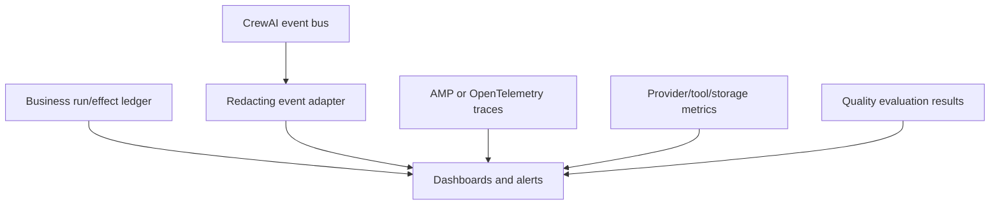
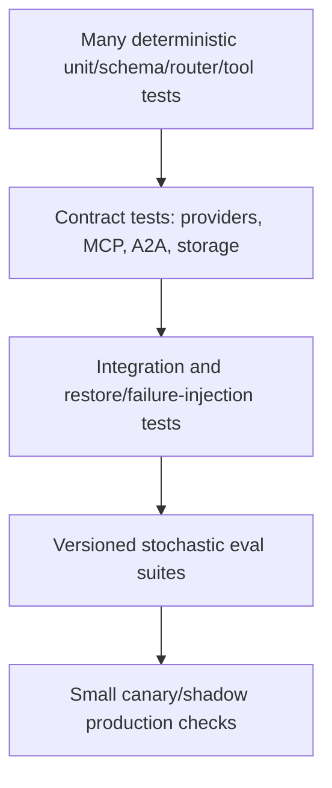

# Observability, Testing, Debugging, and Evals

> **Research date:** 2026-08-31  
> **Baseline:** CrewAI `1.15.18`

## Bottom Line

Observe the workflow at four levels: business run/effect state, CrewAI events, distributed traces, and provider/tool metrics. Test deterministic contracts separately from stochastic quality. `crewai test` is a useful model-judged signal, not a production regression suite by itself.

## Observability Model



### Authoritative versus diagnostic

| Signal | Role |
|---|---|
| Run/effect ledger | Authoritative workflow and side-effect state |
| Checkpoint lineage | Framework recovery and branch history |
| CrewAI events | Lifecycle diagnostics and adapters |
| Traces/logs | Request-level debugging and performance |
| Usage metrics | Framework-estimated tokens/calls/cost inputs |
| Provider invoices/metrics | External billing and service health |
| Evals | Release and quality evidence |

Events and traces can be delayed, dropped, duplicated, sampled, redacted, or exported unsuccessfully. They must not be the only record of an approval or write.

## Event Bus

`CrewAIEventsBus` is a process-level singleton with events for Crew, Agent, Task, Tool, LLM, Flow, HITL, MCP, Knowledge, Memory, guardrail, A2A, and checkpoint lifecycles. Handlers can take `(source, event)` or also receive `RuntimeState`.

Current behavior:

- sync handlers run in a thread-pool path;
- async handlers run through an async event-loop path;
- handlers at a dependency level may run concurrently;
- handler exceptions are logged rather than failing the workflow;
- handler registration is global unless scoped/cleaned up.

Keep handlers small, bounded, idempotent, and observational. Queue expensive export work. In tests, use scoped handlers and unregister/reset fixtures so one test does not pollute another.

## Choose the Right Interception Surface

CrewAI has several superficially similar extension points with different control and failure semantics:

| Surface | Can change execution? | Failure behavior to design for | Appropriate use |
|---|---|---|---|
| `before_kickoff_callbacks` | Yes; each callback returns the next input | Exception fails kickoff; returning the wrong shape corrupts input | Deliberate input transformation after authentication |
| `after_kickoff_callbacks` | Yes; each callback return replaces the result | Forgetting to return the result makes it `None` in tagged source | Deliberate result transformation, not fire-and-forget metrics |
| Execution hooks | Yes; mutate, replace, or raise `HookAborted` | `HookAborted` propagates/blocks; ordinary hook exceptions are swallowed fail-open | Fast policy gates, redaction, loop guards, bounded interception |
| Tool-call hooks | Yes; can block or replace agent-facing result | A block becomes a tool result and the agent run can continue | Early deny and redaction; authorization remains inside the tool |
| Event bus handlers | No reliable control contract | Handler failures are logged, not propagated | Diagnostics and queued export |

Global hooks and event handlers live at process scope. Register them once during worker startup, avoid request-specific mutable closure state, and clear them between isolated tests. Crew-scoped hooks are safer when a policy belongs to only one Crew.

The `1.15.18` source also creates an important async regression-test obligation: open [issue #6736](https://github.com/crewAIInc/crewAI/issues/6736) reports that post-LLM hooks are skipped by native provider `acall()` handlers, and the tagged async handlers do not contain the sync post-hook invocation sites. Do not make a post-LLM hook the sole redaction or audit boundary. Contract-test every provider × sync/async × streaming path you deploy, and redact again at the tool/export/application boundary.

## Tracing Surfaces

CrewAI AMP tracing can be enabled for a Crew after authenticating with the platform, using Crew configuration or the documented environment flag. AMP shows agent decisions, task execution, model calls, and tool usage. The platform also documents OpenTelemetry export for managed deployments.

Separate this from CrewAI's anonymous package telemetry. Source recognizes `OTEL_SDK_DISABLED=true`, `CREWAI_DISABLE_TELEMETRY=true`, or `CREWAI_DISABLE_TRACKING=true` to disable package telemetry. Establish an explicit organizational setting rather than relying on developer defaults.

### Sensitive data

Prompts, messages, tool arguments/results, retrieved passages, feedback, and memory can appear in diagnostics. Apply:

- pre-export redaction and field allowlists;
- tenant and environment labels without secrets;
- retention and regional policy;
- restricted trace access and audit logs;
- sampling that preserves errors and high-risk effects;
- payload-size limits.

AMP offers per-deployment PII redaction for traces on its Enterprise plan. It must be enabled per deployment and custom recognizers must also be selected per deployment. Detection can miss sensitive values; minimize at source even when redaction is enabled.

## Correlation Schema

Use stable fields across logs, events, traces, checkpoints, and the ledger:

```text
environment_id, tenant_id, application_id
run_id, flow_state_id, checkpoint_lineage_id, checkpoint_id
crew_id, task_id, agent_role_revision, flow_method
effect_id, idempotency_key, approval_id
framework_version, model_revision, prompt_config_revision, tool_revision
attempt, outcome, error_class, started_at, completed_at
```

Do not use generated natural-language task descriptions as identifiers.

## Metrics and SLOs

Track distributions and rates, not only averages:

- end-to-end and per-method/task latency;
- queue/admission time;
- model calls, tokens, cache hits, and estimated/provider cost;
- tool/MCP latency, timeout, retry, and failure policy outcome;
- guardrail rejects/retries;
- checkpoint success/failure/age and resume success;
- memory save/recall failure and recall volume;
- human wait time, expiry, rejection, duplicate response;
- run success, degraded, ambiguous-effect, and cancellation rates;
- quality score and policy violation rate by revision.

Alert on loss of recoverability, ambiguous effects, authorization failures, runaway loops, cost anomalies, and quality regressions—not merely exceptions.

## Test Pyramid



### Deterministic tests

- Pydantic input/state/output validation;
- router label and join coverage;
- tool authorization and idempotency;
- failure policy and degraded outcomes;
- knowledge/memory namespace isolation;
- checkpoint/state migrations;
- HITL authentication, expiry, and duplicate response;
- redaction and telemetry configuration.

### Contract tests

Run against the exact supported LLM/provider options, MCP SDK/server versions, A2A cards, embedding stores, and checkpoint providers. Record sanitized fixtures for offline cases without mistaking mocks for interoperability proof.

### Failure injection

Kill the process before/after effects and checkpoints; inject provider 429/5xx/timeout/malformed output; disconnect MCP/A2A; corrupt or remove persisted state; fail event exporters; duplicate webhooks; make parallel siblings fail; exhaust budgets. Assert terminal state and effect reconciliation, not just raised exceptions.

## `crewai test`

The built-in CLI runs a Crew for `n_iterations` (default 2) and evaluates results with an OpenAI model (documented default `gpt-4o-mini`; only OpenAI is currently supported for this feature). It produces model-judged task/Crew scores.

Use it for exploratory comparisons and one additional quality signal. Do not use two iterations and one judge as a release gate. Model judges have variance, bias, prompt sensitivity, contamination, and provider-version drift.

## Evaluation Suite

A durable eval case contains:

- immutable input and tenant/policy context;
- expected structured properties, not only prose;
- deterministic policy and citation checks;
- optional rubric and multiple judge samples;
- allowed tool/effect trace;
- latency/token/cost ceilings;
- adversarial and failure variants;
- framework/model/prompt/tool revisions;
- confidence interval and decision threshold.

Compare candidate and baseline on the same frozen set. Use paired runs where practical, enough samples for uncertainty, and manual review for high-impact regressions. Separate “task quality” from “system correctness”: a fluent answer with an unauthorized tool call fails.

CrewAI also contains experimental evaluation surfaces. Pin them separately and avoid treating experimental APIs as stable production contracts.

Use the repository's [evaluation-driven development](../../evaluation/evaluation-driven-development.md), [trajectory evaluation](../../evaluation/trajectory-and-reliability-evaluation.md), and [observability and tracing](../../evaluation/observability-and-tracing.md) guides for framework-independent dataset, release-gate, and trace design.

## Debugging Order

1. Reproduce with exact versions/config/input and a stable run ID.
2. Inspect authoritative run/effect state before logs.
3. Locate the failing Flow method or Crew task.
4. Compare task context, retrieved evidence, and effective tool set.
5. Inspect model request/response and provider status under data policy.
6. Check tool failures even if a Crew output exists.
7. Inspect persistence/checkpoint events and resume cursor.
8. Run the smallest deterministic or contract test that isolates the boundary.
9. Add a regression fixture before changing prompts or retry counts.

## Production Checklist

- [ ] Run/effect truth exists outside events and traces.
- [ ] All layers share stable correlation IDs and revision metadata.
- [ ] Event handlers cannot break or silently implement required business logic.
- [ ] Sensitive trace fields are minimized and redacted before export.
- [ ] Quality, cost, reliability, and security have separate metrics/gates.
- [ ] Restore, concurrency, and ambiguous-effect failure tests run in CI.
- [ ] Model-judged evals include deterministic assertions and uncertainty.
- [ ] Canary/shadow monitoring detects provider and prompt drift.

## Primary Sources

- [Event listener documentation](https://github.com/crewAIInc/crewAI/blob/1.15.18/docs/v1.15.18/en/concepts/event-listener.mdx)
- [Event bus source](https://github.com/crewAIInc/crewAI/blob/1.15.18/lib/crewai/src/crewai/events/event_bus.py)
- [CrewAI tracing documentation](https://github.com/crewAIInc/crewAI/blob/1.15.18/docs/v1.15.18/en/observability/tracing.mdx)
- [CrewAI testing documentation](https://github.com/crewAIInc/crewAI/blob/1.15.18/docs/v1.15.18/en/concepts/testing.mdx)
- [CrewAI telemetry source](https://github.com/crewAIInc/crewAI/blob/1.15.18/lib/crewai/src/crewai/telemetry/telemetry.py)
- [AMP PII trace redaction](https://docs-platform.crewai.com/platform/en/features/pii-trace-redactions)
- [AMP OpenTelemetry export](https://docs-platform.crewai.com/platform/en/guides/capture_telemetry_logs)
- [Execution hooks documentation](https://github.com/crewAIInc/crewAI/blob/1.15.18/docs/v1.15.18/en/learn/execution-hooks.mdx)
- [Execution-boundary hooks documentation](https://github.com/crewAIInc/crewAI/blob/1.15.18/docs/v1.15.18/en/learn/execution-boundary-hooks.mdx)
- [Async post-LLM hook report #6736](https://github.com/crewAIInc/crewAI/issues/6736)
