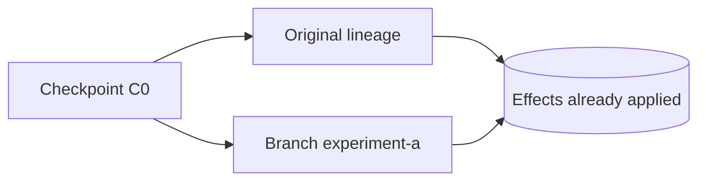
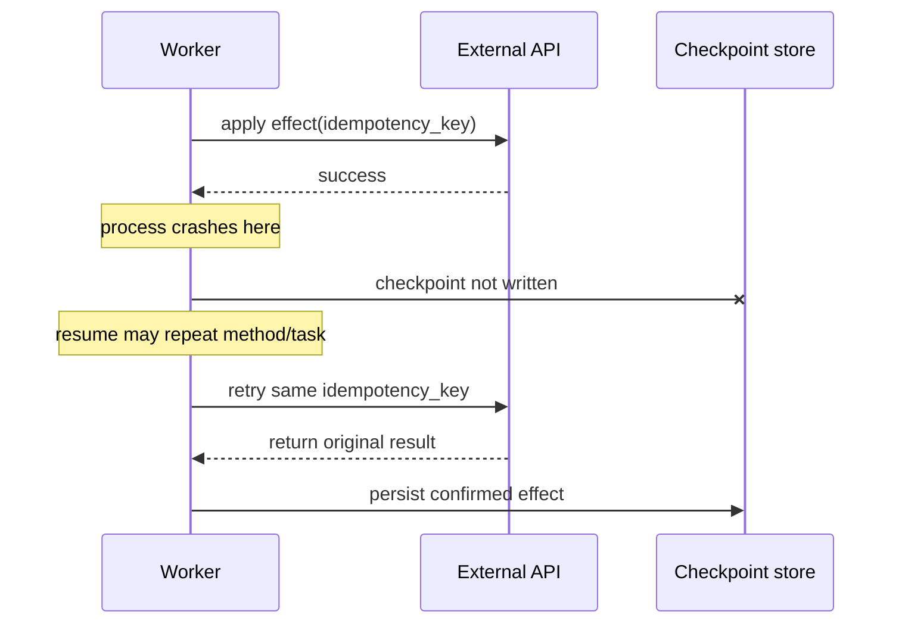

# Persistence, Resume, Fork, and HITL

> **Research date:** 2026-08-31  
> **Baseline:** CrewAI `1.15.18`

## Bottom Line

CrewAI has two durability systems with different purposes. Flow `@persist` snapshots typed state and pending HITL context. Runtime checkpointing captures framework execution state for Crew, Flow, or Agent resume/fork. Neither atomically commits an external side effect, so effect idempotency and reconciliation remain application responsibilities.

## Two Durability Systems

| Property | Flow `@persist` | Runtime `CheckpointConfig` |
|---|---|---|
| Primary data | Flow state snapshots | Serialized entities, task/method progress, outputs, inputs, event graph, lineage |
| Scope | Flow | Crew, Flow, Agent |
| Default storage | Built-in SQLite Flow persistence | JSON files in `./.checkpoints/` |
| Trigger | After decorated method(s); automatic pending HITL | Selected framework events; default `task_completed` |
| Resume entry | Same `id`, `from_pending`, or state restore APIs | `from_checkpoint` |
| Fork entry | `restore_from_state_id` with fresh state ID | `fork(config, branch=...)` |
| Completed-step cursor | Not generally; state alone can rerun starts | Yes, where serialized runtime progress supports it |
| Exact external effects | No | No |

Do not combine `restore_from_state_id` and `from_checkpoint` in one Flow kickoff. Choose the semantic you need and test it.

## Flow State Persistence

Class-level `@persist` saves after every Flow method; method-level `@persist` saves selected boundaries. With a state `id`, a later kickoff can load the latest state for that ID.

Important limitation: state restore is not automatically a program-counter restore. A normal kickoff with a persisted ID may reload fields and then run start methods again. Make starts and effects replay-safe, or use runtime checkpoints when completed-method recovery is required.

`restore_from_state_id=old_id` loads the old snapshot into a fresh Flow state ID and records lineage. An explicit `inputs["id"]` can override the new ID, which risks writing into the original state key; do not allow caller-selected IDs. If no old state exists, current behavior can fall through rather than fail loudly. Verify existence before accepting a restore request.

## Runtime Checkpoints

Checkpointing is event-driven. `checkpoint=True` uses defaults; `CheckpointConfig` selects location, provider, events, retention, and restore source.

```python
from crewai import CheckpointConfig
from crewai.state import SqliteProvider

checkpoint = CheckpointConfig(
    location="./runtime-checkpoints.db",
    provider=SqliteProvider(),
    on_events=["task_completed", "method_execution_finished"],
    max_checkpoints=100,
)
```

Default `task_completed` checkpoints are a practical Crew boundary. Flow recovery may need `method_execution_finished`. High-frequency events such as every LLM completion increase storage and runtime cost.

### Storage providers

- `JsonProvider` writes timestamped JSON files that are readable and portable.
- `SqliteProvider` uses SQLite with WAL and suits higher-frequency local writes.
- both are local storage by default; neither is automatically shared across replicas.
- retention prunes old checkpoints when `max_checkpoints` is set.

Current JSON writes are ordinary file writes, not an atomic transaction with external effects. SQLite improves local storage consistency but not cross-system atomicity.

### Best-effort auto writes

Automatic event-driven checkpoint failures are logged and the run continues. Manual `state.checkpoint()`/`acheckpoint()` re-raise. Monitor checkpoint failure events/logs and decide whether loss of recoverability should fail the application run. A “successful” Crew may have no usable final checkpoint.

## Resume Semantics

A restored Crew skips tasks with completed outputs and resumes downstream work. Started-but-incomplete agent state may be reconstructed when serializable. A restored Flow can restore completed methods, outputs, counters, and recorded events and continue eligible listeners.

Checkpoint serialization cannot perfectly recreate arbitrary Python callables, adapters, clients, file handles, or external resources. Release notes describe fixes and deliberate dropping of non-round-trippable callback/adapter state. After restore:

- rebind runtime-only dependencies;
- validate effective tools, guardrails, callbacks, memory, and provider clients;
- compare configuration/model/tool revisions with the original run;
- reject incompatible migrations instead of silently continuing.

## Fork Semantics

Forking restores a checkpoint under a new lineage/branch so experimental work can coexist with the original. Flow state restore also assigns a fresh state ID by default. A fork does not copy or undo external world state.



If the original performed an effect before C0, the branch observes that shared external reality. If the branch needs isolation, use a sandbox target, dry-run tools, shadow data, or a separate tenant/environment.

## The Effect Gap



Use an application effect ledger with states such as `PLANNED`, `STARTED`, `CONFIRMED`, `AMBIGUOUS`, and `COMPENSATED`. Before retry, query the target system by idempotency/reference key.

The framework-specific mechanisms in this guide implement only part of the repository's canonical [durable execution](../../runtime/durable-execution.md), [state and event contract](../../runtime/agent-state-and-event-contracts.md), and [idempotency and side-effects](../../reliability/idempotency-and-side-effects.md) design. Use those guides to define the external run/effect ledger and adapter contract before choosing a checkpoint frequency.

## Human-in-the-Loop

`@human_feedback` supports synchronous console review and non-blocking providers. It can emit labels for downstream listeners, exposes feedback history, and can participate in revision loops. For production, use a provider that raises `HumanFeedbackPending`; CrewAI persists pending state automatically, using SQLite Flow persistence by default.

Resume with `Flow.from_pending(flow_id)` followed by `resume(feedback)` or `await resume_async(feedback)`. Calling synchronous resume inside an active event loop raises a runtime error.

### Approval is a security operation

Pending context must be bound to:

- unguessable flow/run ID and server-derived tenant;
- exact artifact hash/revision being approved;
- required reviewer role and separation-of-duty rule;
- allowed outcomes and expiry;
- nonce/idempotency key;
- authenticated reviewer identity and timestamp;
- policy/config/model/tool revision.

Do not accept a raw flow ID plus text as sufficient authorization. Atomically claim a pending approval so duplicate webhooks cannot resume twice. Reject late feedback after cancellation, expiry, or a newer revision.

### Feedback routing

If an LLM classifies free-text feedback into emitted labels, its classification is non-deterministic. Prefer structured reviewer actions (`approve`, `reject`, `revise`) at the UI/API boundary. Preserve the original comment separately. Always configure and test a default outcome.

### Managed AMP HITL

CrewAI AMP provides deployed Flow HITL management and webhook/API paths. Platform documentation is a separate product contract from OSS behavior. Webhook configuration may need to be provided again on resume in some enterprise APIs; follow the current platform API version and make receiver processing idempotent.

## Recovery Test Matrix

| Crash point | Expected test |
|---|---|
| Before first method/task | Fresh safe restart |
| After state write, before checkpoint | No invalid state/progress mix |
| After external effect, before checkpoint | Same idempotency key reconciles |
| During parallel listeners/tasks | Completed sibling effects discovered |
| Immediately after HITL pause | Pending context is retrievable |
| Duplicate human response | Exactly one resume claim |
| Restore after code/schema upgrade | Migration or explicit rejection |
| Checkpoint storage unavailable | Alert and declared fail-open/closed behavior |

## Production Checklist

- [ ] The chosen durability mechanism matches state-only or execution-cursor needs.
- [ ] State IDs, checkpoint paths, and branch names are server-controlled.
- [ ] Persisted state and runtime entities have tested version migrations.
- [ ] Auto-checkpoint failures are surfaced to operations.
- [ ] Every external write is idempotent and reconciled after ambiguity.
- [ ] Forks use isolated effect targets when experimentation requires it.
- [ ] Pending approvals are authenticated, authorized, expiring, and single-use.
- [ ] Resume/fork tests use real fixtures from the previous deployed version.

## Primary Sources

- [Checkpointing documentation](https://github.com/crewAIInc/crewAI/blob/1.15.18/docs/v1.15.18/en/concepts/checkpointing.mdx)
- [Flows persistence documentation](https://github.com/crewAIInc/crewAI/blob/1.15.18/docs/v1.15.18/en/concepts/flows.mdx)
- [Human feedback in Flows](https://github.com/crewAIInc/crewAI/blob/1.15.18/docs/v1.15.18/en/learn/human-feedback-in-flows.mdx)
- [Checkpoint listener source](https://github.com/crewAIInc/crewAI/blob/1.15.18/lib/crewai/src/crewai/state/checkpoint_listener.py)
- [Runtime state source](https://github.com/crewAIInc/crewAI/blob/1.15.18/lib/crewai/src/crewai/state/runtime.py)
- [Flow runtime source](https://github.com/crewAIInc/crewAI/blob/1.15.18/lib/crewai/src/crewai/flow/runtime/__init__.py)
