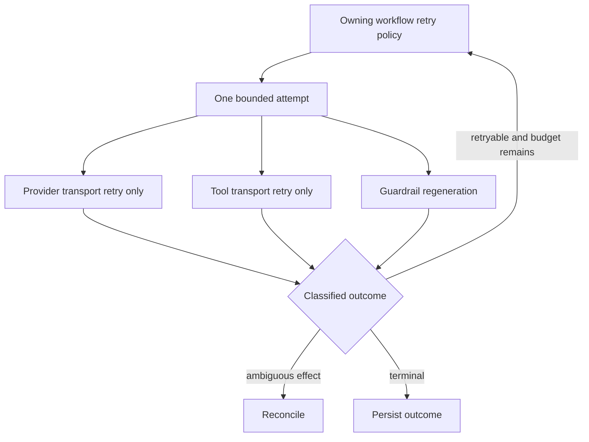

# Reliability, Async, Concurrency, and Retries

> **Research date:** 2026-08-31  
> **Baseline:** CrewAI `1.15.18`

## Bottom Line

CrewAI provides concurrency and retry primitives, not transaction semantics. Bound concurrency outside kickoff, assign one retry owner per failure, make writes idempotent, and test cancellation and crash ambiguity on the exact executor path you use.

## Failure Taxonomy

Classify before retrying:

| Class | Examples | Default response |
|---|---|---|
| Invalid | Schema, policy, unsupported route | Reject; no retry |
| Auth | Expired credential, denied resource | Refresh once or fail closed |
| Throttled | Provider 429, concurrency limit | Bounded jittered backoff |
| Transient | Network reset, provider 5xx | Bounded retry if effect-safe |
| Permanent dependency | Missing tool/server, incompatible protocol | Fail or explicit degraded path |
| Ambiguous effect | Timeout/disconnect after write submit | Reconcile; never blind retry |
| Quality | Guardrail/model output invalid | Bounded regenerate without repeating effects |
| Internal bug | Invariant violation, serialization error | Fail, preserve evidence, fix |

Prompting an agent to “try again” is not error classification.

## Retry Layers

Potential retry layers include provider SDK, CrewAI LLM/tool handling, agent `max_retry_limit`, task guardrail retries, Flow loops, worker/job queues, HTTP clients, MCP/A2A, and human resubmission.



Choose one owning workflow layer. Lower layers may retry only transport-safe/idempotent operations, and their attempts must count toward the global budget. Avoid multiplying three retries at four layers into dozens of calls.

Write the worst-case call calculation in the design review. For example, two workflow attempts × three guardrail attempts × three agent execution attempts × two provider attempts can reach **36 provider attempts for one task** before delegation or tool retries. Configure the product of layers, not each default in isolation, and emit `attempt` plus `retry_owner` on every call.

## Concurrency Surfaces

- multiple Flow starts/listeners can run concurrently;
- `async_execution=True` tasks overlap until a synchronization barrier;
- `akickoff` uses CrewAI's async path;
- `kickoff_async` wraps synchronous kickoff in a worker thread;
- `akickoff_for_each` fans out whole Crew runs;
- Memory encoding/recall and event handlers use thread/async pools;
- A2A/MCP can add their own parallel requests.

Use a process-wide admission controller for runs, model calls, each tool/backend, and per-tenant work. Per-agent `max_rpm` alone does not control total concurrency across agents, Crews, replicas, or retries.

## Async Does Not Mean Non-Blocking

`kickoff_async()` is implemented through `asyncio.to_thread(self.kickoff, ...)`. It keeps an event loop responsive but still consumes a thread and invokes synchronous dependencies. Use native `akickoff()` only after confirming that selected LLM clients, tools, callbacks, storage, and context propagation behave correctly.

Blocking tool code inside an async path can stall the loop. Async wrappers around blocking libraries require a bounded executor and cancellation policy.

## Cancellation

Cancellation is a request, not rollback:

- Python threads cannot be forcibly cancelled safely;
- coroutine cancellation is delivered at await points;
- HTTP servers may keep processing after the client disconnects;
- external effects may complete after local timeout;
- parallel siblings may finish before another branch fails.

In the current synchronous Agent timeout path, `future.cancel()` cannot stop an already running thread and exiting the executor context waits by default. `max_execution_time` is therefore not a hard isolation boundary. Put hard-kill work in separate processes/containers and use transport deadlines below it.

## Flow Parallelism

Routers run before normal listeners for a trigger, but eligible listeners are gathered concurrently. Some OR-race paths cancel remaining candidates after a success; cancellation cannot undo their work. The final Flow return can depend on last completion.

Rules:

- parallel branches operate on immutable input or disjoint state fields;
- joins perform deterministic merge/validation;
- write effects are serialized or use unique keys;
- terminal output is explicit;
- race losers are read-only or safe to abandon;
- every branch deadline fits within the run deadline.

## Crew Async Task Groups

The native async Crew path starts async tasks and later awaits grouped results. A failure while collecting one task does not imply that all already-started sibling work was cancelled before making effects. Test actual failure timing and inspect/reconcile every sibling's side effects.

Thread-based async-task execution has similar hazards. Do not share mutable Task/Agent instances across independent concurrent Crew copies unless the framework's copy semantics and custom dependencies are proven safe.

## Idempotency and Effect Reconciliation

```text
effect_key = hash(tenant_id, workflow_type, business_operation_id, effect_revision)
```

The receiving service or application effect ledger must enforce uniqueness. Store the request hash and original response so a repeated key with different parameters is rejected.

After a timeout:

1. mark the effect `AMBIGUOUS`;
2. query the target by idempotency/reference key;
3. if confirmed, persist the original outcome and continue;
4. if absent and retryable, retry the same key;
5. if unknowable, require reconciliation/human action.

## Replay Is Not Durable Checkpointing

Crew task replay uses recent task-output records and is distinct from runtime checkpoints. [Issue #6650](https://github.com/crewAIInc/crewAI/issues/6650) reports that `kickoff_for_each` resets the latest replay store after batch execution; current source still resets the task-output handler at the end of that path. Do not make batch recovery depend on replay. Persist each item's business result/checkpoint independently.

## Time and Budget Hierarchy

Set nested limits:

```text
run deadline
  > flow method/crew deadline
    > agent/task deadline
      > A2A/MCP/tool operation deadline
        > connect/read/provider attempt timeout
```

Each outer layer must leave time for cleanup, checkpointing, and reconciliation. Track wall time, model/tool calls, tokens, dollars, bytes, method calls, agent iterations, delegation turns, and retries in one budget object owned by the application.

## Backpressure

Reject, queue, or degrade before saturating providers and tools. Use:

- bounded queues and per-tenant quotas;
- semaphores for model/provider and expensive tools;
- circuit breakers for unhealthy dependencies;
- jittered backoff with maximum elapsed time;
- bulkheads for high-risk/slow integrations;
- load shedding for optional enrichment;
- concurrency tests at realistic latency and rate-limit distributions.

Do not start thousands of `akickoff_for_each` coroutines and expect `max_rpm` to provide complete backpressure.

Use the canonical [failure taxonomy](../../reliability/failure-taxonomy.md), [idempotency and side-effects](../../reliability/idempotency-and-side-effects.md), and [run-control](../../runtime/run-controls.md) guides to define typed outcomes, retry ownership, and cancellation semantics outside CrewAI.

## Production Checklist

- [ ] Every failure is mapped to a typed outcome and retry owner.
- [ ] Retry attempts share one global budget and telemetry trail.
- [ ] Parallel work has disjoint state/effect keys and explicit joins.
- [ ] Cancellation tests verify external effects, not only task status.
- [ ] Provider, MCP, A2A, and tool operations have transport deadlines.
- [ ] Hard isolation uses processes/containers, not thread cancellation.
- [ ] Batch runs persist each item independently of replay state.
- [ ] Admission control and backpressure cover every replica and tenant.

## Primary Sources

- [Crew async kickoff source](https://github.com/crewAIInc/crewAI/blob/1.15.18/lib/crewai/src/crewai/crew.py)
- [Agent execution and timeout source](https://github.com/crewAIInc/crewAI/blob/1.15.18/lib/crewai/src/crewai/agent/core.py)
- [Flow runtime source](https://github.com/crewAIInc/crewAI/blob/1.15.18/lib/crewai/src/crewai/flow/runtime/__init__.py)
- [Tasks documentation](https://github.com/crewAIInc/crewAI/blob/1.15.18/docs/v1.15.18/en/concepts/tasks.mdx)
- [Task replay documentation](https://github.com/crewAIInc/crewAI/blob/1.15.18/docs/v1.15.18/en/learn/replay-tasks-from-latest-crew-kickoff.mdx)
- [Current timeout report #4135](https://github.com/crewAIInc/crewAI/issues/4135)
