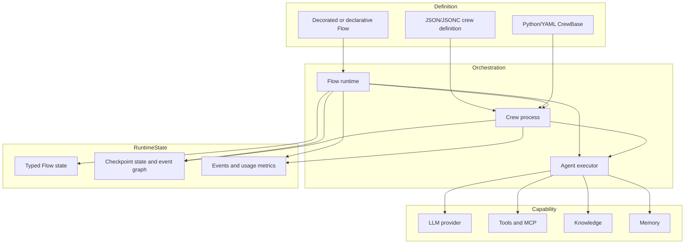
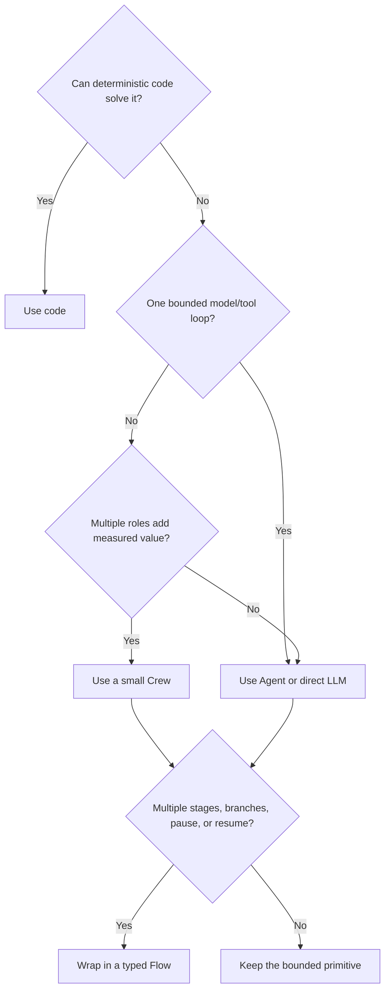

# Runtime and Architecture

> **Research date:** 2026-08-31  
> **Baseline:** CrewAI `1.15.18`

## Bottom Line

Use a **Flow-first architecture** for production workflows. A Flow exposes state transitions, branch conditions, joins, persistence, and approval points. Invoke a Crew only for a bounded step where several role-specialized agents outperform one direct model call or deterministic code.

## The Runtime Layers



CrewAI is a standalone Python framework. At `1.15.18`, the distribution is split into aligned `crewai`, `crewai-core`, and `crewai-cli` packages. The public package requires Python `>=3.10,<3.14`. Lock all three through the published dependency graph; do not independently float the core or CLI.

### Definitions are not executions

- JSON-first Crew projects define agents and tasks in `crew.jsonc`/`crew.json` plus `agents/` files.
- classic projects use `CrewBase`, Python, and YAML configuration.
- decorated Flows use `@start`, `@listen`, `@router`, and optionally `@persist`/`@human_feedback`.
- declarative Flows use a `FlowDefinition` and the same runtime.
- runtime instances hold mutable execution state. Construct one per run unless a documented conversational session deliberately reuses one.

The `1.14.7` refactor separated Flow DSL, definition, and runtime implementation. `crewai.flow.flow` is now largely a compatibility export; behavioral source lives under `crewai.flow.runtime`. This matters when debugging or evaluating breaking changes.

## Crews and Flows Solve Different Problems

| Primitive | Owns | Best use | Poor use |
|---|---|---|---|
| Agent | One reasoning/tool loop | A narrow expert operation | A durable business workflow |
| Task | Deliverable and validation | One explicit unit of work | Implicit global coordination |
| Crew | Agent/task collaboration | Bounded research, analysis, review | Long-lived lifecycle with many side effects |
| Flow | Control and state transitions | Durable workflows and policies | Hiding all logic inside one method |

### Select the minimum sufficient primitive



Adding agents increases prompt surface, model calls, latency, nondeterminism, failure combinations, and permission paths. A named role is not evidence that a separate agent is needed. Benchmark a single capable agent before adopting delegation or a manager.

## Recommended Production Composition

```python
class RunState(BaseModel):
    state_schema_version: int = 1
    tenant_id: str
    run_id: UUID = Field(default_factory=uuid4)
    request: Request
    research: ResearchResult | None = None
    decision: Decision | None = None
    approved: bool = False
    effect_key: str | None = None


@persist
class Workflow(Flow[RunState]):
    @start()
    def validate(self): ...              # deterministic

    @listen(validate)
    def research(self): ...              # bounded Crew

    @listen(research)
    def decide(self): ...                # structured output

    @human_feedback(message="Approve effect?")
    @listen(decide)
    def approve(self): ...               # policy boundary

    @listen(approve)
    def apply_effect(self): ...           # idempotent tool
```

This sketch is an architectural pattern, not a promise of exactly-once execution. The external write still needs an application idempotency key and durable effect record.

## Invocation Semantics

- Crew `kickoff()` is synchronous.
- Crew `kickoff_async()` offloads synchronous kickoff through `asyncio.to_thread`; it does not make every provider and tool operation natively asynchronous.
- Crew `akickoff()` uses the async execution path and is preferable only after the selected LLMs and tools are proven truly async-safe.
- Agent supports direct kickoff, but a direct agent is not a substitute for workflow state.
- Flow `kickoff()` and `kickoff_async()` schedule start methods and downstream listeners.
- `kickoff_for_each`/`akickoff_for_each` multiply whole-run concurrency. Put admission control outside the framework.

Treat every kickoff object as run-scoped. Shared agents, memory stores, callbacks, and provider clients must be reviewed for concurrency safety before reuse.

## Configuration Surfaces

CrewAI supports code, YAML, and newer JSON/JSONC definitions. Configuration-driven systems simplify generation and deployment but introduce a trust boundary:

- validate schemas in CI;
- pin tool and agent identifiers;
- review configuration as code;
- prohibit untrusted `custom:<name>` or inline Python tool definitions;
- record the effective merged configuration with each run;
- canary any executor or prompt-template change.

The JSON-first path was a major `1.15.0` change. Classic CrewBase projects remain supported, but copying examples between layouts without respecting entry points and directories causes deployment failures.

## State and Event Ownership

Keep business state in the Flow state model. Keep operational truth in application-owned records. CrewAI's runtime state and event graph are valuable for framework recovery, but business invariants should not depend on private executor messages or incidental event ordering.

| Information | Authoritative owner |
|---|---|
| Current business status | Application database/run ledger |
| Flow inputs and intermediate typed results | Flow state/persistence |
| Framework resume cursor and serialized entities | Runtime checkpoint |
| External effect completion | Effect ledger and target system |
| Debug timeline | Events/traces/logs |
| Quality decision | Versioned eval result and release gate |

## Failure Domains

Create explicit boundaries around:

- model provider requests and rate limits;
- tool and MCP calls;
- memory/knowledge retrieval and embedding;
- state/checkpoint storage;
- human pause and resume;
- event/tracing export;
- outbound side effects.

A Flow method that calls three external systems is still one coarse failure domain. Split it when individual effects need different retry, approval, or compensation policies.

## When Not to Use CrewAI

Prefer simpler code or a job queue when the work is deterministic. Prefer a mature workflow engine when the primary requirement is cross-service transactions, long timers, very high-volume durable scheduling, or formally controlled exactly-once-like activity semantics. Prefer a single-agent loop when dynamic collaboration has no measured quality advantage. CrewAI can sit inside those systems as a bounded reasoning activity.

Record the adoption decision with evidence, not framework preference:

| Question | Minimum evidence before production |
|---|---|
| Why a model? | Deterministic baseline cannot meet the task-quality requirement |
| Why more than one Agent? | Paired eval shows a material gain over one Agent at acceptable latency/cost |
| Why a Flow? | Named routing, state, pause, recovery, or audit requirement |
| Why CrewAI owns recovery? | Kill/resume tests satisfy the recovery objective on the pinned release |
| Why local storage? | Single-host failure model is explicitly acceptable and backup/restore is tested |
| Why managed AMP? | Required features, region, retention, identity, SLO, and exit plan are contractually acceptable |

Anchor that record in the repository's [execution-boundary](../../runtime/execution-boundaries.md), [run-control](../../runtime/run-controls.md), and [state/event](../../runtime/agent-state-and-event-contracts.md) contracts.

## Production Checklist

- [ ] Each non-deterministic step has a typed contract and bounded budget.
- [ ] Flow state is schema-versioned and contains no live clients or secrets.
- [ ] Crew instances and stateful agents are not accidentally shared across concurrent runs.
- [ ] Control decisions remain visible in Flow routers or deterministic code.
- [ ] Effect completion is recorded outside prompts, memory, and traces.
- [ ] The exact distribution, providers, and prompt/config revision are pinned.
- [ ] Managed-platform claims are not assumed to describe OSS local runtime behavior.

## Primary Sources

- [CrewAI repository and architecture](https://github.com/crewAIInc/crewAI/tree/1.15.18)
- [Production architecture guide](https://github.com/crewAIInc/crewAI/blob/1.15.18/docs/v1.15.18/en/concepts/production-architecture.mdx)
- [Flow runtime source](https://github.com/crewAIInc/crewAI/blob/1.15.18/lib/crewai/src/crewai/flow/runtime/__init__.py)
- [Crew source](https://github.com/crewAIInc/crewAI/blob/1.15.18/lib/crewai/src/crewai/crew.py)
- [Package metadata](https://github.com/crewAIInc/crewAI/blob/1.15.18/lib/crewai/pyproject.toml)
