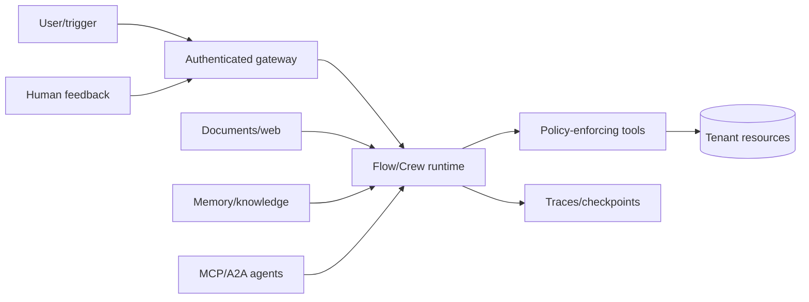
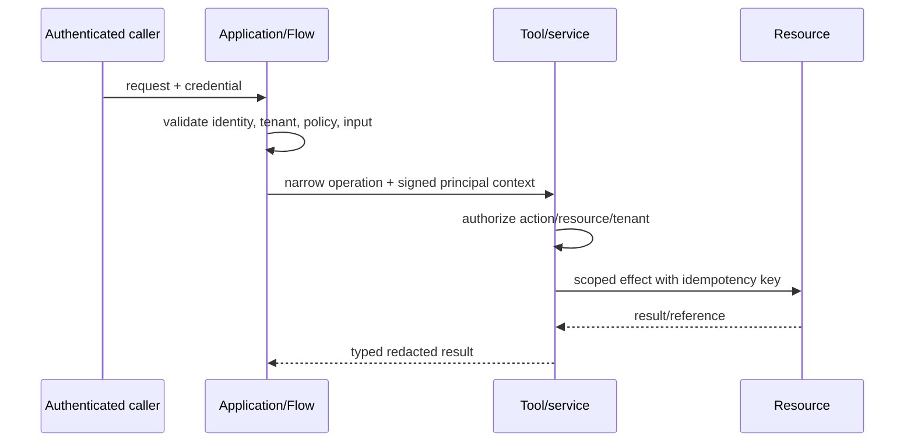

# Security, Permissions, and Tenancy

> **Research date:** 2026-08-31  
> **Baseline:** CrewAI `1.15.18`; CrewAI AMP documentation checked separately

## Bottom Line

CrewAI orchestrates model decisions; it is not the authorization system. Authenticate users at the application edge, derive tenant and policy server-side, authorize every resource and effect inside tools/services, and treat prompts, retrieved content, memory, MCP/A2A metadata, and human feedback as untrusted input.

## Threat Model

Primary risks:

- direct or indirect prompt injection;
- excessive tool privileges and confused-deputy actions;
- cross-tenant retrieval, memory, checkpoint, or trace leakage;
- untrusted MCP/A2A endpoints, metadata, redirects, and callbacks;
- secret exposure through prompts, tool output, logs, or persisted state;
- duplicate/ambiguous writes after retry or resume;
- forged or replayed approvals/webhooks;
- resource exhaustion through agent loops, large files, or fan-out;
- dependency/configuration supply-chain compromise.

## Authorization Architecture

The model may propose an action but cannot grant itself a permission. Never take a tenant ID, role, resource owner, approval status, or credential from model output as authoritative.

## Capability Design

For each Agent:

- expose only task-required tools;
- separate read, propose, approve, and execute capabilities;
- keep delegation off for specialists;
- use short-lived, audience-scoped credentials;
- constrain object IDs and allowed transitions;
- impose per-principal/tenant budgets;
- redact tool results before they return to the model.

For high-impact effects, use deterministic policy plus human approval outside the agent loop. The executor tool must re-check both immediately before writing.

## Prompt Injection

Injection can arrive through user text, web pages, files, Knowledge chunks, Memory, MCP tool descriptions/results, A2A agent cards/messages, or human comments.

Defenses are structural:

1. label external content as data with provenance;
2. keep instructions and policy outside retrieved text;
3. minimize exposed tools;
4. validate planned calls against deterministic policy;
5. require confirmation for sensitive effects;
6. avoid placing secrets in model context;
7. test indirect-injection corpora and tool exfiltration attempts.

Prompt wording is an additional control, never the only one.

## Tenant Isolation

Apply isolation to every plane:

| Plane | Required key/control |
|---|---|
| Flow/business state | Server-derived tenant + unguessable run ID |
| Runtime checkpoints | Tenant/environment namespace and storage ACL |
| Knowledge | Tenant collection/database plus pre-retrieval access filter |
| Memory | Server-derived scope/slice plus separate high-risk stores |
| Tool calls | Resource-level authorization in receiving service |
| MCP/A2A | Per-tenant or audience-scoped credentials; egress allowlist |
| Cache | Tenant, identity, policy, resource version in key |
| Traces/logs | Tenant-aware access, redaction, retention |

CrewAI's local paths, Memory scopes/private flag, collection names, and Flow IDs are not security boundaries. Prefer separate credentials/databases/projects for regulated or adversarial tenants.

## Secrets

- keep secrets in a secret manager or managed platform environment-variable facility;
- inject only into the process/tool that needs them;
- do not put secrets in roles, tasks, state, memory, knowledge, or agent backstories;
- prevent full environment inheritance to stdio MCP subprocesses;
- rotate and revoke without redeploying prompt content;
- redact structured and free-text logs before export;
- scan persisted checkpoints and traces during security tests.

When deploying to AMP, the CLI can detect and transfer local environment variables during deployment creation. Review the detected set; do not treat `.env` contents as an automatically safe allowlist.

## Project Files and Local Artifacts Are Executable Supply Chain

Treat a downloaded CrewAI project, registry package, skill archive, trained-agent file, and declarative Flow as code—not content to preview inside a privileged worker.

At the `1.15.18` tag:

- Crew project import calls `load_dotenv()`, so a `.env` in the process working directory can change runtime behavior;
- declarative Flow script actions compile and execute arbitrary Python when `CREWAI_ALLOW_FLOW_SCRIPT_EXECUTION` has a trusted value;
- JSON/JSONC definitions can resolve local Python tools, agents, and declarations;
- trained-agent data is loaded through Python `pickle`, which is unsafe for untrusted files;
- skills can carry instructions, references, assets, and scripts that influence the model or operator.

Open [issue #7050](https://github.com/crewAIInc/crewAI/issues/7050) combines these surfaces into an untrusted-template execution report. The safe operating response does not depend on its eventual issue disposition:

1. never run a cloned template in a privileged directory or with production credentials;
2. build it in an isolated sandbox with an explicit environment allowlist and no secret-bearing parent environment;
3. keep Flow script execution disabled unless the exact definition and all referenced files were reviewed;
4. prohibit untrusted `trained_agents_file` and training pickle artifacts;
5. resolve and verify every local/registry component before promotion;
6. scan archives for traversal/symlink escapes and pin dependency/skill/tool digests;
7. promote only an immutable reviewed artifact into the production worker.

CrewAI component fingerprints help correlate Agent, Task, and Crew instances; they are UUID/timestamp metadata, not a signature, attestation, authorization grant, or tamper-proof content digest. Do not use a matching fingerprint to trust an artifact.

## Storage Security

JSON checkpoints, SQLite databases, Chroma, LanceDB, output files, replay records, and caches may contain full prompts, outputs, identities, or retrieved data.

Require:

- restrictive filesystem/service ACLs;
- encryption at rest where risk requires it;
- tenant/environment namespace validation and path traversal protection;
- backup and deletion parity;
- schema/version controls;
- retention and physical purge;
- integrity checks and restore authorization;
- no caller-controlled output/checkpoint path.

Persistence is an injection surface: validate restored state and never deserialize arbitrary untrusted Python objects or configuration.

## MCP, A2A, and Network Egress

Allowlist destinations and revalidate DNS, connected peer IPs, and redirects. CrewAI `1.15.17` fixed redirect/peer-IP SSRF gaps in tools, but custom clients still need equivalent controls. Block cloud metadata, loopback, link-local, private ranges unless explicitly required.

Never pass through caller tokens to arbitrary downstream services. For A2A, validate the agent card separately from its advertised endpoint. For push/webhooks, allowlist destinations and authenticate/sign messages.

## Human Approval Security

A production approval must authenticate the reviewer, authorize the exact artifact/effect, bind to a policy revision, expire, and be single-use. Do not equate “a feedback message arrived” with authorization.

AMP Flow HITL documents an email-first mode in which external responders need no platform account. That is convenient, but high-impact deployments must assess mailbox identity, forwarding, link/token replay, recipient routing from Flow state, and separation of duties. Use stronger authenticated review when email possession is insufficient.

## Managed AMP Controls

AMP documentation describes:

- SSO for SaaS and self-hosted Factory, with IdP-backed lifecycle/MFA;
- feature and entity-level RBAC for automations, environment variables, LLM connections, and repositories;
- private/allowlisted automation visibility;
- managed environment variables and LLM connections;
- Enterprise PII redaction for traces;
- deployment bearer tokens and API access.

These control platform users and resources. They do not automatically authorize an end user's domain-level tool action inside a running Crew. Keep application authorization in the request/tool path.

The predefined AMP `Owner` role cannot be restricted, and default `Member` permissions include management of some sensitive connection/environment surfaces according to current docs. Review custom roles and entity permissions against least privilege rather than accepting defaults.

## Webhook Security

- authenticate inbound requests with a rotated secret/signature;
- verify timestamp and replay window;
- use event ID/idempotency key;
- validate execution/tenant mapping server-side;
- accept events out of order;
- acknowledge quickly and process from a durable queue;
- allowlist outbound callback destinations;
- exclude full prompts unless explicitly needed;
- reconcile final state through the authoritative API/ledger.

AMP explicitly states that webhook event order is not guaranteed. Timestamp sorting is useful for display, but state transitions still need monotonic/idempotent logic.

Apply these CrewAI-specific controls within the repository's canonical [agent threat model](../../security/agent-threat-model.md), [prompt-injection defense](../../security/prompt-injection-and-untrusted-data.md), and [permissions, sandboxing, and secrets](../../security/permissions-sandboxing-and-secrets.md) architecture.

## Security Test Cases

- cross-tenant run/state/checkpoint ID guessing;
- retrieval/memory collection collision;
- poisoned document/tool description/agent card;
- tool call with a valid ID belonging to another tenant;
- duplicate, expired, forwarded, and out-of-order approval/webhook;
- SSRF through URL arguments, redirects, and DNS rebinding;
- stdio MCP environment and filesystem exfiltration;
- secret/PII leakage in trace, exception, checkpoint, output file, and memory;
- resume/fork under a different caller or policy revision;
- cost/resource exhaustion through delegation and async fan-out.
- malicious `.env`, Flow script, custom-tool reference, skill archive, or trained-agent pickle in a downloaded project;

## Production Checklist

- [ ] Identity, tenant, and policy are server-derived and propagated as signed context.
- [ ] Tools independently authorize every resource and effect.
- [ ] Agents never receive unnecessary credentials or capabilities.
- [ ] All persistence/retrieval/diagnostic planes enforce tenant isolation.
- [ ] External content and metadata cannot expand permissions.
- [ ] HITL and webhook paths resist replay, forgery, and cross-run confusion.
- [ ] AMP roles/entity permissions and application permissions are reviewed separately.
- [ ] Adversarial tests cover injection, SSRF, leakage, and resource exhaustion.

## Primary Sources

- [CrewAI MCP security guide](https://github.com/crewAIInc/crewAI/blob/1.15.18/docs/v1.15.18/en/mcp/security.mdx)
- [CrewAI `1.15.18` security-related changelog](https://github.com/crewAIInc/crewAI/blob/1.15.18/docs/v1.15.18/en/changelog.mdx)
- [AMP SSO](https://docs-platform.crewai.com/platform/en/features/sso)
- [AMP RBAC](https://docs-platform.crewai.com/platform/en/features/rbac)
- [AMP PII trace redaction](https://docs-platform.crewai.com/platform/en/features/pii-trace-redactions)
- [AMP Flow HITL management](https://docs-platform.crewai.com/platform/en/features/flow-hitl-management)
- [AMP webhook streaming](https://docs-platform.crewai.com/platform/en/features/webhook-streaming)
- [Declarative Flow script execution source](https://github.com/crewAIInc/crewAI/blob/1.15.18/lib/crewai/src/crewai/flow/runtime/_actions.py)
- [Training pickle loader source](https://github.com/crewAIInc/crewAI/blob/1.15.18/lib/crewai/src/crewai/utilities/file_handler.py)
- [Crew project dotenv loading source](https://github.com/crewAIInc/crewAI/blob/1.15.18/lib/crewai/src/crewai/project/crew_base.py)
- [Fingerprinting guide](https://github.com/crewAIInc/crewAI/blob/1.15.18/docs/v1.15.18/en/guides/advanced/fingerprinting.mdx)
- [Untrusted project execution report #7050](https://github.com/crewAIInc/crewAI/issues/7050)
