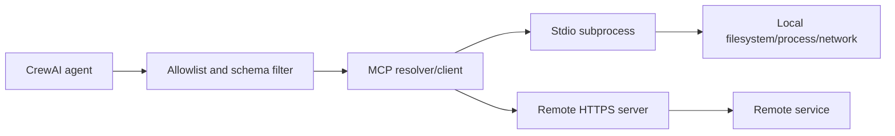

# Tools, Hooks, Skills, MCP, and Knowledge

> **Research date:** 2026-08-31  
> **Baseline:** CrewAI `1.15.18`; MCP Python SDK dependency `~=1.28.1`

## Bottom Line

Tools are executable capabilities, hooks intercept runtime boundaries, Skills teach authored procedures, MCP connects remote or subprocess tools, and Knowledge supplies an authored retrieval corpus. Treat every surface as untrusted until policy admits it. Give each agent the smallest typed capability set, authorize inside the tool, and keep retrieval isolation independent of model instructions.

## Tool Contract

A custom `BaseTool` defines a name, description, Pydantic argument schema, and `_run`/async implementation. Typed inputs reduce parsing errors but do not establish caller authority.

```python
class UpdateTicketInput(BaseModel):
    ticket_id: str = Field(pattern=r"^TKT-[0-9]+$")
    transition: Literal["approve", "reject"]
    idempotency_key: UUID


class UpdateTicketResult(BaseModel):
    ticket_id: str
    transition: Literal["approve", "reject"]
    applied: bool
    effect_reference: str


class UpdateTicket(BaseTool):
    name: str = "update_ticket"
    description: str = "Apply one authorized ticket transition."
    args_schema: type[BaseModel] = UpdateTicketInput
    result_schema: type[BaseModel] = UpdateTicketResult

    def _run(
        self,
        ticket_id: str,
        transition: Literal["approve", "reject"],
        idempotency_key: UUID,
    ) -> UpdateTicketResult:
        principal = current_principal()
        authorize(principal, "ticket.transition", ticket_id)
        raw_result = service.transition_once(
            ticket_id=ticket_id,
            transition=transition,
            idempotency_key=str(idempotency_key),
            principal_id=principal.subject,
        )
        return UpdateTicketResult.model_validate(raw_result)
```

Enforce authentication, tenant resolution, resource authorization, value constraints, rate limits, transport timeouts, and idempotency inside or below the tool. A prompt saying “only modify the current tenant” is not a control.

The annotations on `name`, `description`, `args_schema`, and `result_schema` are intentional: `BaseTool` is a Pydantic model. A typed result is serialized for the agent while remaining available as a raw typed value to post-tool hooks. Keep the agent-facing representation small and redacted.

## Failure Policy

CrewAI normalizes several failures—raised exceptions, returned `ToolFailure`, MCP `isError`, usage-limit failures, and missing tools. Failure policy can be set at tool, task, agent, or Crew scope, with the most specific policy winning. Warning/continue behavior can yield a Crew output that still contains `tool_failures`.

| Capability | Default policy to choose |
|---|---|
| Optional enrichment | Continue only if a typed degraded outcome exists |
| Required read | Raise and classify retryability |
| Required write | Raise, then reconcile effect state before retry |
| Security/policy check | Fail closed |

Always inspect output tool-failure fields. A raised exception still does not roll back an external side effect.

## Tool Hooks Are a Policy Seam, Not the Final Authorization Layer

`PRE_TOOL_CALL` and `POST_TOOL_CALL` hooks can inspect/mutate input, block a call, transform the agent-facing result, and emit telemetry. They are useful for an early deny, redaction, and defense in depth. Their exact failure semantics matter:

- `HookAborted` deliberately blocks the intercepted operation;
- an ordinary exception from an execution hook is swallowed and the chain proceeds—**fail-open**;
- blocking a tool call produces a blocked result for the agent and the wider run can continue;
- hook registration is process-global unless scoped to a Crew, so tests and reused workers must clean it up;
- a post hook can replace the string the agent sees, while the raw typed result remains a separate context field.

Therefore, make policy engine failure explicitly deny and re-check authorization inside the tool/service:

```python
from crewai.hooks import HookAborted, InterceptionPoint, ToolCallHookContext, on


@on(InterceptionPoint.PRE_TOOL_CALL, tools=["update_ticket"])
def deny_unauthorized_ticket_update(ctx: ToolCallHookContext) -> None:
    try:
        allowed = policy_engine.allows(
            principal=current_principal(),
            action="ticket.transition",
            resource_id=ctx.tool_input["ticket_id"],
        )
    except Exception as exc:
        raise HookAborted("policy service unavailable", source="authorization") from exc

    if not allowed:
        raise HookAborted("ticket transition denied", source="authorization")
```

This hook improves feedback and prevents a needless call. It does not replace the `authorize(...)` check in `UpdateTicket`, because another execution path may invoke the service without this hook and a blocked tool does not necessarily fail the whole Crew.

## Caching

Tool-result caching must match the operation:

- never cache writes;
- include tenant, identity, authorization scope, resource version, and relevant arguments in read keys;
- bound TTL by source volatility;
- prevent sensitive results from crossing tenants;
- record whether a result came from cache;
- invalidate on schema/provider revision.

The `1.15.3` release changed tool-result caching to opt-in. Examples or docs written for older behavior may assume a different default; test the effective configuration.

## MCP Integration

CrewAI supports native MCP configuration for stdio, Streamable HTTP, and legacy SSE transports, plus multiple-server configuration, filters, and optional tool-list caching.



### Protocol scope

CrewAI's native adapter focuses on MCP tools. Do not assume every MCP prompt, resource, sampling, elicitation, or multimodal feature is exposed with identical semantics. Build a custom integration when protocol features or output types exceed the adapter's supported surface.

At this baseline, CrewAI pins the MCP Python SDK to the `1.28.x` line. [Issue #6750](https://github.com/crewAIInc/crewAI/issues/6750) reports incompatibility with MCP 2.0. Pin and contract-test both sides; do not upgrade an MCP server fleet to a new major protocol based only on transport compatibility.

### Discovery is already untrusted input

Tool names and descriptions enter model context before invocation. A malicious MCP server can inject instructions through metadata. Allowlist trusted servers, allowlist tools by stable identifier, review schemas/descriptions, and expose only the filtered set to the agent.

### Stdio controls

A stdio server executes a local command with the worker's privileges. Use:

- immutable executable/package versions and verified artifacts;
- a dedicated OS identity or sandbox;
- an explicit environment allowlist, not wholesale environment inheritance;
- read-only filesystem mounts where possible;
- network egress controls;
- CPU, memory, process, and time limits;
- bounded stdout/stderr and clean process termination.

### Remote controls

For HTTP/SSE servers:

- require TLS verification and explicit origins;
- use audience-scoped credentials; never forward a user's bearer token blindly;
- block loopback, link-local, private, metadata-service, and disallowed DNS/IP destinations;
- revalidate redirects and the connected peer address after resolution;
- bound response size, redirects, connection/read timeouts, and retries;
- authenticate response provenance when the protocol/deployment permits it.

CrewAI `1.15.17` added redirect and peer-IP SSRF hardening in its tools layer. Keep defense in depth because custom MCP code and DNS changes can bypass assumptions.

Native MCP setup failures can be logged while execution continues with the remaining tools. Decide whether missing capability is fatal before kickoff; otherwise a run may “succeed” without a required tool.

## Knowledge

Knowledge sources form a retrieval corpus that can be attached to a Crew or Agent. The default implementation uses embeddings and ChromaDB-based storage/RAG. Crew-level knowledge is available across the Crew; agent-level knowledge is narrower.

### Knowledge is not memory or context

| Mechanism | Source | Lifecycle | Use |
|---|---|---|---|
| Task `context` | Upstream task outputs | One run | Explicit data dependency |
| Knowledge | Curated documents/data | Managed corpus | Grounded retrieval |
| Memory | Run-derived items analyzed by an LLM | Cross-run/session | Learned experience/preferences |
| Tool retrieval | External live system | Per call | Fresh authorized data |
| Skill | Authored instructions plus optional references/assets/scripts | Versioned capability package | Teach a procedure; does not itself grant a tool |

Use task context for same-run dependencies. Use knowledge for versioned authored facts. Use memory only for intentionally learned information.

## Skills

CrewAI Skills use progressive disclosure: metadata helps selection, then the runtime loads the chosen `SKILL.md` and supporting material. Skills can come from a project directory, local cache, inline definition, or the organization-scoped CrewAI registry. Treat them as versioned prompt/code supply-chain artifacts, not harmless prose.

Production rules:

- pin a registry skill version and record the resolved version/content digest;
- review local/project skills and optional scripts exactly like code;
- reject symlinks and paths escaping the approved skill root;
- cap metadata/body/reference size before it enters context;
- test conflicts between a skill, system policy, retrieved content, and tool descriptions;
- keep tools separately allowlisted on the Agent/Crew.

The `allowed-tools` field in `SKILL.md` is experimental metadata at `1.15.18`; official docs explicitly say it does **not** provision or inject tools. A skill that names `delete_file` has no right to that capability unless application configuration independently exposes it.

### Index lifecycle

The documented default knowledge embedder is OpenAI `text-embedding-3-small`, independent of the primary agent model. Treat these as index schema:

- embedding provider/model and dimensions;
- chunking and parsing rules;
- metadata schema;
- source content revision;
- tenant/project/release namespace;
- access-control attributes.

Changing them requires a rebuild or explicit migration. Never silently query an index built with incompatible dimensions or preprocessing.

### Tenant isolation

Default local collection/path conventions are conveniences, not an authorization boundary. Role names such as “researcher” are unsafe global collection keys in a multi-tenant service. Derive storage namespaces from server-validated tenant and environment IDs, enforce access filters before retrieval, and use separate credentials/databases where risk requires it.

### Retrieval injection

Retrieved documents are untrusted data. Preserve provenance, label content as evidence rather than instructions, restrict tool use independently, validate citations, and test adversarial documents that request secret disclosure or tool invocation.

## Documentation Contradiction: Code Execution

Current tool documentation still lists `CodeInterpreterTool`, while the `1.14.0` changelog and current Agent documentation say `CodeInterpreterTool` and deprecated agent code-execution fields were removed. Treat code execution as unavailable unless the exact installed package proves otherwise. Never restore it by executing model-generated Python in-process.

JSONC can reference trusted custom Python tools. Configuration capable of selecting local Python is executable code and must not be user-controlled.

For deeper framework-independent design, use [tool contracts](../../tools/tool-contracts.md), [tool provenance](../../tools/tool-results-artifacts-and-provenance.md), and the [MCP security and lifecycle guide](../../protocols/model-context-protocol.md).

## Production Checklist

- [ ] Every tool has typed arguments, authorization, timeout, and bounded output.
- [ ] Every write has a server-derived tenant and idempotency key.
- [ ] Required tool absence or `ToolFailure` produces a typed failed outcome.
- [ ] MCP servers and tools are allowlisted; metadata is treated as hostile.
- [ ] Stdio servers run sandboxed with an environment allowlist.
- [ ] Remote MCP blocks SSRF and token passthrough.
- [ ] Knowledge indexes are namespaced, versioned, rebuildable, and access-filtered.
- [ ] Retrieved content cannot expand tool permissions.

## Primary Sources

- [Tools documentation](https://github.com/crewAIInc/crewAI/blob/1.15.18/docs/v1.15.18/en/concepts/tools.mdx)
- [MCP overview](https://github.com/crewAIInc/crewAI/blob/1.15.18/docs/v1.15.18/en/mcp/overview.mdx)
- [MCP security guide](https://github.com/crewAIInc/crewAI/blob/1.15.18/docs/v1.15.18/en/mcp/security.mdx)
- [MCP resolver source](https://github.com/crewAIInc/crewAI/blob/1.15.18/lib/crewai/src/crewai/mcp/tool_resolver.py)
- [Knowledge documentation](https://github.com/crewAIInc/crewAI/blob/1.15.18/docs/v1.15.18/en/concepts/knowledge.mdx)
- [CrewAI changelog](https://github.com/crewAIInc/crewAI/blob/1.15.18/docs/v1.15.18/en/changelog.mdx)
- [Custom tools and typed results](https://github.com/crewAIInc/crewAI/blob/1.15.18/docs/v1.15.18/en/learn/create-custom-tools.mdx)
- [Execution hooks](https://github.com/crewAIInc/crewAI/blob/1.15.18/docs/v1.15.18/en/learn/execution-hooks.mdx)
- [Tool hooks](https://github.com/crewAIInc/crewAI/blob/1.15.18/docs/v1.15.18/en/learn/tool-hooks.mdx)
- [Skills documentation](https://github.com/crewAIInc/crewAI/blob/1.15.18/docs/v1.15.18/en/concepts/skills.mdx)
