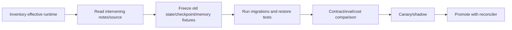

# Versions, Migrations, Limitations, and Alternatives

> **Research date:** 2026-08-31  
> **Baseline:** CrewAI `1.15.18`, released 2026-08-27

## Bottom Line

CrewAI's `1.14`–`1.15` line evolved quickly across executors, checkpointing, project formats, tool behavior, security, and conversational Flows. Pin exact versions, read every intervening release note, migrate persisted fixtures in CI, and verify source where docs and release notes disagree.

## Current Compatibility Snapshot

| Surface | `1.15.18` posture |
|---|---|
| Python | `>=3.10,<3.14` |
| Packages | `crewai-core==1.15.18`, `crewai-cli==1.15.18` through package metadata |
| Pydantic | `>=2.11.9,<2.13` |
| OpenAI SDK | `>=2.30,<3` |
| MCP Python SDK | `~=1.28.1`; not MCP 2.x |
| Crew projects | JSON/JSONC first; classic CrewBase/Python/YAML supported |
| Flow runtime | DSL/definition/runtime split; decorated and declarative definitions |
| Conversational Flows | Stable in `1.15.18`; experimental in earlier `1.15.x` |
| Checkpoint providers | JSON and SQLite built in |
| Agent planning | `planning_config` current; `reasoning` and `max_reasoning_attempts` deprecated |
| Skills | Registry promoted from experimental in `1.15.4`; `allowed-tools` metadata remains experimental |
| Streaming | Frame contract for Flows/LLMs/conversations; separate legacy Crew chunk stream |
| Execution hooks | Generic interception points available; non-`HookAborted` hook errors fail open |

Use the resolved lockfile as the deployment truth. Provider behavior can drift even when the framework does not.

## Change Timeline

| Release | Material production change |
|---|---|
| `1.14.0` | Runtime checkpointing/event state with JSON/SQLite providers; deprecated code-execution surfaces removed |
| `1.14.2`–`1.14.4` | Resume/fork, lineage, migrations, custom persistence keys, guardrail/callable restore fixes |
| `1.14.5` | New AgentExecutor default, CrewAgentExecutor deprecation, Flow state restore/fork surface |
| `1.14.6` | Checkpoint serialization fixes and stdio environment-leak hardening |
| `1.14.7` | Flow DSL/definition/runtime split and pluggable backend work |
| `1.15.0` | JSON-first Crews, unified declarative Flows, removed `StateProxy`, aggregated Flow usage, security fixes |
| `1.15.2` | Stream-frame protocol and inline Skills support |
| `1.15.3` | Tool-result caching changed to opt-in; generic/step/execution-boundary hook dispatcher |
| `1.15.4` | Skills repository promoted from experimental |
| `1.15.17` | SSRF redirect/peer-IP hardening and MCP fixes |
| `1.15.18` | Conversational Flows promoted to stable; API/docs/bug fixes |

Patch versions have carried behavioral and security changes. Do not treat `1.15.*` as one homogeneous runtime.

## Migration Workflow

### Inventory

Record framework/core/CLI, Python, providers, tools, MCP/A2A versions, Flow/Crew definition format, deprecated imports, persistence/checkpoint events/providers, Memory/Knowledge embedding configuration, telemetry, and managed-platform API version.

### Persisted fixtures

Keep sanitized real fixtures for:

- typed and dict Flow state from the oldest supported version;
- paused HITL context;
- Crew and Flow runtime checkpoints;
- branch/fork lineage;
- Memory and Knowledge indexes or rebuild manifests;
- latest-task replay where still used;
- structured task/tool results and failure objects.

Test both successful migration and deliberate rejection of incompatible state.

### Behavior gates

- graph routes and terminal output;
- completed-task/method skip behavior on resume;
- side-effect idempotency after crash;
- async sibling/cancellation behavior;
- tool failure policy and cache default;
- token/cost aggregation;
- memory save/recall and index compatibility;
- telemetry/redaction;
- quality/security evals.

## Current Known Limitations and Reports

These are bounded upgrade/test leads, not blanket claims about every deployment:

| Surface | Evidence and response |
|---|---|
| Dict-state restore | [#6706](https://github.com/crewAIInc/crewAI/issues/6706) reports new defaults lost on restore; prefer Pydantic and migration tests |
| Batch replay | [#6650](https://github.com/crewAIInc/crewAI/issues/6650) reports `kickoff_for_each` clearing replay records; use per-item durable results/checkpoints |
| MCP 2.0 | [#6750](https://github.com/crewAIInc/crewAI/issues/6750) reports pinned MCP 1.x incompatibility; pin both sides |
| Agent timeout | [#4135](https://github.com/crewAIInc/crewAI/issues/4135) was closed not planned, but current source still uses non-killable thread cancellation; use transport/process isolation |
| Async post-LLM hooks | Open [#6736](https://github.com/crewAIInc/crewAI/issues/6736) reports native provider `acall()` paths skip post hooks; tagged async handlers lack the sync invocation sites, so contract-test and enforce redaction elsewhere |
| Untrusted project execution | Open [#7050](https://github.com/crewAIInc/crewAI/issues/7050) links `.env`, declarative script execution, and pickle-loading surfaces; sandbox and review downloaded projects/artifacts |
| State persistence | Saves data but does not by itself restore an execution cursor; use runtime checkpoints where needed |
| Checkpoint writes | Automatic event-triggered writes are best-effort; monitor or checkpoint manually at critical boundaries |
| Exactly-once effects | Neither persistence nor checkpoints atomically commit external writes; use idempotency/reconciliation |
| Local stores | Defaults are not automatic multi-replica/tenant infrastructure |

Re-check issue status and source at every upgrade. Closed historical executor/HITL reports should become regression tests, not permanent assertions that the current release is broken.

## Documentation Contradictions

At the research date:

1. the repository's existing short overview says conversational Flows are experimental; `1.15.18` release notes and versioned guide say stable;
2. current Tools documentation lists `CodeInterpreterTool`, while the `1.14.0` changelog/current Agent documentation say it and deprecated code-execution fields were removed;
3. some simplified checkpoint examples can obscure the exact `CheckpointConfig`-based source signature and the distinction from Flow `@persist`;
4. the Agent/Reasoning docs still foreground `reasoning` and unbounded `max_reasoning_attempts`, while tagged source deprecates both in favor of `planning_config`;
5. the Crew Planning guide states an implicit `gpt-4o-mini` planner, while tagged `CrewPlanner` source defaults to `gpt-5.4-mini`; set `planning_llm` explicitly;
6. the versioned execution-boundary hook guide says a Crew kickoff also exposes its internal Flow hooks, while the `1.15.18` changelog/source skip interception on CrewAI-internal Flows; test exact dispatch counts;
7. older source docstrings/comments can lag current exception behavior.

Prefer this order: installed/source API → versioned release notes → matching versioned docs → examples/blogs. Open a documentation issue rather than silently inventing a compatibility shim.

## Deprecated or Historical Patterns

- `A2AConfig`: migrate to `A2AClientConfig`/`A2AServerConfig` before v2.0.
- `CrewAgentExecutor`: current AgentExecutor became default in `1.14.5`; test custom executor hooks.
- `StateProxy`: removed in `1.15.0`; migrate to typed state/current Flow APIs.
- Agent `reasoning` and `max_reasoning_attempts`: deprecated; migrate to bounded `PlanningConfig`.
- automatic tool caching assumptions: make caching explicit.
- older short/long/entity memory architecture: migrate deliberately to unified Memory.
- “consensual” Crew process: not a current process option.
- in-process model-generated code execution: removed/deprecated and unsafe as a compatibility workaround.

## Alternatives and Composition

Choose by the dominant requirement:

| Requirement | Prefer |
|---|---|
| Deterministic transformation/API integration | Ordinary code and queues |
| One bounded reasoning/tool loop | Direct model call or one Agent |
| Role-based collaboration with explicit task deliverables | Small Crew |
| Explicit state/routing/HITL around CrewAI work | CrewAI Flow |
| Cross-service long-running durable transactions/timers | Mature workflow engine; call CrewAI as an activity |
| Database-backed graph with precise state-machine semantics | Evaluate graph-oriented agent runtime |
| Very high-volume batch inference | Batch/data processing platform with bounded model stage |
| Strict sandboxed arbitrary code execution | Dedicated sandbox service, not an agent worker |

CrewAI need not own the whole system. A durable workflow engine can schedule a CrewAI Flow/Agent activity; an API service can use CrewAI for one decision; a retrieval service can enforce access before returning bounded evidence.

Use the [durable runtime comparison](../../comparisons/durable-agent-workflow-runtimes.md) when recovery semantics dominate the decision, and the [runtime language guide](../../languages/choosing-an-agent-runtime-language.md) when Python process, concurrency, or deployment constraints dominate it.

## Adopt or Reconsider

Adopt CrewAI when:

- team/task metaphors clarify a real collaborative problem;
- Flow control and current checkpoint/HITL features fit recovery needs;
- Python and the dependency/provider ecosystem fit operations;
- quality gains justify model-call and debugging cost;
- the team can own effect safety and security around the runtime.

Reconsider when:

- the workflow is mostly deterministic;
- exactly-once-like external activity semantics dominate;
- hard real-time cancellation is required;
- thousands of long-lived state machines require a proven distributed scheduler;
- strict static control is more important than agent-directed delegation;
- operational constraints prohibit current dependency/provider/data paths.

## Upgrade Checklist

- [ ] Exact old/new dependency trees and release notes are archived.
- [ ] Deprecated symbols and hidden behavioral defaults are inventoried.
- [ ] Real state/checkpoint/HITL/index fixtures restore or fail explicitly.
- [ ] Tool caching/failure, async, cancellation, and replay are regression-tested.
- [ ] Security changes and new network surfaces are threat-modeled.
- [ ] Paired quality, latency, and cost evals meet thresholds.
- [ ] Canary rollback/migration and active-run reconciliation are rehearsed.
- [ ] Docs contradictions and remaining uncertainty are recorded.

## Primary Sources

- [CrewAI `1.15.18` changelog](https://github.com/crewAIInc/crewAI/blob/1.15.18/docs/v1.15.18/en/changelog.mdx)
- [CrewAI `1.15.18` package metadata](https://github.com/crewAIInc/crewAI/blob/1.15.18/lib/crewai/pyproject.toml)
- [CrewAI releases](https://github.com/crewAIInc/crewAI/releases)
- [Checkpointing documentation](https://github.com/crewAIInc/crewAI/blob/1.15.18/docs/v1.15.18/en/concepts/checkpointing.mdx)
- [Conversational Flows guide](https://github.com/crewAIInc/crewAI/blob/1.15.18/docs/v1.15.18/en/guides/flows/conversational-flows.mdx)
- [CrewAI source at `1.15.18`](https://github.com/crewAIInc/crewAI/tree/1.15.18)
- [Agent planning configuration source](https://github.com/crewAIInc/crewAI/blob/1.15.18/lib/crewai/src/crewai/agent/planning_config.py)
- [Execution hook dispatcher source](https://github.com/crewAIInc/crewAI/blob/1.15.18/lib/crewai/src/crewai/hooks/dispatch.py)
- [Streaming types source](https://github.com/crewAIInc/crewAI/blob/1.15.18/lib/crewai/src/crewai/types/streaming.py)
