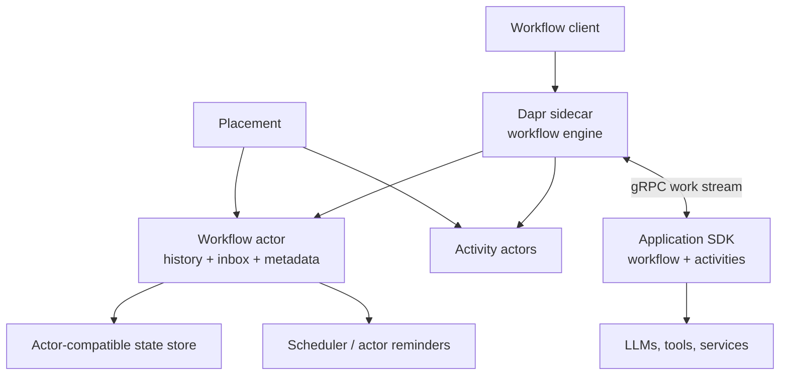
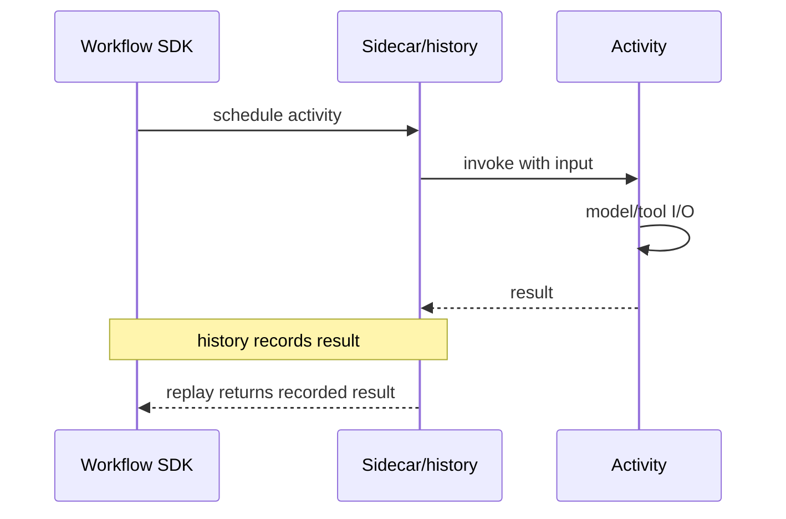
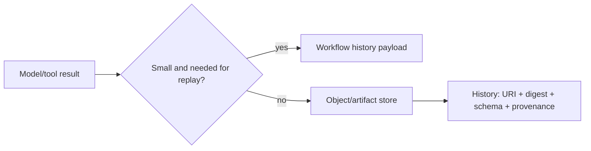

# Dapr Workflow for Agent Workflows

**Research date:** 2026-08-31  
**Status:** Research-backed technology guide  
**Scope:** Dapr 1.18-era Workflow architecture, actors/state stores, retries/interactions, versioning, operations, security, and Dapr Agents 1.0 boundary

## Bottom line

Choose Dapr Workflow when durable agent processes belong inside a broader Dapr platform using sidecars, actors, state stores, pub/sub, service invocation, workload identity, secrets, and observability. Dapr provides event-sourced deterministic orchestration, activities, child workflows, durable timers, external events, management APIs, versioning/patching, retention, and current history integrity features.

Do not choose it from SDK syntax alone. The sidecar/placement/scheduler topology, actor-compatible state store, reminder health, storage limits, coupled app scaling, runtime/SDK/Helm compatibility, and default-unbounded concurrency become part of the agent’s correctness envelope.

## Architecture

The engine runs in the sidecar and is implemented with `durabletask-go`. One Workflow actor stores an instance’s history and inbox; short-lived Activity actors dispatch work. Application replicas register workflow/activity definitions and receive work over gRPC. Actor placement can move workflow and activity work across replicas.

## Replay and activity boundary

Workflow/orchestrator code is replayed from event history and must be deterministic. It can schedule activities, children, timers, and external-event waits. Put model calls, tool calls, network/database I/O, uncontrolled clock/randomness, filesystem access, and agent framework loops in Activities or child Workflows.

Activities can retry after a worker/sidecar failure or policy. Use stable operation IDs and target-side reconciliation. Dapr’s reminder-driven execution keeps retrying transiently failed workflow/activity work; do not assume arbitrary effects run once.

## Retry layers

Dapr Workflow retry policies are durable code-level policies for activity/child exceptions. Dapr Resiliency policies are operator-configured policies for connectivity/operation faults and are a separate layer. If an agent SDK/provider client also retries, attempts can multiply.

Set one owner per failure class and calculate worst-case attempts, total time, and cost. Classify permanent auth/policy/input failures. A Dapr DurableAgent retry policy defaults must be inspected explicitly; current Dapr Agents guidance documents a default maximum of one attempt for its workflow operations unless configured/environment-overridden.

## External events, approvals, and timers

External events are named, single-workflow inputs and same-name waits are delivered FIFO. Durable timers can wait minutes to years and release compute. Combine an external event with a timer for approval expiry.

Bind the event payload to workflow ID/generation, proposal digest, tenant/resource, actor, expiry, and policy version. Authenticate and authorize the caller through the application API; knowing a workflow ID is not authority. Revalidate on resume.

Management pause/resume suspends workflow scheduling. It is different from a business approval event. Keep administrative and domain interactions separate in audit trails.

## Continue-as-New and child workflows

Continue-as-New resets history and increments a generation. The current feature guide warns that it discards incomplete tasks—including activities, timers, and child workflows that were started but not awaited. Before rollover:

- stop accepting new work or buffer it durably;
- await or explicitly abandon/cancel every child/activity;
- carry compact state and deduplication cursors;
- preserve pending approval/effect identities;
- verify late results from the old generation cannot mutate the new one.

Child Workflows own independent histories/status and reduce parent history pressure. Parent termination terminates children. Use bounded fan-out and application-level quotas.

## State-store and history engineering

Workflow history is append-only across state-store keys; inbox entries queue unprocessed events. Completed state remains until retention or purge. The selected store’s item and transaction limits constrain payloads and concurrent checkpoint batches. The official architecture cites Cosmos DB’s 2 MB item limit as an example and notes that fan-out batches can hit store transaction limits.

Measure checkpoint latency, batch size, history rehydration, reminder count, and store throttling using the exact component. History signing/attestation in Dapr 1.18 adds tamper evidence and chain of custody; it does not validate that a model decision was correct or authorized.

## Concurrency and scaling boundaries

By default there are no global Workflow/Activity concurrency limits; runaway fan-out can consume the cluster. Configure and verify limits. Recent release notes reported a Helm path where limits were silently ignored, making a runtime-level load test essential.

All replicas of one workflow application must register the same set of Workflows and Activities. They scale together; individual Activity types cannot be independently scaled within that app registration boundary. Split applications only with a deliberate cross-app workflow/service design.

Placement decides execution locality; a Workflow and its Activities may run on different nodes. Avoid process-local shared state. Use Dapr state/service APIs or external stores with explicit consistency.

## Versioning and operations

Dapr now provides named Workflow versions plus patch markers for replay-compatible evolution. Test old history against new code and define how callers select/default versions. Continue-as-New can be a controlled upgrade boundary for long-lived workflows.

Management APIs/CLI support start, history, suspend, resume, terminate, rerun from beginning/event, and purge. Purge permanently deletes inputs, outputs, and history and normally requires a running Workflow client to preserve state-machine integrity; forced purge while runs exist can corrupt state. Restrict and audit it.

Configure retention because completed actor state otherwise grows without bound. Monitor sidecar/workflow gRPC health, placement/scheduler/reminders, history/inbox/state-store latency and errors, Activity retry, concurrency, app registration parity, stalled workflows, retention/purge, version adoption, and storage bytes.

## Dapr Agents boundary

Dapr Agents 1.0 is a Python agent framework that uses Dapr Workflow under its DurableAgent abstraction. It durably records LLM/tool interactions and supports HTTP/pub-sub triggers, multi-agent child workflows, hooks, and human approval. Hooks run inside an Activity boundary, so intermediate hook state is not separately durable unless the hook records it.

Adopt Dapr Agents only after selecting Dapr Workflow/platform on operational merit. Verify framework/runtime package compatibility, which hooks are dispatched, how memory differs from Workflow history, tool authorization, retry policy, stream recovery, and version semantics. “Agent identity” and workload identity do not automatically authorize a particular tool resource.

## Security

Dapr provides mTLS/workload identity, access policies including current workflow access policy, secret-store integration, and optional client-side state encryption. By default Dapr does not transform application state; enable state encryption or use an encrypted backend as policy requires. Protect sidecar APIs, component scopes, placement/scheduler traffic, state-store credentials, and management endpoints.

Workflow history contains inputs/outputs and Activity results. Avoid credentials, minimize prompts/tool data, encrypt sensitive state, limit dashboard/API access, and set retention. History signing detects modification; it is not confidentiality.

## Adoption tests

- [ ] Replay old history after workflow/activity/SDK/runtime changes.
- [ ] Crash app and sidecar before/after Activity completion and target commit.
- [ ] Reconcile late Activity results across cancel and Continue-as-New generations.
- [ ] Race same-name external events, timeouts, pause/resume, and termination.
- [ ] Prove concurrency limits are effective in the deployed Helm/config path.
- [ ] Saturate fan-out against state-store item/batch/throttle limits.
- [ ] Restart placement/scheduler/state-store and measure recovery/backlog.
- [ ] Retain/purge completed workflows without corrupting active instances.
- [ ] Verify every replica registers the same definitions and old versions drain.
- [ ] Inspect encrypted history, signed history, and access-policy enforcement.

## Choose something else when

- the organization does not otherwise want the Dapr sidecar/building-block platform;
- independent scaling by workflow/activity type is essential;
- a managed dedicated workflow service is preferred;
- library-only Postgres durability or keyed durable-service handlers are simpler;
- Python data/ML infrastructure orchestration is the dominant need.

## Primary sources and failure-test leads

- [Workflow architecture](https://docs.dapr.io/developing-applications/building-blocks/workflow/workflow-architecture/), [features](https://docs.dapr.io/developing-applications/building-blocks/workflow/workflow-features-concepts/), and [protocol state/history](https://docs.dapr.io/contributing/protocol-reference/workflow-protocol/workflow-protocol-state-and-history/)
- [Workflow versioning](https://docs.dapr.io/developing-applications/building-blocks/workflow/workflow-versioning/), [management](https://docs.dapr.io/developing-applications/building-blocks/workflow/howto-manage-workflow/), and [security](https://docs.dapr.io/concepts/security-concept/)
- [Dapr Agents introduction](https://docs.dapr.io/developing-ai/dapr-agents/dapr-agents-introduction/), [patterns](https://docs.dapr.io/developing-ai/dapr-agents/dapr-agents-patterns/), and [hooks/HITL](https://docs.dapr.io/developing-ai/dapr-agents/dapr-agents-hooks/)
- Regression leads: [Dapr releases](https://github.com/dapr/dapr/releases) and [workflow routing regression #10039](https://github.com/dapr/dapr/issues/10039)

See [durable-runtime selection](../comparisons/durable-agent-workflow-runtimes.md) and the [research packet](../research/packets/durable-agent-workflow-runtimes.md).
