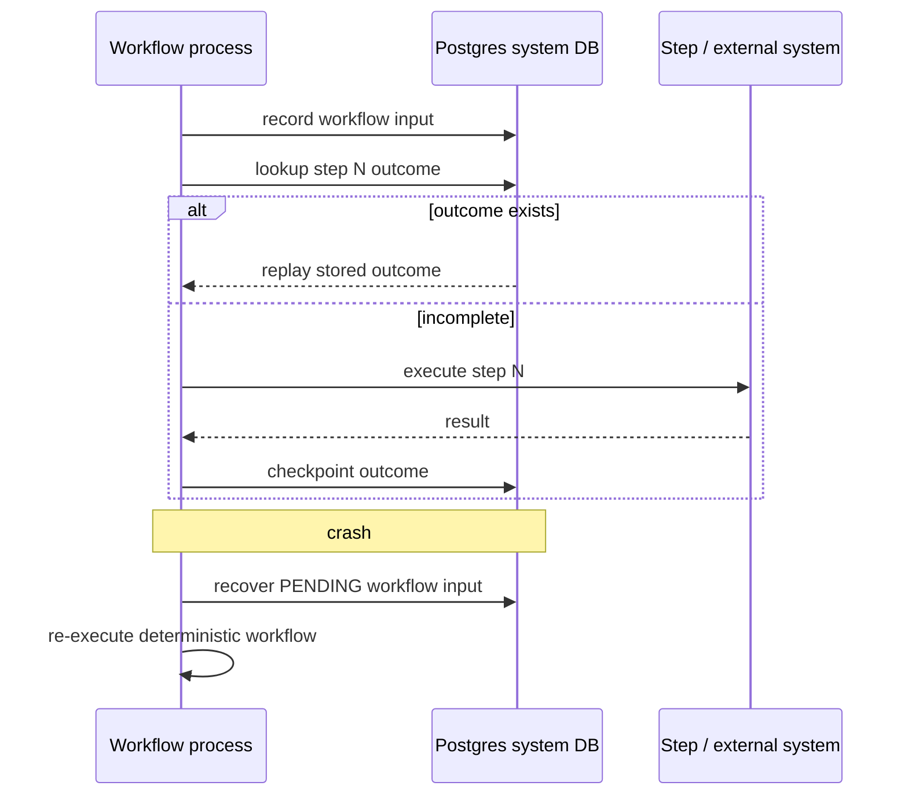
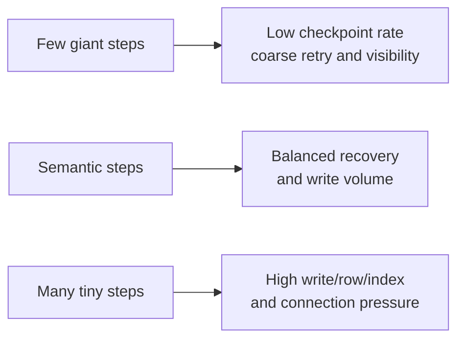
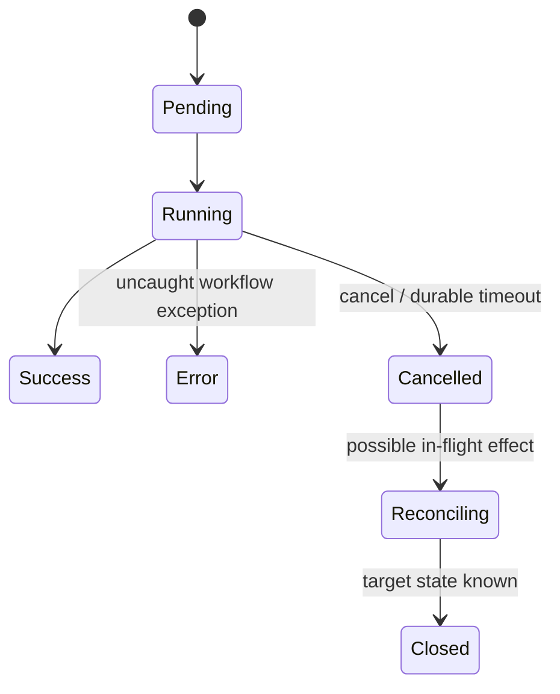

# DBOS for Agent Workflows

**Research date:** 2026-08-31  
**Status:** Research-backed technology guide  
**Scope:** DBOS language libraries, Postgres-backed recovery, queues/interactions, versioning, Conductor, and current agent integrations

## Bottom line

Choose DBOS when an agent application wants durable workflows, queues, waits, communication, and observability as an embedded library whose primary data-plane dependency is Postgres. This can be a major simplification for a Postgres-centered application or constrained/on-premises deployment.

The simplicity has a precise cost model: every workflow/step checkpoint is database work, large outputs become database storage, and a distributed fleet needs coordinated recovery. Treat steps as at-least-once until their result is checkpointed, keep them idempotent, and use application versioning or patch markers before changing step order.

## Execution and recovery model

Recovery restarts the workflow function with stored inputs. Completed steps return stored outputs; the first missing step executes. Workflow code must invoke the same steps with the same inputs and order. Put I/O, random/time, and other nondeterminism in steps.

## Agent boundary design

Current integrations cover Pydantic AI, OpenAI Agents SDK, LlamaIndex, Google ADK, Vercel AI SDK, and related stacks. Do not rely on the adapter name alone. Verify which operations become steps:

| Agent operation | Required durable unit |
|---|---|
| Model request | Step with bounded retry and serialized response/reference |
| Function/MCP tool | Step or child workflow with operation ID |
| Guardrail/policy evaluation | Deterministic code or step when it uses I/O/model |
| Human approval | Durable message/event wait plus expiry |
| Agent handoff | Child workflow or explicit step/result contract |
| Token stream | Durable stream semantics tested separately from final workflow output |
| Large artifact | Object-store reference and digest, not step blob |

The OpenAI integration requires `DBOSRunner` plus workflow and step annotations for tools/guardrails. The Pydantic integration wraps the loop, model requests, and MCP communication. Pin both the framework and adapter versions; test that cancellation, streaming, parallel tools, and errors cross the boundary as intended.

## Write and payload economics

The official architecture documents one database write per step plus one at workflow start and one at completion. Inputs, workflow output, and every step output are serialized. This makes granularity a database design decision:

Avoid token-level checkpoints. Persist semantic model/tool milestones. Put documents, media, sandbox directories, and large model output in artifact storage; checkpoint an immutable URI, digest, schema, and provenance.

## Effects and transactions

Steps are tried at least once until completion is checkpointed. If an HTTP target commits and the process dies before the step output is written, the step can repeat. Use target-side idempotency or lookup.

DBOS transactions can provide a stronger boundary when application data and workflow bookkeeping commit in the same compatible database transaction. That advantage does not extend to email, payment, cloud, or other remote APIs. Separate:

- database transaction commit;
- external operation commit;
- workflow step checkpoint;
- user-visible completion.

Workflow IDs are admission idempotency keys and must be globally unique within the application. Validate them as a security/correctness boundary. A current issue described an empty ID causing unrecoverable/duplicate recovery behavior before a fix; retain invalid/empty/normalization collision tests.

## Communication, waits, and streams

DBOS supports durable sleep, messages to workflows, workflow events, and append-only streams. Messages sent from a workflow are durably/exactly-once delivered in DBOS’s boundary; external senders need an idempotency key. `recv` consumes per-topic messages and can time out.

Stream guarantees depend on caller context: documented workflow stream writes are exactly once, while writes from a retryable step can duplicate. Give every semantic event an event ID and make UI reduction idempotent. Do not assume a live framework token stream can be reconstructed unless the selected adapter explicitly checkpoints it.

## Timeouts and cancellation

Workflow timeouts are durable and start when a queued workflow begins execution. On expiry, DBOS cancels the workflow/children and normally preempts at the next step boundary; an async step must be marked preemptible for immediate interruption. A target request can still complete after cancellation.

Current issue evidence reproduced a cancellation-versus-completion race where a clean cancel return could lose to completion. Even when fixed, adoption tests must assert the caller-observable outcome. A cancellation API should return whether cancellation took effect or the application should read/reconcile final status.

## Distributed recovery and Conductor

On one server, startup scans and recovers its pending workflows. In a distributed setting, workers/executors share a system database and need ownership coordination when one disappears. The official production guidance recommends unique executor IDs and DBOS Conductor for automatic high-availability recovery, workflow/queue management, dashboards, alerts, and retention—or equivalent self-managed coordination.

Conductor is not in the critical execution path, so applications keep running during a disconnection. However, control-plane reads/actions and automatic cross-executor recovery depend on connectivity and healthy executors. Document this degraded mode and alert on it.

Monitor database WAL/write IOPS, connections, lock/queue contention, checkpoint latency/size, pending workflows by executor/version, recovery attempts, queue age, Conductor connectivity, retention deletion, and effect reconciliation backlog.

## Versioning and upgrade

Breaking changes add/remove/reorder steps or change their inputs. DBOS supports:

- **patching:** a durable patch marker selects old versus new path;
- **application versioning:** workflows recover only on a process with the version where they began.

With application versioning, use blue/green deployment and retain old processes until old workflows drain. If a serverless platform removes an old revision, old workflows cannot recover unless compatible patching or an explicit migration/fork strategy exists. Automatic source hashes are helpful but not a substitute for versioning prompts, tools, policies, and domain schemas.

## Security and data

The system database contains workflow inputs/outputs and step outputs. Apply database encryption, network isolation, least-privilege credentials, backups, row/retention policy, and separate databases/app identities by environment. Avoid secrets and raw credentials in serialized values.

Conductor’s metadata-only mode can keep inputs/outputs from the managed console; review plan and self-host differences. Conductor communicates over outbound WebSockets and does not need database access, but connected executor/control permissions remain sensitive. Keep repair, fork, cancel, version, and export APIs strongly authorized and audited.

## Adoption tests

- [ ] Crash after target effect but before step checkpoint; reconcile by operation ID.
- [ ] Measure Postgres writes, bytes, connections, and queue locks on production-shaped steps.
- [ ] Kill one executor and prove one compatible executor recovers each workflow.
- [ ] Disconnect Conductor and document execution versus management/recovery behavior.
- [ ] Reject empty, whitespace, normalized-collision, and cross-tenant workflow IDs.
- [ ] Race cancel/timeout/completion and verify final effect state.
- [ ] Upgrade with both patch markers and blue/green version drain.
- [ ] Exercise messages/events/streams under duplicate send and retrying steps.
- [ ] Verify adapter durability for built-in tools, MCP, parallel calls, and token reconnect.
- [ ] Enforce retention and inspect system DB/console for sensitive data.

## Choose something else when

- the team wants a dedicated workflow service with deep cross-language server semantics;
- keyed durable service objects are the dominant model;
- Python data orchestration infrastructure is the main need;
- Dapr is already strategic;
- Postgres is not an acceptable shared durability/throughput dependency or the team will not operate distributed recovery.

## Primary sources and failure-test leads

- [DBOS architecture](https://docs.dbos.dev/architecture), [workflows](https://docs.dbos.dev/python/tutorials/workflow-tutorial), and [recovery](https://docs.dbos.dev/production/workflow-recovery)
- [Workflow upgrades](https://docs.dbos.dev/java/tutorials/upgrading-workflows), [communication/streams](https://docs.dbos.dev/python/tutorials/workflow-communication), and [Conductor](https://docs.dbos.dev/production/conductor)
- [OpenAI Agents integration](https://docs.dbos.dev/integrations/openai-agents) and [AI quickstart/integrations](https://docs.dbos.dev/ai/ai-quickstart)
- Regression leads: [cancellation race #767](https://github.com/dbos-inc/dbos-transact-py/issues/767) and [empty workflow ID recovery #759](https://github.com/dbos-inc/dbos-transact-py/issues/759)

See [durable-runtime selection](../comparisons/durable-agent-workflow-runtimes.md), [Go agent runtimes](../languages/go-agent-runtimes.md), [Go vs Python vs TypeScript/Node.js](../comparisons/go-vs-python-vs-typescript-node-agent-runtimes.md), and the [research packet](../research/packets/durable-agent-workflow-runtimes.md).
