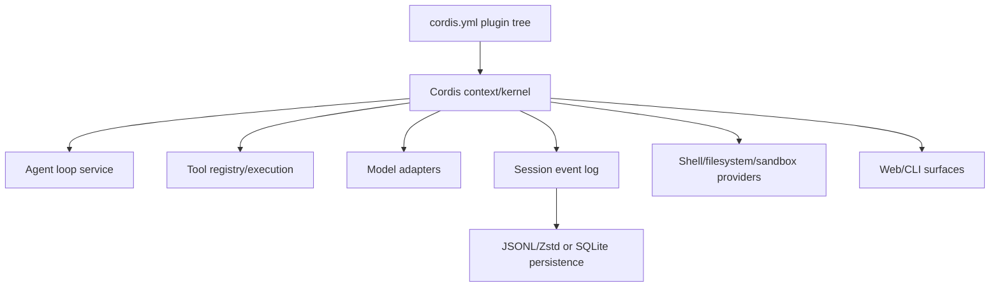
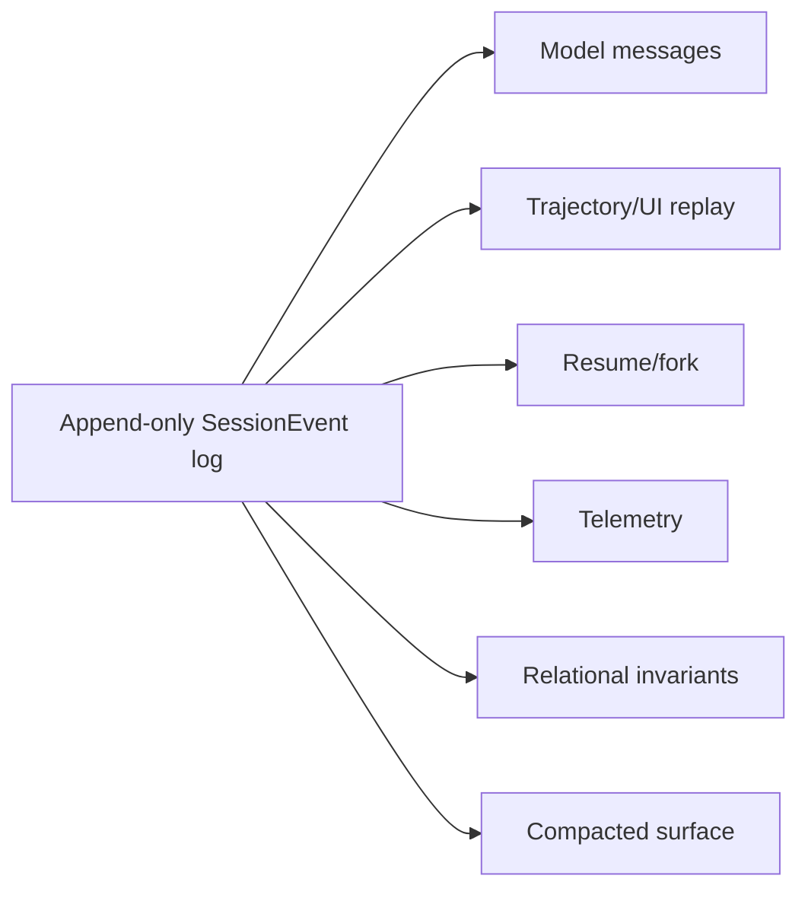
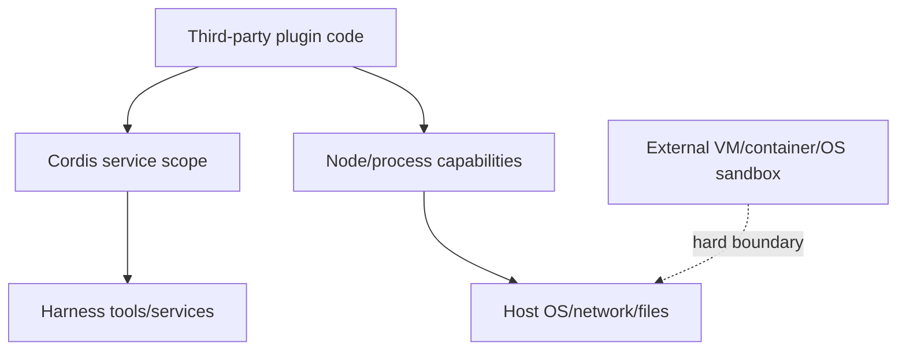

# DeepSeek Harness: Architecture, Evaluation, and Safety Boundary

**Research date:** 2026-08-31  
**Status:** Research-backed preview guide  
**Maturity:** `0.1.2-alpha.2` developer preview at commit `0a53fb55bea101816fa226bb964ae2bed71c343b`; official safety statement says not security-audited or production-ready

## Bottom line

DeepSeek Harness is an ambitious, highly composable TypeScript workspace-agent harness built on the Cordis plugin kernel. Its append-only session model, capability seams, lifecycle-managed plugins, and inspectable architecture are valuable design references.

Do not deploy it as a sensitive or exposed production control plane at this maturity. The project explicitly expects breaking changes and says it must not be the sole security control for untrusted workloads. Use it only in disposable, strongly isolated environments with minimal credentials and audited, pinned plugins.

## Architecture

Cordis gives plugins scoped services, declared dependencies, typed events, reversible effects, configuration composition, hot reload, and optional service isolation. When a required service disappears, dependent plugins unload and can reload when it returns.

That makes capability replacement systematic, but also means configuration and plugin lifecycle are executable architecture. A hot-reloaded provider can change tool, telemetry, storage, or policy behavior mid-process. Treat the complete plugin tree as signed/versioned deployment configuration.

## Event-sourced sessions

The `SessionEvent` log is the Harness source of truth. It records model-visible inputs, request provenance, raw assistant chunks, tools/results, steps/turns, compaction, approvals, and extension events. Messages, surface/UI state, transcripts, telemetry, resume, replay, and fork derive from the same ordered log. Map it into the application-owned [agent state and event contract](../runtime/agent-state-and-event-contracts.md); a session log does not replace product identity, authorization, retention, or an external-effect ledger.

This is a strong audit model if the log is complete and protected. It also creates a high-value sensitive artifact containing prompts, reasoning/chunks, files/tool data, approvals, and policy facts. Encrypt it, restrict access, cap retention and size, and support tenant deletion.

The persistence seam ships JSONL/Zstandard and SQLite backends. Durable append resolves after the batch is safe; crash repair preserves an incomplete turn and classifies unpaired tool work as `TOOL_NOT_STARTED` or `TOOL_OUTCOME_UNKNOWN`. This is better than guessing. The application must still reconcile an unknown external effect by operation ID.

The current session format is pre-release version 0 with no broad compatibility promise. Pin the exact harness/plugin set and export critical domain artifacts outside the internal format.

## Plugin isolation is not containment

Cordis service isolation gives plugin groups different instances of a capability. It does not prevent plugin code from using Node.js, the network, filesystem, process environment, or host APIs available to the process.

Audit plugins like application dependencies: pin by digest/commit, review install scripts and transitive packages, inventory services/events/tools/prompts they register, deny network by default, and test unload/reload cleanup. Dependency injection controls discovery, not authority.

Process-global service registries have already produced multi-preset mount/resume collisions in current discussions. Test two sessions/presets concurrently, hot reload, duplicate registration, partial plugin load, and service disappearance.

## Sandbox and approval boundary

Current design includes per-session sandbox/approval policy facts in the session log and one-call escalation. Official architecture notes describe fail-closed handling when an escalation cannot be approved and inheritance into subagents. These are useful controls, but the official safety statement explicitly warns that sandboxing and approvals do not guarantee isolation.

Run defense in depth:

1. a disposable VM or dedicated, locked-down container/host;
2. unprivileged OS identity, read-only base image, explicit workspace volume;
3. no host socket, broad home directory, SSH agent, cloud metadata, or ambient credentials;
4. default-deny egress with destination-specific proxy policy;
5. harness sandbox and per-call approval;
6. application/resource authorization at each external service;
7. immutable backups and independent audit/effect ledger.

Do not bind the Web UI beyond loopback without a real authenticated reverse proxy and network isolation. Public, version-specific discussions report unauthenticated control-plane access and sandbox/approval bypass paths. These are not formal advisories, but combined with the official preview warning they make exposed production use unacceptable.

## Modes and model portability

Standard, PTC, Minimal, and Creator modes expose materially different authority. PTC lets model-generated TypeScript orchestrate multiple tool rounds and is explicitly shell-equivalent trust; Creator Mode can inspect and experiment with the runtime; Minimal Mode can still have broad shell/editor access depending on its composition.

Record a capability manifest per preset:

- visible tools, skills, subagents, workflows, and model adapter;
- shell/filesystem provider and actual sandbox roots;
- approval policy and escalation path;
- network and credential sources;
- session backend/format and compaction plugins;
- UI/RPC listeners and authentication;
- plugin package names, hashes, install scripts, and service scope.

Custom models may not follow DeepSeek-specific tool conventions. Current discussions report optional sandbox escalation fields causing repetitive failures with other models and object/`oneOf` arguments arriving as raw strings through some adapters. Run schema, approval, tool-error, and cancellation conformance per model/provider.

## Operational acceptance tests

- [ ] Run inside a disposable external sandbox and prove host/home/socket/metadata denial.
- [ ] Inspect every plugin, dependency, prompt contribution, tool, listener, and network endpoint.
- [ ] Start concurrent presets/sessions and hot-reload providers without registry collisions.
- [ ] Crash during event append, compressed-frame write, tool send, effect commit, and flush.
- [ ] Corrupt/truncate session storage and verify bounded repair plus artifact recovery.
- [ ] Resume/fork under the exact pinned format and reject incompatible versions safely.
- [ ] Reconcile `TOOL_OUTCOME_UNKNOWN`; never let the model blindly repeat a write.
- [ ] Exercise approval inheritance and privilege escalation through every subagent/workflow path.
- [ ] Test each model adapter against complex schemas, cancellation, tool errors, and stream termination.
- [ ] Confirm UI/RPC is loopback-only or protected by independently verified authentication/TLS.
- [ ] Scan session/trace artifacts for secrets and enforce retention/deletion.

## Use it for

- studying a plugin-composed harness and event-sourced session architecture;
- isolated local experimentation on disposable workspaces;
- testing alternative loops, tools, storage, compaction, or provider plugins under controlled conditions;
- evaluating whether capability seams improve an internal harness design.

## Do not use it for

- exposed multi-user production services;
- untrusted workloads without an independent hard sandbox;
- sensitive credentials/data on an ordinary developer host;
- long-lived stored sessions that require compatibility guarantees;
- a compliance boundary based only on harness approvals or service isolation.

## Primary sources and risk evidence

- [Official overview](https://www.deepseek.com/harness/en/), [repository](https://github.com/deepseek-ai/deepseek-harness), and [official safety statement](https://github.com/deepseek-ai/deepseek-harness/blob/master/SAFETY.md)
- [Architecture](https://github.com/deepseek-ai/deepseek-harness/blob/master/docs/architecture.md), [Cordis services/isolation](https://github.com/deepseek-ai/deepseek-harness/blob/master/docs/user/develop/framework/service.md), and [Cordis primer](https://github.com/deepseek-ai/deepseek-harness/blob/master/docs/cordis-primer.md)
- [Session model](https://github.com/deepseek-ai/deepseek-harness/blob/master/docs/subsystems/session.md), [persistence](https://github.com/deepseek-ai/deepseek-harness/blob/master/docs/subsystems/persistence.md), and [persistence package contract](https://github.com/deepseek-ai/deepseek-harness/blob/master/packages/session/session-persistence/README.md)
- Version-specific security/test leads: [audit discussion #817](https://github.com/deepseek-ai/deepseek-harness/discussions/817), [control-plane report #853](https://github.com/deepseek-ai/deepseek-harness/discussions/853), [resume collision #1415](https://github.com/deepseek-ai/deepseek-harness/discussions/1415), and [schema adapter #4747](https://github.com/deepseek-ai/deepseek-harness/discussions/4747)

Continue with the [DeepSeek Harness production-minded guide](deepseek-harness/README.md). See also [evolving ecosystem selection](../comparisons/evolving-agent-framework-ecosystems.md), the [DeepSeek Harness deep-dive packet](../research/packets/deepseek-harness-deep-dive.md), and the earlier [ecosystem packet](../research/packets/framework-lifecycle-and-second-wave.md).
