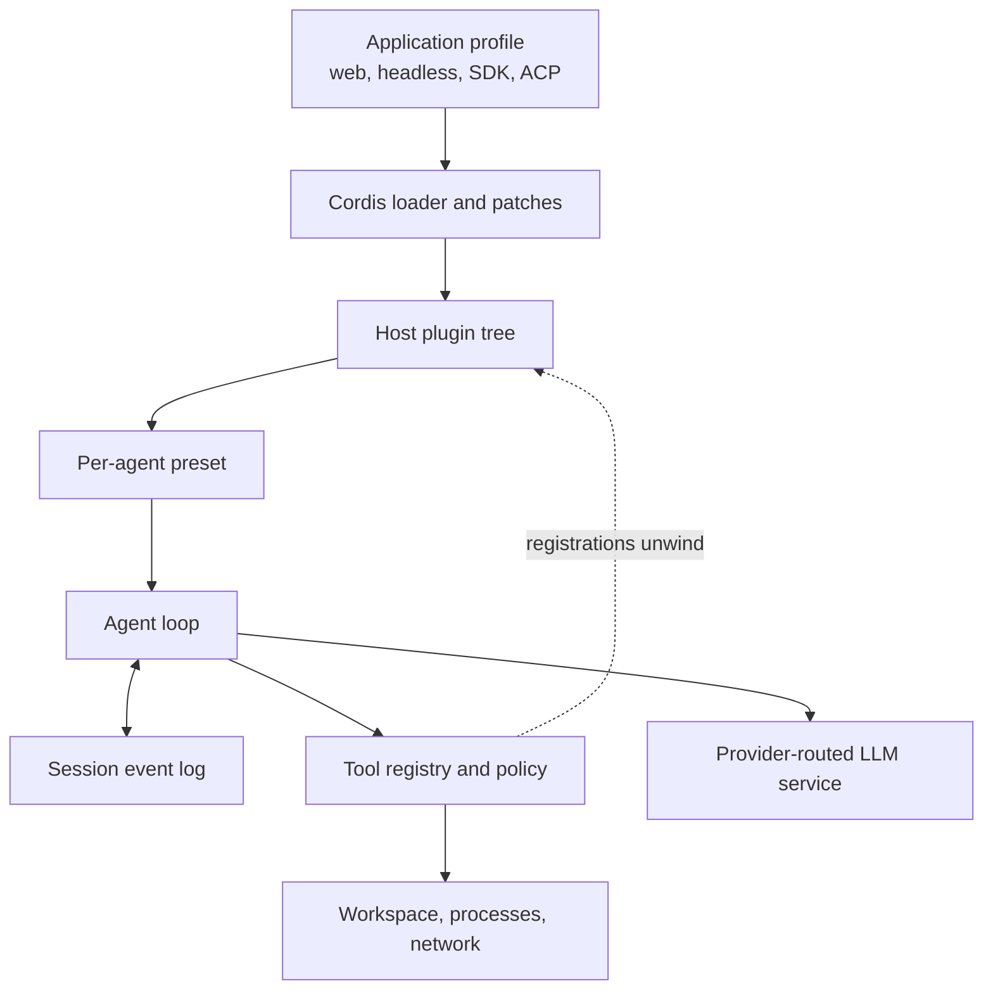
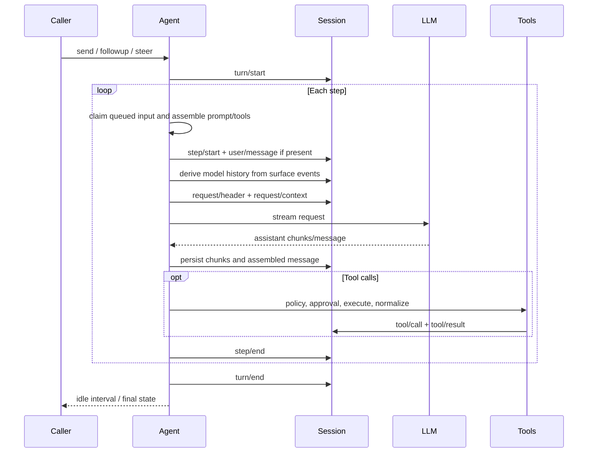

# Architecture, Cordis runtime, and agent loop

> **Research date:** 2026-08-31  
> **Current-source baseline:** DeepSeek Harness `0.1.2-alpha.2` at `0a53fb55bea101816fa226bb964ae2bed71c343b`  
> **Volatility:** very high; refresh on any core, profile, preset, loop, or Cordis release

DeepSeek Harness is best understood as a composition system around an event-recorded agent loop. Cordis supplies the plugin lifecycle and service/event substrate. Harness packages supply sessions, tools, model requests, prompts, policies, and application profiles. Presets then compose an agent-specific standing runtime inside that process.

## System map

No box is a privileged, immutable core. A plugin can register or replace services exposed to its context, and Cordis tracks registrations as reversible effects. That is an extension mechanism, not proof that all combinations are safe or semantically compatible.

## Cordis: lifecycle composition, not containment

Cordis contributes three core ideas:

- **Services** are named capabilities resolved through a `Context` and declared dependencies.
- **Events** support several dispatch semantics, including broadcast, waterfall, parallel, serial, and first-answer/bail patterns.
- **Effects** record registrations and cleanup functions so unloading a plugin can reverse the state it introduced.

The associated Cordis paper describes effect tracking and dependency-driven activation/deactivation as a “spatiotemporal composability” model. This is useful for hot reconfiguration: add a plugin, satisfy a dependency, or change configuration, and Cordis can reconcile the affected runtime fibers.

Do not translate those properties into a security claim. Service scoping decides which service instance a plugin sees. It does not isolate memory, Node.js APIs, processes, the filesystem, or network access. A same-process plugin remains part of the trusted host.

## Profiles, bundles, patches, and presets

Four composition concepts serve different scopes:

| Concept | Scope | Purpose | Operational consequence |
|---|---|---|---|
| **Profile** | Process/application | Select the application surface and bundle stack | Determines server/stdio/headless behavior and reload policy |
| **Bundle** | Profile dependency layer | Package a reusable Cordis patch into an npm artifact | Installation and bundle membership normally require restart |
| **Patch** | Loader configuration | Add, remove, or replace configured plugin rows | A targeted row replaces its config; it is not an implicit deep merge |
| **Preset** | Agent/session | Compose standing prompt, tools, policies, and capabilities | Different sessions can mount different agent behavior in one host |

Profiles live under `$DSH_HOME/profiles/<name>`. The effective configuration is layered in this order:

1. bundle patches;
2. profile `cordis.patch.yml`;
3. home-level patch;
4. command-line `--patch` inputs, in order.

Use `dsh --profile <name> --dump-config` to inspect the result and `--dump-default-config` to compare it with the shipped composition. This is safer than reasoning from a single patch file.

The shipped application profiles include `web`, `headless`, `sdk`, `sdk-minimal`, and `acp`. The base bundle participates in all except `sdk-minimal`. The web profile is configured for live reload by default; the other shipped profiles are startup-only.

The shipped agent presets are `standard`, `ptc`, `minimal`, and `cordis`. The public site calls the last one “Creator.” The distinction matters:

- `standard` is the full workspace coding composition.
- `ptc` adds Programmatic Tool Calling and `run_code` presentation.
- `minimal` exposes a smaller fixed prompt and tool set; it is not automatically a safer runtime.
- `cordis` can inspect and define runtime composition. Treat it as host-level, shell-equivalent authority.

## The loop in exact terms

A **step** is one model request followed by the tool calls produced by that response. A **turn** contains zero or more steps and may continue because tools ran or because a queued steering message must be included.

The main extension points are events around pre-step, request construction, streaming, tool execution, and post-step transitions. A plugin can reject a step, alter the request route, add model-visible context, wrap execution, or observe events. Ordering therefore matters. A change that is locally valid can still violate another plugin's assumptions.

## Durable events versus live events

Harness separates two classes of event:

- **Session events** are durable records used to reconstruct model history, replay a UI, and repair incomplete turns.
- **Agent/capability events** are live coordination hooks for the current runtime.

Do not assume a live event was persisted merely because it affected execution. If an operational fact must survive restart, identify the session event that records it or add an explicit durable record.

## Agent handles and cancellation

Creating or resuming an agent returns an owning handle and disposer. The public status is intentionally small: `idle` or `running`. “Running” may span multiple turns.

Message methods have different admission semantics:

| Method | Placement | Wakes an idle agent? | Per-message completion result? |
|---|---|---:|---:|
| `followup` | Next turn | Yes | No |
| `steer` | Next step | Depends on API option | No |
| `inject` | Next step | No | No |
| `whenIdle` | Observes an idle interval | Not applicable | Whole-agent interval only |

This is not a request/response queue. After a follow-up is accepted, the caller cannot infer exactly which turn produced which final text from `whenIdle` alone. Build explicit correlation in durable events or domain storage when a business workflow requires it.

Cancellation stops current work with a cause such as caller, parent, hook, or disposal. It does **not** roll back a completed tool call or an external effect. Tools must honor the supplied abort signal and external writes must use their own idempotency and recovery design.

## Composition failure modes

### Duplicate registration

Cordis effect cleanup is strongest when every mount has one clear owner and every teardown completes. Duplicate IDs can still collide. A version-scoped report in Discussion [#1415](https://github.com/deepseek-ai/deepseek-harness/discussions/1415) showed `0.1.0-rc.6` sessions colliding when multiple `cordis` presets registered process-global inspect providers. The examined `0.1.2-alpha.2` source still throws on a duplicate host inspect-provider ID and still registers those providers from the tool plugin, so this remains a concrete regression test—not a universal statement about every preset combination.

Operational response:

- avoid mounting duplicate singleton-style providers in one process;
- test two simultaneous sessions and abnormal teardown;
- make plugin registrations owned, reversible, and idempotent where semantics allow;
- treat an opaque resume failure as a possible composition/mount failure before declaring session corruption.

### Hot-reload drift

Live reload can change prompts, policies, or registrations while a host remains up. It is useful during development but expands the number of runtime states operators must reason about. Prefer startup-only, version-pinned composition for controlled environments.

### Patch replacement surprises

A patch row replaces the target configuration rather than recursively merging every nested field. Dump and diff the effective configuration after an upgrade; otherwise an omitted field can silently revert to a default or remove a prior setting.

### False isolation assumptions

An agent-scoped service instance can prevent accidental cross-session lookup while providing no protection against malicious host code. Use an OS process, container, VM, or remote execution boundary for hostile code.

## Design guidance

- Keep the default composition small. Every plugin adds ordering, lifecycle, compatibility, and trust obligations.
- Separate process profiles from per-agent presets in configuration reviews.
- Give every effect one lifecycle owner; test clean unload, partial mount failure, and repeated mount/unmount.
- Record business-critical correlation outside “wait until idle.”
- Make side-effecting tools idempotent and cancellation-aware.
- Treat dynamic composition and the Creator/`cordis` preset as privileged administration, not an ordinary user capability.
- Freeze production-like compositions at startup and qualify the fully assembled profile, not individual packages in isolation.

## Review checklist

- [ ] The exact profile, bundles, patches, and preset are recorded.
- [ ] Effective configuration was dumped and reviewed.
- [ ] Plugin trust is evaluated independently from service scope.
- [ ] Duplicate mount, unload, abnormal teardown, and restart were tested.
- [ ] Every live coordination fact that must survive restart has a durable record.
- [ ] Tool side effects define idempotency and cancellation behavior.
- [ ] Dynamic Cordis authoring is disabled or isolated for untrusted users.

## Primary sources

- [Official architecture](https://github.com/deepseek-ai/deepseek-harness/blob/master/docs/architecture.md)
- [Agent lifecycle](https://github.com/deepseek-ai/deepseek-harness/blob/master/docs/agent-lifecycle.md)
- [Agent core package](https://github.com/deepseek-ai/deepseek-harness/blob/master/packages/core/agent/README.md)
- [Command-line boot package](https://github.com/deepseek-ai/deepseek-harness/blob/master/packages/boot/cmdline/README.md)
- [Generated configuration catalog](https://github.com/deepseek-ai/deepseek-harness/blob/master/docs/config-catalog.md)
- [Cordis paper](https://arxiv.org/abs/2608.25512)
- [Current tool-cordis source](https://github.com/deepseek-ai/deepseek-harness/tree/master/packages/extensions/tool-cordis)
- [Version-scoped duplicate-registration report #1415](https://github.com/deepseek-ai/deepseek-harness/discussions/1415)
