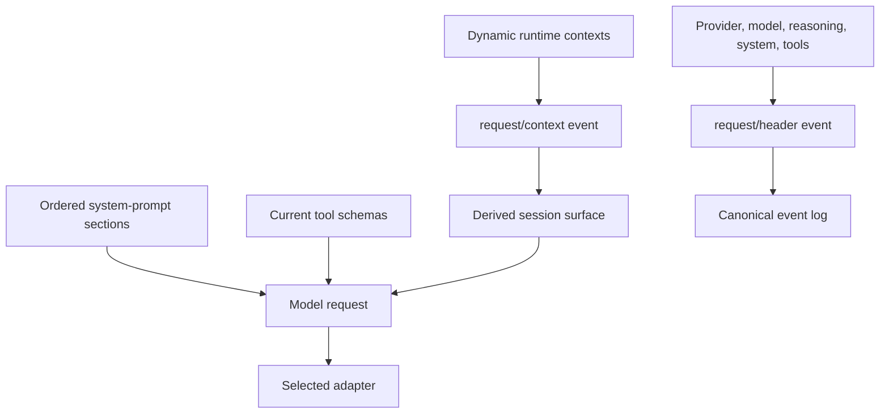
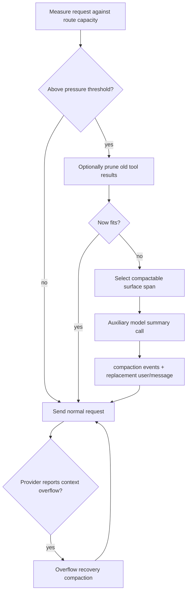

# Context, compaction, and continuity

> **Research date:** 2026-08-31  
> **Current-source baseline:** DeepSeek Harness `0.1.2-alpha.2` at `0a53fb55bea101816fa226bb964ae2bed71c343b`  
> **Volatility:** very high; refresh on prompt assembly, history surfaces, token measurement, compaction, spill, or provider routing changes

DeepSeek Harness constructs each model request from the current system prompt, registered tool schemas, and a derived session-history surface. Context is therefore a product of runtime composition and durable events—not a single mutable message array.

Compaction manages model context pressure by replacing an older surface span with a summary. It preserves the canonical events, but it is lossy from the model's point of view and creates a new model call, cost, and failure surface.

## Request context assembly

System-prompt sections have explicit ordering and scope. Tool schemas are assembled from the current registry. Dynamic context is appended as durable user-role snapshots when it changes, so later replay can see what the model saw. `request/header` records the effective provider route, model, reasoning configuration, system prompt, and schemas.

This supports diagnosis but also means a session can contain full prompt and workspace-policy material. It should be protected accordingly.

## Model history is a projection

The loop derives history from surface operations over session events. A surface addition contributes a new model-visible node; a replacement substitutes one span with another. Original canonical events remain in storage.

This distinction resolves an apparent paradox:

- the log is append-only for audit and recovery;
- the next model request can see a compacted, pruned, or otherwise replaced history.

Any plugin that reads “history” must specify whether it consumes the canonical event sequence, the model-visible surface, or a query projection. Those views answer different questions.

## Automatic compaction path

The basic compaction provider is optional and enters through a service seam. Automatic pressure checks run before a step. Context-overflow recovery can also invoke compaction after a provider error classified as overflow.

The current basic provider uses pressure and retention fractions as heuristics. Source notes explicitly do not present those defaults as corpus-validated universal values. Capacity, tokenization, prompt shape, and tool output differ across providers, so tune from measurements rather than copying a threshold.

## What compaction records

`compaction/start`, `compaction/summary`, and `compaction/end` form a log-level bracket. The actual model-history replacement is a `user/message` surface operation. This makes the summary auditable and preserves the original span.

The summarizer replays the same prefix and appends a fixed summary instruction. That arrangement can preserve provider prefix-cache opportunity, but it still performs a separate model request and records its usage. Compaction is neither free nor deterministic.

Selection preserves tool-call/tool-result pairing. It does not promise to preserve whole conversational turns. A summary that drops causal detail can therefore make a later tool result or user reference hard for the model to interpret even when event structure is valid.

## Tool-result pruning

A deterministic pruner can replace older large tool results before invoking the summarizer. If the remeasured request now fits, it avoids a summary call.

Pruning is attractive for verbose command output, but apply it selectively:

- retain errors and the lines needed to explain a subsequent decision;
- retain stable artifact identifiers and checksums;
- avoid pruning the only evidence of an external mutation;
- expose a retrieval path if the model may need the full result later;
- evaluate model task success, not only token reduction.

## Known estimation and recovery limits

### Token estimates

The generic fallback uses a character-based heuristic. This can undercount CJK text, dense JSON, code, or provider-specific tokenization. Route capacity and adapter usage metadata are better inputs when available.

### Overflow classification

Recovery depends on the adapter recognizing a provider error as context overflow. Custom OpenAI-compatible gateways can reshape error codes or messages and defeat that classification. Test real overflow responses for every route.

### Indivisible context

An oversized system/tool envelope or one indivisible history node cannot necessarily be compacted. The right response may be a smaller tool catalog, truncated attachment, artifact retrieval tool, or different model—not repeated summaries.

### Summary failure

If the auxiliary call fails, the loop may continue with full or pruned history depending on the path. That can immediately reproduce the original overflow. Add a bounded retry/fallback policy outside any user-visible endless loop.

### Output truncation

A summary can hit its own output-token limit. A syntactically completed request is not proof that the summary retained the facts needed for continuity.

## Repeated compaction and stale route tests

Community reports are useful regression inputs when kept version-scoped:

- Discussion [#3565](https://github.com/deepseek-ai/deepseek-harness/discussions/3565) reported a release-candidate path where resumed manual compaction used stale provider/model routing.
- Discussion [#4776](https://github.com/deepseek-ai/deepseek-harness/discussions/4776) reported repeated compaction around an incompressible checkpoint in `0.1.1-rc.2`.

Neither report is a blanket current guarantee of failure. Turn them into adoption tests:

1. resume a session;
2. change provider/model route;
3. compact manually and automatically;
4. verify the compaction request header uses the intended route;
5. introduce one overlarge indivisible node;
6. verify bounded failure/backoff rather than a tight loop.

## Skills and instruction continuity

Skill catalogs and workspace instruction updates can become durable model-visible messages. Compaction may summarize or hide an older snapshot. A later complete refresh can re-establish current instructions, but there can be a period where the model relies on the summary.

Therefore:

- keep critical safety policy outside prompt context;
- make instruction snapshots concise and version-identifiable;
- re-inject current task invariants after compaction when correctness depends on them;
- test a long session that crosses instruction and skill updates.

## Spill artifacts are not durable context by themselves

Oversized tool text can be spilled to private local files, leaving the model a preview and locator. This reduces prompt size, but the locator is only useful while the artifact exists and is accessible to the current environment.

The current spill design does not substitute for artifact lifecycle management. Define retention, cleanup, access control, fork/copy behavior, and a stable retrieval tool. Never leave a business-critical result reachable only through an ephemeral local spill path.

## Continuity strategy

For long-running work, use layered memory deliberately:

| Layer | Store | Retention rule |
|---|---|---|
| Session events | Exact conversational and tool trajectory | Audit/recovery policy |
| Model surface | Current working context and summaries | Bounded by model capacity |
| Domain state | Task status, durable IDs, approvals, external outcomes | Business system of record |
| Artifacts | Files, reports, datasets, generated outputs | Explicit artifact store and lifecycle |
| Telemetry | Operational metrics and traces | Minimal necessary fields and privacy policy |

Do not force durable domain state into prose summaries. Store it structurally and rehydrate only the relevant slice into model context.

## Compaction evaluation

Measure more than token count:

- factual retention of names, IDs, constraints, unresolved questions, and decisions;
- tool-result provenance and external-effect status;
- provider/model route correctness after resume;
- number, latency, and token cost of auxiliary calls;
- frequency of immediate re-compaction;
- success on post-compaction task continuations;
- privacy impact of keeping originals versus exported summaries;
- behavior with multilingual text, code, JSON, images, and huge single nodes.

Keep a golden session corpus and replay it against every upgrade. A summary-quality regression may not appear in unit coverage or schema validation.

## Review checklist

- [ ] Consumers distinguish canonical events from model-visible surface history.
- [ ] Route capacity and overflow classification are tested per adapter.
- [ ] Compaction thresholds come from workload measurements.
- [ ] Summaries preserve durable identifiers, constraints, decisions, and unknown effects.
- [ ] Repeated/incompressible compaction fails with a bound and actionable error.
- [ ] Critical policy is enforced outside prompt context.
- [ ] Spill artifacts have retrieval, retention, access, and fork semantics.
- [ ] Golden long-session tests cover resume, route change, and compaction.

## Primary sources

- [Agent lifecycle](https://github.com/deepseek-ai/deepseek-harness/blob/master/docs/agent-lifecycle.md)
- [Session subsystem and surface operations](https://github.com/deepseek-ai/deepseek-harness/blob/master/docs/subsystems/session.md)
- [Compaction packages](https://github.com/deepseek-ai/deepseek-harness/tree/master/packages/compaction)
- [System prompt package](https://github.com/deepseek-ai/deepseek-harness/tree/master/packages/core/system-prompt)
- [Version-scoped stale-route report #3565](https://github.com/deepseek-ai/deepseek-harness/discussions/3565)
- [Version-scoped repeated-compaction report #4776](https://github.com/deepseek-ai/deepseek-harness/discussions/4776)
