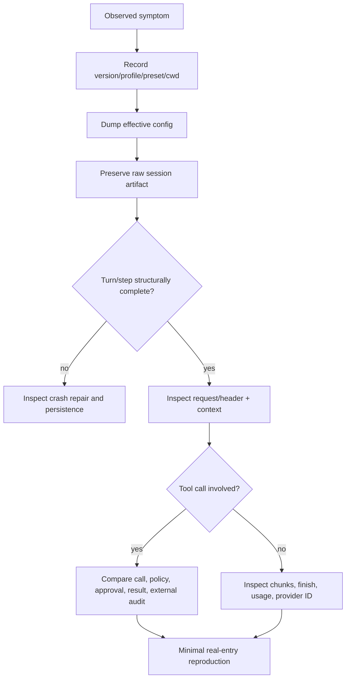

# Debugging, telemetry, testing, and evaluation

> **Research date:** 2026-08-31  
> **Current-source baseline:** DeepSeek Harness `0.1.2-alpha.2` at `0a53fb55bea101816fa226bb964ae2bed71c343b`  
> **Volatility:** very high; refresh on event, trajectory UI, telemetry, test harness, invariant, or entry-profile changes

DeepSeek Harness is unusually diagnosable when operators preserve its event evidence. The canonical session log can show the effective request header, dynamic context, streamed assistant blocks, tool calls/results, compaction, and repair events. The main risk is observing the wrong layer—testing a package without the real loader, checking an HTTP response instead of the live GUI, or accepting a syntactically valid session whose semantics are wrong.

## Evidence ladder

Use the lowest layer that can disprove the hypothesis, then move upward:

1. **Effective composition:** dumped profile configuration, package versions, profile, preset, cwd, and environment source.
2. **Canonical session events:** sequence, turn/step boundaries, request headers, context, tool pairs, errors, compaction, and repair.
3. **Process logs and exit status:** plugin load, retry, cancellation, child processes, persistence flush, and shutdown.
4. **Trajectory/UI projection:** what the user saw, derived from the same events plus client state.
5. **External systems:** provider request IDs, API idempotency keys, filesystem state, deployment or database audit logs.

Do not start by reading only the final assistant message. It is a projection, not the full execution record.

## Session-led debugging



Useful checks:

- sequence numbers are contiguous;
- every started step/turn has a closer or explicit repair;
- each tool call has exactly one normalized result;
- the expected provider/model/reasoning and tool schemas appear in `request/header`;
- dynamic context and workspace instructions match the intended cwd;
- cancellation/timeout appears before or after the uncertain effect;
- compaction replaced the intended span and used the intended route;
- the final persisted record was flushed before shutdown.

The trajectory UI is helpful for scanning events, but retain the raw artifact. A UI projection can omit detail, group rows, or have its own client regression.

## Configuration diagnosis

Profiles layer bundles and patches. Diagnose the assembled composition, not a source patch in isolation:

```text
dsh --profile <profile> --dump-config
dsh --profile <profile> --dump-default-config
```

Diff the output and record package versions. A missing tool can result from a conditional configuration expression, a replaced config row, an unsatisfied dependency, a duplicate registration, or the wrong preset—not from the tool package itself.

## Telemetry semantics

The session-telemetry seam receives a ledger derived from session events. It is best-effort handoff, not guaranteed delivery. A backend may see duplicates after retry or restart; consumers should deduplicate by `(session.id, event.seq)`.

The ledger is not a byte-for-byte copy of every event stream detail. For example, it can emit only the first assistant chunk for a step, so sequence gaps are expected. Use the session artifact—not telemetry—as the forensic source of truth.

The OpenTelemetry backend can export session-derived fields through a configured pipeline. The base composition supports feedback-gated, full, and disabled modes. Do not assume built-in redaction is complete. Event-derived telemetry can expose:

- user and assistant content;
- system prompt and workspace instructions;
- tool arguments/results and file paths;
- provider/model and session identity;
- error content and compaction summaries.

Define a field-level allow-list before enabling export. Apply redaction before data leaves the process, test the redactor with nested plugin events and binary/large content, and ensure a redaction failure fails closed. Sampling is not redaction.

## Metrics that expose real failure

Track:

| Area | Signals |
|---|---|
| Model | latency to first token, total latency, attempts, finish reason, route/model, usage/cost |
| Loop | turns, steps/turn, idle duration, cancellations, overflow recoveries |
| Tools | call/result counts, validation errors, denials, approvals, timeouts, unknown outcomes |
| Persistence | append/flush latency, batch depth, repair events, load failures, backend size |
| Context | estimated/actual tokens, pruned bytes, compaction frequency/cost, immediate re-compaction |
| Subagents | active/queued children, continuation latency, child failures, uncorrelated completions |
| Host | memory, CPU, event-loop lag, open files/processes, graceful shutdown duration |

Use bounded-cardinality labels. Session and tool-call IDs belong in traces/logs, not metric dimensions.

## Upstream testing policy

The official testing guide requires unit coverage, real API end-to-end coverage, expected output, recorded session snapshots, and Chromium snapshots for web behavior. It targets per-file 100% coverage while explicitly treating coverage as necessary but insufficient.

The repository's postmortems show why:

### Postmortem 0001: test the real loader

An ACP plugin's default-export shape caused dependency injection to be dropped, while direct package tests still passed. The corrective pattern was to boot the real Loader with built artifacts and validate composition, not only call source functions.

### Postmortem 0002: assert semantics, not merely snapshots

A conditional JavaScript expression landed in the wrong configuration context and disabled filesystem tools. Existing snapshots accepted `UNKNOWN_TOOL`, so they preserved the bug. The corrective pattern was a semantic guard that asserts required tools exist and the expected action actually succeeds.

### Postmortem 0003: verify the current browser world

Automation validated a replacement server and an HTTP 200 rather than the GUI instance under test. The corrective pattern was to verify exact URL/origin, visible state, and the currently running server before claiming UI success.

### Postmortem 0004: distinguish warnings from child failure

A benign partial Landlock notice was misclassified as a child-process error. The corrective pattern was structured failure detection and tests over assembled output, not brittle substring matching.

These are production-relevant lessons: qualify composition, behavior, environment identity, and structured semantics.

## Test pyramid for a Harness deployment

### 1. Pure and package tests

Test schema validation, event projections, policy decisions, redaction, path normalization, retry classification, and cancellation state machines. Include invalid and adversarial values.

### 2. Loader composition tests

Boot built packages through the real Cordis loader. Assert dependencies, services, event consumers, tools, prompt sections, and unload effects. Exercise duplicate mount and partial boot failure.

### 3. Recorded session snapshots

Use deterministic provider fixtures to record canonical events, stdout, prompts, and tool schemas. Normalize only unstable fields. A snapshot must have semantic assertions so an error-shaped output cannot be blessed accidentally.

### 4. Real provider tests

Periodically call every enabled provider/model/gateway. Verify streaming, schemas, cancellation, images, usage, overflow, rate limits, and errors. Keep these isolated from unit reliability and cost budgets.

### 5. Application tests

- `headless`: stdout/stderr separation, exit status, persistence flush.
- SDK: JSON-RPC framing, concurrent requests, shutdown, stdout purity.
- ACP: multi-session isolation, prompt serialization, cancel/close, permissions, MCP.
- Web: launch token/cookie, exact origin, WebSocket, current visible GUI, reconnect, long history.

### 6. Failure and upgrade tests

Kill the process during stream, tool, flush, compaction, and child execution. Restore from copied persistence. Upgrade a fixture corpus between pinned versions and verify refusal or compatibility explicitly.

## Evaluation beyond software correctness

Agent quality needs a workload corpus with objective evidence:

- task success and regression rate;
- unsupported claims and evidence quality;
- tool selection and argument validity;
- unnecessary side effects and approval burden;
- long-session success before/after compaction;
- provider/model cost and latency;
- recovery from injected failures;
- security-policy violations and prompt-injection resistance.

Separate deterministic harness correctness from stochastic model quality. Run multiple samples for model behavior, but require deterministic invariants around authorization, persistence, and side effects.

## Incident bundle

Collect, with secrets redacted and raw originals access-controlled:

- exact Harness/package versions and source commit if custom;
- profile, preset, effective dumped configuration, cwd, OS/kernel/Node version;
- raw session artifact and storage backend metadata;
- process logs, exit status, signal, and resource metrics;
- provider request IDs, route/model, and sanitized raw response fragments;
- tool idempotency keys and external-system audit records;
- plugin/bundle inventory and integrity;
- reproduction steps and whether restart changes the result.

## Review checklist

- [ ] Raw session evidence is preserved before mutation or upgrade.
- [ ] The real built entry path and loader composition are tested.
- [ ] Snapshots have semantic assertions.
- [ ] Web tests verify the exact live origin and visible world.
- [ ] Provider conformance uses periodic real API tests.
- [ ] Telemetry is best-effort, deduplicated, and field-allow-listed.
- [ ] Metrics avoid high-cardinality IDs.
- [ ] Kill/restart and storage-upgrade tests cover the pinned release.
- [ ] Model-quality evaluation is separate from deterministic safety invariants.

## Primary sources

- [Official testing guide](https://github.com/deepseek-ai/deepseek-harness/blob/master/docs/testing.md)
- [Session telemetry subsystem](https://github.com/deepseek-ai/deepseek-harness/blob/master/docs/subsystems/session-telemetry.md)
- [OpenTelemetry backend](https://github.com/deepseek-ai/deepseek-harness/tree/master/packages/session/session-telemetry-otel)
- [Session snapshot harness](https://github.com/deepseek-ai/deepseek-harness/tree/master/packages/test-support/session-snapshot)
- [Trajectory UI](https://github.com/deepseek-ai/deepseek-harness/tree/master/packages/client/ui-trajectory)
- [Official postmortems](https://github.com/deepseek-ai/deepseek-harness/tree/master/docs/postmortem)

