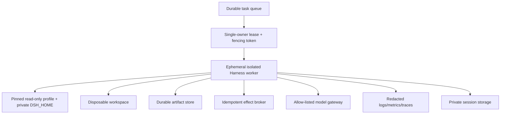

# Deployment, operations, and reliability

> **Research date:** 2026-08-31  
> **Current-source baseline:** DeepSeek Harness `0.1.2-alpha.2` at `0a53fb55bea101816fa226bb964ae2bed71c343b`  
> **Maturity warning:** no production, HA, or security guarantee is claimed by the project  
> **Volatility:** very high; refresh on any profile, CLI, SDK, ACP, persistence, shutdown, package, or configuration change

DeepSeek Harness currently fits best as a pinned, single-owner worker in an isolated environment. Its shipped profiles cover local web use, one-shot headless execution, JSON-RPC SDK control, and ACP integration. None is a turnkey multi-tenant control plane or high-availability service.

## Application profiles

| Profile | Interface | Lifecycle | Important limits |
|---|---|---|---|
| `web` | Loopback HTTP/WebSocket UI | Long-lived host; live reload by default | Local authentication, not internet-facing tenant security |
| `headless` | One-shot CLI | Runs a task, waits idle, flushes, exits | Final text on stdout, reasoning/status on stderr; exit code is coarse |
| `sdk` | JSON-RPC over stdio | Long-lived child process | No per-prompt result object or general prompt cancel in the basic server contract |
| `sdk-minimal` | Minimal SDK composition | Long-lived child process | `danger-full-access`; fewer services is not a stronger security boundary |
| `acp` | Agent Client Protocol over stdio | Controller-owned, multi-session | Trusted controller; protocol feature matrix differs from web/SDK |

All application modes are assembled through the CLI/profile system. The Python SDK packages and launches the runtime rather than reimplementing the agent loop.

## Headless contract

Headless mode is the simplest automation surface:

- it performs a one-shot run without a server;
- final assistant text is written to stdout;
- reasoning/progress is written to stderr;
- it waits for the agent to become idle and flushes persistence;
- exit `0` means the run completed under its contract, otherwise `1`.

Do not treat exit `0` as business success. Parse a structured artifact or verify the domain outcome. Keep stdout clean if another program consumes it.

## SDK server contract

The SDK server speaks JSON-RPC over stdio. Concurrent client requests can enqueue work. Agents remain alive until server shutdown; the basic server does not expose a universal per-session close, durable prompt ID/result correlation, or per-prompt cancellation.

Operational implications:

- dedicate stdout to protocol frames; logs must go to stderr or another sink;
- supervise the process and bound request admission externally;
- add domain correlation above “agent became idle”;
- dispose the whole server to guarantee all agents stop;
- verify the selected adapter instead of relying on the DeepSeek-specific fallback;
- test broken pipes, client disappearance, large frames, and shutdown during a request.

The Python SDK bundles a compatible runtime and includes Windows Python support as of `0.1.2-alpha.1`; that does not remove the need to pin both Python and packaged runtime versions.

## ACP contract

ACP supports multiple sessions, session listing/resume/close/cancel, model/config control, MCP configuration, and permission interaction. It serializes one prompt at a time per session. The current feature set does not equate to every web/session capability: deletion, fork, arbitrary load semantics, additional directories, and interactive UI behavior may be absent.

Stdio ACP assumes a trusted local controller and has no transport authentication. MCP commands and HTTP server definitions supplied through that controller are executable/authorized configuration. Validate them before launch.

## Process lifecycle

On `SIGINT` or `SIGTERM`, the CLI disposes the root Cordis tree and allows a bounded graceful-shutdown window; a second signal forces exit. A partial application boot should tear down the already-mounted tree.

Operators should still:

- stop accepting work before signaling;
- wait for current tools and session flushes with a deadline;
- kill and reap child processes after the deadline;
- mark active external effects for reconciliation;
- preserve unflushed logs and storage artifacts;
- avoid rapid supervisor restart loops on a corrupt configuration.

Test shutdown during model stream, tool execution, persistence append, compaction, plugin reload, and subagent activation.

## Reference deployment

The queue/lease and artifact/effect systems are external because Harness does not provide cross-process work ownership, business transactions, or artifact lifecycle.

## Storage and ownership

- Give each worker a private writable `$DSH_HOME` or one exclusively leased persistence root.
- Do not share a writable JSONL directory or SQLite database across replicas without external single-writer fencing.
- Back up before every version change and test restore with the old binary.
- Store domain outputs outside ephemeral spill files.
- Encrypt sensitive session artifacts and set explicit retention/deletion.
- Monitor storage growth; built-in session listing is not a lifecycle manager.

For failover, the old owner must be fenced before the new owner writes. A shared volume alone is not coordination.

## Configuration and package promotion

Use a promotion pipeline:

1. pin the Harness package, Node runtime, package manager, bundles, plugins, and model routes;
2. build/install in a clean environment with reviewed install scripts;
3. dump the effective profile configuration;
4. run loader, snapshot, provider, safety, and failure tests;
5. copy a representative session corpus and test read/resume/fork/compaction;
6. deploy to an isolated canary with no broad credentials;
7. compare error, cost, latency, compaction, and repair signals;
8. promote immutably; do not mutate `node_modules` in place.

Bundle membership changes require restart. Live patch reload is convenient in development but should be disabled or tightly controlled in production-like workers to preserve reproducibility.

## Version and format upgrades

The release line remains prerelease and has already included an incompatible SQLite format. Compatibility-breaking changes are explicitly expected.

Upgrade procedure:

- read every intermediate release note;
- create a storage and configuration copy;
- test the new binary on the copy, never the only original;
- verify event-format refusal/compatibility and plugin event readers;
- re-run sandbox escape and web-authentication tests;
- requalify each provider/model/gateway;
- keep the old runtime and restore path until the canary window closes;
- export important domain state independently from session internals.

Do not infer that a later alpha label is “older” than an earlier RC label; use versions, dates, release notes, and compatibility tests.

## Capacity and resource controls

Bound resources outside and inside the process:

| Resource | Controls |
|---|---|
| CPU/memory | Container/VM quotas, process memory alarms, PTC/workflow local limits |
| Time | Task, turn, model, tool, workflow, and shutdown deadlines |
| Concurrency | Queue admission, per-worker sessions, tool and subagent limits |
| Cost/tokens | Per-request/model budgets, compaction accounting, total task ceiling |
| Disk | Workspace/session/artifact quotas and retention |
| Processes | PID limit, child reaper, no host process namespace when possible |
| Network | DNS/egress allow-list, rate limit, provider timeout, no metadata endpoints |

There is no single global Harness knob that proves a task is bounded across all plugins and external agents. Enforce limits at the worker and orchestration layer.

## Health and readiness

A process being alive is insufficient. Readiness should verify:

- effective profile mounted without dependency/duplicate-registration errors;
- persistence root writable and exclusively owned;
- required tools/policies/prompts present;
- provider credentials resolve and a bounded model probe succeeds when appropriate;
- sandbox runner selected and verified for the current platform;
- telemetry/redaction path healthy or safely disabled;
- no incompatible session/storage format is being opened;
- queue lease/fencing token remains valid.

Remove readiness immediately on lease loss, persistence failure, provider-wide authentication failure, or configuration drift.

## Reliability failure matrix

| Failure | Automatic behavior | Operator/system responsibility |
|---|---|---|
| Model transient error | Adapter may retry | Bound retry/cost; route failover only after conformance |
| Tool timeout/cancel | Pipeline records error | Reap children and reconcile external effect |
| Process crash | Session load repairs incomplete turn | Fence writer; inspect unknown outcomes; resume/retry safely |
| Storage corruption/incompatibility | Load may refuse or discard torn tail | Restore copy; use pinned reader; never overwrite original |
| Plugin mount failure | Partial tree should dispose | Quarantine config/package; prevent restart loop |
| Provider outage | Requests fail/retry | Queue/backpressure; explicit failover policy |
| Long context | Prune/compact/recover may run | Bound loops; preserve domain state; choose larger route if needed |
| Worker lost | In-memory activations disappear | Durable task reconciliation and lease-based reassignment |

## Runbooks to prepare

- session will not resume;
- unknown tool outcome after crash;
- persistence format rejected after upgrade;
- provider auth/rate-limit/outage;
- plugin duplicate registration or partial boot;
- runaway PTC/workflow child process;
- suspected credential or session-log exfiltration;
- web token/cookie exposure;
- compaction loop or model context overflow;
- telemetry sink outage or redaction failure.

## Adoption checklist

- [ ] Deployment is isolated and single-owner.
- [ ] Versions, plugins, runtime, and effective config are immutable and recorded.
- [ ] External queue/lease, domain state, artifacts, and idempotent effects exist where required.
- [ ] Shutdown and crash tests cover every side-effect boundary.
- [ ] Storage backup/restore and version rollback are proven.
- [ ] Resource, concurrency, cost, disk, process, and egress limits exist externally.
- [ ] Readiness checks semantics, ownership, provider, and sandbox—not only process liveness.
- [ ] Live reload is disabled or operationally controlled.
- [ ] The official developer-preview and safety posture is acceptable for the use case.

## Primary sources

- [Command-line boot package](https://github.com/deepseek-ai/deepseek-harness/blob/master/packages/boot/cmdline/README.md)
- [Generated configuration catalog](https://github.com/deepseek-ai/deepseek-harness/blob/master/docs/config-catalog.md)
- [Headless bundle](https://github.com/deepseek-ai/deepseek-harness/tree/master/packages/bundle/headless)
- [SDK documentation](https://github.com/deepseek-ai/deepseek-harness/tree/master/packages/sdk)
- [ACP packages](https://github.com/deepseek-ai/deepseek-harness/tree/master/packages/acp)
- [Session persistence package](https://github.com/deepseek-ai/deepseek-harness/blob/master/packages/session/session-persistence/README.md)
- [Official releases](https://github.com/deepseek-ai/deepseek-harness/releases)
- [Official safety notice](https://github.com/deepseek-ai/deepseek-harness/blob/master/SAFETY.md)
