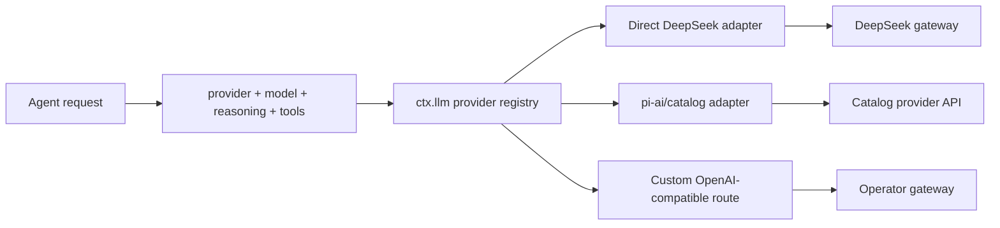

# Models, providers, and streaming

> **Research date:** 2026-08-31  
> **Current-source baseline:** DeepSeek Harness `0.1.2-alpha.2` at `0a53fb55bea101816fa226bb964ae2bed71c343b`  
> **Volatility:** very high; refresh on any LLM interface, adapter, model catalog, gateway, credential, replay, or usage change

DeepSeek Harness routes model requests through `ctx.llm`. A request names a provider route and model; the route selects one adapter instance, and that adapter owns provider-specific request conversion, streaming, replay state, errors, usage, and optional features.

Provider-neutral types do not guarantee provider-equivalent behavior. Every provider/model/gateway tuple needs conformance tests.

## Routing model

The provider string selects the adapter registration. The model string is owned and validated by that adapter. Multiple provider route names may point at one adapter, but duplicate ownership of a route is rejected. Plugins can alter a request at the `agent/request` seam; the effective route and request envelope are recorded in `request/header`.

Record both provider and model. A model name alone is ambiguous when gateways, compatibility layers, or vendor catalogs overlap.

## Adapter contract

A `GenerateOptions` request can include:

- provider and model;
- adapter-owned reasoning effort;
- ordered messages and system prompt;
- tool schemas;
- temperature, maximum output tokens, and stop sequences;
- cancellation signal;
- session identity and auxiliary purpose such as compaction or session title.

The streaming contract must preserve ordered assistant chunks, raw model tool-argument fragments, final finish state, and usage. The current core contract expects usage before finish and no chunks after finish. An adapter should reject unsupported options rather than silently discard them.

Replay state is adapter-owned and should only be reused with the same compatible adapter instance. It can encode provider cache or continuation details that are meaningless elsewhere.

## Direct DeepSeek and catalog/custom adapters

The repository includes a direct DeepSeek HTTP/SSE adapter and a `pi-ai`-based adapter for broader model catalogs and custom providers. The web profile exposes DeepSeek, catalog providers, and custom OpenAI-compatible configuration.

OpenAI-compatible is not a complete protocol specification. Gateways differ in:

- developer versus system roles;
- max-token field names;
- reasoning/thinking representations;
- tool schema support and `oneOf` handling;
- tool-call fragment indexes and argument encoding;
- image content formats;
- finish reasons and usage/cache fields;
- error shape, retry hints, and context-overflow classification.

Compatibility options describe how Harness will format a request. They do not prove the endpoint implements the corresponding semantics.

## Tool-call streaming is the highest-risk compatibility surface

The loop assembles streamed tool-call fragments, then parses the top-level raw argument JSON and validates it against the tool schema. Common gateway/model failures include:

- invalid or truncated top-level JSON;
- a nested object emitted as a JSON-encoded string;
- reused tool-call indexes that fuse parallel calls;
- duplicated fragments after reconnect;
- a schema subset the model does not follow;
- arguments emitted under the wrong field due to a compatibility protocol.

Do not add permissive coercion that guesses model intent for side-effecting tools. Fail closed, retain the raw fragments for diagnosis, and either fix/configure the adapter or choose a compatible route.

Version-scoped reports [#4747](https://github.com/deepseek-ai/deepseek-harness/discussions/4747), [#4427](https://github.com/deepseek-ai/deepseek-harness/discussions/4427), and [#805](https://github.com/deepseek-ai/deepseek-harness/discussions/805) provide useful fixtures for nested-string arguments, parallel index reuse, and gateway-specific argument corruption. They are reports against particular versions/routes, not proof that all current providers fail.

## Credentials and configuration

The CLI can resolve model credentials from environment variables, a Harness credentials file, and `.env` locations. The web UI treats credentials as write-only configuration. Exact precedence and field names are adapter-specific and volatile; inspect the current CLI and adapter documentation when deploying.

Operational rules:

- use one short-lived key per environment/tenant/provider;
- keep `.credentials.yaml` and `.env` out of the workspace visible to untrusted code;
- do not inject every provider key into one worker;
- rotate on plugin or workspace compromise;
- ensure debug logs and session headers do not serialize secret values;
- test the effective source of each credential so a stale environment value does not shadow a rotated file value.

## Model capabilities must be declared and tested

A catalog entry can advertise input modalities, reasoning controls, and context/output limits. Hand-entered models may default to text-only unless input capabilities are explicitly configured. Catalog metadata can also become stale relative to a gateway.

Before enabling a model route, verify:

| Capability | Qualification test |
|---|---|
| Text streaming | Ordered chunks, finish, empty response, retry, disconnect |
| Tool calls | Required fields, nested objects, arrays, `oneOf`, Unicode, large args |
| Parallel tool calls | Stable IDs/indexes and independently assembled arguments |
| Cancellation | Provider request aborts and no late chunks mutate the session |
| Context limit | Real overflow is recognized and compaction/retry is bounded |
| Usage | Input/output/cache/reasoning units map correctly and are not double-counted |
| Images | Supported MIME/size/path cases and explicit rejection when unsupported |
| Reasoning | Supported levels, request conversion, visibility, and billing behavior |
| Model switching | New request header and no incompatible replay state reuse |
| Errors | Authentication, rate limit, overload, invalid request, server error, timeout |

Use recorded provider responses for deterministic adapter tests and periodic real-API end-to-end tests for drift.

## Retry policy

The direct/provider adapters can retry transient model failures. Current defaults are implementation details, not service-level guarantees. A safe retry design distinguishes:

- failures before any response content;
- interrupted streaming after visible chunks;
- provider overload/rate limit with retry hints;
- invalid request/schema/auth errors that should not retry;
- context overflow that may need compaction, not repetition;
- a tool-call stream whose partial arguments must not be combined with a fresh request.

Bound attempts, elapsed time, and total cost. Add jitter. Preserve attempt telemetry without duplicating assembled assistant messages. Cancellation must stop backoff promptly.

## Provider route changes and continuity

Switching route mid-session can be valid, but it changes tokenization, context capacity, tool behavior, cache reuse, reasoning options, and error semantics. The session retains previous provider/model request headers; the next request should use the new route without reusing incompatible adapter replay state.

Test route changes across:

- normal next turn;
- resumed session;
- manual and automatic compaction;
- subagent start and continuation;
- image-bearing history;
- history containing provider-specific tool output.

## DeepSeek-specific metadata paths

As of `0.1.2-alpha.1`, the official adapter can:

- send active Harness plugin package names/versions as model-hidden metadata by default;
- upload the canonical session log incrementally when explicitly opted in.

Neither field consumes ordinary model prompt tokens, but both disclose operational data to the configured gateway. Inventory metadata and full session upload require separate privacy review. A custom `baseURL` receives these extensions if the adapter sends them there.

## Cost and observability

Record per request:

- session, turn, and step identity;
- provider route, model, reasoning effort, and auxiliary purpose;
- input/output/cache usage and provider request ID when available;
- attempt count, latency to first token, total latency, and finish reason;
- compaction and title calls separately from user-facing calls;
- schema/stream parse failures without leaking raw secrets.

Do not assume usage fields are comparable across providers. Normalize with provenance and retain the raw provider interpretation needed for billing reconciliation.

## Adoption checklist

- [ ] Provider and model identities are explicit and pinned in fixtures.
- [ ] Real gateway conformance tests cover all used capabilities.
- [ ] Invalid tool arguments fail closed with raw evidence retained safely.
- [ ] Retry is bounded by attempts, elapsed time, and cost.
- [ ] Cancellation stops request and backoff.
- [ ] Context overflow and model switching are tested after resume/compaction.
- [ ] Credentials are isolated, short-lived, and not workspace-readable.
- [ ] Usage fields are normalized with provider provenance.
- [ ] Plugin inventory and session-log upload are separately reviewed.

## Primary sources

- [LLM streaming subsystem](https://github.com/deepseek-ai/deepseek-harness/blob/master/docs/subsystems/llm-streaming.md)
- [Provider and model configuration](https://github.com/deepseek-ai/deepseek-harness/blob/master/docs/user/guide/providers.md)
- [Core LLM types](https://github.com/deepseek-ai/deepseek-harness/blob/master/packages/llm/llm/src/types.ts)
- [Direct DeepSeek adapter](https://github.com/deepseek-ai/deepseek-harness/tree/master/packages/llm/llm-deepseek)
- [pi-ai adapter](https://github.com/deepseek-ai/deepseek-harness/tree/master/packages/llm/llm-pi-ai)
- [Release `0.1.2-alpha.1`](https://github.com/deepseek-ai/deepseek-harness/releases/tag/dsh-v0.1.2-alpha.1)
- Version-scoped provider reports: [#4747](https://github.com/deepseek-ai/deepseek-harness/discussions/4747), [#4427](https://github.com/deepseek-ai/deepseek-harness/discussions/4427), [#805](https://github.com/deepseek-ai/deepseek-harness/discussions/805)
