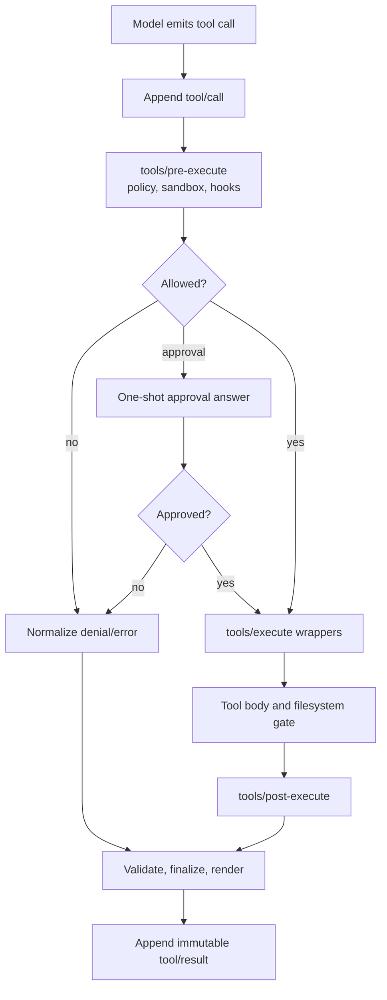

# Plugins, tools, and skills

> **Research date:** 2026-08-31  
> **Current-source baseline:** DeepSeek Harness `0.1.2-alpha.2` at `0a53fb55bea101816fa226bb964ae2bed71c343b`  
> **Volatility:** very high; refresh on tool schema, plugin loader, PTC, skills, or instruction changes

DeepSeek Harness has three distinct extensibility surfaces:

- a **plugin** is trusted runtime code that registers services, events, prompts, tools, or UI behavior;
- a **tool** is a model-callable contract routed through a policy and result-recording pipeline;
- a **skill** is discovered instructional content that can be catalogued and loaded into model context.

Skills can influence model behavior, but they do not receive code permissions by themselves. Plugins do. Tools bridge model intent to host effects. Reviews must keep those authority levels separate.

## Tool execution pipeline

Denial skips the tool body. PTC-dispatched nested calls re-enter the same pipeline and create their own durable call/result pairs. This is a useful policy property, but only for actions that actually pass through the registry; host plugin code and allowed process/network operations can exist outside a particular filesystem-tool check.

## Authoring a reliable tool

`defineTool` ties a typed parameter schema, canonical output schema, executor, and pure presentation callbacks together. The current schema DSL supports JSON scalars, arrays, objects, `json`, and exact-one `oneOf`. Model arguments are detached, validated, and frozen before the executor runs. Invalid arguments follow the normal tool-error path.

Important boundaries:

- The implicit parameter object is open; explicit nested objects must state whether additional properties are accepted.
- Defaults are not automatically applied.
- Constraints outside the supported schema vocabulary—such as cross-field relations—remain the executor's responsibility.
- A raw JSON Schema registration owns input validation, while the registry still validates its declared output.
- Output must be lossless JSON and match the declared schema before rendering.
- `presentCall` and `presentResult` must be pure, replay-safe projections. They must not perform the action again.
- `timeoutMs` is policy metadata; the tool must still observe or forward `exec.signal` and bring owned async work to quiescence.
- `isConcurrencySafe(args)` is an explicit promise. Return true only for operations whose shared-state effects commute or are independently isolated.

The execution identity contains an opaque token, call ID, name, frozen arguments, agent identity, signal, and optional parent transport identity. Do not reconstruct authorization from mutable display text.

## Failure contracts for side-effecting tools

Every production-oriented tool should answer:

| Question | Required design |
|---|---|
| What happens if cancellation arrives during I/O? | Propagate the abort signal and define whether the effect may still complete |
| What happens after timeout? | Stop owned work, reap children, and report uncertainty honestly |
| Can the call be retried? | Use a stable domain idempotency key or make retries explicitly unsafe |
| How is partial success represented? | Return structured per-item outcomes; do not collapse to a generic error |
| What can be logged? | Redact at the source and classify args/results before telemetry |
| Can two calls run concurrently? | Default to exclusive unless independence is proven and tested |

Harness can record `TOOL_OUTCOME_UNKNOWN`; it cannot derive whether a bank transfer, deployment, or remote mutation committed.

## PTC is a tool-presentation mode, not a security boundary

Programmatic Tool Calling exposes generated SDK text and a `run_code` transport so the model can coordinate many tool calls from code. The current backend uses a worker thread and TypeScript execution with limits on heap, busy time, wall time, and output. It starts with an empty environment.

Those controls bound some resource use; they do not isolate hostile code:

- a worker thread shares the host process trust domain;
- allowed Node.js APIs and tools remain powerful;
- terminating a worker does not guarantee that spawned OS processes die;
- intermediate in-memory binding values are not all constrained by output caps;
- the official documentation describes PTC as equivalent in trust to shell execution.

Use it only in a disposable or separately isolated environment. Prefer native tool calls for simpler workflows where generated orchestration code adds no material value.

## Plugins and bundles

A bundle is an npm package that declares a Harness bundle patch. A profile manifest chooses bundles and external plugins. The CLI delegates package operations to pnpm; adding/removing bundle membership requires restart, while patch changes may hot-reload in the live web profile.

Security properties follow ordinary same-process package execution:

- plugin code can access Node.js and process authority available to the host;
- Cordis service scoping is not containment;
- package install/prepare scripts are executable supply-chain inputs;
- pnpm may block unapproved build scripts, but an allow-list is an operator trust decision, not validation;
- a Git URL, floating version, or hot update weakens reproducibility;
- a plugin can observe or alter prompts, requests, policies, tools, persistence, or UI depending on injected services.

Review source and transitive dependencies, pin exact versions and integrity, generate an SBOM, install in a staging profile, then test mount/unmount/restart. Do not grant a plugin because its README calls it a “skill” or “sandbox.” Authority comes from where its code runs.

## Skills: precedence and snapshot behavior

The built-in local skill provider discovers `SKILL.md` directories and flat Markdown skills without recursively walking arbitrary nested trees. The current default rank order is:

| Rank | Location | Higher precedence? |
|---:|---|---|
| 100 | Project `.dsh/skills` | Highest within the active scope layer |
| 200 | Project `.agents/skills` | |
| 300 | Configured custom source | |
| 400 | User DSH skills | |
| 500 | User `.agents` skills | |
| 600 | Bundled skills | Lowest within the layer |

Lower numeric rank wins only **within the selected scope layer**. Scope resolution first selects the nearest applicable layer; rank then resolves names in it. A project skill can therefore shadow a bundled skill with the same name.

Harness injects a catalog summary and loads full skill bodies on demand according to invocation policy. Complete snapshots are cached; an incomplete refresh retains the last good view rather than replacing it with partial discovery. Watchers monitor known roots and structured filesystem invalidation refreshes catalogs.

Operational guidance:

- treat project skills as repository-controlled prompt authority;
- inspect shadowing after changing cwd or scope;
- require code review for skills that direct tool use or data handling;
- do not assume the body seen earlier remains current after hot reload;
- record skill digests or the effective session context when reproducibility matters.

## Workspace instructions

Harness can assemble `$DSH_HOME/AGENTS.md` and project instruction files from broad to specific scope. The rendered chain has a size cap, and the content is injected as durable user-role messages. First-party read/write/edit tools can trigger a touch-based refresh.

Limitations matter:

- there is no general watcher for every external editor or process;
- a direct external change may not be noticed until a qualifying tool touches the path;
- symlinked instruction files can cross a trust boundary;
- instruction precedence affects model behavior, not host authorization;
- a malicious repository can use instructions or skills for prompt injection.

Keep security policy in executable tool/policy checks. Instructions may explain the policy but cannot enforce it against a compromised or confused model.

## Model-output compatibility is a provider concern

Harness validates structured tool arguments; it does not generally coerce a nested JSON string into the object a schema requested. Discussion [#4747](https://github.com/deepseek-ai/deepseek-harness/discussions/4747) reported a `0.1.1-rc.2` model route stringifying nested `object`/`oneOf` fields. The current validator is right to reject an invalid value. The engineering lesson is to test each provider/model/gateway against representative nested schemas, parallel calls, and streaming fragments instead of weakening validation globally.

## Plugin/tool qualification matrix

| Test | Why it matters |
|---|---|
| Mount twice, unload twice, restart | Finds duplicate IDs, leaked effects, and order dependence |
| Invalid/malformed/deep arguments | Verifies validation and bounded failure paths |
| Cancellation before, during, after side effect | Exposes uncertainty and resource leaks |
| Timeout with spawned process | Checks whether child work survives tool termination |
| Parallel calls | Validates `isConcurrencySafe` and provider stream assembly |
| Replay/presentation | Ensures UI rendering is pure and no effect repeats |
| Storage/reload | Confirms plugin events remain serializable and compatible |
| Provider matrix | Finds schema, raw argument, and adapter-specific divergence |
| Upgrade with pinned session fixture | Detects event or plugin compatibility breaks |

## Review checklist

- [ ] Plugin code is reviewed as host-trusted code and pinned exactly.
- [ ] Build/install scripts are explicitly approved.
- [ ] Tool inputs and canonical outputs are runtime-validated.
- [ ] Side effects define cancellation, idempotency, and reconciliation.
- [ ] Concurrency is opt-in and proven.
- [ ] Presentation callbacks are pure.
- [ ] PTC/workflow code runs only inside an appropriate OS boundary.
- [ ] Skill and instruction shadowing is inspected for the actual cwd.
- [ ] Executable policy—not prompt text—enforces security requirements.
- [ ] Every provider/model route passes the structured-tool matrix.

## Primary sources

- [Tools subsystem](https://github.com/deepseek-ai/deepseek-harness/blob/master/docs/subsystems/tools.md)
- [Adding a tool](https://github.com/deepseek-ai/deepseek-harness/blob/master/docs/cookbook/adding-a-tool.md)
- [Tool schema catalog](https://github.com/deepseek-ai/deepseek-harness/blob/master/docs/tool-catalog.md)
- [PTC worker-thread backend](https://github.com/deepseek-ai/deepseek-harness/tree/master/packages/code-runtime/code-runtime-worker-thread)
- [Command-line boot package](https://github.com/deepseek-ai/deepseek-harness/blob/master/packages/boot/cmdline/README.md)
- [Generated configuration catalog](https://github.com/deepseek-ai/deepseek-harness/blob/master/docs/config-catalog.md)
- [Skills packages](https://github.com/deepseek-ai/deepseek-harness/tree/master/packages/skill)
- [Workspace instructions package](https://github.com/deepseek-ai/deepseek-harness/tree/master/packages/context/agent-instructions)
- [Version-scoped structured-argument report #4747](https://github.com/deepseek-ai/deepseek-harness/discussions/4747)
