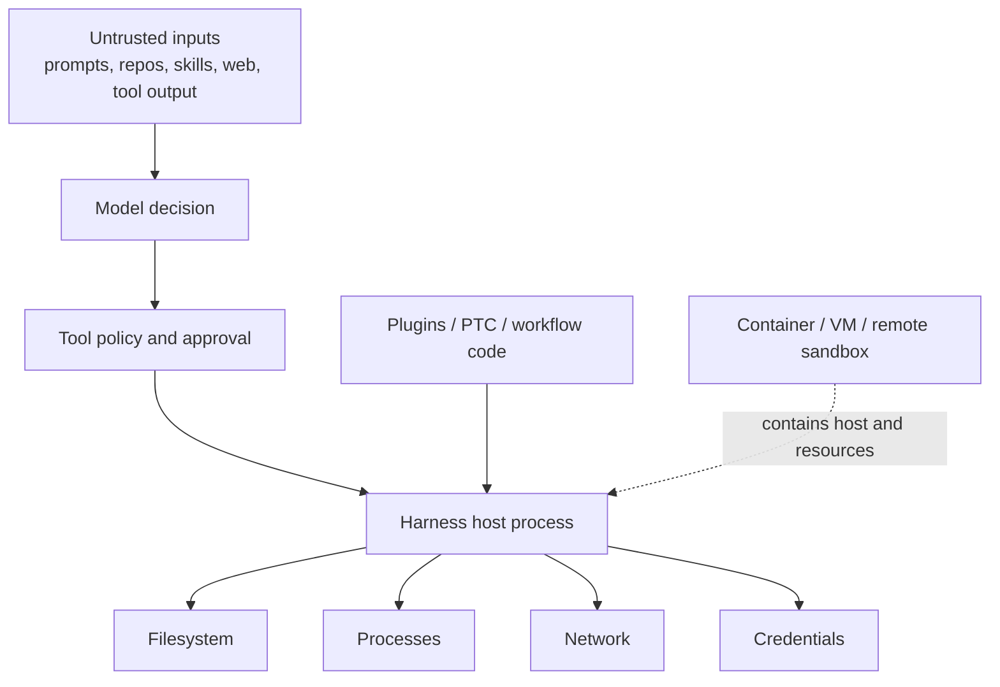
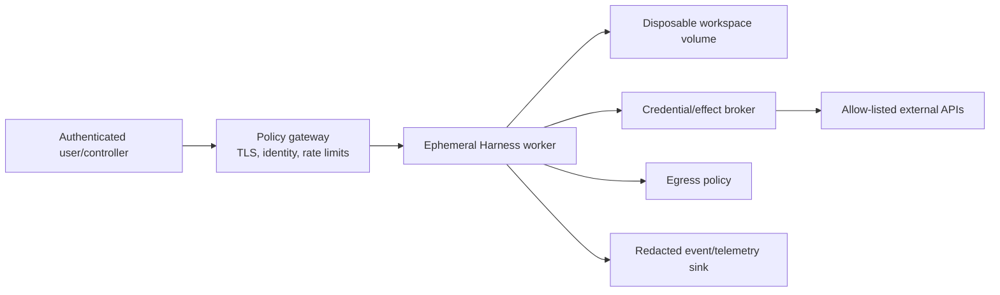

# Safety, permissions, and the sandbox boundary

> **Research date:** 2026-08-31  
> **Current-source baseline:** DeepSeek Harness `0.1.2-alpha.2` at `0a53fb55bea101816fa226bb964ae2bed71c343b`  
> **Maturity warning:** the official project says it is experimental, not security-audited, and not production-ready  
> **Volatility:** critical; refresh immediately after any safety notice, sandbox, approval, web, tool, PTC, workflow, plugin, MCP, or credential change

DeepSeek Harness executes model-directed tools, commands, plugins, and external connections. Its controls reduce some risks but do not make that activity safe by default. The official `SAFETY.md` recommends a disposable VM, container, or dedicated environment, least privilege, backups, and plugin review.

The correct threat model assumes that model output, repository content, skills, instructions, tool results, and fetched web content can be adversarial.

## Trust map

Tool policy is an application control inside the host. The outer container/VM/remote sandbox is the security boundary that can constrain the host itself.

## Sandbox modes mean filesystem policy

The current `SandboxMode` vocabulary is:

- `read-only`;
- `workspace-write`;
- `danger-full-access`.

These names describe selected filesystem effects. They do not define a complete network, process, credential, IPC, device, or kernel policy. The base composition currently defaults to `workspace-write`, while reads and network are not generally confined by that label.

`danger-full-access` bypasses the Harness sandbox service. “Minimal” tools or the `sdk-minimal` profile do not make that mode safe.

## Local platform runners

Harness includes platform-specific local enforcement paths:

| Platform | Current mechanism | Important limit |
|---|---|---|
| Linux | Bubblewrap and/or Landlock paths | Kernel/version-dependent coverage; configured namespace/filesystem policy only |
| macOS | Seatbelt profile via `sandbox-exec` | Deprecated system interface and policy-specific coverage |
| Windows | Restricted token and ACL-based path | Partial boundary; Windows path/process behavior requires dedicated tests |
| Custom | Operator-supplied runner | Harness relies on the operator's assertion and implementation |

The filesystem service also performs policy checks around trusted file operations, but path validation has time-of-check/time-of-use and symlink considerations. Defense-in-depth checks do not replace kernel-enforced isolation for hostile code.

Before calling a runner “secure,” test the exact OS/kernel/build and attempt:

- symlink and junction traversal;
- alternate path encodings and case behavior;
- writes outside the workspace, including through subprocesses;
- reads of home, SSH, cloud, package-manager, and Harness credential locations;
- `/proc` and process visibility where applicable;
- network egress and local service access;
- child processes that outlive the tool/worker;
- inherited handles, sockets, and environment variables.

## Approval behavior

Approval is a one-shot decision in the tool pipeline. Current outcomes include allowed-once, rejected, cancelled, and unavailable. If no answerer is available, the path fails closed.

`approval: never` means **never ask and reject calls that require approval**. It does not mean “approve everything.” This naming is easy to misread; test effective behavior rather than relying on an option label.

An approval request binds to the tool call identity and contains the tool/call identifiers and reason. The approval UI does not necessarily duplicate every argument in a separately signed display object. The reviewer must see the already-streamed, immutable tool call and enough normalized detail to make an informed decision.

Approval is weakest when:

- the prompt is vague or omits the actual target;
- one approval authorizes an open-ended interpreter or shell;
- allowed code can perform a different effect without returning through the pipeline;
- a custom carrier auto-answers prompts;
- untrusted content can socially engineer the reviewer;
- arguments contain Unicode, newline, symlink, or path-display ambiguity.

Prefer narrow, structured tools over approving a general shell. Display normalized target paths and effect summaries.

## Plugins, PTC, and workflow code

These run at or near host authority:

- Same-process plugins are trusted code. Cordis scoping is not memory or OS containment.
- PTC uses a worker thread with resource caps; official docs characterize it as shell-equivalent trust, not a sandbox.
- Workflow scripts also run in a worker/VM-style context that is not a hostile-code boundary.
- Dynamic Creator/`cordis` functionality can inspect and alter runtime composition and should be treated as administrative code execution.
- A worker termination may leave spawned OS processes alive.

Put the entire Harness process inside a least-privilege outer boundary when these features are enabled. Do not place ambient production credentials in that environment.

## Network and web surface

### Shipped web CLI

The current shipped `dsh web` path binds to loopback and rejects `--host 0.0.0.0`. Since `0.1.2-alpha.1`, it uses a per-process one-time launch token exchanged on the root page for a signed, host/port-bound cookie. Host API and WebSocket access require the cookie. The cookie is HTTP-only and SameSite Strict; loopback HTTP means it is not marked Secure.

This narrowed a historically unauthenticated local-web surface. It does not make the app an internet-facing multi-user service:

- the token/cookie is local application authentication, not enterprise identity or tenant authorization;
- no TLS exists on the loopback HTTP path;
- browser, proxy, extension, DNS/host, and local-user threats still matter;
- any custom HTTP carrier that binds broadly owns its TLS, authentication, authorization, CSRF/origin, rate-limit, and proxy design.

Never expose the shipped or custom web surface to a LAN/public network without an explicit, reviewed security layer.

### Web fetch and SSRF

The `0.1.2-alpha.1` release added a public-only WebFetch path with SSRF protection. Treat this as a version-specific control, not proof that every network-capable plugin, shell, MCP server, provider gateway, or custom fetch tool is protected. Test redirects, DNS rebinding, IPv4/IPv6 private ranges, link-local and metadata endpoints, non-HTTP schemes, proxies, and alternate tools.

## Credentials and ambient authority

If the host process can read a credential and send network traffic, assume a sufficiently capable or compromised agent path can exfiltrate it. Tool prompts cannot make ambient secrets secret.

Use:

- short-lived, task-scoped credentials;
- separate service accounts per environment and tenant;
- minimal filesystem and API permissions;
- egress allow-lists at an outer boundary;
- brokered operations that keep secret material outside the agent host;
- automatic rotation and revocation;
- canary credentials and exfiltration monitoring where appropriate.

Never run the Harness in a developer home directory containing broad SSH, cloud, browser, package registry, or production credentials if untrusted repositories or tools are in scope.

## MCP is a command and trust boundary

An MCP server launched by command is an executable dependency. Its transport can expose tools and data beyond the Harness's native tool set. The default client integration does not imply that server commands are sandboxed by the same filesystem policy.

For each MCP server, review:

- command path, package provenance, version pin, and install scripts;
- environment variables and credentials passed to it;
- cwd and filesystem visibility;
- network destinations;
- tool schemas and destructive effects;
- prompt/resource content as injection input;
- cancellation, timeout, process reaping, and restart behavior.

## Version-scoped security reports

Early release-candidate Discussions such as [#817](https://github.com/deepseek-ai/deepseek-harness/discussions/817), [#454](https://github.com/deepseek-ai/deepseek-harness/discussions/454), and [#962](https://github.com/deepseek-ai/deepseek-harness/discussions/962) documented risks around unauthenticated web RPC, plugin/dynamic execution, credentials, reads, and network access. Later releases added token authentication, public-only fetch protection, and stronger documentation of trust boundaries; `0.1.0-rc.1` also fixed a Bubblewrap `/proc/<pid>/root` escape.

Use old reports as regression cases, not as unqualified claims that every exact path remains present. The underlying architectural questions—ambient credentials, same-process plugins, unconfined egress, executable modes, and local-web exposure—remain mandatory threat-model items.

## Safer deployment pattern

The worker should run as a non-root identity with a read-only base image, resource limits, no host socket, no ambient cloud role, a disposable workspace, and explicit egress. High-impact external effects should pass through a broker that validates tenant, action, target, idempotency, and approval independently from model prose.

This pattern reduces risk; it does not override the project's developer-preview status.

## Security gates

- [ ] The official safety notice has been reviewed and accepted by the owner.
- [ ] The entire host runs in a disposable container, VM, or remote sandbox.
- [ ] Plugins, MCP commands, PTC, workflow, and Creator mode are separately authorized.
- [ ] No ambient production secrets exist in the worker.
- [ ] Network egress is allow-listed outside Harness.
- [ ] Filesystem escape tests pass on the exact target platform.
- [ ] Approval displays normalized targets and cannot be auto-answered unexpectedly.
- [ ] Web access is loopback-only or behind reviewed TLS, identity, authorization, and CSRF/origin controls.
- [ ] Session logs, telemetry, and optional uploads are classified and protected.
- [ ] External effects use a broker, idempotency, limits, and reconciliation.
- [ ] An incident can revoke credentials, stop workers, preserve logs, and restore workspaces.

## Primary sources

- [Official safety notice](https://github.com/deepseek-ai/deepseek-harness/blob/master/SAFETY.md)
- [Sandbox subsystem](https://github.com/deepseek-ai/deepseek-harness/blob/master/docs/subsystems/sandbox.md)
- [Approval subsystem](https://github.com/deepseek-ai/deepseek-harness/blob/master/docs/subsystems/approval.md)
- [Web application bundle](https://github.com/deepseek-ai/deepseek-harness/tree/master/packages/bundle/web-app)
- [Release `0.1.2-alpha.1`](https://github.com/deepseek-ai/deepseek-harness/releases/tag/dsh-v0.1.2-alpha.1)
- [Release `0.1.0-rc.1`](https://github.com/deepseek-ai/deepseek-harness/releases/tag/dsh-v0.1.0-rc.1)
- Version-scoped security reports: [#817](https://github.com/deepseek-ai/deepseek-harness/discussions/817), [#454](https://github.com/deepseek-ai/deepseek-harness/discussions/454), [#962](https://github.com/deepseek-ai/deepseek-harness/discussions/962)
