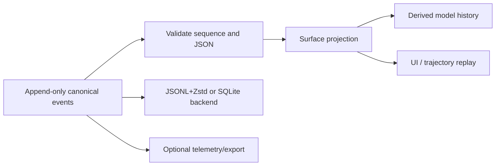
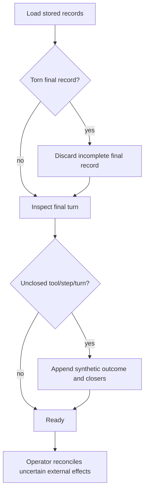

# Sessions, events, and persistence

> **Research date:** 2026-08-31  
> **Current-source baseline:** DeepSeek Harness `0.1.2-alpha.2` at `0a53fb55bea101816fa226bb964ae2bed71c343b`  
> **Volatility:** very high; refresh on any session schema, storage format, crash-repair, fork, or upload change

The session log is DeepSeek Harness's source of conversational truth. It is an append-only sequence of typed, lossless-JSON events. Model history is derived from a mutable **surface view** over those events; it is not stored as a second independent transcript.

This design gives strong audit and replay properties inside one ownership domain. It does not supply distributed transactions, cross-process writer leases, data retention, or rollback of external effects.

## Canonical log and derived surface

The canonical log retains original events. Surface operations can add a new model-visible node or replace a prior span. Compaction uses this mechanism: the old events remain available for audit, while the next model request sees a summary node in place of the compacted surface span.

`Session.append` enforces contiguous sequence numbers, validates lossless JSON, and freezes accepted data. Non-serializable values are rejected rather than silently coerced. That boundary is important: a plugin event that cannot be replayed from JSON does not belong in the session log.

## Event families

Core event families include:

| Event family | Purpose |
|---|---|
| `turn/start`, `turn/end` | Bound one admitted conversational turn |
| `step/start`, `step/end` | Bound one model request plus its tool execution |
| `user/message` | Record user, steering, injected, instruction, or replacement content |
| `assistant/chunk`, `assistant/message` | Preserve streaming material and the assembled response |
| `tool/call`, `tool/result` | Pair the requested tool identity/arguments with its normalized outcome |
| `request/header` | Record provider/model/request configuration, system prompt, and tool schemas |
| `request/context` | Record dynamic model-visible context for the request |
| `session/end-seed` | Bound a completed prefix used for a low-level fork seed |

Plugins can extend the typed session-event map. An extension must define compatibility semantics and decide whether old readers may skip it. The current format carries a session format version and an `ignorable` event property. Unknown required events are refused; unknown ignorable events may be skipped. Forward/backward version mismatches produce directional errors rather than hopeful parsing.

## “Every model-visible input is logged” has consequences

The request header and context records make a session unusually useful for incident reconstruction: they capture the effective system prompt, provider and model, reasoning configuration, and tool schemas. Raw assistant chunks support UI replay, while the assembled assistant message drives derived history.

They also make the session a sensitive artifact. Depending on enabled tools and plugins it can contain:

- user content and model reasoning;
- system prompts and workspace instructions;
- file names, paths, file contents, and diffs;
- shell commands and output;
- tool arguments and results;
- approval decisions;
- provider routes and plugin-specific events;
- compaction summaries that condense sensitive earlier context.

Apply access control, encryption, backup, deletion, and incident handling appropriate for source code and credentials. The built-in session API currently does not constitute a full retention or deletion service.

## Persistence and flush semantics

Session appends pass synchronously through the in-process event path and are copied into bounded asynchronous persistence batches. An append resolves only after the backend reports the event durable. `session/flush` drains pending persistence to quiescence.

The loop uses checkpoints before operations where losing the preceding history would be especially damaging:

- before a model request;
- before a top-level tool that may cause a side effect;
- before the next step.

These checkpoints order the log relative to an attempted effect. They do not make the effect and event append atomic. If a process dies after an external service accepts a request but before its result is durably logged, recovery cannot know the outcome without an idempotency key or reconciliation query.

## Crash repair

On load, Harness balances an incomplete final turn instead of attempting to resume midway through it. Durable events are preserved, and repair can synthesize tool errors such as:

- `TOOL_NOT_STARTED` when the recorded call was never known to start;
- `TOOL_OUTCOME_UNKNOWN` when the external outcome cannot be established.

It then adds the necessary step/turn closers. A torn final storage record may be discarded. The repaired session can continue with an explicit uncertainty record, but no partial turn is resumed and no external action is rolled back.

Treat `TOOL_OUTCOME_UNKNOWN` as an incident requiring domain reconciliation, not as permission to retry blindly.

## Storage backends

### JSONL with optional Zstandard framing

The default file-oriented backend stores per-session streams. The compressed form uses concatenated checksummed Zstandard frames; a raw JSONL option also exists. Per-session files are easy to copy and inspect, but directory listing, retention, shared locking, and aggregate queries remain operator concerns.

### SQLite

SQLite is opt-in and stores packed event rows in one database. It improves centralized local querying and file count, but it does not transform the Harness into a distributed database. The release history already contains an SQLite-format incompatibility in `0.1.0-rc.8`; assume migrations are not guaranteed until the project documents otherwise.

### Backend choice

| Need | Prefer | Caution |
|---|---|---|
| Simple local artifacts and per-session recovery | JSONL/Zstandard | Many files; external indexing and retention needed |
| One local database and projection queries | SQLite | Format churn; still one host/ownership domain |
| Multi-node ownership, HA, tenant isolation | Neither by default | Build an explicit coordination and storage layer, or choose a durable platform |

## Single-writer discipline

The examined source has in-process coordination for sequence reservations and persistence batches, but no documented cross-process session lease or file lock. Version-scoped Discussions [#420](https://github.com/deepseek-ai/deepseek-harness/discussions/420), [#2254](https://github.com/deepseek-ai/deepseek-harness/discussions/2254), and [#4506](https://github.com/deepseek-ai/deepseek-harness/discussions/4506) report duplicate sequence numbers or corrupted logs under concurrent multi-process writers in release-candidate versions.

The safe operational rule is therefore:

> Assign exactly one process as writer for a session and persistence root unless an external coordinator provides exclusive ownership.

Do not mount a writable `$DSH_HOME` on multiple replicas and assume the backend arbitrates. If failover is required, use a fencing token or lease outside Harness, stop the old owner, verify storage, then start the new owner.

## Forks are snapshots, not shared histories

A low-level fork chooses a stable between-turn boundary and creates a seed from a completed prefix. Subagent forking similarly clips to completed history. The child receives a snapshot, not a live branch that automatically merges future parent events.

Forking preserves conversational context but does not copy every external artifact. In particular, oversized tool outputs can be spilled to private local files and represented in history by a locator/preview. A fork can inherit the locator while the backing artifact remains tied to the original local storage. Design artifact transfer explicitly.

## Optional DeepSeek session-log upload

The official DeepSeek adapter added opt-in incremental session-log upload in `0.1.2-alpha.1`. It is off by default. When enabled, the payload can include the complete canonical session header and events—without a general redaction stage—including paths, prompts, chunks, tool arguments/results, compaction and plugin events.

Delivery semantics are incremental and at-least-once: the adapter first sends the existing log, then suffixes; a successful HTTP response advances a local accepted watermark. A crash can cause duplicate delivery. The destination follows the configured gateway/base URL, so a custom gateway becomes a recipient of the log.

Before enabling it:

- identify the actual destination and data controller;
- classify the complete event schema, not only chat text;
- confirm consent, residency, retention, deletion, and incident response;
- expect duplicates and deduplicate by session/event identity;
- test failure and retry behavior with large histories;
- keep it disabled when the receiving path is not explicitly approved.

The same adapter can send installed plugin package names and versions as model-hidden metadata by default. Treat inventory disclosure as a separate privacy and supply-chain decision from model prompts.

## Recovery runbook

1. Stop all possible writers to the affected root.
2. Copy the raw session file/database and relevant logs before repair or upgrade.
3. Record Harness version, storage backend, profile, preset, and last known tool effect.
4. Load with the same pinned version first; preserve any synthetic repair events.
5. For an unknown tool outcome, query the external system using a domain idempotency key.
6. Resume only after one writer has exclusive ownership.
7. Export durable business artifacts separately before upgrading a storage format.

## Design checklist

- [ ] One writer owns each session and persistence root.
- [ ] External effects use idempotency keys and reconciliation queries.
- [ ] Session artifacts are classified as sensitive data.
- [ ] Backups are tested with the exact pinned Harness version.
- [ ] Retention and deletion exist outside the built-in listing API.
- [ ] Forked workflows explicitly transfer non-log artifacts.
- [ ] Optional log upload and plugin inventory disclosure are separately approved.
- [ ] Storage-format upgrades use a copy, a restore test, and a rollback plan.

## Primary sources

- [Session subsystem](https://github.com/deepseek-ai/deepseek-harness/blob/master/docs/subsystems/session.md)
- [Session persistence package](https://github.com/deepseek-ai/deepseek-harness/blob/master/packages/session/session-persistence/README.md)
- [Session query subsystem](https://github.com/deepseek-ai/deepseek-harness/blob/master/docs/subsystems/session-query.md)
- [Agent lifecycle](https://github.com/deepseek-ai/deepseek-harness/blob/master/docs/agent-lifecycle.md)
- [DeepSeek adapter session-log upload](https://github.com/deepseek-ai/deepseek-harness/tree/master/packages/llm/llm-deepseek)
- [Release `0.1.2-alpha.1`](https://github.com/deepseek-ai/deepseek-harness/releases/tag/dsh-v0.1.2-alpha.1)
- Version-scoped multi-writer reports: [#420](https://github.com/deepseek-ai/deepseek-harness/discussions/420), [#2254](https://github.com/deepseek-ai/deepseek-harness/discussions/2254), [#4506](https://github.com/deepseek-ai/deepseek-harness/discussions/4506)
