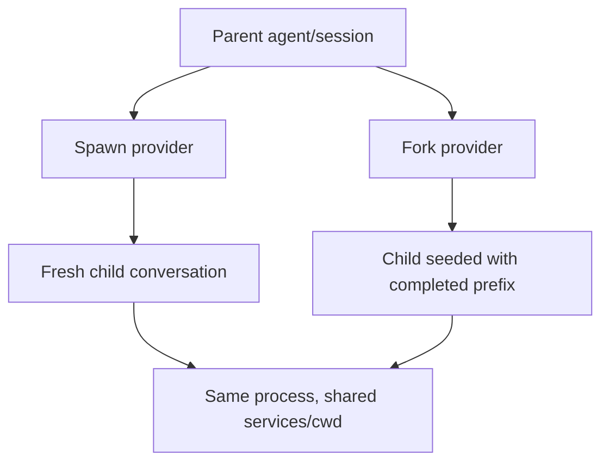
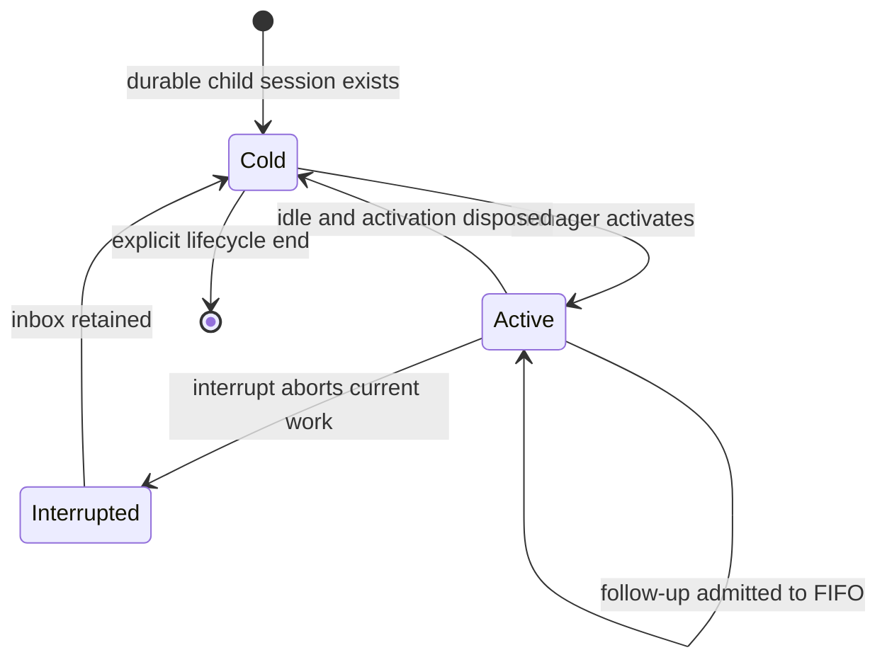
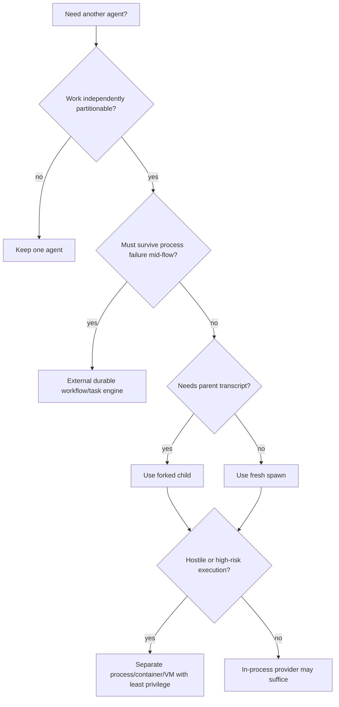

# Subagents, workflows, and orchestration

> **Research date:** 2026-08-31  
> **Current-source baseline:** DeepSeek Harness `0.1.2-alpha.2` at `0a53fb55bea101816fa226bb964ae2bed71c343b`  
> **Volatility:** very high; refresh on any subagent provider, continuation, workflow, ACP, Codex, Claude, or experimental teams change

DeepSeek Harness models subagents as a capability seam with named providers. A provider may run a fresh child inside the current process, fork completed parent history, spawn an external ACP process, or delegate to another agent runtime. These options have different persistence, authority, cancellation, and continuity semantics.

More agents are not automatically more reliable. Start with one agent and introduce delegation only when work can be partitioned, verified, and merged more effectively than it can be executed sequentially.

## Provider families

The examined source includes providers for:

- fresh in-process spawn;
- in-process fork from a stable completed parent prefix;
- ACP subprocess agents;
- optional Codex and Claude Code backends;
- a DeepSeek Harness SDK backend.

Some providers are one-shot; others are continuable. Capability discovery occurs at start. If a caller requests an unsupported model override, reasoning option, schema, depth, tool filter, or persona, the provider should reject it rather than pretend to honor it.

Always inspect the selected provider's capability declaration. “Subagent” is not one uniform execution contract.

## Spawn versus fork

- **Spawn** starts a fresh conversation. The child may share the host process, cwd, and services but does not inherit the parent transcript.
- **Fork** snapshots only a stable completed prefix. It does not copy an in-progress step and does not stay synchronized with later parent events.

Transcript inheritance is not authority inheritance. The child's preset, tool scope, policy, sandbox configuration, and provider route are independently resolved. Verify them explicitly.

## Continuable children

A continuable child has a durable child session and at most one active process-local execution activation. A manager owns cold resume, ancestry, the FIFO inbox, and activation lifecycle.

The activation is not a durable request/result record. Once a follow-up is admitted, cancellation of the caller no longer owns that work. Interrupt aborts the active execution while retaining the inbox. A process crash can lose accepted-but-not-yet-logged prompts, because the activation and manager graph are process-local.

Consequences:

- do not promise exactly-once mailbox delivery;
- do not map one follow-up to one final response without explicit correlation;
- persist parent/child task state in a domain store when it matters;
- after restart, reconcile the durable child session with the external task queue;
- use a single process owner unless a separate lease/mailbox layer exists.

## Reporting and merge boundaries

Harness does not provide a universal durable “child report mailbox.” A parent should request a structured result when the provider supports schemas, then validate and persist that result outside transient activation state.

A robust delegation contract includes:

| Field | Purpose |
|---|---|
| Task ID and parent ID | Durable correlation |
| Input artifact/version | Prevent stale work |
| Allowed scope | Bound files, systems, tools, and side effects |
| Expected schema | Make completion machine-checkable |
| Evidence links | Support independent verification |
| Idempotency key | Make external writes safe to retry/reconcile |
| Merge owner | Prevent two agents from committing conflicting conclusions |
| Deadline/budget | Bound runaway execution |

The parent remains responsible for synthesis. Parallel opinions are evidence, not consensus.

## ACP and external providers

An ACP provider runs a fresh subprocess and speaks a protocol boundary. That improves lifecycle separation from an in-process child but is not an operating-system sandbox by itself. The child can still have filesystem, process, network, and credential authority granted by its environment.

ACP permission prompts can be auto-answered according to configuration. Treat that policy as security-critical. A protocol transport is not a human approval.

Optional Codex and Claude Code providers bring their own authentication, configuration, model semantics, tools, and release cadence. Pin and qualify both sides of the boundary. Do not infer that a Harness sandbox wraps an external agent's internal effects unless the actual launch environment enforces it.

## Workflow tool

The workflow tool runs model-authored JavaScript in a worker and exposes helpers such as single-agent calls, parallel execution, pipelines, phases, and logging. It is a foreground orchestration convenience: the parent blocks until the workflow completes.

Current architectural limits include:

- no durable workflow journal or resume point;
- no automatic replay of a partially completed graph;
- no nested or saved workflow definition;
- no universal token budget;
- bounded concurrency/items/total agents are local controls, not distributed quotas;
- the worker/VM is not a security boundary.

If a workflow launches three remote effects and dies after the second, Harness does not turn the script into a transactional durable workflow. Each effect and phase must be idempotent, and durable phase state must live outside the worker.

Use the workflow tool for bounded, disposable fan-out where recomputation is safe. Use a durable workflow engine when operations must survive process failure and resume at a verified step.

## Experimental Agent Teams

Source under `packages/experimental` explores durable rosters, mail, and task records. It is excluded from the official release packages examined, carries no stability promise, shares a process and checkout, and uses advisory write scopes. It does not establish cross-process exactly-once execution or automatically release abandoned tasks.

Treat it as design research, not a released product capability or adoption dependency.

## Orchestration decision tree

## Reliability patterns

### Prefer explicit fan-out/fan-in

Partition independent inputs, give each child a stable task ID and output schema, persist each result, then let one owner perform the merge. Avoid children editing the same files or mutable record set.

### Bound every dimension

Set concurrency, total child count, per-child time, tool call limits, token/cost ceilings, and maximum result size. A concurrency limit alone does not bound total spend.

### Carry authority by policy, not by prose

A prompt saying “read only” is advisory. Enforce child tools, filesystem scope, network policy, and credentials in its actual execution environment.

### Reconcile after interruption

On restart, enumerate domain tasks, compare them with durable child sessions and external operations, and decide whether to resume, retry with the same idempotency key, or mark for manual review.

### Keep route selection explicit

Provider/model/reasoning selection for subagents became more configurable in `0.1.2-alpha.1`. Record the resolved route per child and test fallback. A silent fallback can change tool schema support, cost, or output quality.

## Failure matrix

| Failure | What survives | What may be lost/unknown | Response |
|---|---|---|---|
| Parent cancellation after follow-up admitted | Child durable events already appended | Caller-to-result ownership | Correlate through task store, not caller future |
| Host process crash | Durable child session | Activation, queued/unlogged input, in-memory ancestry | Reconcile and cold-resume under one owner |
| Workflow worker termination | Completed external effects | Current phase and non-persisted variables | Use idempotency and external phase state |
| Child provider subprocess exits | Parent and stored child events | Unflushed output, external effect outcome | Capture exit, flush, reconcile effect |
| Two children edit same artifact | Their individual traces | Deterministic merge | Partition ownership or serialize merge |
| Unsupported capability requested | Nothing should start | None if fail-closed | Reject before launch |

## Review checklist

- [ ] One agent was considered before adding orchestration.
- [ ] Every child provider's exact capabilities and trust boundary are recorded.
- [ ] Spawn/fork and one-shot/continuable semantics are explicit.
- [ ] Parent/child work has durable IDs and structured outputs.
- [ ] Shared artifact writes have one merge owner.
- [ ] Concurrency, total work, time, result size, and spend are bounded.
- [ ] Process crash and accepted-but-unlogged input are in the recovery plan.
- [ ] External effects are idempotent and reconcilable.
- [ ] Experimental Agent Teams is not treated as released production support.

## Primary sources

- [Subagent subsystem](https://github.com/deepseek-ai/deepseek-harness/blob/master/docs/subsystems/subagent.md)
- [Subagent providers](https://github.com/deepseek-ai/deepseek-harness/tree/master/packages/subagent)
- [Workflow tool catalog](https://github.com/deepseek-ai/deepseek-harness/blob/master/docs/tool-catalog.md#deepseek-aidsh-tool-workflow)
- [Workflow packages](https://github.com/deepseek-ai/deepseek-harness/tree/master/packages/workflow)
- [ACP application documentation](https://github.com/deepseek-ai/deepseek-harness/blob/master/packages/acp/README.md)
- [Experimental source tree](https://github.com/deepseek-ai/deepseek-harness/tree/master/packages/experimental)
- [Release `0.1.2-alpha.1`](https://github.com/deepseek-ai/deepseek-harness/releases/tag/dsh-v0.1.2-alpha.1)
