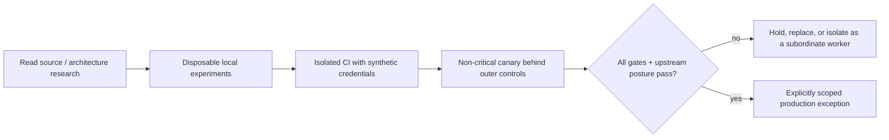

# Version evolution, limitations, adoption gates, and alternatives

> **Research date:** 2026-08-31  
> **Current-source baseline:** DeepSeek Harness `0.1.2-alpha.2` at `0a53fb55bea101816fa226bb964ae2bed71c343b`  
> **Maturity:** developer preview; all public releases examined were prereleases  
> **Volatility:** extreme; re-evaluate on every release, safety update, or storage/event-format change

DeepSeek Harness has a compelling architectural thesis: a fully plugin-composed agent harness with an event-sourced conversational record, replaceable model/tool/persistence/application layers, and deep runtime introspection. Its current adoption constraint is equally clear: the project explicitly guarantees compatibility-breaking changes, says it is not security-audited, and says it must not be treated as production-ready.

The default recommendation is experimentation in an isolated environment, not a production dependency. A different decision requires explicit evidence against the gates below.

## Release evolution

The August 2026 release line moved quickly:

| Release | Date | Material change |
|---|---:|---|
| `0.1.0-rc.7` | 2026-08 | Plugin settings, external Codex/Claude subagents, persistence and long-history fixes |
| `0.1.0-rc.8` | 2026-08 | Multimodal support, persistent shell improvements, fork performance, incompatible SQLite format |
| `0.1.1-rc.1` | 2026-08 | Bubblewrap `/proc/<pid>/root` escape fix |
| `0.1.1-rc.2` | 2026-08 | Image and compatibility work |
| `0.1.2-alpha.1` | 2026-08-27 | Provider/subagent controls, Windows Python runtime, ACP expansion, token web auth, public-only WebFetch/SSRF protection, DeepSeek metadata/upload extensions |
| `0.1.2-alpha.2` | 2026-08-30 | Connection/retry UI, schedules, plugin grouping, preset switching, long-history efficiency, token/time statistics, `SessionEvent.ignorable` restoration |

The label moved from RC back to alpha while the version number increased. Every GitHub release examined was marked prerelease. Maturity labels are therefore not a monotonic readiness signal; use the official notices and qualification evidence.

## Stable ideas versus volatile implementation

| Relatively durable design idea | Highly volatile current detail |
|---|---|
| Cordis plugins/services/events/effects compose the runtime | Exact package graph, profile patches, and shipped presets |
| Canonical session events derive model history | Event schema/version, storage records, repair rules, projections |
| Tools pass through policy and durable call/result records | Schema subset, approval payload, sandbox runner behavior |
| Providers own request/stream conversion | Model catalogs, gateway flags, retries, metadata extensions |
| Subagents are named provider capabilities | Available providers, continuation semantics, external backends |
| Compaction replaces a model-visible span but retains originals | Thresholds, estimation, pruning, overflow classification |

Build abstractions around the durable concepts only when needed. Pin and test every implementation detail.

## Current limitations that change architecture

### No production/security guarantee

This is not merely missing documentation. It is the project's explicit safety and maturity position. An internal audit cannot convert the upstream dependency into a supported production platform; it can only bound your particular use.

### Same-process extensibility expands trust

Plugins, PTC, workflows, and Creator-mode composition can operate with host authority. Service scoping and worker threads are not OS containment.

### Persistence is local ownership, not distributed durability

The event log has useful append/flush/repair semantics, but the current implementation documents no cross-process writer lease, distributed task queue, retention manager, or atomic transaction with external effects.

### Orchestration state is partly process-local

Continuable child sessions are durable, but activations, accepted-yet-unlogged input, ownership graphs, and workflow variables can disappear on process failure.

### Provider compatibility is empirical

OpenAI-compatible gateways and model routes differ in tool schemas, stream assembly, images, usage, reasoning, errors, and overflow classification. Provider-neutral types do not prove conformance.

### Operational surfaces are local building blocks

Web, SDK, headless, and ACP profiles are useful application interfaces, not a complete tenant, identity, HA, quota, retention, or deployment system.

## Adoption gates

### Gate 1: upstream posture

- [ ] The official README no longer guarantees breaking changes for the release you will use, or the organization explicitly accepts that churn.
- [ ] The official safety notice supports the intended environment, or an exception owner accepts its warning.
- [ ] A security audit/review scope covers the exact release and enabled composition if the use case requires it.
- [ ] A supported upgrade/rollback policy exists for event and storage formats.

### Gate 2: security boundary

- [ ] Harness runs inside a disposable, least-privilege container/VM/remote sandbox.
- [ ] Egress, credentials, filesystem, processes, and web exposure are controlled outside Harness.
- [ ] Every plugin, MCP server, PTC/workflow path, and dynamic composition feature is reviewed and pinned.
- [ ] Platform-specific escape and approval-confusion tests pass.

### Gate 3: correctness and compatibility

- [ ] Effective profile/preset composition passes real-loader and duplicate-mount tests.
- [ ] Every provider/model/gateway passes tool, streaming, cancellation, image, usage, overflow, and error conformance.
- [ ] Golden session fixtures pass resume, fork, compaction, crash repair, and upgrade tests.
- [ ] Domain results are verified independently from assistant prose and process exit.

### Gate 4: durability and operations

- [ ] Exactly one writer owns each persistence root through a lease/fence.
- [ ] External effects are idempotent and reconcilable.
- [ ] Durable task state and artifacts live outside ephemeral activation/spill state.
- [ ] Backup/restore, storage growth, retention, deletion, and incident runbooks are proven.
- [ ] Resource, cost, concurrency, and shutdown limits are enforced outside plugins.

### Gate 5: data governance

- [ ] Session events, telemetry, traces, plugin inventory, and optional log upload are separately classified.
- [ ] Redaction is field-allow-listed and tested before export.
- [ ] Retention, residency, deletion, access, and breach handling meet policy.
- [ ] No unapproved ambient secret is readable by the worker.

If any required gate fails, do not compensate with a prompt. Change the architecture or use another tool.

## Adoption ladder



At every step, preserve a fast exit: domain data must remain portable even if session internals change.

## Alternative selection matrix

No alternative removes the need for security and reliability design. Choose the layer matching the actual problem.

| Primary need | Better starting point | Why | What it does not automatically solve |
|---|---|---|---|
| Small model/tool loop with application-owned state | Custom loop or provider API | Minimum moving parts and complete control | Workspace harness, plugin ecosystem, durable workflow |
| Lightweight agents, tools, handoffs, sessions, tracing | [OpenAI Agents SDK](../openai-agents-sdk/README.md) | Focused runner abstractions with documented tools/handoffs/tracing | Hostile code containment or arbitrary provider equivalence |
| Explicit graph, checkpoints, interrupts, state inspection | [LangGraph](../langchain-langgraph-and-deep-agents.md) | Graph/state durability and human-in-the-loop are first-class | Secure workspace execution boundary |
| Claude-centered workspace agent or managed session | [Claude Agent SDK and Managed Agents](../claude-agent-sdk-and-managed-agents.md) | Provider-aligned workspace/managed surfaces | Vendor independence or universal local containment |
| Typed Python agents and provider abstraction | [Pydantic AI](../pydantic-ai.md) | Application-centric typed model/tool patterns | Full workspace harness and OS sandbox |
| Mission-critical resumable business workflow | [Temporal](../temporal-for-agent-workflows.md), [Restate](../restate-for-agent-workflows.md), or [DBOS](../dbos-for-agent-workflows.md) | Durable steps, retries, timers, and ownership are the primary abstraction | Agent prompts/tools/workspace by itself |
| Hostile code or shell execution | Dedicated container/VM/remote sandbox | OS/process boundary, quotas, disposable filesystem, egress control | Agent loop and application logic |

Hybrid designs are often strongest: run a small Harness worker as one activity inside a durable workflow, and place its workspace execution inside a remote sandbox. This keeps Harness's tool/session ergonomics without pretending it owns business durability or the security perimeter.

## When DeepSeek Harness is a good fit today

- studying plugin-composed agent runtime design and Cordis effects;
- prototyping local coding-agent experiences in disposable workspaces;
- evaluating event-sourced conversational history and trajectory tooling;
- building experimental plugins against a pinned prerelease;
- isolated internal research where data, credentials, and uptime are non-critical;
- a replaceable subordinate worker behind stronger orchestration and containment.

## When not to use it today

- an internet-facing multi-tenant agent service;
- a host with broad developer or production credentials;
- untrusted code execution without a separate OS boundary;
- a regulated workload whose audit/retention/deletion controls depend on built-in session APIs;
- a multi-replica service sharing writable session storage;
- a mission-critical workflow that assumes exactly-once continuation or transactional effects;
- a product that cannot absorb frequent breaking configuration/storage/plugin changes.

## Refresh triggers

Re-run the full evaluation immediately when:

- a new prerelease/stable version or Cordis release appears;
- `SAFETY.md` or the developer-preview wording changes;
- event/storage format, sandbox, approval, web auth, PTC, workflow, telemetry, provider, or session upload changes;
- stable APIs, support policy, security audit, production readiness, or HA are claimed;
- a current-source regression test based on a Discussion changes behavior;
- a provider gateway/model changes its streaming or tool schema behavior.

Until a stable line exists, schedule a 30-day maximum refresh even without a trigger.

## Decision record template

```text
Harness version / commit:
Profile, preset, bundles, plugins:
Use case and data classification:
Why this is simpler/better than alternatives:
Outer security boundary:
Single-writer and durable task ownership:
Provider conformance evidence:
Session/format upgrade and rollback evidence:
External-effect idempotency/reconciliation:
Telemetry/upload/privacy decisions:
Unmet gates and exception owner/expiry:
Exit/migration plan:
```

## Primary sources

- [Official README and developer-preview notice](https://github.com/deepseek-ai/deepseek-harness/blob/master/README.md)
- [Official safety notice](https://github.com/deepseek-ai/deepseek-harness/blob/master/SAFETY.md)
- [Official releases](https://github.com/deepseek-ai/deepseek-harness/releases)
- [Official architecture](https://github.com/deepseek-ai/deepseek-harness/blob/master/docs/architecture.md)
- [LangGraph overview](https://docs.langchain.com/oss/python/langgraph/overview)
- [OpenAI Agents SDK](https://openai.github.io/openai-agents-python/)
- [Temporal documentation](https://docs.temporal.io/)
- [E2B sandbox documentation](https://e2b.dev/docs)

