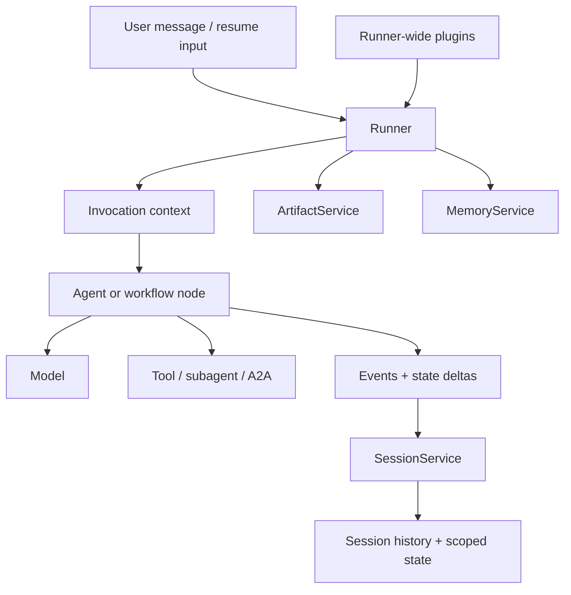
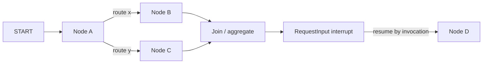
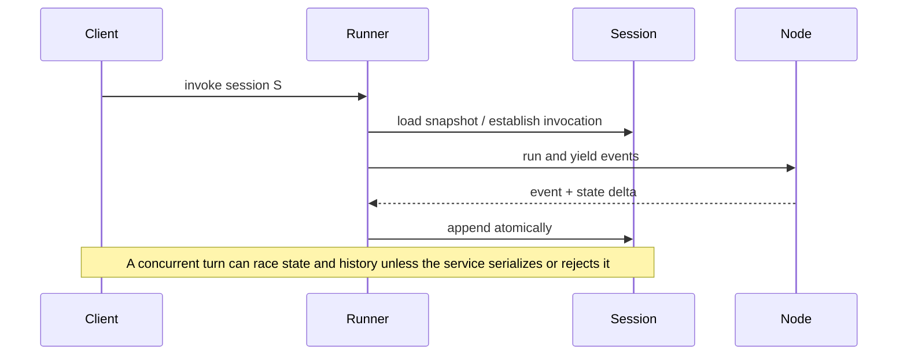

# Google Agent Development Kit in Production

**Research date:** 2026-08-31
**Status:** Research-backed technology guide  
**Scope:** ADK agent/runtime concepts and ADK 2 graph workflows; verify language and release-specific support

> Continue from this concise overview into the [12-guide Google ADK production playbook](google-adk/README.md) for Runner/events, models, tools/MCP/A2A, state/artifacts/memory, graph workflows, streaming, HITL, deployment, evaluation, reliability, security, and language parity.

## Bottom line

Choose Google ADK when you want a service-oriented agent toolkit with explicit sessions, state, memory, artifacts, lifecycle plugins, broad language availability, graph workflows, and a path from local containers to Google-managed Agent Runtime.

Its strength is also its adoption risk: ADK spans many abstractions and languages. Pin an exact capability profile. Do not translate “supported by ADK” into “identical in Python, TypeScript, Go, Java, Kotlin, self-hosting, and Agent Runtime.”

At this snapshot, ADK Go 2.0 is GA and requires Go 1.25 or later. Its checked release adds graph-based workflows, parallel and loop primitives, and human-in-the-loop tool confirmation. That dated Go baseline does not prove parity with every Python or TypeScript feature, plugin, service implementation, or deployment surface.

## Runtime model

The event stream is not merely UI output. It is part of state persistence, workflow rehydration, and auditability.

## Keep the information stores separate

| Store | Purpose | Do not use it as |
|---|---|---|
| Session events | Ordered interaction and execution history | An unlimited prompt transcript |
| Session state | Serializable scratchpad and state deltas | Arbitrary object graph or untracked mutable global |
| `temp:` state | One invocation’s intermediates | Cross-invocation checkpoint |
| `user:` state | User-scoped values across sessions | An ungoverned behavioral profile |
| `app:` state | Application-scoped values | A high-contention configuration database |
| Memory service | Searchable cross-session knowledge | Exact workflow state or authoritative record |
| Artifact service | Files and large outputs | Inline model context by default |

Mutate state through the execution context so ADK records a delta on an event. Directly changing a retrieved `Session` can bypass tracking and lose updates. The in-memory session service is for local work; persistence, locking, and user-state capabilities differ among database and managed services.

## ADK 2 workflows

`Workflow` is a graph node that supports static edges, conditional routes, parallel branches, joins, nested workflows, dynamic nodes, bounded static concurrency, retry policy, and human input. Multiple parallel terminal nodes cannot all return independent outputs; aggregate them through a join.

On resume, the workflow examines session events, reconstructs completed nodes, and deterministically replays scheduling to the interrupt. This is meaningfully stronger than simply restoring conversation history. It makes the following part of the compatibility contract:

- event type and ordering;
- invocation ID isolation;
- node and sequence identity;
- workflow graph signature;
- state-delta merge behavior;
- rules for nodes that rerun on resume;
- tool-effect receipts outside the graph.

Pin the ADK version for in-flight work or prove checkpoint/event migration before rollout.

## Concurrency, cancellation, and effects

Use one active mutation lane per session unless the chosen `SessionService` documents conflict handling. Database-backed row locks can serialize appends, but they do not define the semantic merge of two overlapping invocations. Queue, reject, or fork concurrent user turns explicitly.

Early termination must be tested at the async iterator boundary, live connection, model request, parallel node, and tool process. Current runner implementation cancels a root task if the caller stops consuming the async stream, but remote tools and provider requests may have their own cancellation behavior. A client disconnect is never sufficient proof that backend work stopped.

Workflow replay cannot make non-idempotent tools deterministic. Persist an application operation ID and effect result; on resume, reconcile before issuing another write.

## Plugins and policy

Plugins are registered once on a `Runner` and run before agent-local callbacks. They can observe or short-circuit user, runner, agent, model, tool, event, and error lifecycle points. This makes them appropriate for telemetry and shared policy, with two cautions:

1. A returned value changes control flow, so test callback precedence and transcript/event consequences.
2. Application authorization must still validate exact tenant, resource, action, and current policy at the tool commit boundary.

Keep the plugin chain small, deterministic, versioned, and visible in traces. Treat any model-based guardrail as a risk signal rather than the only enforcement decision.

## Deployment choices

| Target | Best fit | Main burden |
|---|---|---|
| Local/custom container | Provider flexibility, private environment, simple services | You own scaling, persistence, telemetry, and upgrades |
| Cloud Run | Stateless API workers and moderate concurrency | Externalize sessions/artifacts; account for instance lifecycle |
| GKE | Custom networking, isolation, accelerators, or platform standards | Full cluster and workload operations |
| Agent Runtime / Agent Platform | Managed autoscaling and integrated Google operations | Service compatibility, region/data controls, and platform coupling |

The deploy target does not decide the state architecture. A managed compute service plus in-memory sessions is still ephemeral.

## Observability and evaluation

ADK exposes logging, metrics, and traces, with OpenTelemetry/Cloud Trace integration and plugins for deeper analytics. Content capture is intentionally configurable; prompt logging should remain off unless the data classification and retention policy allow it.

Preserve a stable application schema above framework telemetry:

- run, invocation, session, tenant, and workflow-definition IDs;
- node attempt and causal parent;
- tool definition fingerprint and call/effect IDs;
- model/provider/version and token/latency/cost data;
- interruption, resume, replay, state-delta, and artifact events;
- policy decisions and redaction status.

## Operational acceptance tests

- [ ] Record language, ADK version, provider adapter, deploy target, and service implementations as one capability profile.
- [ ] Verify every chosen feature exists in that language; do not infer from another documentation tab.
- [ ] Run two turns concurrently against the same session and confirm queue/reject semantics.
- [ ] Replay after normal completion, human input, process crash, tool timeout, and version upgrade.
- [ ] Test a completed invocation followed by a separate interrupted/resumed invocation in the same session.
- [ ] Stop consuming a stream and verify model, node, tool, and child tasks terminate.
- [ ] Exercise parallel branches at `max_concurrency`; separately bound dynamic-node fan-out.
- [ ] Migrate the production session schema on a copy of real data before release.
- [ ] Confirm state prefixes, deletion, user isolation, and memory retention match privacy policy.
- [ ] Reconcile every write tool across ambiguous failure and replay.

## Choose ADK when

- Session/event/service boundaries fit the domain better than a transcript-only runner.
- Graph workflows and ordinary agents must coexist.
- The organization values Google deployment integration or supported JVM/Go options.
- You can maintain an explicit feature matrix and versioned replay tests.

## Prefer another shape when

- You need only a small in-process loop.
- The workflow is deterministic and an ordinary workflow system already owns state.
- Exact cross-language parity is mandatory today.
- A durable engine with established transactional activity semantics is the primary requirement.
- You cannot tolerate rapid graph/session schema evolution for long-lived runs.

## Version and failure notes

The July 2026 ADK 2.5.0 replay regression is a useful adoption test: a previous completed invocation could contaminate a later human-input resume in the same session. It does not establish that all versions are broken; it establishes that multi-invocation replay belongs in the release suite. Similarly, historical same-session concurrency discussion is a reason to make serialization explicit rather than depend on an in-memory default.

## Sources and related guides

Primary sources: [ADK documentation](https://adk.dev/), [sessions](https://adk.dev/sessions/), [state](https://adk.dev/sessions/state/), [plugins](https://adk.dev/plugins/), [observability](https://adk.dev/observability/), [deployment](https://adk.dev/deploy/), [ADK 2 workflow guide](https://github.com/google/adk-python/blob/main/docs/guides/workflow/workflow/index.md), and [runner architecture](https://github.com/google/adk-python/blob/main/.agents/skills/adk-architecture/references/interfaces/runner.md). Version-specific evidence: [workflow replay issue #6497](https://github.com/google/adk-python/issues/6497) and [concurrent-turn discussion #790](https://github.com/google/adk-python/discussions/790).

- [Provider-native framework selection](../comparisons/provider-native-agent-frameworks.md)
- [Choosing an agent runtime language](../languages/choosing-an-agent-runtime-language.md)
- [Go agent runtimes](../languages/go-agent-runtimes.md)
- [Go vs Python vs TypeScript/Node.js](../comparisons/go-vs-python-vs-typescript-node-agent-runtimes.md)
- [Python vs TypeScript/Node.js](../comparisons/python-vs-typescript-node-agent-runtimes.md)
- [Durable execution](../runtime/durable-execution.md)
- [Delegation, handoffs, and shared state](../orchestration/delegation-handoffs-and-shared-state.md)
- [Observability and tracing](../evaluation/observability-and-tracing.md)
- [Research packet](../research/packets/provider-native-agent-frameworks.md)
