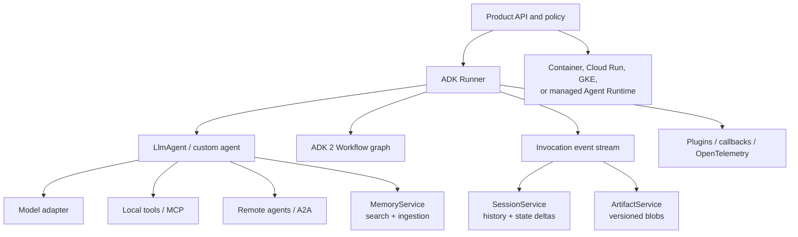

# Google Agent Development Kit Production Playbook

**Research date:** 2026-08-31  
**Status:** Deep, research-backed guide cluster  
**Primary scope:** Google ADK Python 2.8.0 and Go 2.2.0, with explicit coverage of TypeScript 2.0.0, Java 1.8.0, and Kotlin 0.8.0  
**Freshness rule:** Verify the selected SDK, model adapter, session service, and deployment surface together before adoption

## Bottom line

Google Agent Development Kit is a multi-language agent runtime toolkit. Its strongest architectural idea is the event boundary: a `Runner` drives an agent or workflow, produces events, and commits state and artifact deltas through services before yielding those events to the application. ADK 2 adds graph workflows that can rehydrate progress from event history.

That does **not** make every ADK program a durable, exactly-once workflow. A production design still has to define session concurrency, idempotent external effects, cancellation, authorization, retention, and deployment ownership.

Keep four boundaries explicit:

- **ADK library versus Agent Runtime:** ADK can run inside an ordinary application process. Agent Runtime is a separate managed Google Cloud deployment product.
- **session persistence versus durable effects:** an appended event can recover orchestration progress; it cannot prove that a payment, email, or database write happened exactly once.
- **MCP versus A2A:** MCP exposes tools and context. A2A exposes a remote agent. Neither protocol is an authorization decision.
- **language availability versus feature parity:** every feature page and release line has its own support and maturity status.

## Reading paths

| Goal | Start here | Continue with |
|---|---|---|
| Understand execution | [Runtime and event loop](runtime-and-event-loop.md) | [Sessions, state, artifacts, and memory](sessions-state-artifacts-and-memory.md) |
| Build agents and tools | [Agents, instructions, models, and routing](agents-instructions-models-and-routing.md) | [Tools, MCP, A2A, callbacks, and plugins](tools-mcp-a2a-callbacks-and-plugins.md) |
| Build deterministic orchestration | [Workflows, graphs, parallelism, and loops](workflows-graphs-parallelism-and-loops.md) | [Reliability, concurrency, cancellation, and effects](reliability-concurrency-cancellation-and-effects.md) |
| Build interactive products | [Streaming, live events, and frontends](streaming-live-events-and-frontends.md) | [Human-in-the-loop, confirmation, and resume](human-in-the-loop-confirmation-and-resume.md) |
| Ship and operate | [Deployment, scaling, and Agent Runtime](deployment-scaling-and-agent-runtime.md) | [Evaluation, testing, debugging, and telemetry](evaluation-testing-debugging-and-telemetry.md) |
| Review production risk | [Security, identity, and multi-tenancy](security-identity-and-multi-tenancy.md) | [Language parity, versioning, migration, and limitations](language-parity-versioning-migration-and-limitations.md) |

## Guide map

1. [Runtime, Runner, and the event loop](runtime-and-event-loop.md)
2. [Agents, instructions, models, and routing](agents-instructions-models-and-routing.md)
3. [Tools, MCP, A2A, callbacks, and plugins](tools-mcp-a2a-callbacks-and-plugins.md)
4. [Sessions, state, artifacts, and memory](sessions-state-artifacts-and-memory.md)
5. [Workflows, graphs, parallelism, and loops](workflows-graphs-parallelism-and-loops.md)
6. [Streaming, live events, and frontends](streaming-live-events-and-frontends.md)
7. [Human-in-the-loop, confirmation, and resume](human-in-the-loop-confirmation-and-resume.md)
8. [Deployment, scaling, and Agent Runtime](deployment-scaling-and-agent-runtime.md)
9. [Evaluation, testing, debugging, and telemetry](evaluation-testing-debugging-and-telemetry.md)
10. [Reliability, concurrency, cancellation, and external effects](reliability-concurrency-cancellation-and-effects.md)
11. [Security, identity, and multi-tenancy](security-identity-and-multi-tenancy.md)
12. [Language parity, versioning, migration, and limitations](language-parity-versioning-migration-and-limitations.md)

The source ledger, research method, bounded issue evidence, and unresolved documentation contradictions are in the [deep-dive research packet](../../research/packets/google-adk-deep-dive.md).

## Production invariants

- One logical session has one explicit concurrency policy: serialize turns, reject overlap, or implement and test a domain-specific merge protocol.
- State changes flow through callback/tool context or event deltas. A fetched `Session` object is read-only application data.
- Event, prompt, tool, graph, state, and artifact schemas are versioned together.
- ADK events map into an application-owned [state and event contract](../../runtime/agent-state-and-event-contracts.md) with stable identity, fenced terminal outcomes, ordering, and replay policy.
- Every external write uses an application operation ID, an idempotency key where supported, and a reconciliation path.
- Confirmation is authenticated authorization by the current principal, not trust in an event whose role is merely `user`.
- Tool permissions are enforced inside or immediately before the tool, after arguments are known.
- Parallel branches do not share mutable process state or write the same state key without an explicit merge rule.
- Limits cover model calls, tool calls, graph steps, loop iterations, parallel width, elapsed time, stream backlog, tokens, cost, artifact size, and retained events.
- Persistent sessions, memory, artifacts, traces, and model-provider logs have separate retention and tenant-isolation policies.
- Deployment, SDK, model, prompt, graph, tool, and policy versions are visible in every trace and durable record.

## Current release snapshot

| SDK | Checked release | Maturity signal that matters |
|---|---:|---|
| Python | `2.8.0` (2026-08-25) | ADK 2 GA; a maintained 1.x line also continues |
| Go | `2.2.0` (2026-08-10) | ADK 2 GA; requires Go 1.25+; a 1.x line also continues |
| TypeScript | `2.0.0` (2026-08-20) | 2.0 agent/node refactor released; `Workflow` remains marked experimental and template workflows are deprecated |
| Java | `1.8.0` (2026-08-13) | 1.x surface; several capabilities remain page-specific rather than cross-language |
| Kotlin | `0.8.0` (2026-08-15) | Pre-1.0; server and Android surfaces differ; A2A consumption is experimental |

Release numbers are evidence of the snapshot, not compatibility promises. ADK's repositories publish independently, and current release notes include fixes for replay, event loss, cancellation, parallel errors, artifact publication, confirmation attribution, and tool parts. Pin exact versions and run the conformance suite described in the testing guide.

## Refresh triggers

Refresh this cluster when any of these changes:

- a new ADK major/minor release in any selected language;
- workflow replay, rehydration, `RequestInput`, or interruption identifiers;
- session-service locking, schema, event append, or user/app-state behavior;
- tool confirmation support for persistent session services;
- cancellation support outside TypeScript or provider-side generation cancellation;
- Agent Runtime naming, API resource model, region, networking, security, or data-governance controls;
- MCP or A2A protocol/library major versions;
- model capability reporting, structured-output/tool compatibility, or live-streaming support;
- security advisories affecting ADK, model adapters, MCP/A2A SDKs, or optional extras.

## Primary starting sources

- [ADK documentation](https://adk.dev/)
- [Runtime](https://adk.dev/runtime/)
- [Events](https://adk.dev/events/)
- [Sessions](https://adk.dev/sessions/session/)
- [ADK 2 workflows and graphs](https://adk.dev/graphs/)
- [Deployment](https://adk.dev/deploy/)
- [ADK Python releases](https://github.com/google/adk-python/releases)
- [ADK Go releases](https://github.com/google/adk-go/releases)
- [ADK TypeScript releases](https://github.com/google/adk-js/releases)
- [ADK Java releases](https://github.com/google/adk-java/releases)
- [ADK Kotlin releases](https://github.com/google/adk-kotlin/releases)
