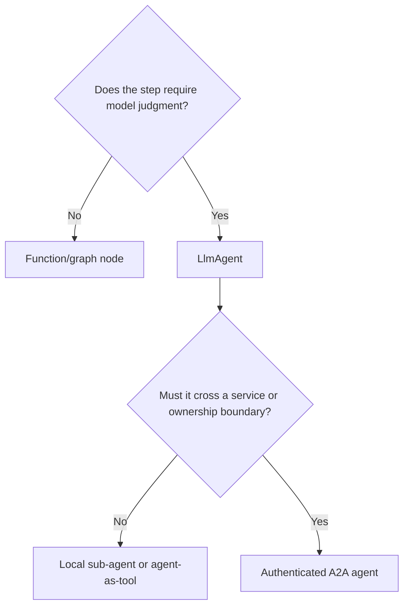

# Agents, Instructions, Models, and Routing

## Choose the smallest agent shape

Use an `LlmAgent` when a model must interpret unstructured input, select tools, or synthesize an answer. Use a function or graph node when control flow is deterministic. Use a remote A2A agent only when the boundary must cross ownership, process, language, or deployment domains.

More agents increase prompt surface, latency, non-determinism, tool authority, and debugging cost. A single agent plus deterministic tools is the default until a second agent has a distinct contract.

## `LlmAgent` configuration that changes behavior

| Field | Production significance |
|---|---|
| `name` | Stable identifier in the agent tree, events, transfers, and traces; must be unique where routing depends on it |
| `description` | Model-visible delegation signal; vague descriptions cause routing errors |
| `instruction` | Static string or provider function; may interpolate state and artifacts |
| `model` | Provider adapter and capability contract, not just a model-name string |
| `tools` | Executable authority and prompt-visible schema |
| `sub_agents` | Delegation topology |
| input/output schemas | Validation boundary whose compatibility depends on the model adapter |
| `output_key` | Writes the final agent output into session state through event flow |
| callbacks/planner/code executor | Additional control, risk, cost, and language-parity surfaces |

ADK supports `{key}` state interpolation and artifact placeholders in instructions; an optional marker can avoid failure for a missing key. Interpolation is convenient, but it can silently turn tenant-controlled state or retrieved artifacts into privileged instructions. Delimit and label untrusted content, minimize what enters the system instruction, and test prompt-injection paths.

## Instructions are code and data

Treat instruction generation like a versioned program:

- separate durable policy from per-request context;
- include only state keys needed for the decision;
- mark retrieved text and tool output as untrusted data;
- never embed raw secrets;
- log the prompt-template version, not sensitive expanded content;
- test empty, oversized, malicious, stale, and conflicting state;
- validate output before an action, even when a schema is configured.

An instruction provider can read invocation context and generate dynamic instructions. This is useful for tenant policy or locale, but it also makes identical user input produce different behavior. Capture the provider version and policy inputs in traces.

## Model adapters are not interchangeable

ADK can call Gemini through Google AI Studio or Google Cloud, third-party models hosted on Google's platform, Anthropic clients, and broad provider sets through LiteLLM. The common interface does not normalize every capability.

Verify at least:

- system/developer-role mapping;
- tool-call and tool-result encoding;
- parallel tool calls;
- structured output plus tools;
- thought/reasoning parts and signatures;
- token accounting and context limits;
- streaming, live audio/video, and interruption;
- safety settings and blocked responses;
- retry classification and idempotency;
- data location, retention, and provider logging.

ADK Python 2.7 introduced explicit model-capability reporting to reduce behavior inferred from model IDs. Use reported capabilities where available, but keep an integration test: adapters and provider APIs still evolve independently.

## Structured output

A schema narrows the model response format; it does not prove semantic correctness or authorize an effect. Some model combinations historically did not support tools and `output_schema` together. Capability reporting and newer models improve detection, but the application should test the exact SDK/adaptor/model trio.

Good pattern:

1. Ask the model for a small typed decision or plan.
2. Validate values and cross-field invariants in deterministic code.
3. Resolve current authorization and domain state.
4. Execute through a narrow tool with an idempotency key.

Avoid using a large domain object as the model's writable schema. Prefer a command DTO with explicit intent, resource IDs, and expected revision.

## Routing patterns

| Pattern | Use when | Main risk |
|---|---|---|
| Model selects a function tool | The operation set is small and arguments are well-defined | Hallucinated or over-broad arguments |
| Local sub-agent transfer | A specialist needs its own prompt/context but shares process trust | Hidden prompt/authority expansion |
| Agent as a tool | The parent should retain control and consume a bounded result | Nested latency and token cost |
| Deterministic graph route | The decision can be computed from validated state | Incorrect/stale routing state |
| Model router | Classification genuinely requires language understanding | Retry/fallback semantics and inconsistent providers |
| A2A remote agent | Independent service ownership or language/deployment isolation | Remote trust, identity, availability, protocol drift |

Model routing helpers and retry/fallback features are language- and release-specific. A retry is safest only before any output or tool effect. Once partial output or an external action exists, failover can duplicate or contradict work.

## Context budgeting

ADK exposes switches for including conversation history and richer context. Do not equate “more history” with better behavior. Build a budget that prioritizes:

1. policy and task contract;
2. the current user turn;
3. authoritative tool data;
4. compact current state;
5. selected recent history;
6. retrieved long-term memory with provenance.

Summaries and memories can be stale or malicious. Preserve source/time metadata and revalidate important facts against systems of record.

## Production checklist

- [ ] Every agent has one clear responsibility and a bounded tool set.
- [ ] `name`, `description`, instruction, tool schemas, and model are versioned.
- [ ] Dynamic instruction inputs are allowlisted and tenant-scoped.
- [ ] The exact model adapter is tested for tools, schemas, streaming, safety, and usage.
- [ ] Structured outputs receive deterministic semantic validation.
- [ ] A routing fallback cannot repeat a completed external effect.
- [ ] Context selection has token, provenance, and freshness limits.
- [ ] Model deprecation and fallback are tested before production rollout.

## Primary sources

- [LLM agents](https://adk.dev/agents/llm-agents/)
- [Gemini models](https://adk.dev/agents/models/google-gemini/)
- [Anthropic models](https://adk.dev/agents/models/anthropic/)
- [Models hosted on Agent Platform](https://adk.dev/agents/models/agent-platform/)
- [LiteLLM integration](https://adk.dev/agents/models/litellm/)
- [Model routing](https://adk.dev/agents/models/routing/)
- [ADK Python releases](https://github.com/google/adk-python/releases)
