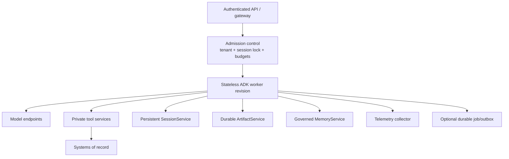

# Deployment, Scaling, and Agent Runtime

## Choose the execution owner first

ADK is an in-process library. It can run in any suitable container or service. Google also provides a managed agent hosting surface whose current documentation increasingly calls it **Agent Runtime**; older and underlying APIs still use names such as Vertex AI Agent Engine, Reasoning Engine, `reasoningEngines`, and `agent_engines`.

Treat those names as layers and migration history, not interchangeable API strings.

| Option | You operate | Platform operates | Best fit |
|---|---|---|---|
| Ordinary container/VM | Process, API, identity, scaling, persistence, telemetry, deploys | Base infrastructure varies | Maximum portability/control |
| Cloud Run | Container/API plus application services and policy | Request serving, autoscaling, revisions, service identity primitives | Stateless HTTP/event frontends and workers |
| GKE | Cluster workload, scheduling policy, networking, storage integration | Managed Kubernetes control plane | Custom networking, accelerators, sidecars, complex worker topology |
| Managed Agent Runtime | Agent package/configuration, application policy, data/services | Managed agent execution API and infrastructure | Google Cloud-native managed agent operations |

Managed hosting reduces infrastructure work; it does not remove tool authorization, tenant isolation, idempotency, data governance, or evaluation.

## Reference production topology

Workers should be replaceable. Anything required after restart belongs in a persistent service or durable job system, not a process-global dictionary, local filesystem, or open generator.

## Package and API boundary

The managed Python deployment flow packages an agent and dependencies; it does not deploy the local ADK web UI or development API server. Managed infrastructure supplies its own serving contract. The Go deployment surface differs and can include an API server. Read the selected language page rather than copying commands across SDKs.

For self-hosting:

- build a pinned, minimal image;
- run as non-root on a read-only filesystem where possible;
- use a production API layer, not `adk web` or an unauthenticated development server;
- expose health/readiness separately from model invocation;
- initialize required model/tool/session dependencies before readiness;
- close MCP/tool/client resources on shutdown;
- drain or detach in-flight work during revision changes.

## Scaling model

Scale four dimensions separately:

1. **Request/stream connections:** HTTP/SSE/live session concurrency.
2. **Agent work:** active model/tool/workflow invocations.
3. **Downstream capacity:** provider quotas, database pools, tool rate limits.
4. **durable backlog:** queued/resumable jobs and pending approvals.

Autoscaling on HTTP concurrency alone can overwhelm model quotas or databases. Admission control should consider tenant quotas, same-session exclusion, total in-flight model calls, workflow fan-out, and tool capacity.

### Session affinity

Ordinary turns should not require sticky routing if sessions/artifacts/approval state are externalized. Live bidirectional connections remain attached for their connection lifetime. Resume after disconnect should reconstruct from durable state or explicitly report that the mode is not resumable.

Never use load-balancer affinity as the only same-session lock. It fails across revisions, retries, and direct worker calls.

## Deadlines and long work

Align:

- edge/load-balancer timeout;
- service request timeout;
- runner wall-clock deadline;
- model and tool timeouts;
- stream heartbeat/idle timeout;
- durable-job lease and retry policy.

For work longer than the serving limit, return an operation ID and move execution to a durable worker/queue. The base `Runner` is not itself a durable queue.

## Google Cloud identity and secrets

On Cloud Run or GKE, prefer workload/service identity and Application Default Credentials over service-account keys. Give the runtime service account only the model, session, artifact, memory, secret, and tool permissions it needs. Give deployment identities separate permissions.

Use Secret Manager or an equivalent secret store, mount/inject at runtime, and rotate. Do not put secrets in prompts, session state, artifacts, images, command lines, or traces. For user OAuth, use ADK's tool-auth flow or an application credential broker with tenant-scoped storage and refresh handling.

## Network and data controls

Verify the exact current Agent Runtime/Google Cloud feature matrix for:

- supported regions and data location;
- VPC Service Controls and private connectivity;
- ingress/egress restrictions;
- CMEK and organization-policy compatibility;
- retention and deletion behavior;
- telemetry export and prompt/response capture;
- model and third-party tool data paths.

Cloud product capabilities and names have changed quickly. Treat any static matrix in this guide as a prompt to verify official documentation, not a procurement guarantee.

## Rolling deployments

Version every pending execution with the SDK, graph/agent, prompt, tool schema, state schema, and policy version. Then choose:

- **drain:** old revision finishes pending runs;
- **version route:** resume goes to a compatible old worker;
- **migrate:** transform durable state with tested code;
- **invalidate safely:** mark non-resumable and require a new user action without executing effects.

Never let a new revision reinterpret an old approval or tool call under changed arguments.

## Capacity and cost controls

Enforce per-run and per-tenant ceilings on:

- model calls, tokens, and expensive model tiers;
- tool calls and external API spend;
- graph/loop steps and parallel width;
- concurrent live sessions;
- event/state/artifact/memory bytes;
- retry attempts and total wall time.

Emit budget-denied as a first-class terminal outcome, not an internal error.

## Production checklist

- [ ] The team states whether ADK or Agent Runtime owns each serving concern.
- [ ] Development UI/API servers are absent from public production paths.
- [ ] Workers are disposable and all resume-critical state is externalized.
- [ ] Admission control coordinates same-session, tenant, model, and tool capacity.
- [ ] Long work uses an explicit durable-job boundary.
- [ ] Runtime, deployment, and user credentials are separated and least-privileged.
- [ ] Network, region, retention, encryption, and provider data paths are verified.
- [ ] Rolling deploys preserve or safely invalidate pending runs and approvals.
- [ ] Shutdown drains/cancels work and closes tools without corrupting shared users.

## Primary sources

- [ADK deployment overview](https://adk.dev/deploy/)
- [Deploy to Agent Runtime](https://adk.dev/deploy/agent-runtime/)
- [Agent Runtime deployment details](https://adk.dev/deploy/agent-runtime/deploy/)
- [Deploy to Cloud Run](https://adk.dev/deploy/cloud-run/)
- [Deploy to GKE](https://adk.dev/deploy/gke/)
- [Vertex AI Agent Engine / Agent Runtime overview](https://cloud.google.com/vertex-ai/generative-ai/docs/reasoning-engine/overview)
- [Cloud Run service identity](https://cloud.google.com/run/docs/configuring/services/service-identity)
- [Cloud Run secrets](https://cloud.google.com/run/docs/configuring/services/secrets)
- [Private Service Connect interface for Agent Engine](https://cloud.google.com/vertex-ai/generative-ai/docs/agent-engine/private-service-connect-interface)
