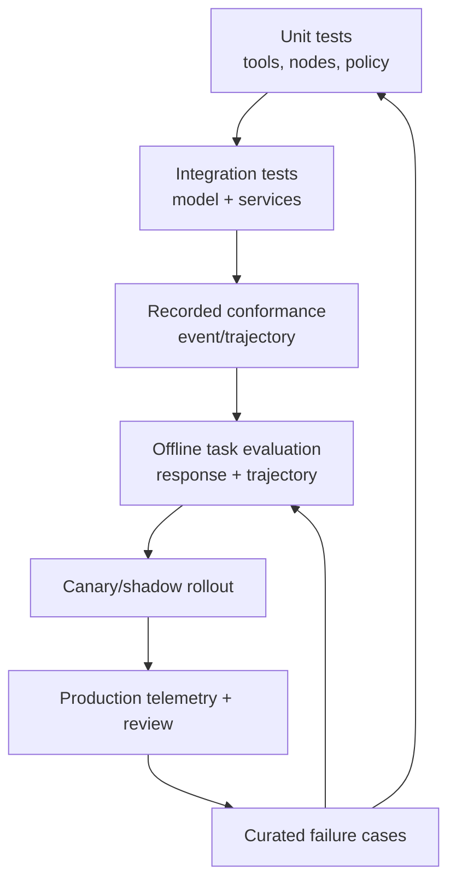

# Evaluation, Testing, Debugging, and Telemetry

## One quality system, several evidence layers

No single benchmark proves an agent is production-ready. ADK applications need deterministic software tests, recorded runtime conformance, task-level evaluation, adversarial safety tests, and production telemetry.

## Support reality

The official ADK evaluation framework is currently documented for Python. Observability pages label feature-specific support rather than uniform parity: logging is documented for Python, Go, and Kotlin; metrics for Python and Kotlin; other trace/export surfaces vary. TypeScript and Java applications still need tests and OpenTelemetry, but may require application-owned adapters.

Do not infer parity from the top-level five-language claim.

## Test pyramid

### 1. Deterministic unit tests

Test without a live model:

- tool argument validation, authorization, idempotency, and error mapping;
- callbacks/plugins ordering and short-circuit behavior;
- state prefix/scope and event deltas;
- graph routes, joins, loop limits, and dynamic fan-out validation;
- prompt-template rendering with missing/malicious/oversized state;
- stream-event normalization;
- approval digest and single-consume logic;
- telemetry redaction.

### 2. Runtime integration tests

Use the exact session/artifact/memory services and model adapter:

- create/load/append across process restart;
- concurrent same-session requests;
- model tool calls and structured output;
- MCP discovery/invocation/close lifecycle;
- A2A auth and protocol version;
- streaming disconnect/reconnect;
- cancellation during model and tool work;
- artifact atomicity and version reads;
- memory ingestion and freshness.

### 3. Replay/resume conformance

Record and assert the meaningful event sequence rather than only the final text. Include:

- event author, invocation, branch, partial/final, tool/function IDs;
- state and artifact deltas;
- interruption and resume identifiers;
- terminal status;
- no duplicate external operation ID.

Mandatory scenarios:

1. process dies before a tool starts;
2. tool commits, process dies before its response event;
3. process dies while waiting for human input;
4. a prior invocation exists in the same session before HITL resume;
5. rolling deploy changes graph/prompt/tool versions;
6. parallel branch fails while siblings run.

ADK's conformance recording/replay does not currently cover every live/BIDI behavior; live evaluation remains a separate test surface.

## ADK evaluation

The Python evaluation tooling can score final responses and tool trajectories through UI, CLI, pytest integration, or evaluation APIs. Available criteria include exact or order-sensitive/insensitive tool trajectory checks, text similarity, model-judged quality, hallucination/safety criteria, and multi-turn behavior. Custom metrics are supported in newer releases.

Use metrics deliberately:

| Question | Stronger evidence |
|---|---|
| Did the agent call the required safe tools? | Deterministic trajectory constraint |
| Did it avoid a forbidden tool? | Deterministic absence/policy assertion |
| Is a factual answer correct? | Reference facts plus task-specific scorer |
| Is prose helpful? | Calibrated rubric/judge plus human audit |
| Is it safe under attack? | Adversarial suite plus deterministic policy outcomes |
| Does a multi-turn workflow recover? | Recorded state/event assertions and end-to-end test |

ROUGE or a generic model judge should not decide whether a payment, permission, or tenant boundary was correct.

### Dataset construction

Include:

- common tasks and realistic long-tail inputs;
- tool errors, timeouts, stale data, and partial responses;
- ambiguous user intent and missing required fields;
- prompt injection through user, memory, artifact, MCP, A2A, and tool output;
- authorization changes between plan, approval, and commit;
- repeated/cancelled/resumed turns;
- model/provider fallback;
- language-specific serialization and schema cases.

Version datasets, rubrics, judges, judge models, sampling settings, and environment fixtures. Keep a human-reviewed calibration set and measure judge disagreement.

## Telemetry model

At minimum, correlate:

- tenant-safe request/session/invocation/event IDs;
- agent, node, branch, tool, model, provider, and deployment version;
- start/end/status/latency for invocation, model, tool, node, and approval;
- input/output token and cost estimates;
- retry/cancel/timeout/rate-limit/budget outcomes;
- tool result class and operation ID, not secret payload;
- state/artifact/memory byte counts and ingestion lag;
- stream disconnect/reconnect/backlog;
- evaluation/policy version and decision.

OpenTelemetry spans, metrics, and structured logs should share correlation attributes. Use sampling that retains errors, approvals, policy denies, high-cost runs, and rare workflows.

## Sensitive data

The logging docs note that prompt content is normally elided in OpenTelemetry GenAI logs, while Python debug logging can include full prompts. Never enable verbose/debug logging in production without reviewing the exact version and sinks.

Redact before export, not only in the dashboard. Consider:

- user/model text;
- tool arguments and results;
- OAuth/API credentials;
- artifact names/content;
- memory excerpts;
- exception messages and stack locals;
- URLs and database identifiers;
- A2A/MCP payloads.

Keep a safe structured envelope by default and allow temporary, audited content capture only for approved tenants/incidents.

## Debugging workflow

1. Find the invocation and deployment/version tuple.
2. Reconstruct ordered events and state/artifact deltas.
3. Separate model, scheduler, tool, storage, transport, and policy failures.
4. Check whether an external effect committed by operation ID.
5. Reproduce with recorded inputs in an isolated tenant/test account.
6. Add the case to deterministic and evaluation suites.
7. Fix the smallest owning boundary; do not hide it with a prompt retry.

## Release gates

Block rollout when:

- deterministic policy or tenant tests fail;
- replay/resume produces divergent effects;
- event schemas change without a protocol migration;
- cost/latency/error regress beyond agreed budgets;
- safety/adversarial pass rate falls below the approved threshold;
- telemetry cannot identify deployment, model, tool, and policy versions;
- a selected language/service combination lacks tested operational controls.

## Production checklist

- [ ] Unit tests cover tools, policy, state, graph, approval, and redaction.
- [ ] Integration tests use the production model adapter and persistence services.
- [ ] Replay/resume and post-effect crash cases are permanent conformance tests.
- [ ] Evaluation scores both final results and trajectories where relevant.
- [ ] Judge metrics are calibrated against human-reviewed cases.
- [ ] Telemetry is correlated, versioned, and content-safe by default.
- [ ] Debug logging cannot silently export prompts or secrets.
- [ ] Canary rollback decisions use explicit quality, cost, latency, and safety gates.

## Primary sources

- [ADK evaluation](https://adk.dev/evaluate/)
- [Evaluation criteria](https://adk.dev/evaluate/criteria/)
- [Custom evaluation metrics](https://adk.dev/evaluate/custom_metrics/)
- [Evaluation and conformance testing](https://adk.dev/evaluate/)
- [Observability](https://adk.dev/observability/)
- [Logging](https://adk.dev/observability/logging/)
- [Metrics](https://adk.dev/observability/metrics/)
- [Traces](https://adk.dev/observability/traces/)
- [Agent Engine evaluation](https://cloud.google.com/vertex-ai/generative-ai/docs/agent-engine/evaluate)
