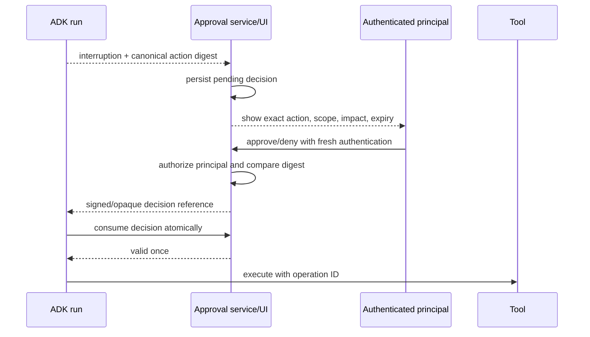

# Human-in-the-Loop, Confirmation, and Resume

## Two interruption mechanisms

ADK currently exposes two related but distinct mechanisms:

| Mechanism | Purpose | Snapshot support/maturity |
|---|---|---|
| Tool confirmation | Ask before executing a particular function tool | Support header lists Python, TypeScript, and Go and marks it experimental; the same page's Boolean section also shows Java, so Java support is ambiguous |
| Graph `RequestInput` | Pause an ADK 2 workflow for arbitrary structured human input | Python, Go, and TypeScript 2.0; TypeScript Workflow is still release-marked experimental |

Do not design a single portable approval layer by assuming they share storage, UI, or resume semantics. Build an application-level interruption record and adapt each SDK mechanism to it.

## Approval is an authorization transaction

An approval must bind all of these values:

```text
tenant + principal + session + invocation + interruption ID
+ action type + normalized arguments + resource revision
+ policy version + expiry + decision + decision ID
```

If arguments, target revision, identity, policy, or expiry changes, the approval is invalid. “The previous event author was user” is not sufficient.



The runtime event should contain a decision reference or bounded payload; the approval system is the source of truth.

## Tool confirmation flow

A confirmation-required tool first yields an `adk_request_confirmation`-style function call. The application collects a decision and resumes using a matching function response and the same invocation identity.

Production requirements:

- render normalized, human-readable arguments and the affected resource;
- display consequences and whether the action is reversible;
- reject hidden/unrendered fields;
- require fresh auth for high-risk actions;
- expire and single-consume decisions;
- record deny, timeout, superseded, and cancelled states;
- revalidate authorization and resource revision at commit time;
- use an operation ID so resumed execution cannot duplicate the effect.

### Documented storage limitation

At the research snapshot, the tool-confirmation guide's known-limitations section says `DatabaseSessionService` and `VertexAiSessionService` are unsupported. That conflicts with the natural expectation that persistent session services are the path to cross-process resume. Treat this as a release-blocking constraint, not a footnote:

- do not advertise crash-safe/rolling-deployment confirmation until the exact combination passes;
- keep approval state in an application-owned durable store;
- prefer graph `RequestInput` for a supported ADK 2 workflow use case only after its own persistent-session conformance test;
- recheck the limitation on every ADK upgrade.

## Graph `RequestInput`

A graph node yields `RequestInput` with an interruption ID, prompt/payload, and optional response schema. The schema validates shape; it does not automatically rewrite malformed input or authorize the responder.

Use a stable unique interruption ID tied to a particular node execution. Go's `RerunOnResume` behavior and interruption-ID guidance matter when the node must execute again after a response. Keep node work before the interruption replay-safe: a node can rerun.

Pattern:

1. Check `ctx.resume_inputs` for the exact interruption ID.
2. If absent, yield `RequestInput` and return without an external write.
3. If present, validate the application-authenticated decision/input.
4. Re-read current domain state and authorization.
5. execute the next effect idempotently.

## Resume contract

Resume must preserve:

- `app_name`, `user_id`, and `session_id`;
- the pending `invocation_id` where the mechanism requires it;
- interruption/function-call ID;
- graph/prompt/tool/policy versions or a compatible version route;
- original normalized action digest;
- a trace/correlation link to the initial request.

The official resume guide notes that programmatic Runner/REST paths are the relevant surface and that CLI/web support has limitations. A development UI is not proof of a production resume contract.

## Trust-boundary warning

An open ADK Python issue reported on 2026-07-24 shows why role labels are not identity: an inbound A2A peer can provide a function response that is converted to a `user` role and can self-approve a confirmation-gated dangerous tool in the reported 2.5.0/main code path. The issue also notes that development `/run` endpoints have no authentication by default.

Until a selected release is verified to prevent this path:

- never accept approval responses through A2A;
- never expose development API servers directly;
- authenticate the application endpoint and distinguish human, service, and agent principals;
- store/consume decisions in a separate approval service;
- reauthorize inside the tool;
- regression-test forged function responses from every transport.

This issue is bounded evidence for a test and mitigation, not evidence that every SDK/language/version behaves identically.

## Failure and recovery matrix

| Failure | Required behavior |
|---|---|
| Approval UI disconnects | Pending record remains until expiry; no tool execution |
| Worker restarts while waiting | New worker reloads compatible pending state or marks it non-resumable |
| Decision arrives twice | Atomic single-consume; same decision ID cannot execute twice |
| Arguments change after approval | Digest mismatch; request new approval |
| Resource revision changed | Revalidate and reject/supersede |
| SDK/graph version changed | Route to compatible worker or migrate explicitly |
| Effect commits, response event is lost | Reconcile using operation ID |
| Remote agent sends approval-looking data | Treat as untrusted peer content; reject |
| Request expires | Emit terminal expired/superseded status |

## UX requirements

Good approval UI answers:

- Who requested this?
- Which agent/tool will act?
- What exact resource and tenant are affected?
- What normalized arguments will be used?
- What information leaves the trust boundary?
- What is the estimated cost/impact?
- Can the action be reversed?
- When does the request expire?
- What changed since the request was created?

Never show only “Allow tool?”

## Production checklist

- [ ] Human identity comes from authenticated application context, not ADK role text.
- [ ] The decision binds exact action, arguments, target revision, policy, and expiry.
- [ ] Decisions are durable, single-use, auditable, and revocable before commit.
- [ ] Persistent-session support is verified for the exact interruption mechanism.
- [ ] Nodes do no unreconciled work before a replayable interruption.
- [ ] A2A and generic API callers cannot submit human approvals.
- [ ] Rolling deploy and cross-invocation resume tests pass.
- [ ] Approval expiry, deny, duplicate, supersede, and post-effect crash are tested.

## Primary sources

- [Tool confirmation](https://adk.dev/tools-custom/confirmation/)
- [Graph human input](https://adk.dev/graphs/human-input/)
- [Runtime resume](https://adk.dev/runtime/resume/)
- [Events](https://adk.dev/events/)
- [Bounded 2.5.0 replay regression #6497](https://github.com/google/adk-python/issues/6497)
- [Open A2A confirmation trust-boundary issue #6461](https://github.com/google/adk-python/issues/6461)
