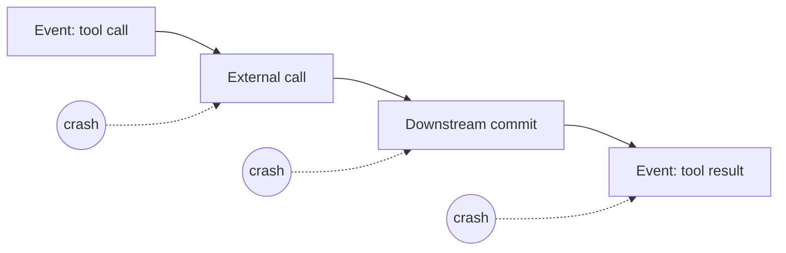

# Reliability, Concurrency, Cancellation, and External Effects

## The reliability contract ADK does and does not provide

ADK gives useful event ordering, persistent session services, state/artifact deltas, graph rehydration, and retry/callback hooks. These mechanisms can recover agent progress. They do not create a transaction across the model, session database, and every external tool.

The dangerous window is after downstream commit and before the result event is durable. A replay or retry cannot know the outcome unless the tool protocol supplies an operation ID, idempotency, and lookup/reconciliation.

## Same-session concurrency

Session state is read-modify-append data. Two turns against one session can both read the same state, call tools, and append individually valid but semantically conflicting events.

`DatabaseSessionService` now documents in-process per-session locks and row-level locks for PostgreSQL/MySQL/MariaDB. Those locks protect append/data integrity. They do not make overlapping user intentions merge safely.

Default policy:

1. derive a stable tenant/user/session key at the authenticated edge;
2. acquire a distributed lease or queue position for that key;
3. reject or enqueue a second turn while one is active;
4. include a fencing token/revision if a stale worker could continue;
5. release only after terminal event or durable detach.

If concurrent turns are a product requirement, define an explicit merge model and isolate effects. A conversation transcript is rarely a CRDT.

## Parallel work inside one invocation

Graph/parallel agents create intentional concurrency. Keep it structured:

- parent owns all child tasks;
- bounded semaphore limits width;
- each branch has its own client/transaction or a verified safe pool;
- sibling cancellation and cleanup are deterministic;
- state keys are branch-exclusive until a join;
- shared toolsets are not closed while another branch uses them;
- errors retain branch identity and all relevant causes.

Test success, one-branch failure, multi-branch failure, deadline, client disconnect, and cancellation while a tool is active.

## Retry taxonomy

| Operation | Usually safe retry condition | Required guard |
|---|---|---|
| Session/event read | Transient failure | Bounded attempts/deadline |
| Event append | Service-specific | Event ID/deduplication or confirmed append semantics |
| Model call before any output/tool | Transient provider error | Budget, jitter, compatible model behavior |
| Model call after partial output | Rarely transparent | Restarted-response protocol; never concatenate blindly |
| Pure read tool | Transient error | Stable query and freshness policy |
| External write tool | Only with idempotency/reconciliation | Operation ID and downstream lookup |
| Memory ingestion trigger | Service-specific async retry | Ingestion job ID/status/deduplication |
| Artifact publication | Idempotent object/version protocol | Checksum and atomic ready marker |

Never allow nested model, runner, gateway, and job retries to multiply invisibly. Carry an attempt budget and record the layer that retried.

## Reliable effect protocol

For every write tool:

1. validate typed arguments;
2. derive tenant/principal from trusted context;
3. authorize against current domain state;
4. create or reuse a durable application operation ID;
5. call the downstream service with an idempotency key or transactional outbox;
6. persist downstream receipt/status;
7. emit the ADK tool-result event;
8. on ambiguity, query/reconcile rather than repeat.

If the downstream API has no idempotency or lookup, put a domain service in front of it. Prompt instructions such as “do not call twice” are not an effect protocol.

## Timeouts and budgets

Use one decreasing deadline propagated through runner, model, tool, MCP/A2A, database, and stream layers. A tool timeout should be shorter than the remaining invocation deadline so the runtime can record a terminal event.

Budget dimensions:

- wall time and idle time;
- model/tool calls and retries;
- graph nodes/loop iterations;
- parallel width;
- tokens and monetary cost;
- event/state/artifact bytes;
- pending approval lifetime;
- stream backlog.

Classify budget exhaustion separately from provider/system failure.

## Cancellation reality

The dedicated ADK cancellation documentation currently describes TypeScript `AbortSignal` support and says cancellation is non-destructive: already committed events remain. An open Python issue asks for a supported external cancellation contract for standard `run_async`.

Cancellation is cooperative, not rollback. Design these milestones:

1. request accepted;
2. scheduler stops starting new work;
3. model/tool cancellation attempted;
4. children/resources drained or force-closed;
5. external effects reconciled;
6. terminal cancelled/timed-out record committed.

Never report “cancelled” as “nothing happened.”

## Circuit breakers and load shedding

Retry does not solve an overloaded or unhealthy dependency. Add per-dependency:

- concurrency limits;
- rate limits and quota-aware admission;
- timeout and retry budget;
- circuit breaker/open duration;
- fallback only when semantically safe;
- stale-cache policy for reads;
- health metrics and operator controls.

Load-shed before creating a model call or workflow fan-out. Preserve capacity for resumes, denials, cancellations, and reconciliation.

## Resource cleanup

Every model/MCP/A2A/database/client resource needs one owner and an idempotent close path. Shutdown order should stop admissions, mark the revision draining, wait within a deadline, cancel/detach remaining work, close per-invocation resources, and only then close shared pools.

Recent release notes across ADK languages include fixes for live background-tool cleanup, cancellation, runner sequencing, event loss, parallel errors, and artifact publication. Keep cleanup and crash tests even after a fix lands.

## Failure matrix

| Failure point | Detect with | Recovery |
|---|---|---|
| Before model/tool | Missing child event/span | Safe bounded retry |
| Model partial then failure | Partial flag and no terminal | Explicit restart/fail protocol |
| Tool unknown outcome | Operation record pending/unknown | Query downstream, reconcile, then emit result |
| Event append failure | Storage error after work | Stop progression; reconcile effects; alert |
| Session lease lost | Fencing-token mismatch | Stale worker stops; new worker recovers |
| Parallel branch hangs | Parent deadline/branch span | Cancel/drain siblings; terminal partial-failure policy |
| Approval expires | Pending decision TTL | Terminal expired; require new intent |
| Worker dies | Missing heartbeat/lease | Recover compatible run or mark non-resumable |

## Production checklist

- [ ] Same-session overlap is serialized/rejected with distributed coordination.
- [ ] Parallel work is bounded and structured.
- [ ] Every retry has a layer, budget, and idempotency classification.
- [ ] Every external write has operation ID and reconciliation.
- [ ] Cancellation is tested during models, tools, streams, and parallel branches.
- [ ] Timeouts form one decreasing deadline.
- [ ] Dependency overload uses load shedding/circuit breaking, not retry storms.
- [ ] Shutdown and post-commit/pre-event crash are tested.

## Primary sources

- [Runtime event loop](https://adk.dev/runtime/event-loop/)
- [Sessions and database locking](https://adk.dev/sessions/session/)
- [Runtime cancellation](https://adk.dev/runtime/cancel/)
- [Runtime resume](https://adk.dev/runtime/resume/)
- [Graph workflows](https://adk.dev/graphs/)
- [Python database session service](https://github.com/google/adk-python/blob/main/src/google/adk/sessions/database_session_service.py)
- [Historical same-session concurrency discussion #790](https://github.com/google/adk-python/discussions/790)
- [Open Python cancellation request #4796](https://github.com/google/adk-python/issues/4796)
- [ADK Python releases](https://github.com/google/adk-python/releases)
