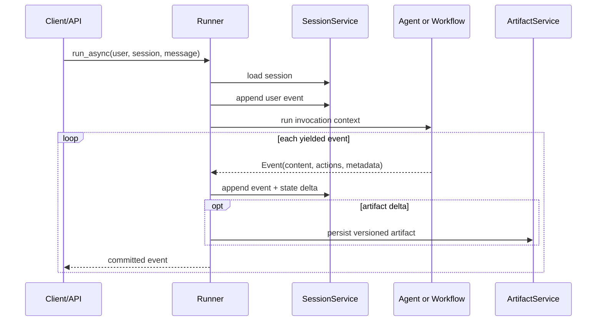

# Runtime, Runner, and the Event Loop

## The useful mental model

The `Runner` is the application-facing execution boundary. It binds an app or root agent to session, artifact, memory, credential, and plugin services; creates an invocation; calls the root executable; processes each yielded event; commits its deltas; and only then yields the event upstream.

This order matters. The event stream is simultaneously:

- the UI/protocol output;
- the audit trail of agent and tool activity;
- the carrier for state and artifact deltas;
- the input to workflow rehydration and resume;
- a debugging and evaluation record.

Treating events as disposable text chunks breaks several ADK guarantees at once.

## Runtime objects

| Object | Owns | Does not own |
|---|---|---|
| `Runner` | Invocation lifecycle, service coordination, plugin execution, event commit/yield | HTTP authentication, queueing, domain transactions, global exactly-once delivery |
| `InvocationContext` / `Context` | Per-run identity, session access, state view, services, cancellation/run metadata | Durable business truth |
| `Event` | Content plus author, invocation, branch, timestamp, partial/turn flags, and action deltas | Proof that a downstream side effect committed |
| `SessionService` | Session identity, event history, state materialization, persistence behavior | Long-term semantic memory or artifact blobs |
| `ArtifactService` | Versioned binary/file payloads | Searchable conversation memory |
| `MemoryService` | Ingestion and retrieval across conversations | Authoritative transaction state |

## Event anatomy

An event can carry model content, function calls or responses, transfer/escalation signals, partial-stream flags, and an `EventActions` payload. Important metadata includes the event ID, `invocation_id`, author, branch, and timestamp.

State and artifact updates are delta-based. A callback or tool may update context state or save an artifact, and the runtime attaches those deltas to an event for persistence. Therefore:

- preserve event order per invocation;
- preserve `invocation_id` across an interruption resume;
- do not synthesize trusted approval or function-response events from unauthenticated clients;
- do not strip action deltas before persistence;
- do not assume every content event is the final user-visible answer.

ADK supplies final-response helpers. A frontend should still define its own protocol for partial text, tool status, approval requests, errors, completion, and reconnect.

## Async first

Python's `run_async` is the normal production path. The synchronous `run` helper uses a background thread and is intended for environments where a synchronous caller is unavoidable. It is not a separate durability mode.

An async generator creates backpressure only as far as the application consumes it. If a client disconnects or a queue fills, the application must decide whether to:

- cancel the invocation;
- keep it running and persist output for later retrieval;
- detach it to a durable job system;
- reject new work until capacity recovers.

That policy is outside the base `Runner`.

## Callbacks and plugins in the loop

Plugins intercept the runner-wide lifecycle. Object-level callbacks belong to a particular agent or tool. Plugin callbacks run before corresponding object callbacks; a returned override can skip later plugins, the original operation, and later callbacks.

This ordering has two production consequences:

1. Put global telemetry and deny-first policy in early plugins, but enforce the final authorization again at the tool boundary.
2. Treat return values as control flow. A callback that returns content or a tool result is not merely observing execution.

See [tools, MCP, A2A, callbacks, and plugins](tools-mcp-a2a-callbacks-and-plugins.md) for the full interception model.

## Failure boundaries

| Failure | What may already be durable | Required response |
|---|---|---|
| Model request fails before an event | User event and earlier events | Retry only under an explicit budget and provider-safe rule |
| Tool fails before external commit | Tool-call event may exist | Emit classified failure; retry only if safe |
| Tool commits, then process dies before response event | External effect may exist without a matching result event | Reconcile by operation ID; never blindly rerun |
| Session append fails | Tool/model work may have happened, event not durable | Stop progression; alert; reconcile side effects |
| Client disconnects | Previously appended events remain | Apply the product's cancel-or-detach policy |
| Plugin/callback throws | Earlier events and effects may exist | Record structured failure without leaking secrets |

## Production pattern

Wrap the runner in a thin application service that owns:

- authenticated principal and tenant resolution;
- a stable mapping to `app_name`, `user_id`, and `session_id`;
- same-session admission control;
- per-run budgets and deadlines;
- stream protocol and reconnect cursors;
- operation IDs for effects;
- deployment/prompt/model/tool/policy version tags;
- structured terminal status: completed, interrupted, cancelled, timed out, or failed.

Do not place domain transactions or authorization rules in the transport handler merely because it is close to the runner. Tools need the same protections when invoked through a different UI, A2A, tests, or replay.

## Review checklist

- [ ] The team can diagram the exact order of event append, state update, artifact publication, and client delivery.
- [ ] Events are stored and streamed without losing invocation, branch, action, or partial/final metadata.
- [ ] The application has an explicit disconnect and backpressure policy.
- [ ] Same-session overlap is serialized or rejected.
- [ ] Every terminal path produces an observable status.
- [ ] A post-effect/pre-result crash has a tested reconciliation path.
- [ ] Sync wrappers are not mistaken for worker isolation or durability.

## Primary sources

- [Runtime overview](https://adk.dev/runtime/)
- [Runtime event loop](https://adk.dev/runtime/event-loop/)
- [Events](https://adk.dev/events/)
- [Run configuration](https://adk.dev/runtime/runconfig/)
- [Python Runner implementation](https://github.com/google/adk-python/blob/main/src/google/adk/runners.py)
- [Python base agent implementation](https://github.com/google/adk-python/blob/main/src/google/adk/agents/base_agent.py)
