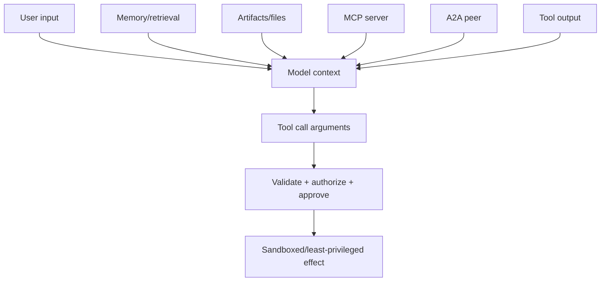

# Security, Identity, and Multi-Tenancy

## Threat model

An ADK application processes untrusted instructions from more places than the chat box:



Prompt injection is expected input behavior, not a rare parsing bug. The model is not an authorization engine. Every path from model-controlled data to an effect must cross deterministic validation and current authorization.

## Separate identities

| Identity | Meaning | Typical credential |
|---|---|---|
| Human/user principal | Person or client authorizing product actions | Application session, OAuth/OIDC token |
| Agent/runtime identity | Workload calling models, stores, and internal tools | Workload/service identity |
| Tool/downstream identity | Credential constrained to one service/action set | Delegated user token or narrow service credential |
| Remote agent/MCP peer | External service principal | mTLS/OAuth/signed service identity |
| Deployment operator | Principal allowed to publish revisions/configuration | CI/CD workload identity |

Do not let a content role such as `user` stand in for a human principal. Do not let the runtime's broad service account silently act as every user when downstream authorization is user-specific.

ADK tool authentication supports schemes and credentials for OAuth, API keys, and service accounts. In-memory credential storage is for development. Production credentials need encrypted tenant/user scope, refresh/revocation handling, and audit.

## Multi-tenant mapping

At the authenticated edge, resolve:

```text
tenant_id -> application policy namespace
principal_id -> ADK user_id mapping
conversation/work item -> opaque session_id
```

Never accept `app_name`, `user_id`, storage namespace, artifact filename, memory corpus, or model project directly from model output or an untrusted client.

Enforce isolation in every plane:

- session query and append;
- state prefixes, especially `user:` and `app:`;
- artifact bucket/object prefix and encryption context;
- memory corpus and retrieval filter;
- trace/log/project export;
- cache keys and rate-limit buckets;
- tool resources and downstream row policies;
- A2A/MCP endpoints and credentials.

Test cross-tenant IDs, guessed sessions, shared-cache collisions, deleted users, and stale delegated credentials.

## Tool authorization

Apply this order immediately before execution:

1. parse and type-check arguments;
2. canonicalize resource identifiers;
3. derive principal/tenant from trusted context;
4. load current resource and policy state;
5. evaluate authorization and risk;
6. obtain human approval if required;
7. compare approved action digest/current revision;
8. execute with least privilege and operation ID;
9. audit the decision and outcome.

Plugins/callbacks are useful defense layers, but final tool authorization remains mandatory. A different runner, short-circuit, replay, A2A path, or direct invocation must not bypass it.

## Prompt and data injection

Treat retrieved memory, artifacts, MCP resources, web pages, tool output, remote-agent messages, and model output as untrusted data. Controls:

- delimit and label origin/provenance;
- avoid placing untrusted text in privileged instructions;
- minimize tool availability for the current task;
- validate generated arguments against domain allowlists;
- escape model output before rendering HTML/Markdown/terminal content;
- scan files and enforce content/size/type limits;
- prevent arbitrary URL fetches and SSRF with egress allowlists/resolution checks;
- redact secrets before model/tool contexts;
- run adversarial indirect-injection evaluations.

ADK Python 2.8.0 added a Model Armor plugin surface and additional prompt/output fencing. These are defense-in-depth and need policy/evasion tests; they do not replace authorization or sandboxing.

## Dangerous execution

Shell, code execution, browser/computer use, and filesystem tools require an isolation boundary stronger than a prompt:

- disposable sandbox per tenant/job;
- non-root user, read-only base image, minimal capabilities;
- explicit workspace and file-size quotas;
- allowlisted mounts and no host socket;
- denied metadata-service and internal-network access by default;
- egress proxy/allowlist;
- CPU, memory, process, wall-time, and output limits;
- scanned inputs/outputs and artifact quarantine;
- no ambient cloud/developer credentials;
- human approval for high-risk changes, still backed by tool authorization.

## A2A and development server risk

An open Python issue reported that A2A-originated function responses could be represented as `user` content and self-approve confirmation-gated tools in the examined 2.5.0/main path. It also calls out unauthenticated development `/run` surfaces. Until the selected version is verified:

- reject human-approval messages from A2A/MCP/service principals;
- authenticate and authorize all serving endpoints;
- never expose `adk web`/development API servers as production control planes;
- reauthorize confirmation inside the tool;
- test forged approval/function-response events.

## Secrets and telemetry

Do not store secrets in session state, memory, artifacts, prompts, exceptions, or trace attributes. Retrieve them just in time through workload identity or a secret manager and pass the narrowest credential to the tool.

The logging guide warns that Python debug output can include full prompts. Redact before export, restrict debug mode, isolate telemetry tenants/projects, encrypt transport/storage, and enforce TTL/deletion.

## Supply chain

Pin direct and transitive dependencies, review optional extras, generate an SBOM, scan images/packages, and use trusted package indexes/build provenance. This matters because adapters are optional but powerful.

In March 2026, the ADK Python project warned that compromised LiteLLM 1.82.7/1.82.8 could arrive through ADK `eval` and `extensions` extras, recommended immediate update, credential rotation for affected environments, and investigation. The incident shows why “optional development/eval dependency” is still production-relevant when installed in CI or developer systems with credentials.

Track separately:

- ADK SDK and CLI/web packages;
- model adapters such as LiteLLM;
- MCP and A2A SDKs/servers;
- code/browser execution images;
- observability plugins/exporters;
- transitive serializers/template engines.

## Data governance

Create a data-flow inventory covering model provider, Agent Runtime, session store, artifact bucket, memory system, traces/logs, MCP/A2A peers, and tools. For each, record region, controller/processor, retention, encryption, deletion, access, and incident path.

Deleting a session does not necessarily delete exported telemetry, artifacts, derived memories, model-provider logs, or downstream effects. Build coordinated deletion and evidence of completion.

## Security test matrix

- cross-tenant session/state/artifact/memory access;
- direct object ID guessing and stale session reuse;
- tool arguments that change tenant/resource/path/URL;
- indirect prompt injection from every context source;
- forged approval via HTTP, A2A, MCP, and replay;
- SSRF, path traversal, archive bombs, oversized outputs;
- sandbox breakout/credential discovery/metadata access;
- plugin/callback bypass and short-circuit ordering;
- debug log and trace secret leakage;
- compromised/missing/changed MCP tools;
- revoked user credential during a pending run;
- rolling deploy under an old approval/policy.

## Production checklist

- [ ] Human, runtime, remote-peer, tool, and deployer identities are distinct.
- [ ] Tenant scope is derived at the edge and enforced in every storage/tool plane.
- [ ] Tool authorization occurs after argument validation and before commit.
- [ ] Human approval is a bound, authenticated transaction.
- [ ] Untrusted context is delimited, minimized, escaped, and adversarially tested.
- [ ] Dangerous tools run in least-privileged sandboxes with restricted egress.
- [ ] Development servers are not production endpoints.
- [ ] Secrets and prompt content are redacted before telemetry export.
- [ ] Optional extras/adapters/protocol SDKs are pinned, scanned, and inventoried.
- [ ] Coordinated retention/deletion covers sessions, artifacts, memory, traces, providers, and effects.

## Primary sources

- [ADK safety and security](https://adk.dev/safety/)
- [Tool authentication](https://adk.dev/tools-custom/authentication/)
- [Tool confirmation](https://adk.dev/tools-custom/confirmation/)
- [Plugins](https://adk.dev/plugins/)
- [Observability logging](https://adk.dev/observability/logging/)
- [Cloud Run service identity](https://cloud.google.com/run/docs/configuring/services/service-identity)
- [Private Service Connect for Agent Engine](https://cloud.google.com/vertex-ai/generative-ai/docs/agent-engine/private-service-connect-interface)
- [Open A2A confirmation issue #6461](https://github.com/google/adk-python/issues/6461)
- [ADK LiteLLM supply-chain warning #5005](https://github.com/google/adk-python/issues/5005)
- [ADK Python security policy/advisories](https://github.com/google/adk-python/security)
