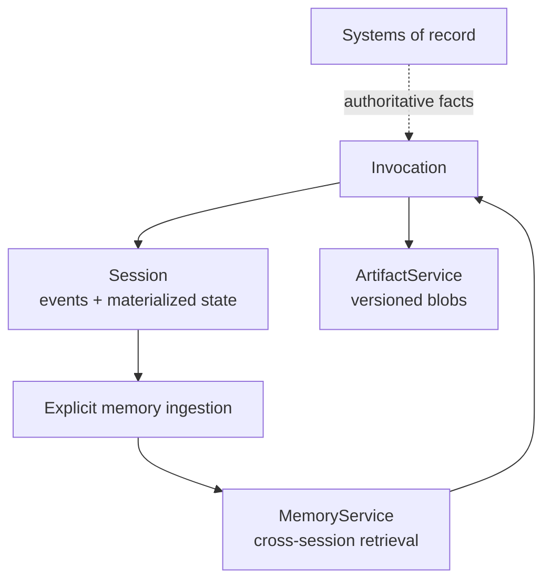

# Sessions, State, Artifacts, and Memory

## Four different data planes

ADK deliberately separates conversation history, working state, binary artifacts, and long-term searchable memory. Collapsing them into one store produces retention, scale, and correctness problems.



| Plane | Key/identity | Good for | Not good for |
|---|---|---|---|
| Session | `(app_name, user_id, session_id)` | Ordered events and conversation-local state | Cross-tenant identity, large files, business source of truth |
| State | Scoped keys materialized from event deltas | Small dynamic workflow/agent facts | Unbounded transcript copies, arbitrary objects, secrets |
| Artifact | Filename plus version, session- or user-scoped | Files, images, reports, large outputs | Queryable semantic memory |
| Memory | Service-specific corpus/retrieval identity | Cross-session recall | Transactional state or automatic truth |

## Sessions

A session groups events for one application, user, and conversation/workflow ID. Its identity is security-sensitive: the API layer must derive `user_id` and tenant scope from authenticated context, not accept arbitrary client values.

### Service choices

| Service | Persistence | Production position |
|---|---|---|
| `InMemorySessionService` | Process memory only | Tests and local development |
| `DatabaseSessionService` | SQL database | Application-operated persistence where supported |
| `VertexAiSessionService` | Managed Agent Runtime service | Google Cloud production path with service-specific API behavior |
| Community/custom service | Implementation-specific | Adopt only with explicit event-ordering, locking, schema, retention, and failure tests |

Python and Go document `DatabaseSessionService`; availability differs across other SDKs. Python requires async database drivers. PostgreSQL, MySQL, and MariaDB paths use row-level locking in addition to in-process same-session append locks; SQLite does not become a multi-replica coordination service.

Locking protects storage integrity. It does not define the semantic result of two simultaneous user turns that both read old state and invoke tools. Serialize or reject same-session turns at admission.

## State scopes

ADK state prefixes define scope:

| Prefix | Scope | Typical content |
|---|---|---|
| none | Current session | Workflow phase, collected fields, compact conversation facts |
| `user:` | User across sessions in one app | Stable preferences with explicit retention |
| `app:` | All users/sessions in the app | Small configuration/reference data, rarely mutated |
| `temp:` | Current invocation only | Intermediate tool coordination that must not persist |

Use flat, namespaced, serializable keys, for example `checkout.shipping_country` rather than a deeply nested mutable object. Include a schema/version key for long-lived data.

### Correct mutation path

Modify state through `CallbackContext`, `ToolContext`, an agent `output_key`, or an explicit `EventActions.state_delta`. Do not modify a `Session` object fetched from `SessionService` and expect persistence. Direct mutation bypasses the event history, timestamping, locking, and append path.

This rule is essential for auditability and rehydration:

```text
context state write -> event state_delta -> SessionService.append_event -> materialized state
```

Some managed service APIs do not expose user-scoped state independently of a session. Do not design a cross-session user profile around a generic state API without testing the selected service.

## Artifacts

Artifacts are versioned payloads. Saving returns a version; loading without a version commonly selects the latest. A `user:` filename prefix changes scope from session to user where supported.

Production rules:

- use object storage or another durable service, not in-memory artifacts;
- record content type, size, checksum, creator invocation, tenant, classification, and retention class;
- use generated internal object names and sanitized display names;
- scan untrusted uploads before model/tool use;
- authorize each read by tenant, user, session, and purpose;
- avoid “latest” for replay-critical reads—persist the exact version;
- make publication atomic or use a pending/ready state.

ADK Python 2.8.0 included an atomic artifact-publication fix. That is a reminder to test crash boundaries and concurrent readers on the exact artifact service/version.

## Memory

Memory is explicit retrieval, not an automatic property of sessions. ADK documents in-memory search plus Google Cloud Memory Bank and RAG-backed options. Their semantics differ:

- **Memory Bank** can use a model to extract and consolidate memories from session events and supports direct ingestion.
- **RAG memory** stores/retrieves transcript-like content through retrieval infrastructure.
- **In-memory memory** is useful for tests, not durable production recall.

ADK's `add_session_to_memory` can trigger an asynchronous long-running operation rather than wait for extraction. A session object may also omit events unless refetched appropriately. Therefore, “invocation completed” does not imply “new memory is searchable.” Track ingestion state, retry safely, and expose freshness.

### Memory safety

Retrieved memory is untrusted, potentially stale model input. Store provenance, event/session origin, creation/update time, extraction version, and tenant/user scope. Before a consequential action, re-read authoritative systems.

Support:

- user inspection and deletion where required;
- TTL and purpose limitation;
- tenant-scoped retrieval filters;
- poisoning evaluation;
- extraction and consolidation version migration;
- tombstones or rebuilds after deletion;
- retrieval budgets and relevance thresholds.

## Data ownership pattern

| Data | Authoritative home | ADK representation |
|---|---|---|
| Account balance | Financial system | Fresh tool result; optional short-lived `temp:` cache |
| Shipping address | Customer system | Resource ID and validated snapshot, not sole copy |
| Current conversation phase | Session state | Session-scoped key through event delta |
| Generated report | Artifact store | Exact artifact name/version/checksum |
| User writing preference | Profile service or governed user state | `user:` state/memory with consent and TTL |
| Approval decision | Authorization/audit store | Authenticated decision ID linked to interruption |

## Migration and retention

Session database schemas can change; Python v1.22.0 introduced a documented migration. Treat schema migration as a deployment project:

1. inventory event/state size and unsupported values;
2. back up and rehearse on production-like data;
3. stop or version-gate writers;
4. migrate and verify counts/order/materialized state;
5. run replay/resume conformance tests;
6. keep a rollback/read-old strategy.

Define retention separately for session events, state, artifacts, memory, telemetry, and provider logs. Deleting a session does not automatically prove derived memory, exported traces, or artifacts disappeared.

## Production checklist

- [ ] Session IDs are opaque, authenticated, tenant-scoped, and non-reusable across users.
- [ ] Same-session turns have one admission-control policy.
- [ ] State writes flow through event deltas.
- [ ] Every persistent state key has owner, schema, scope, retention, and size limit.
- [ ] Artifact reads pin versions when reproducibility matters.
- [ ] Memory ingestion completion and freshness are observable.
- [ ] Retrieval is tenant-filtered and treated as untrusted input.
- [ ] Backup, migration, deletion, and restore are tested across every data plane.

## Primary sources

- [Sessions](https://adk.dev/sessions/session/)
- [State](https://adk.dev/sessions/state/)
- [Events](https://adk.dev/events/)
- [Artifacts](https://adk.dev/artifacts/)
- [Memory](https://adk.dev/sessions/memory/)
- [Memory Bank setup](https://docs.cloud.google.com/gemini-enterprise-agent-platform/scale/memory-bank/setup)
- [Memory Bank troubleshooting](https://docs.cloud.google.com/gemini-enterprise-agent-platform/troubleshooting/memory-bank)
- [Python database session service implementation](https://github.com/google/adk-python/blob/main/src/google/adk/sessions/database_session_service.py)
