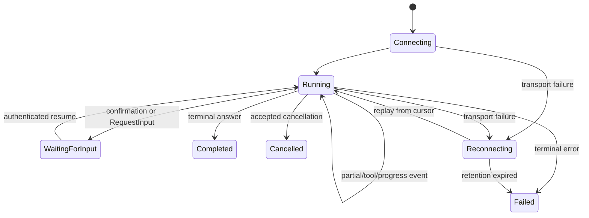

# Streaming, Live Events, and Frontends

## Three modes, different contracts

`RunConfig` distinguishes non-streaming-style event delivery, server-sent model output, and bidirectional live operation. Names and language support vary, but the architectural split is:

| Mode | Direction | Use | Main operational risk |
|---|---|---|---|
| `NONE` | Request plus event iterator | Ordinary agent turns where token deltas are unnecessary | Long request timeout and poor progress visibility |
| `SSE` | Server to client incremental output | Text streaming and tool progress | Disconnect/reconnect, buffering, duplicate display |
| `BIDI` / live | Concurrent input and output | Voice, audio/video, interruption, real-time tools | Session affinity, media backpressure, cancellation, provider-specific behavior |

Bidirectional live execution uses a live runner path rather than ordinary `run_async`. The graph and live-run documentation describe separate surfaces and do not establish a uniform graph-plus-live contract across languages. Test the actual agent/workflow/model combination instead of selecting a transport flag by assumption.

## Events are the product protocol input

An ADK event may be partial text, a final content message, a tool call, a tool response, a state/artifact delta, an agent transfer, an interruption request, or an error-related record. Build a stable application protocol over these events.

Example envelope:

```json
{
  "protocol_version": 1,
  "session_id": "opaque-session",
  "invocation_id": "invocation-123",
  "sequence": 42,
  "event_id": "adk-event-id",
  "type": "text_delta",
  "agent": "researcher",
  "payload": {"text": "partial"},
  "terminal": false
}
```

Do not expose the raw SDK object as the long-lived public API. Normalize it so SDK upgrades do not silently change clients, while retaining the original event in protected logs when needed.

## Frontend state machine



The UI should distinguish transport loss from invocation failure. A broken SSE connection does not prove the model/tool stopped.

## Ordering and deduplication

Assign an application sequence number only after the event is durably accepted for delivery. Preserve ADK `event_id` and `invocation_id`; use them for deduplication, not presentation order across unrelated invocations.

For reconnect:

1. client sends the last acknowledged cursor;
2. server authorizes the session/invocation;
3. server replays retained application envelopes after the cursor;
4. live delivery continues without overlap;
5. if retention expired, server returns an explicit resync-required status.

Do not ask the agent to regenerate lost text. Regeneration can differ and may repeat tools.

## Backpressure

Slow clients can retain model chunks, tool output, audio frames, and artifacts in memory. Bound:

- per-connection buffered events/bytes;
- per-tenant active streams;
- output rate and event size;
- audio/video frame queues;
- artifact references rather than inline blobs;
- time without client acknowledgement.

Coalesce text deltas for UI efficiency, but never coalesce away tool, interruption, error, or terminal boundaries. If delivery must outlive the connection, persist it in a separate outbox/stream service rather than relying on an in-process generator.

## Cancellation and disconnect

At the research snapshot, the dedicated cancellation guide documents an `AbortSignal` path for TypeScript and describes cancellation as non-destructive: already committed events remain. Python has an open feature request for a supported external cancellation contract for standard `run_async`.

Therefore define separate states:

- **client disconnected:** transport ended;
- **cancellation requested:** application asked the run to stop;
- **cancellation acknowledged:** runtime stopped scheduling new work;
- **provider/tool termination confirmed:** active remote/local work ended;
- **cancelled terminal record committed:** consumers can stop waiting.

A cancelled task may have completed an external effect. Reconcile effects independently.

## Live multimodal concerns

Live sessions add:

- turn detection and interruption semantics;
- audio/video codec and frame-size limits;
- half-open connections and heartbeat policy;
- session affinity or externalized connection state;
- ephemeral credentials and model-specific auth;
- transcript consent and retention;
- tool calls racing with user interruption;
- prompt/audio injection and unsafe output handling.

Keep the media plane separate from durable business events. Store references/checksums rather than raw media in session state.

## Error protocol

Never send raw exception text by default. Return a stable error code, retryability, terminal flag, and correlation ID. Keep provider/tool details in access-controlled telemetry.

Classify at least:

- authentication/authorization failure;
- quota/rate limit;
- model blocked/refused;
- tool validation/authorization/downstream failure;
- session conflict;
- deadline/cancellation;
- stream retention expired;
- internal compatibility failure.

## Production checklist

- [ ] The public stream envelope is versioned separately from ADK objects.
- [ ] Partial, final, tool, interruption, error, and terminal events are distinct.
- [ ] Reconnect uses durable cursors and deduplication.
- [ ] Disconnect and cancellation are separate states.
- [ ] Backpressure is bounded per stream and tenant.
- [ ] Live media has consent, retention, size, heartbeat, and interruption policies.
- [ ] Tool effects remain reconcilable after disconnect/cancel.
- [ ] The exact language/model/workflow streaming combination is tested.

## Primary sources

- [Events](https://adk.dev/events/)
- [Run configuration](https://adk.dev/runtime/runconfig/)
- [Streaming development guide](https://adk.dev/streaming/dev-guide/part1/)
- [Runtime cancellation](https://adk.dev/runtime/cancel/)
- [Runtime resume](https://adk.dev/runtime/resume/)
- [Graph workflow limitations](https://adk.dev/graphs/)
- [Open Python cancellation request #4796](https://github.com/google/adk-python/issues/4796)
