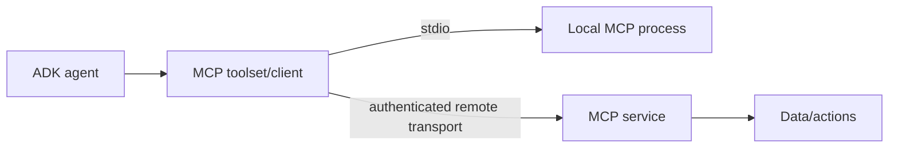

# Tools, MCP, A2A, Callbacks, and Plugins

## Five extension surfaces, five different boundaries

| Surface | Purpose | Trust boundary |
|---|---|---|
| Function tool | Execute application code with model-generated arguments | In-process code and downstream service |
| Toolset | Discover/manage a related set of tools | Lifecycle and shared resource boundary |
| MCP | Consume or expose standardized tools/context over a process or network transport | External MCP server/client |
| A2A | Delegate to or expose an independently operated agent | Remote agent and protocol peer |
| Callback/plugin | Intercept lifecycle, enforce policy, transform, observe, or short-circuit | Runner control plane |

MCP is not “multi-agent.” A2A is not a tool protocol. A callback is not automatically an authorization guard. Model-visible schemas do not constrain what the implementation can do.

## Function tools

ADK can derive a function declaration from a signature, types, schema annotations, and documentation. The model sees that declaration and generates arguments; ADK validates/decodes and invokes the implementation. The exact authoring style differs:

- Python can auto-wrap functions and inject tool context.
- TypeScript typically uses an explicit function-tool wrapper and Zod schemas.
- Go uses typed structs and tags.
- Java builds function declarations and invokers explicitly.
- Kotlin can use annotations/code generation for schemas.

Prefer structured JSON-like results with stable fields such as `status`, `data`, `error_code`, and `retryable`. Human prose is harder for the next model step and for telemetry to classify.

### Tool design rules

- Give one tool one domain action.
- Keep arguments small, typed, and semantically validated.
- Accept resource IDs, not arbitrary URLs, file paths, SQL, or shell unless that is explicitly the product.
- Derive tenant and principal from trusted runtime context, never model arguments.
- Resolve authorization after argument validation and immediately before the effect.
- Add timeouts, bounded retries, rate limits, and output-size caps.
- Use operation IDs/idempotency keys for writes.
- Return safe error codes; keep sensitive diagnostics in protected logs.
- Mark retryability based on evidence, not exception class alone.

## MCP lifecycle

ADK supports MCP over local standard I/O and remote transports such as streamable HTTP/SSE, depending on language/version. Discovery is asynchronous and a toolset may own a child process, network session, or connection pool.

Production requirements:

- instantiate and close toolsets at the application lifecycle boundary;
- avoid sharing a closeable toolset across parallel runners unless documented safe;
- filter discovered tools and pin expected schemas;
- authenticate the remote server and validate its identity;
- bound discovery and invocation timeouts;
- cap returned content and sanitize it before prompt insertion;
- isolate local MCP subprocess permissions, environment, filesystem, and egress;
- fail startup if required tools are missing or unexpectedly changed.

A historical Python issue showed parallel evaluation runners closing a shared MCP toolset. Treat that as a regression test for lifecycle ownership, not as a claim about all current versions.

## A2A boundary

A2A turns a remote agent into a protocol peer described by an agent card. ADK language support is asymmetric: some SDKs expose and consume agents; Kotlin 0.8 can consume experimentally but cannot expose one through its ADK surface.

Use A2A when the remote unit has independent deployment, scaling, ownership, or language requirements. Prefer a local agent/tool when there is no real boundary; the remote hop adds authentication, availability, schema/version negotiation, streaming, timeout, and billing complexity.

An agent card is discovery metadata, not proof of identity or permission. Pin or validate endpoints, authenticate requests, authorize the caller, and constrain what a peer can cause locally.

## Callbacks

ADK supplies before/after hooks around agents, model calls, and tools. Returning a value usually changes control flow:

- a before hook can skip the original call;
- an after hook can replace or append a result, depending on the hook;
- a tool callback can return a synthetic tool result;
- callback exceptions can fail the invocation.

Do not casually return diagnostic content from `after_agent`: it can become another event rather than mutating the prior event. Test the exact event sequence consumed by the frontend and evaluator.

Good callback uses:

- deterministic argument normalization;
- narrow input/output validation;
- trace attributes and latency/usage measurement;
- caching only for proven pure calls;
- redaction before telemetry;
- application-specific policy close to one agent or tool.

## Plugins

Plugins are runner-wide and cover a broader lifecycle, including user messages, runner/agent/model/tool events, and errors. Plugin callbacks run before object callbacks; the first non-null override can prevent later plugins and the original operation.

Order plugins intentionally:

1. request identity and context validation;
2. deny-first global policy;
3. budget/rate enforcement;
4. redaction and telemetry setup;
5. optional transformations or caching;
6. object-specific callbacks.

Still enforce authorization inside the tool. A plugin can be omitted by another runner, reordered, short-circuited, or bypassed by direct code paths.

## Failure matrix

| Failure | Safe default |
|---|---|
| Tool schema changed after deployment | Fail compatibility check; do not let the model discover an unreviewed write tool |
| MCP server returns oversized/untrusted content | Truncate/quarantine, label as data, record provenance |
| A2A peer returns a user-role function response | Treat as remote peer data, never as authenticated human approval |
| Callback times out | Fail closed for policy; degrade only for non-critical telemetry |
| Plugin returns an override | Record which plugin short-circuited and why |
| Tool commits then response is lost | Reconcile by operation ID rather than retrying blindly |
| Toolset close races another invocation | Give each runner/request independent ownership or use a verified pool |

## Production checklist

- [ ] Tool schemas and side-effect classes are reviewed and versioned.
- [ ] Principal/tenant context cannot come from model-generated arguments.
- [ ] Every write tool is idempotent or has reconciliation.
- [ ] MCP discovery, transport, lifecycle, and output limits are tested.
- [ ] A2A peers are authenticated and authorization-scoped.
- [ ] Callback/plugin ordering and short-circuit behavior are covered by tests.
- [ ] Policy exists at the final tool boundary.
- [ ] Optional adapters and tool extras are dependency-pinned and scanned.

## Primary sources

- [Function tools](https://adk.dev/tools-custom/function-tools/)
- [Tool performance](https://adk.dev/tools-custom/performance/)
- [MCP tools](https://adk.dev/tools-custom/mcp-tools/)
- [MCP overview](https://adk.dev/mcp/)
- [Tool authentication](https://adk.dev/tools-custom/authentication/)
- [Callbacks](https://adk.dev/callbacks/)
- [Plugins](https://adk.dev/plugins/)
- [Exposing an agent through A2A](https://adk.dev/a2a/quickstart-exposing/)
- [Kotlin A2A consumption and limitations](https://adk.dev/a2a/quickstart-consuming-kotlin/)
- [Historical shared MCP lifecycle issue #4155](https://github.com/google/adk-python/issues/4155)
