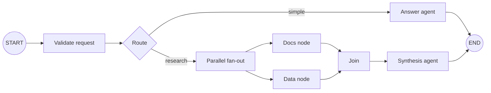

# Workflows, Graphs, Parallelism, and Loops

## ADK has two orchestration generations

ADK 1-style workflow agents remain widely available:

- `SequentialAgent` runs sub-agents in order;
- `ParallelAgent` runs branches concurrently;
- `LoopAgent` repeats a sub-agent sequence until escalation or a limit;
- custom agents implement control flow in code.

ADK 2 adds a `Workflow` graph surface in Python, Go, and TypeScript. Python and Go have GA ADK 2 lines; TypeScript 2.0 exposes the node/graph architecture but still marks `Workflow` experimental, and its template workflow classes are deprecated rather than immediately removed. Java and Kotlin remain on their own 1.x/pre-1.0 surfaces.

Do not mechanically rewrite stable template workflows. Migrate when graph routing, joins, replay, dynamic nodes, or human-input nodes materially improve the design and the target language is ready.

## Graph model

An ADK 2 workflow connects nodes with edges. Nodes can wrap agents, tools/functions, or nested workflows. Edges may be unconditional, conditional routes, parallel branches with joins, or dynamic scheduling.

Static graph scheduling creates runner tasks for ready nodes. Rehydration scans session events, reconstructs completed node executions, and deterministically replays scheduling up to an interruption. Dynamic `ctx.run_node` allows runtime-selected nodes while preserving workflow supervision.

Always await `ctx.run_node`. The Python context documentation warns that starting it through bare `asyncio.create_task()` is unsupervised: errors can be swallowed and parent cancellation does not reliably cancel it.

## Determinism boundary

The scheduler should be deterministic from persisted workflow inputs and events. Nodes can still call non-deterministic models, clocks, random generators, and external services. Persist the result needed for replay rather than silently recomputing it.

Classify node work:

| Node type | Replay strategy |
|---|---|
| Pure function | Safe to recompute if version is pinned |
| Model call | Prefer persisted event/output; retry under a bounded policy |
| Read-only query | Re-read only if freshness is intended and recorded |
| External write | Operation ID + idempotent commit + reconciliation |
| Human input | Persist interruption identity and authenticated response |
| Time/random | Inject and persist chosen value |

## State and data flow

Use explicit node input/output and small state keys. Avoid hidden mutable globals. Parallel branches should write distinct keys or feed a join node that owns the merge.

ADK graph data handling supports fan-out/fan-in patterns, but an orchestration join is not a distributed transaction. If one branch commits an external effect and another fails, define compensation or reconciliation explicitly.

### Route design

- Use deterministic conditions when validated state is enough.
- Restrict route labels to a closed set.
- Define behavior for missing/unknown routes.
- Persist the routing decision if later replay must not reclassify.
- Keep model routers separate from effecting nodes.

## Parallelism

Parallelism helps only when branches are independent and downstream capacity exists. Model/provider rate limits, tool pools, session writes, and stream consumers are shared bottlenecks.

Set limits for:

- graph-wide concurrency;
- per-model/provider calls;
- per-tool and downstream service;
- per-tenant work;
- join wait time;
- branch output size;
- total token/cost budget.

Structured concurrency requires a clear parent-child relationship: cancel or drain siblings when the parent fails, collect all branch failures, and close resources only after users finish. The ADK 2.8.0 release includes fixes around parallel sub-agent error handling, which reinforces the need for version-specific fan-out tests.

## Loops

Every loop must have more than a maximum iteration count. Define:

- a measurable progress predicate;
- a terminal success condition;
- non-retryable failure conditions;
- per-iteration and total budgets;
- duplicate-effect protection;
- operator-visible reason for exit;
- a dead-letter or human-escalation path.

Model self-critique is not a reliable progress signal by itself. Track deterministic state such as unresolved validation errors, remaining items, or an external job status.

## Dynamic workflows

Dynamic nodes are justified when the exact branch set depends on runtime data, such as a validated list of accounts. They are not a license to let model output create arbitrary code or tool authority.

Validate dynamic node identifiers and inputs, cap fan-out, record the generated topology, and keep node implementations pre-registered. When topology itself is model-generated, require a deterministic compiler/validator before execution.

## Rehydration and upgrade risk

Rehydration depends on event shapes, invocation isolation, node paths, graph topology, and workflow implementation. A closed Python 2.5.0 issue reproduced prior-invocation events contaminating a later HITL resume; current releases include related replay/function-response fixes. Use the reproduction as a permanent upgrade test:

1. complete one invocation in a persistent session;
2. start a second invocation that interrupts after an LLM node;
3. restart or create a new runner;
4. resume the exact interruption;
5. assert no earlier invocation is replayed or awaited.

Pin graph and node schema versions with pending runs. Prefer draining old interrupted executions before an incompatible deployment. If that is impossible, keep a version-routed worker or a migration adapter.

## Known scope limitations

The current graph documentation warns that some third-party integrations may be incompatible. Streaming/live, deployment, and resume surfaces also vary by language and mode. Do not infer that a feature available to `LlmAgent` works inside every graph node or execution path; test each required composition.

## Production checklist

- [ ] The workflow surface is supported and mature in the selected language/version.
- [ ] Each node is classified as pure, read, model, effect, or interruption.
- [ ] Parallel branches have independent state/effects and bounded concurrency.
- [ ] Joins define partial-failure behavior.
- [ ] Loops have progress, budgets, and effect deduplication.
- [ ] Dynamic topology is validated and capped.
- [ ] Workflow/node/event schema versions are durable metadata.
- [ ] Cross-invocation resume and rolling-upgrade tests pass on persistent storage.

## Primary sources

- [ADK 2 graph workflows](https://adk.dev/graphs/)
- [Routes](https://adk.dev/graphs/routes/)
- [Graph data handling](https://adk.dev/graphs/data-handling/)
- [Dynamic workflows](https://adk.dev/graphs/dynamic/)
- [Collaborative workflows](https://adk.dev/workflows/collaboration/)
- [Sequential agents](https://adk.dev/agents/workflow-agents/sequential-agents/)
- [Parallel agents](https://adk.dev/agents/workflow-agents/parallel-agents/)
- [Custom agents](https://adk.dev/agents/custom-agents/)
- [Python workflow implementation guide](https://github.com/google/adk-python/blob/main/docs/guides/workflow/workflow/index.md)
- [Python workflow context](https://github.com/google/adk-python/blob/main/src/google/adk/agents/context.py)
- [Bounded replay regression #6497](https://github.com/google/adk-python/issues/6497)
