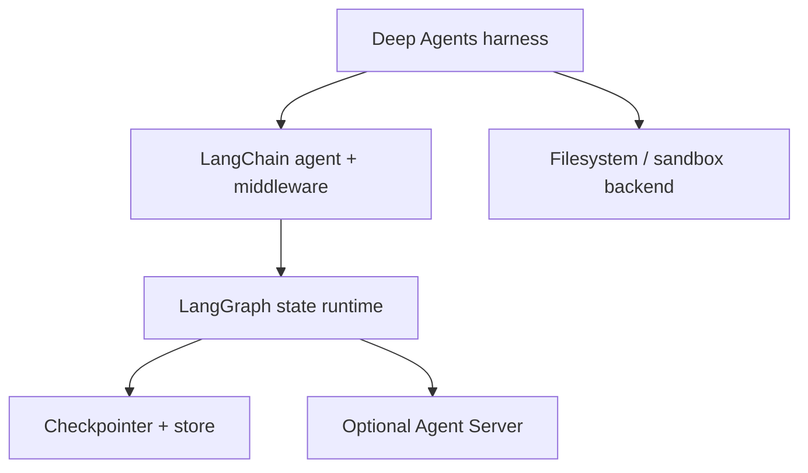
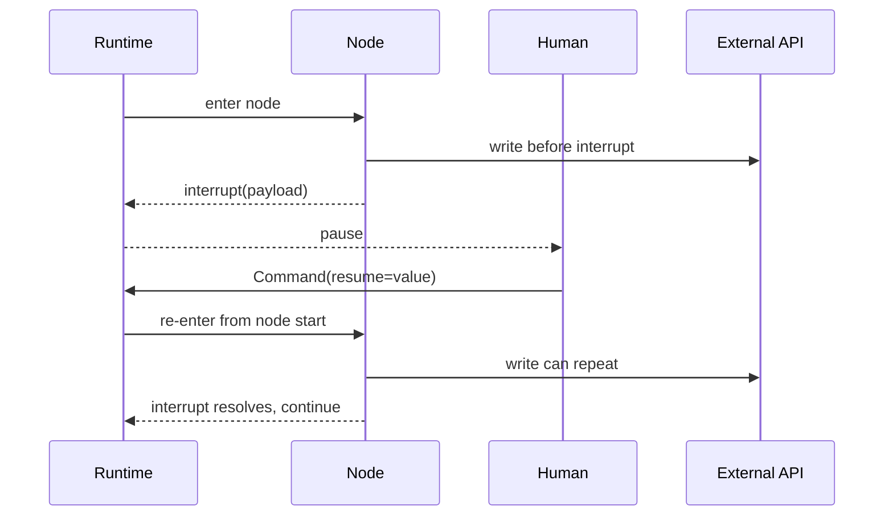
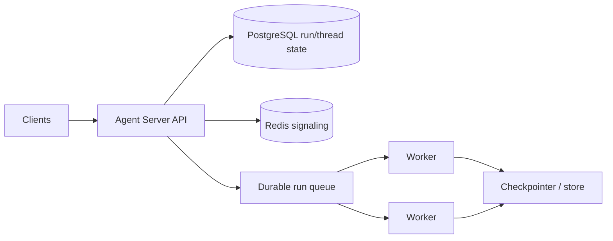

# LangChain, LangGraph, and Deep Agents in Production

**Research date:** 2026-08-31  
**Status:** Research-backed technology guide  
**Scope:** Current Python documentation and deployment surfaces; verify package, server, and persistence versions before adoption

## Bottom line

Use **LangGraph** when explicit state, transitions, interrupts, checkpoint inspection, replay, and subgraphs are core requirements. Add **LangChain agents** when their middleware and integration layer removes useful plumbing. Choose **Deep Agents** when you deliberately want an opinionated filesystem, planning, memory, sandbox, and subagent harness.

They are layers, not three interchangeable frameworks:

Keep authorization, external-effect identity, durable business state, and hard containment outside the model-facing convenience layer.

## Choose the thinnest useful layer

| Need | Start with | Avoid |
|---|---|---|
| Explicit nodes, reducers, branches, pause/resume | LangGraph Graph API | Hiding domain transitions inside generic middleware |
| Ordinary-looking functions with checkpointed tasks | LangGraph Functional API | Assuming ordinary syntax removes replay rules |
| Model/tool agent with dynamic model/tools and middleware | LangChain `create_agent` | Adding a custom graph before a concrete need |
| Plans, files, context offload, subagents, shell work | Deep Agents | Treating harness defaults as a security architecture |
| Managed queue, runs, threads, API/workers | Agent Server | Treating it as merely a hosted checkpointer |

The Graph and Functional APIs share the runtime. Select based on readability and control, not an assumed durability difference.

## Checkpoint and replay semantics

LangGraph organizes checkpoints by thread and saves graph state at step or superstep boundaries. In parallel supersteps, successful node writes can be retained as pending writes when a sibling fails. That prevents unnecessary re-execution of successful peers, but it does not make external effects exactly once.

An interrupted node restarts from the beginning on resume until it reaches the matching `interrupt()`. Therefore:

- put pure computation before the interrupt;
- move non-idempotent effects after an approval, or give them a stable operation ID;
- keep interrupt order stable inside a node;
- serialize interrupt payloads and resume values safely;
- revalidate authorization, resource version, and expiry on resume.

Time travel forks from an earlier checkpoint and re-executes later nodes. Model calls, APIs, interrupts, and nondeterministic code can all run again. Use it for debugging and controlled branching, not as a free rollback of the external world.

## Subgraphs and concurrency

Choose subgraph persistence deliberately:

| Mode | Use | Risk |
|---|---|---|
| Per invocation | Independent specialist execution | Internal detail may be one parent step at parent checkpoint granularity |
| Per thread | Multi-turn specialist memory | Namespace and concurrent-call conflicts |
| Stateless | Pure reusable transformation | No native continuity |

Do not invoke the same stateful subgraph concurrently without proving namespace isolation and merge behavior. Define reducers for concurrent graph writes and keep shared resources behind transactional services.

## Agent Server is a runtime product

Agent Server adds assistants, threads, runs, an API tier, workers, persistent run data, a durable task queue, leases, cancellation signaling, and thread-level run serialization. Current deployment architecture separates PostgreSQL-backed durable state from Redis-backed ephemeral coordination.

Evaluate API and worker scaling independently. Test lease expiry, worker death, duplicate delivery, cancellation races, same-thread admission, database recovery, Redis loss, migrations, retention, and observability. Self-hosted LangGraph plus a checkpointer does not automatically inherit these service semantics.

## Deep Agents security and memory

Deep Agents adds planning, virtual files, context offload, summarization, subagents, memory files, and sandbox command execution. Backends may route paths to graph state, persistent stores, local files, or external sandboxes.

Current documentation/source makes an important distinction: built-in filesystem permission middleware checks built-in tool operations, while direct backend access or another execution path may not pass through the same rule. Rules are ordered/first-match and may default to allow; subagent policies may replace rather than intersect parent policy.

Use this defense stack:

1. authorize the tenant and resource in application code;
2. issue scoped, short-lived credentials;
3. enforce filesystem, process, network, and secret boundaries in the sandbox/backend;
4. use built-in permission middleware as additional policy;
5. audit every read/write/execute decision and artifact.

Writable memory needs separate governance. Keep human-owned instructions immutable to the agent. Put agent-authored memory in a distinct namespace with ownership, size and context budgets, schema validation, optimistic concurrency, review, provenance, retention, and rollback. Do not load an ever-growing shared file into every prompt.

## Operational acceptance tests

- [ ] Resume every interrupt after a fresh process and deployment version.
- [ ] Crash each parallel node before and after its state write and external effect.
- [ ] Fork/time-travel a run and confirm which model calls and effects repeat.
- [ ] Run concurrent calls against every stateful subgraph and same thread.
- [ ] Replay the oldest supported checkpoint after schema/package migration.
- [ ] Verify reducer behavior with reordered concurrent writes.
- [ ] Kill an Agent Server worker after lease acquisition and during result commit.
- [ ] Bypass built-in Deep Agents tools and confirm the sandbox/backend still denies access.
- [ ] Attempt subagent privilege expansion and cross-tenant memory/file access.
- [ ] Measure context growth from plans, files, summaries, subagents, and memory.
- [ ] Bound graph steps, recursion, subagents, concurrency, tokens, cost, and wall time.

## Choose it when

- inspectable workflow state and pause/replay are first-class product requirements;
- the team will design nodes around deterministic replay and idempotent effects;
- LangChain middleware or Deep Agents harness components remove known work;
- the selected persistence and deployment tier meets recovery and compliance needs.

## Prefer another shape when

- one or two model/tool calls suffice: use a thin custom loop;
- Python type validation is the central differentiator: compare Pydantic AI;
- TypeScript UI streaming is central: compare Vercel AI SDK;
- the business process needs stronger schedules, compensation, and years-long engine guarantees: invoke agents from a durable workflow engine;
- hard workspace isolation is the main problem: select and validate the sandbox before the harness.

## Primary sources and failure-test leads

- [LangGraph persistence](https://docs.langchain.com/oss/python/langgraph/persistence), [interrupts](https://docs.langchain.com/oss/python/langgraph/interrupts), [time travel](https://docs.langchain.com/oss/python/langgraph/use-time-travel), [subgraphs](https://docs.langchain.com/oss/python/langgraph/use-subgraphs), and [Functional API](https://docs.langchain.com/oss/python/langgraph/functional-api)
- [LangChain agents](https://docs.langchain.com/oss/python/langchain/agents)
- [Agent Server](https://docs.langchain.com/langsmith/agent-server), [deployment](https://docs.langchain.com/langsmith/deployment), and [scaling](https://docs.langchain.com/langsmith/agent-server-scale)
- [Deep Agents overview](https://docs.langchain.com/oss/python/deepagents/overview), [subagents](https://docs.langchain.com/oss/python/deepagents/subagents), and [memory](https://docs.langchain.com/oss/python/deepagents/memory)
- Adoption tests from [parallel interrupt IDs issue #6626](https://github.com/langchain-ai/langgraph/issues/6626) and [memory ownership/context budget issue #5720](https://github.com/langchain-ai/deepagents/issues/5720)

See [independent framework selection](../comparisons/independent-agent-frameworks.md) and the [research packet](../research/packets/independent-agent-frameworks.md).
