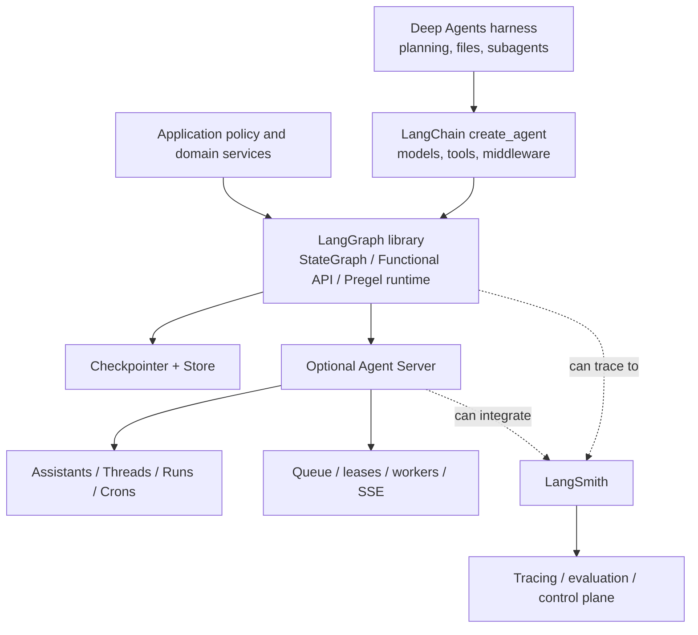

# LangGraph Production Playbook

**Research date:** 2026-08-31
**Status:** Deep, research-backed guide cluster
**Primary scope:** LangGraph Python 1.2.x, especially 1.2.11; verify package and service versions before adoption
**Secondary scope:** Shared concepts in LangGraph.js; do not infer language parity without a conformance test

## Bottom line

LangGraph is most useful when state transitions, pause/resume, checkpoint inspection, replay, and nested workflows are part of the product contract. It is a low-level orchestration runtime, not a model provider, a complete agent harness, a security boundary, or an exactly-once workflow engine.

The names around it describe different layers:

Every production design should state which boxes it actually operates. A locally compiled graph with PostgreSQL checkpointing does not gain Agent Server queue semantics. An Agent Server deployment does not automatically make a tool effect exactly once. LangSmith tracing does not authorize a tool call.

## Reading paths

| Goal | Start here | Continue with |
|---|---|---|
| Understand what the runtime does | [Runtime mental model](runtime-mental-model.md) | [State, graphs, nodes, and reducers](state-graphs-nodes-and-reducers.md) |
| Add persistence or approval | [Persistence, checkpoints, and threads](persistence-checkpoints-and-threads.md) | [Interrupts and resume](interrupts-human-in-the-loop-and-resume.md), [durability and effects](durability-replay-and-effects.md) |
| Build nested or multi-agent systems | [Subgraphs and multi-agent composition](subgraphs-and-multi-agent-composition.md) | [Models, tools, context, and memory](models-tools-context-and-memory.md) |
| Build a streaming product | [Streaming and event protocols](streaming-events-and-frontends.md) | [Agent Server operations](agent-server-deployment-and-operations.md) |
| Ship and operate | [Testing, debugging, observability, and evaluation](testing-debugging-observability-and-evaluation.md) | [Security and multi-tenancy](security-and-multi-tenancy.md), [failure modes and migrations](failure-modes-migrations-and-versioning.md) |
| Decide whether to adopt | [Ecosystem boundaries](ecosystem-boundaries.md) | [Selection and alternatives](selection-and-alternatives.md) |

## Guide map

1. [Ecosystem boundaries](ecosystem-boundaries.md)
2. [Runtime mental model](runtime-mental-model.md)
3. [State, graphs, nodes, and reducers](state-graphs-nodes-and-reducers.md)
4. [Persistence, checkpoints, and threads](persistence-checkpoints-and-threads.md)
5. [Interrupts, human review, and resume](interrupts-human-in-the-loop-and-resume.md)
6. [Streaming, event protocols, and frontends](streaming-events-and-frontends.md)
7. [Subgraphs and multi-agent composition](subgraphs-and-multi-agent-composition.md)
8. [Models, tools, runtime context, and memory](models-tools-context-and-memory.md)
9. [Durability, replay, and external effects](durability-replay-and-effects.md)
10. [Agent Server deployment and operations](agent-server-deployment-and-operations.md)
11. [Testing, debugging, observability, and evaluation](testing-debugging-observability-and-evaluation.md)
12. [Security and multi-tenancy](security-and-multi-tenancy.md)
13. [Failure modes, migrations, and versioning](failure-modes-migrations-and-versioning.md)
14. [Selection and alternatives](selection-and-alternatives.md)

The evidence ledger and unresolved questions are in the [deep-dive research packet](../../research/packets/langgraph-deep-dive.md).

## Production invariants

- Graph state is recoverable orchestration state, not the source of truth for money, inventory, permissions, or other domain records.
- The application-owned [state and event contract](../../runtime/agent-state-and-event-contracts.md) remains canonical across LangGraph, queues, transports, and framework replacement.
- A checkpoint proves that LangGraph persisted a state transition; it does not prove an external system did or did not commit an effect.
- A node can run again after an interrupt, retry, crash, replay, migration, or operator action.
- Every state key written by parallel nodes has an intentional reducer or is exclusive to one writer.
- The same stable thread ID is used only for one authorized logical conversation or workflow.
- Interrupt payloads and resume values are versioned, JSON-safe, authenticated, authorized, expiring application messages.
- Model output and checkpoint data are untrusted at every execution and deserialization boundary.
- Limits cover supersteps, wall time, model calls, tool calls, concurrency, queued work, tokens, cost, state size, stream backlog, and retained history.
- Deployment, package, graph, prompt, model, tool schema, and policy versions are visible in traces and state.

## Snapshot and refresh triggers

The Python core release checked for this cluster was `langgraph==1.2.11` (released 2026-08-11). The Python SDK release checked was `langgraph-sdk==0.4.4` (released 2026-08-27). The package family is independently versioned; pin and test the core, checkpoint saver, SDK, CLI/server image, LangChain integrations, and LangSmith deployment surfaces as a set.

Refresh this cluster when any of these change:

- checkpoint, pending-write, durability-mode, replay, interrupt, or subgraph namespace semantics;
- stream protocol defaults, v2/v3 stabilization, reconnect behavior, or frontend hook contracts;
- Agent Server run serialization, lease, cancellation, queue, Redis, PostgreSQL, retention, or deployment topology;
- graph migration and backward-compatibility guarantees;
- authentication, authorization, encryption, serializer, or store namespace advisories;
- a new LangGraph, checkpoint, SDK, or Agent Server major/minor release.

## Primary starting sources

- [LangGraph overview](https://docs.langchain.com/oss/python/langgraph/overview)
- [Graph API](https://docs.langchain.com/oss/python/langgraph/graph-api)
- [Persistence](https://docs.langchain.com/oss/python/langgraph/persistence)
- [Interrupts](https://docs.langchain.com/oss/python/langgraph/interrupts)
- [Agent Server](https://docs.langchain.com/langsmith/agent-server)
- [Python releases](https://github.com/langchain-ai/langgraph/releases)
- [Security advisories](https://github.com/langchain-ai/langgraph/security/advisories)
