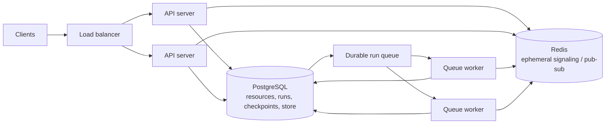

# LangGraph Agent Server Deployment and Operations

**Research date:** 2026-08-31
**Status:** Research-backed deployment guide

## Agent Server is an execution product

Deploying a graph to Agent Server adds an API and worker runtime around the graph. It owns assistants, threads, runs, cron jobs, server-managed persistence, a durable run queue, leases, cancellation signaling, and streaming transport.



This is materially different from calling a compiled graph inside a web request.

## Resource model

| Resource | Operational meaning |
|---|---|
| Graph | Code blueprint loaded by the server |
| Assistant | Graph plus selectable configuration |
| Thread | Serialized state lineage and run admission boundary |
| Run | Queued/executing attempt against an assistant |
| Cron | Scheduled run creation |

The server injects its checkpointer and store. Export a compiled graph for ordinary cases. A factory graph is evaluated per invocation and should be reserved for true per-run graph customization.

## Runtime modes

| Mode | Shape | Use |
|---|---|---|
| Single host | API process also manages queue execution | Development and low traffic |
| Split API/queue | Dedicated API and queue-worker pools | Independent read/write/execution scaling |
| Distributed runtime | Separate orchestration and execution processes | High concurrency and specialized large-scale needs |

At least one queue worker must keep consuming the queue. Official self-hosting guidance warns against scale-to-zero serverless deployment for standalone servers.

## Run lifecycle

1. API server creates a pending durable run.
2. A worker acquires a lease and loads the graph.
3. The worker executes, writes checkpoints, and publishes stream events.
4. API servers forward ephemeral events to connected clients.
5. The worker writes terminal status and releases capacity.

The queue enforces at most one executing run per thread. That prevents simultaneous server runs from racing the same thread, but it does not prevent:

- direct writes to the same domain records from other services;
- an earlier cancelled task completing late;
- two threads acting on the same external resource;
- duplicated effects after worker recovery.

## Capacity model

Official scaling guidance starts with:

```text
available_jobs = queue_workers * N_JOBS_PER_WORKER
steady_throughput ~= available_jobs / average_run_seconds
```

`N_JOBS_PER_WORKER` defaults to 10 in the documented architecture. This is a starting point, not a capacity guarantee. Workers greedily fetch available jobs, so high per-worker concurrency can produce uneven utilization and event-loop contention.

Measure distributions, not averages:

- queued wait p50/p95/p99;
- active run duration and tail;
- CPU/memory per active run;
- checkpoint bytes and latency per step;
- model/tool outbound concurrency;
- stream connections and event bandwidth;
- thread hot spots;
- lease expiry/recovery time;
- Postgres connections, locks, IOPS, WAL, bloat, and restore time;
- Redis memory, reconnects, and pub/sub loss.

## Blocking and resource isolation

Queue workers serve many runs. Synchronous blocking work can stall the event loop. Use true async clients or move bounded blocking work to controlled threads/processes. A thread offload does not create cancellation or resource isolation.

For CPU-heavy parsing, untrusted code, browser automation, or large local models, use a separate worker/service or sandbox with:

- CPU/memory/process limits;
- filesystem and network policy;
- wall deadline;
- kill/reap behavior;
- scoped credentials;
- artifact quotas.

## Persistence topology

PostgreSQL holds assistant/thread/run/cron data and normally checkpoints/store data. Redis holds ephemeral signaling, cancellation, and stream pub/sub. Back up and restore the durable database; do not describe Redis as the run source of truth.

Operational drills:

- PostgreSQL failover during run creation and checkpoint commit;
- Redis restart during active SSE;
- worker death after lease and after external effect;
- API-server rolling replacement with connected clients;
- schema migration under queued and paused runs;
- point-in-time restore with leases and run statuses reconciled;
- complete loss of one availability zone.

## Admission and backpressure

Reject or queue work before model/tool resources saturate. Apply:

- per-tenant active/queued run quotas;
- per-assistant concurrency;
- maximum queue age;
- request and state size limits;
- global outbound provider concurrency;
- weighted capacity for expensive assistants;
- circuit breakers for degraded dependencies;
- overload responses clients can distinguish from permanent failures.

Do not let `N_JOBS_PER_WORKER` become the only safety control.

## Run interaction

Use `/join` for completion rather than polling and `/stream` for live output. Define client idempotency around run creation. Select a double-texting strategy explicitly. Cancellation is a signal; verify downstream work cooperates and reconcile late effects.

## Deployment choices

| Choice | Advantage | Responsibility |
|---|---|---|
| LangSmith Cloud | Managed platform and deployment | Data flow, tenant policy, vendor dependency |
| Hybrid | Data plane in your cloud, managed external control plane | Internet egress, cluster/data-plane operations |
| Self-hosted full platform | Infrastructure and data control | Control and data planes, upgrades, all stores |
| Standalone Agent Server | Smallest server product surface | CI/CD, scaling, auth, PostgreSQL, Redis, SLOs |
| Custom service around library | Reuse existing platform | Reimplement and document server semantics |

## SLO and alert starter set

- run creation availability and latency;
- queue age and oldest runnable job;
- lease expiry/retry rate;
- active/queued runs by tenant and assistant;
- run success, failure, cancellation, interrupt, and unknown-effect rates;
- checkpoint error and latency;
- Postgres/Redis saturation;
- stream disconnect/rejoin rate;
- cost and tokens per successful outcome;
- old interrupted thread count;
- effect reconciliation backlog.

## Production readiness checklist

- [ ] Separate API and worker scaling has been load tested.
- [ ] Per-tenant admission prevents noisy-neighbor starvation.
- [ ] Queue, lease, cancellation, and late-result behavior is documented.
- [ ] PostgreSQL backup and restore drills resume representative threads.
- [ ] Redis loss degrades streaming/signaling without corrupting durable state.
- [ ] Workers have bounded shutdown and deployment drain behavior.
- [ ] Every run records deployment, graph, model, tool, and policy versions.
- [ ] Thread TTL and legal retention are configured and verified.
- [ ] Auth is fail-closed on every server resource and action.

## Sources

- [Agent Server architecture](https://docs.langchain.com/langsmith/agent-server)
- [Agent Server scaling](https://docs.langchain.com/langsmith/agent-server-scale)
- [Standalone deployment](https://docs.langchain.com/langsmith/deploy-standalone-server)
- [LangSmith platform setup](https://docs.langchain.com/langsmith/platform-setup)
- [Double texting](https://docs.langchain.com/langsmith/double-texting)

Next: [testing and observability](testing-debugging-observability-and-evaluation.md).
