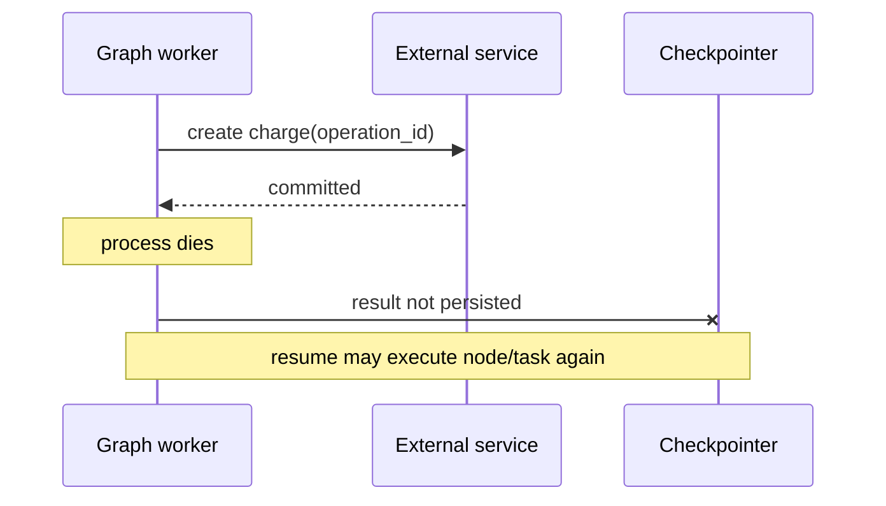

# LangGraph Durability, Replay, and External Effects

**Research date:** 2026-08-31
**Status:** Research-backed reliability guide

## Durable state is not exactly-once execution

LangGraph can persist checkpoints and recorded task results so work can resume. There is still no atomic transaction spanning the checkpoint database and an arbitrary external service.



No checkpoint can infer from a missing receipt whether the external service committed.

## What can cause re-execution

- node retry after a retryable exception or timeout;
- process, worker, or host failure;
- loss of an asynchronous checkpoint window;
- interrupt resume re-entering a node;
- replay/time travel from an older checkpoint;
- subgraph namespace/recovery behavior;
- operator state edit or manual rerun;
- code or backend defect;
- client retry against a service boundary without idempotency.

Design every external action for at-least-once invocation.

## Functional API tasks

`@task` records task results and is the correct place for nondeterminism or external work in the Functional API. Recorded results can be reused when a workflow resumes the same deterministic sequence. A task can still rerun if it began but did not durably complete. It therefore needs idempotency and reconciliation.

Keep branching and task order deterministic outside tasks. Time, random numbers, model calls, network reads, and mutable global state used to select which task comes next can break replay alignment.

## Effect protocol

Use an application effect ledger:

```text
operation_id: stable for the logical effect
tenant_id
effect_type
target
normalized_arguments_hash
status: reserved | sent | committed | failed | unknown
external_id
attempts
created_at / updated_at
policy_and_approval_reference
```

### Safe flow

1. Derive or reserve a stable operation ID.
2. Authenticate and authorize the exact effect.
3. Insert/reserve the operation under a uniqueness constraint.
4. Call the external system with that idempotency key when supported.
5. Persist the external receipt.
6. Return only after the ledger can answer a retry.
7. If delivery is ambiguous, query/reconcile rather than repeat.

For systems without idempotency support, use a domain-specific deduplication record, transactional outbox, or manual reconciliation.

## Retry policy

Retry only failures classified as transient and only when the operation is safe to repeat. Bound attempts and elapsed time. Honor downstream retry hints and add jitter.

Current 1.2 documentation marks per-node timeout and node-level error-handler features as alpha. The documented default retry classifier has concrete exception choices that may not match your domain. Supply an explicit classifier and pin the version before relying on it.

| Failure | Default action |
|---|---|
| Validation/policy denial | Do not retry |
| Provider 429/5xx before effect | Bounded retry |
| Timeout with idempotency key | Query status, then retry if safe |
| Connection lost after write | Mark unknown and reconcile |
| Programmer error | Fail and alert |
| Human rejection | Terminal business result |

## Time travel

Replay skips nodes before the selected checkpoint and re-executes later nodes. Forking with an update creates an alternate checkpoint lineage. Later model calls, APIs, and interrupts can all happen again and can produce different outputs.

Use time travel for:

- debugging and root-cause reproduction;
- counterfactual evaluation;
- controlled repair with effects disabled or mocked;
- branching a draft before commit.

Do not label it “undo” when external systems have already changed. A compensating action is a new effect with its own authorization and receipt.

## Durability modes and failure windows

`sync`, `async`, and `exit` change when graph state is persisted. None changes the effect protocol above. Test the exact saver and host combination.

Issue #8039 reported an open 2026 reproduction where ordering of pending writes and checkpoint writes under `sync` could make post-crash node reuse host-dependent in tested 1.2.0/1.2.4 environments. Treat it as a targeted regression test, not proof about every later version. The safe production contract remains that effects may repeat.

## Cancellation and timeout

A node timeout means the runtime stopped waiting or cancelled the task according to its mechanism; it does not guarantee a thread, subprocess, provider request, or remote write ceased. Downstream clients need deadlines and cancellation propagation, and effect status may remain unknown.

## Failure-injection matrix

| Injection point | Expected graph recovery | Effect assertion |
|---|---|---|
| Before reserve | Node may rerun | No operation exists |
| After reserve, before send | Node may rerun | Same operation ID continues |
| After send, before response | Node may rerun | Reconcile external status |
| After response, before checkpoint | Node may rerun | Ledger returns prior receipt |
| After checkpoint | Later node resumes | No repeated effect |
| During replay | Later nodes execute | Effects disabled, deduped, or explicitly reauthorized |

## Acceptance checklist

- [ ] Kill the process at every row in the matrix.
- [ ] Repeat under each durability mode.
- [ ] Repeat on different CPU counts and database latency.
- [ ] Replay from every checkpoint before and after an effect.
- [ ] Retry identical client run-creation requests.
- [ ] Cancel during each downstream call.
- [ ] Verify a compensation is never confused with rollback.
- [ ] Alert and expose an operator workflow for effects stuck `unknown`.

## Sources

- [Functional API: determinism and idempotency](https://docs.langchain.com/oss/python/langgraph/functional-api)
- [Persistence and pending writes](https://docs.langchain.com/oss/python/langgraph/persistence)
- [Time travel](https://docs.langchain.com/oss/python/langgraph/use-time-travel)
- [Fault tolerance](https://docs.langchain.com/oss/python/langgraph/fault-tolerance)
- [Durability ordering issue #8039](https://github.com/langchain-ai/langgraph/issues/8039)

Next: [Agent Server operations](agent-server-deployment-and-operations.md).
