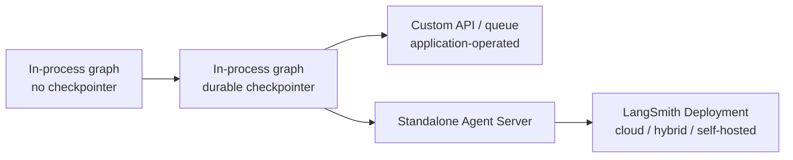

# LangGraph Ecosystem Boundaries

**Research date:** 2026-08-31
**Status:** Research-backed boundary guide

## Why this distinction matters

“LangGraph” is often used loosely for a library, a server API, a deployment product, an observability product, or a high-level agent assembled with LangChain. Architecture claims become unreliable when the layer is not named.

## The layers

| Layer | It owns | It does not inherently own |
|---|---|---|
| LangGraph library | StateGraph and Functional authoring APIs, Pregel-style execution, state channels/reducers, checkpoint protocol, interrupts, replay, subgraphs, streaming | Hosted queue, fleet scheduling, identity provider, tool sandbox, model integrations, exactly-once effects |
| LangGraph checkpoint/store packages | Saver/store protocols and specific backends | Tenant authorization, domain transactions, retention policy, managed database operations |
| LangChain agents | `create_agent`, model/tool abstractions, middleware, structured output and integrations, running on LangGraph | Agent Server operations, hard containment, business workflow truth |
| Deep Agents | Opinionated planning, files, context offload, memory, subagents, sandbox adapters | The LangGraph core contract or a universal security architecture |
| Agent Server | Assistants, threads, runs, cron jobs, API/worker topology, queue, leases, persistence integration, cancellation signaling, SSE | LangSmith evaluation by definition, external effect atomicity, authorization policy correctness |
| LangSmith | Tracing, datasets, experiments, evaluators, monitoring and optional deployment control plane | The graph's business logic, tool authorization, external effect reconciliation |

The open-source library can be used without LangChain. LangChain's current high-level agent runs on the LangGraph runtime. The older LangGraph `create_react_agent` prebuilt was deprecated in the v1 line in favor of LangChain `create_agent`. Deep Agents adds a harness above these layers; it is not another name for raw LangGraph.

## Five deployment shapes

### In-process without persistence

Useful for deterministic transformations, request-scoped routing, tests, and workflows where restart-from-input is acceptable. No interrupt or recovery claim should depend on `InMemorySaver` surviving a process.

### In-process with a durable checkpointer

Adds thread-scoped checkpoints, inspection, interrupts, history, replay, and recovery. The application still owns HTTP admission, concurrency policy, queuing, scheduling, cancellation propagation, availability, and store lifecycle.

### Application-operated service

A team may wrap the graph in its own API and queue. This can be the right choice when a mature platform already supplies identity, jobs, tenancy, SLOs, and databases. Document the custom semantics rather than describing them as LangGraph defaults.

### Standalone Agent Server

Adds the server resource model and queue/worker runtime without requiring the LangSmith control plane. Official guidance warns not to place standalone servers in scale-to-zero serverless environments because reliable task ownership needs long-running workers.

### LangSmith Deployment

Cloud, hybrid, and self-hosted options combine deployment management with the wider LangSmith product. Hybrid keeps the data plane in the customer's cloud while the managed control plane remains external; this has an explicit egress and data-flow consequence.

## Product nouns are not interchangeable

| Noun | Meaning |
|---|---|
| Graph | Compiled executable graph definition |
| Assistant | A deployed graph plus configuration |
| Thread | Logical state/checkpoint lineage across runs |
| Run | One execution request against an assistant, optionally on a thread |
| Checkpoint | State snapshot at a superstep boundary |
| Store item | Application-defined cross-thread data under a namespace/key |
| Trace | Observability record; not the execution source of truth |
| Dataset example | Evaluation input/reference record; not a production thread |

Never use a trace ID as a thread authorization decision or a thread ID as an effect idempotency key without a separate operation dimension. One thread can contain many runs and effects; one trace may sample or omit spans.

## Capability claim template

Use this language in design documents:

> We run LangGraph Python version X with saver Y under deployment shape Z. Agent Server version/image A provides queue and per-thread run admission. Application service B provides authentication, authorization, effect idempotency, and reconciliation. LangSmith project C receives redacted traces at sampling policy D.

This is auditable. “LangGraph handles durability and security” is not.

## Boundary acceptance tests

- [ ] Stop the Python process and confirm which state survives.
- [ ] Kill a queue worker after lease acquisition and during checkpoint commit.
- [ ] Disconnect an SSE client and verify whether the run continues and how it rejoins.
- [ ] Submit two runs to the same thread and to different threads.
- [ ] Disable LangSmith and prove execution still behaves correctly.
- [ ] Bypass LangChain tool middleware and call the domain service directly with unauthorized input.
- [ ] Restore PostgreSQL without Redis and Redis without PostgreSQL in a staging environment.
- [ ] Verify whether a feature named in the design exists in the library, Agent Server, or LangSmith tier actually purchased and deployed.

## Sources

- [LangGraph overview](https://docs.langchain.com/oss/python/langgraph/overview)
- [LangGraph v1](https://docs.langchain.com/oss/python/releases/langgraph-v1)
- [Agent Server architecture](https://docs.langchain.com/langsmith/agent-server)
- [Standalone Agent Server](https://docs.langchain.com/langsmith/deploy-standalone-server)
- [LangSmith platform setup](https://docs.langchain.com/langsmith/platform-setup)
- [Hybrid deployment](https://docs.langchain.com/langsmith/hybrid)

Next: [runtime mental model](runtime-mental-model.md) or [selection and alternatives](selection-and-alternatives.md).
