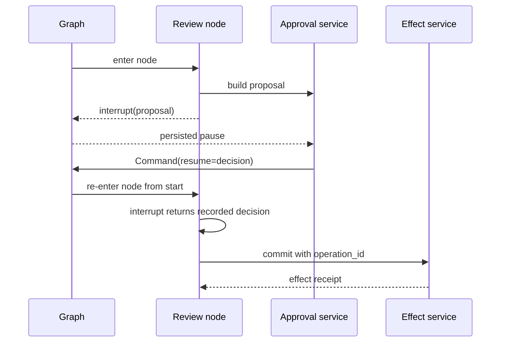

# LangGraph Interrupts, Human-in-the-Loop, and Resume

**Research date:** 2026-08-31
**Status:** Research-backed control-flow guide

## The critical semantic

`interrupt(payload)` persists graph state and returns control to the caller. Resuming with `Command(resume=value)` on the same thread makes that value available to the interrupt call—but the node restarts from its beginning. It does not continue from a suspended Python instruction.



Any code before the interrupt can run again. That includes logging, randomness, database reads, model calls, and external writes.

## A production approval record

Do not interrupt with “Approve?” and resume with `true`. Use a proposal:

```text
proposal_id
thread_id and run_id
action type
target resource and current version
normalized arguments
human-readable explanation
policy version and risk class
created_at and expires_at
proposal hash
```

The resume command should carry or reference:

```text
proposal_id and hash
decision: approve / reject / edit
approved arguments if edited
actor identity and assurance level
reason
decided_at
```

On resume, reauthenticate the caller, authorize the actor for this exact action, compare the proposal hash, check expiry, and revalidate the resource version. Approval is permission to attempt a specific operation, not proof that the operation succeeded.

## Placement rules

- Put pure proposal construction before `interrupt`.
- Put the non-idempotent commit after a validated approval.
- If work before the interrupt is expensive or nondeterministic, place it in a checkpointed task or preceding node.
- Never wrap `interrupt` in a broad `try/except`; it uses control-flow signaling.
- Keep the order and conditional structure of multiple interrupts stable across resume.
- Use JSON-safe, size-bounded payloads; persist large evidence separately and reference it.

## Multiple and parallel interrupts

Multiple interrupts inside one task are matched by execution order. Parallel branches can surface several outstanding decisions. Build the UI around stable interrupt IDs and proposal IDs, not list position alone.

Parallel approval paths deserve an adoption test. Issue #6626 documented a 2025 collision where parallel tool interrupts received identical IDs; it was closed, but it remains a valuable regression fixture for every pinned version and language implementation.

Test:

1. two different parallel branches pause;
2. decisions arrive in either order;
3. one approves and one rejects;
4. the process restarts before resume;
5. the graph/version changes while paused;
6. a duplicate resume request arrives;
7. an unauthorized user guesses the thread or interrupt ID.

## Validation loops

Human input can be invalid. A review node can interrupt again with a validation error, but interrupt ordering must remain deterministic. Prefer a single versioned envelope whose response schema can express validation failure, or put repeated review in its own explicit graph loop.

Bound review loops and define abandonment:

- maximum invalid submissions;
- expiry;
- escalation destination;
- cancellation state;
- retention/deletion policy;
- behavior when the approving user loses permission while the thread waits.

## Static breakpoints versus dynamic interrupts

Static `interrupt_before`/`interrupt_after` breakpoints are useful for debugging. Dynamic `interrupt()` is the application control-flow primitive. Do not build a production approval protocol around a Studio-only breakpoint.

## Resume and migration

Paused threads are more migration-sensitive than completed threads. Current compatibility guidance says an interrupted thread cannot safely tolerate removing or renaming a node it may resume into. Interrupt payload and resume schema changes also need a compatibility path.

Use:

- a version field in the proposal and response;
- tolerant readers for old optional fields;
- add-then-remove migrations;
- a drain/migrate/cancel policy for old paused threads;
- canary resume tests against the oldest supported checkpoint.

## Approval is not containment

A reviewer can be tricked, overprivileged, or mistaken. Enforce deterministic policy at commit:

- allowed tool/action;
- target tenant/resource;
- argument constraints;
- credential scope;
- egress and sandbox boundary;
- rate and financial limits;
- idempotency key;
- resource version;
- complete audit event.

## Acceptance checklist

- [ ] Resume after a fresh process, host, and deployment version.
- [ ] Duplicate the resume request and prove one logical decision.
- [ ] Replay from before and after the interrupt.
- [ ] Alter the resource after proposal and before approval.
- [ ] Expire and revoke an approval.
- [ ] Resume all parallel decisions in different orders.
- [ ] Reject oversized, malformed, and non-JSON values.
- [ ] Verify code before the interrupt can repeat without harm.
- [ ] Verify effect code after approval reconciles ambiguous outcomes.

## Sources

- [LangGraph interrupts](https://docs.langchain.com/oss/python/langgraph/interrupts)
- [Functional API determinism](https://docs.langchain.com/oss/python/langgraph/functional-api)
- [Time travel](https://docs.langchain.com/oss/python/langgraph/use-time-travel)
- [Parallel interrupt issue #6626](https://github.com/langchain-ai/langgraph/issues/6626)

Next: [durability, replay, and effects](durability-replay-and-effects.md).
