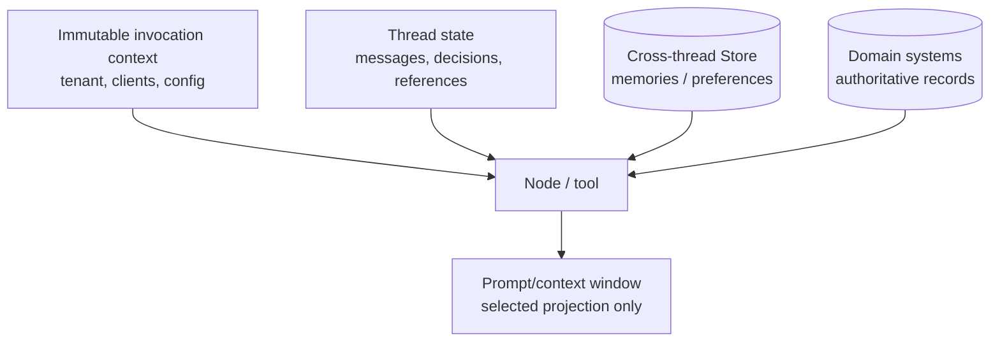
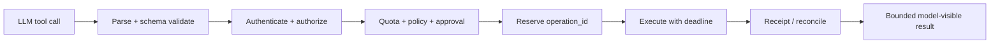

# LangGraph Models, Tools, Runtime Context, and Memory

**Research date:** 2026-08-31
**Status:** Research-backed integration guide

## LangGraph does not require LangChain

Nodes are ordinary sync or async functions. They may call any model or service client. LangChain model and tool abstractions are common integrations, but they are a neighboring layer. Keep the distinction visible when debugging, upgrading, and assigning security ownership.

## Four data planes

The model context window should be a deliberately selected projection. Do not dump all state, store memories, and traces into every prompt.

## Model call boundary

A model node should record:

- provider and model identifier;
- model configuration and prompt/template version;
- normalized request ID and provider request ID;
- input evidence references;
- structured-output schema version;
- token/usage and latency when available;
- finish/stop reason;
- retry attempt;
- raw diagnostic reference under restricted retention.

Provider-neutral wrappers normalize a useful subset. They do not guarantee identical tool-call ordering, structured-output enforcement, usage, safety settings, caching, or cancellation.

## ToolNode and custom execution

`ToolNode` is an optional prebuilt dispatcher. It validates the requested tool name against registered tools and relies on the tool's schema for arguments. Runtime data can be injected through state/store/context mechanisms.

For production, wrap every effectful tool behind an application-owned executor:

The model-visible tool result should be smaller and less sensitive than the internal receipt.

## Error taxonomy

| Error | Model sees? | Retry |
|---|---|---|
| Invalid arguments | Safe validation detail | Model may repair within budget |
| Unknown tool | Allowed-tool summary | Model may choose again |
| Authorization denial | Minimal deterministic denial | Never retry unchanged |
| Rate limit/transient dependency | Bounded status | Runtime retry if idempotent |
| Ambiguous external write | “Outcome pending reconciliation” | Reconcile, do not repeat blindly |
| Internal bug/secret-bearing error | Generic failure ID | No model detail; alert operator |

Do not let a raw exception become a prompt-injection or secret-exfiltration channel.

## Runtime context

Use `context_schema` and the runtime object for invocation-scoped dependencies such as authenticated identity, database/client handles, feature flags, and model selection. Context is not automatically a security boundary: a node can misuse what it receives.

Pass the least capability:

- tenant-scoped repository rather than an unrestricted database;
- short-lived delegated token rather than a platform credential;
- read-only client in a read node;
- effect service that rechecks authorization rather than raw network access.

## Short-term memory

Thread state can preserve conversation messages and working facts across runs. Separate:

- immutable user/request inputs;
- model messages;
- verified domain facts;
- provisional model claims;
- tool receipts;
- summary projections.

Summaries are lossy derived artifacts. Store the source references and summary version so a later node can determine what evidence was omitted.

## Long-term memory and Store

Store items use namespace and key organization and may support semantic search. Treat memory writes as untrusted content:

- authorize namespace and item;
- validate a typed schema;
- record author/source/provenance;
- apply optimistic concurrency;
- cap item count, bytes, and retrieval count;
- distinguish human-owned instructions from agent-authored memory;
- support review, expiry, deletion, and rollback;
- defend retrieval against prompt injection.

Embedding similarity is relevance evidence, not authorization or truth.

## Context budgeting

Create a deterministic context assembly node or service:

1. mandatory system/policy instructions;
2. current normalized request;
3. relevant verified domain facts;
4. bounded recent messages;
5. retrieved memories with provenance;
6. tool schemas allowed for this actor/action;
7. remaining budgets.

Measure tokens before the call. Define what is dropped, summarized, or rejected when over budget. Do not silently remove approval constraints or safety policy.

## Integration tests

- [ ] Swap model providers and compare tool, stream, usage, and structured-output behavior.
- [ ] Fuzz tool names and nested arguments.
- [ ] Attempt to override injected runtime fields from model arguments.
- [ ] Cancel during model streaming and tool execution.
- [ ] Make a tool return megabytes, binary data, HTML, and malicious instructions.
- [ ] Retrieve another tenant's memory using similar text.
- [ ] Race two memory updates and verify conflict handling.
- [ ] Rotate credentials while a thread is paused.
- [ ] Prove the prompt contains only the intended state projection.

## Sources

- [LangGraph overview](https://docs.langchain.com/oss/python/langgraph/overview)
- [Runtime context](https://docs.langchain.com/oss/python/concepts/context)
- [LangChain tools and ToolRuntime](https://docs.langchain.com/oss/python/langchain/tools)
- [LangGraph memory](https://docs.langchain.com/oss/python/langgraph/add-memory)
- [Persistence and Store](https://docs.langchain.com/oss/python/langgraph/persistence)

Next: [security and multi-tenancy](security-and-multi-tenancy.md).
