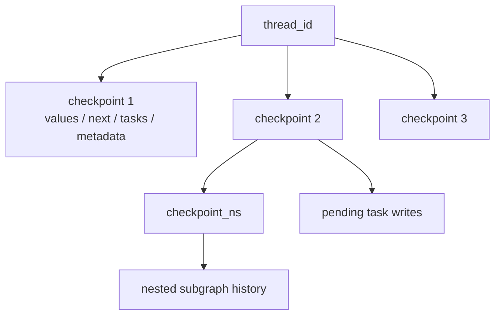

# LangGraph Persistence, Checkpoints, and Threads

**Research date:** 2026-08-31
**Status:** Research-backed persistence guide

## What is persisted

With a checkpointer, LangGraph saves a `StateSnapshot` at superstep boundaries and can save task-level writes from nodes that complete within an in-progress superstep. Snapshots are organized by `thread_id`, `checkpoint_ns`, and `checkpoint_id`.

This supports:

- short-term thread memory;
- human interrupts;
- state history and inspection;
- replay and forks;
- recovery from the last persisted boundary;
- retention of successful sibling writes when another parallel node fails.

It does not create an atomic transaction with an external API or domain database.

## Thread identity

A thread ID is a persistent cursor and an authorization-sensitive resource key. Reusing one loads and extends its state. Using a new one starts a new lineage.

Generate thread IDs server-side or map an opaque client identifier through an authorization layer. Never let knowledge of a thread ID grant access. Bind every create, read, update, search, run, stream, and delete operation to tenant and actor policy.

Keep these separate:

- tenant ID;
- user ID;
- conversation/workflow ID;
- thread ID;
- run ID;
- checkpoint ID;
- external effect operation ID.

## Checkpointer and store

| System | Scope | Contents | Primary access |
|---|---|---|---|
| Checkpointer | One thread lineage | graph state snapshots and writes | `thread_id`, optional checkpoint |
| Store | Cross-thread namespace | application-defined documents | namespace + key/search |
| Domain database | Business aggregate | authoritative records and transactions | domain key/version |

Do not use the store namespace as the only tenant security boundary. Apply authorization outside the query and use fixed, validated namespace segments. A July 2026 advisory showed how prefix matching in older PostgreSQL/SQLite store versions could cross namespace segment boundaries; versions 3.1.1 fixed it.

## Saver selection

The current reference positions in-memory saving for tests, SQLite for local/lightweight use, and PostgreSQL saving for production workloads. A production selection must still test:

- async method support matching `ainvoke`/`astream`;
- transaction and isolation behavior;
- connection pool and timeout settings;
- schema setup and migrations;
- backup/restore and point-in-time recovery;
- retention and deletion;
- encryption and key rotation;
- maximum thread ID/state/blob sizes;
- high-contention same-thread and cross-thread load.

Agent Server injects its own checkpointer and store. Do not compile a separate saver into a graph deployed there unless the specific server integration instructs it.

## Snapshot and pending-write semantics

Suppose nodes A and B run in one superstep. A succeeds and B fails. The checkpointer can persist A's task writes so a resume does not need to rerun A. This improves recovery, but the safe external-effect rule remains “may execute again” because:

- A might have performed the effect before its task write committed;
- durability mode changes the persistence window;
- process death can occur at any instruction;
- an operator can replay from an earlier full checkpoint;
- version-specific bugs can affect ordering or nested checkpoints.

Pending writes are recovery data, not an exactly-once receipt.

## Durability modes

| Mode | Persistence | Use | Residual risk |
|---|---|---|---|
| `sync` | Persist changes before next step | Recovery-sensitive flows | More latency; external effect still not atomic |
| `async` | Persist while next step executes | Default performance/durability balance | Crash can lose the latest checkpoint |
| `exit` | Persist when execution exits, including interrupt/error | Short flows where mid-run recovery is unnecessary | Process crash can lose intermediate progress |

Measure the latency and recovery point under the selected backend. Do not choose `sync` by slogan; prove it at injected crash points.

## Serialization and trust

The default `JsonPlusSerializer` supports LangGraph/LangChain types and more than plain JSON. Serializer capabilities and advisories have changed. Treat the checkpoint database as trusted infrastructure:

- deny untrusted write access;
- pin fixed serializer/checkpoint packages;
- avoid enabling pickle fallback for data an attacker could influence;
- validate state again after deserialization;
- encrypt sensitive state and independently test restore/key rotation;
- do not checkpoint raw long-lived credentials;
- audit all security advisories, not only the `langgraph` core version.

## Storage growth

Full channel values may be written at every superstep. Append-heavy messages and evidence can make each checkpoint larger than the last. `DeltaChannel` was beta in the 1.2 line; use it only with explicit compatibility and recovery tests.

Control growth through:

- bounded state and artifacts stored by reference;
- transcript compaction with provenance;
- thread TTL and explicit deletion workflows;
- checkpoint retention policy;
- archival required by audit rules;
- per-tenant storage quotas;
- restore-time and history-query SLOs.

Agent Server documentation notes that deleting a thread also deletes associated runs and checkpoints; verify store items and external artifacts separately.

## Recovery drills

- [ ] Crash before and after every checkpoint boundary.
- [ ] Kill the database connection during `put_writes` and checkpoint commit.
- [ ] Restore the database to a new environment and resume old threads.
- [ ] Resume an interrupted thread after code and schema migration.
- [ ] Replay a parallel superstep with one successful and one failed node.
- [ ] Delete a thread and verify runs, checkpoints, store items, traces, and artifacts against policy.
- [ ] Load test state history and latest-state reads at the retention limit.
- [ ] Verify cross-tenant searches cannot escape namespace and auth filters.

## Sources

- [LangGraph persistence](https://docs.langchain.com/oss/python/langgraph/persistence)
- [Checkpoint reference](https://reference.langchain.com/python/langgraph/checkpoints)
- [Durability type reference](https://reference.langchain.com/python/langgraph/types/Durability)
- [Store namespace advisory GHSA-47pj-3jcm-6whg](https://github.com/langchain-ai/langgraph/security/advisories/GHSA-47pj-3jcm-6whg)
- [Agent Server persistence](https://docs.langchain.com/langsmith/agent-server)

Next: [interrupts and resume](interrupts-human-in-the-loop-and-resume.md) and [durability, replay, and effects](durability-replay-and-effects.md).
