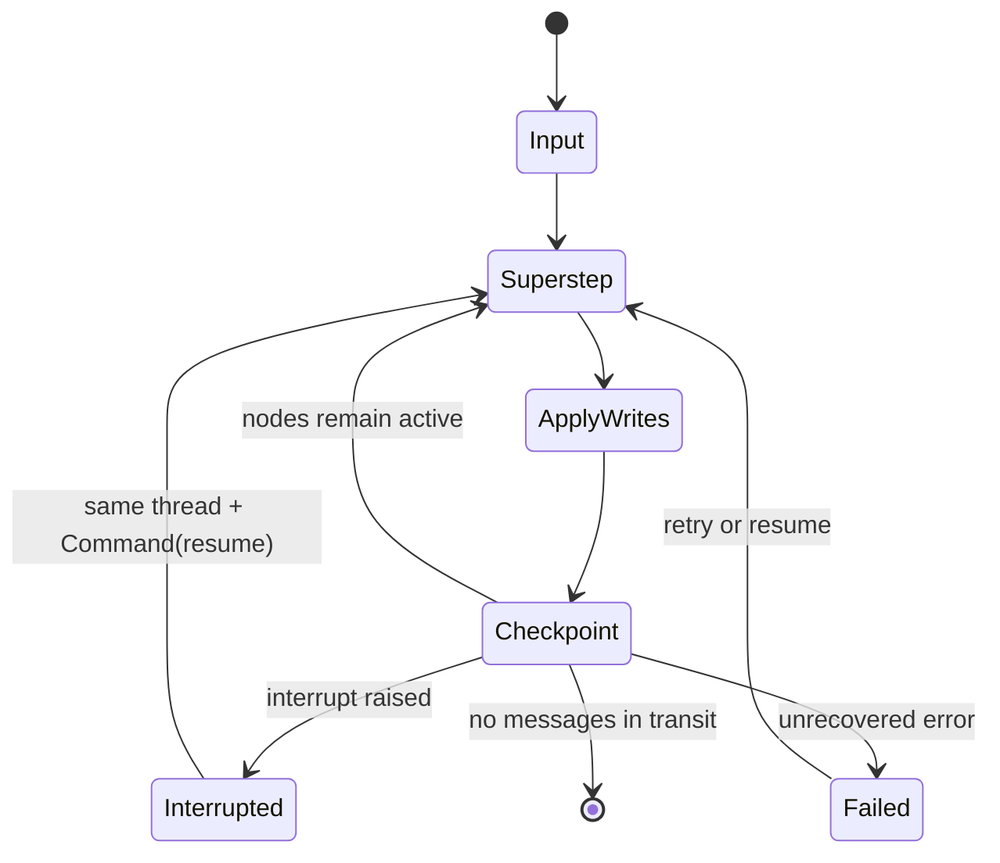
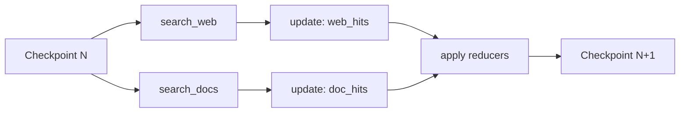

# LangGraph Runtime Mental Model

**Research date:** 2026-08-31
**Status:** Research-backed runtime guide

## The shortest accurate model

LangGraph compiles application functions and routing rules into a message-passing program. Active nodes execute in discrete supersteps, publish state updates to channels, and schedule later nodes through edges or commands. A checkpointer can persist the state at superstep boundaries and task writes inside a superstep.

This is closer to a bulk-synchronous state machine than to a call stack that can be frozen at an arbitrary instruction.

## Graph API and Functional API

Both authoring APIs use the same underlying runtime.

| Question | Graph API | Functional API |
|---|---|---|
| Primary unit | State, nodes, edges | `@entrypoint`, ordinary control flow, `@task` |
| Best when | Transitions and parallel branches must be explicit | Existing procedural code needs checkpointed tasks and interrupts |
| Visibility | Topology is directly inspectable | Control flow stays close to ordinary Python |
| Replay obligation | Nodes and effects may repeat | Entrypoint code repeats; recorded tasks can be reused |
| Common mistake | Giant nodes or ambiguous reducers | Nondeterminism outside tasks |

Choose for readability and testability, not because one API is “more durable.”

## Supersteps and parallel work

If a node has multiple outgoing edges, their destination nodes can execute in the next superstep. They read the state that existed at the start of that step and emit independent updates. The runtime then combines updates with per-key reducers.

Do not assume one parallel node sees another parallel node's update. Put a barrier between dependent stages.

## Scheduling and routing

Use one routing mechanism from a node:

- fixed edges for unconditional topology;
- conditional edges for a routing function;
- `Command(update=..., goto=...)` when state update and dynamic routing belong together;
- `Send` for dynamic fan-out/map work.

Mixing a static outgoing edge with `Command(goto=...)` can schedule both paths. That may be intentional, but it is usually an accidental double route.

## State, context, and configuration

These carry different kinds of data:

| Surface | Lifetime | Mutability | Examples |
|---|---|---|---|
| State | Thread/run evolution | Updated through channels | messages, classification, result IDs |
| Runtime context | One invocation | Application-supplied, conceptually immutable | tenant identity, clients, model choice |
| Store | Across threads | Explicit reads/writes | user preferences, durable agent memory |
| Runnable config | Invocation/execution control | Framework/application metadata | thread ID, tags, recursion limit |

Credentials, database connections, and policy engines belong in runtime context or application services—not checkpointed state. A domain record belongs in its domain database; graph state should carry the record ID and version.

## Limits are separate

The recursion limit bounds supersteps, not all resource use. At this research snapshot the documented default is 1,000 steps, but a single step may still perform many parallel tools, stream large bodies, or wait on slow dependencies.

Set independent bounds:

- supersteps and remaining steps;
- model/tool calls per run and per node;
- fan-out width and nested graph depth;
- per-attempt, per-node, and run deadlines;
- queued and active runs;
- input, state, checkpoint, tool-result, and stream-event bytes;
- tokens and cost;
- retries and elapsed retry time.

## Cancellation is a protocol

Stopping a graph consumer does not prove that a model call, task, worker, subprocess, or external write stopped. Agent Server can signal cancellation to workers, but application code and downstream clients must cooperate. Record an ambiguous effect as unknown and reconcile by operation ID.

## Compile-time and runtime validation

`compile()` performs graph-structure checks and attaches runtime resources such as a checkpointer. It does not prove:

- reducers are algebraically safe under concurrency;
- routes terminate;
- tool schemas are authorized;
- code is deterministic across replay;
- checkpoints remain compatible after upgrades;
- external effects are idempotent.

Those are application tests.

## Review checklist

- [ ] Each node has one responsibility and a named failure policy.
- [ ] Every fan-out has a join/merge contract.
- [ ] Each state field has an owner, reducer, retention class, and size budget.
- [ ] Routing uses one intentional mechanism per node.
- [ ] Runtime context is not accidentally serialized into checkpoints.
- [ ] Nondeterminism and external work have an explicit replay boundary.
- [ ] Run limits cover more than recursion.
- [ ] Cancellation and unknown outcomes have a reconciliation path.

## Sources

- [Graph API overview](https://docs.langchain.com/oss/python/langgraph/graph-api)
- [Functional API](https://docs.langchain.com/oss/python/langgraph/functional-api)
- [Use the Graph API](https://docs.langchain.com/oss/python/langgraph/use-graph-api)
- [Runtime context](https://docs.langchain.com/oss/python/concepts/context)

Next: [state, graphs, nodes, and reducers](state-graphs-nodes-and-reducers.md).
