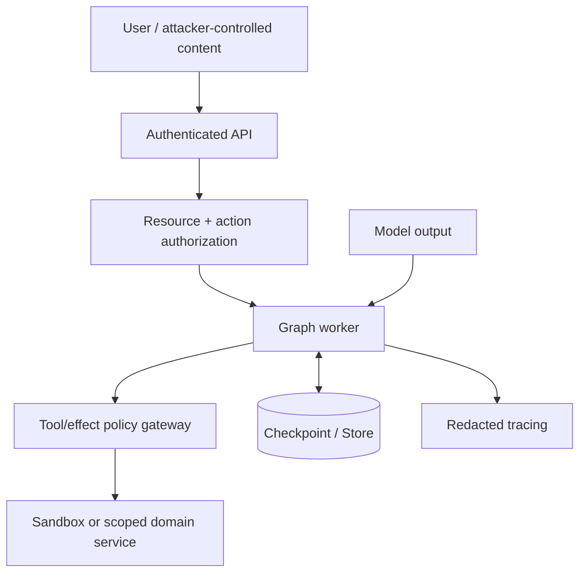

# LangGraph Security and Multi-Tenancy

**Research date:** 2026-08-31
**Status:** Research-backed security guide

## The security boundary is your application and infrastructure

LangGraph executes application-provided Python functions and optional model-selected tools. It does not sandbox them. Treat model output, user input, retrieved content, tool results, resume values, checkpoint data, stream metadata, and remote graph responses as untrusted.

## Trust boundaries

Enforce identity and policy at API admission and again immediately before an external effect.

## Agent Server authentication and authorization

Current docs state:

- LangSmith-hosted service uses API keys by default and can use custom handlers.
- Self-hosted Agent Server has no default authentication.
- `@auth.authenticate` verifies credentials for requests.
- `@auth.on` handlers authorize specific resources/actions and can attach/filter metadata.

Use a fail-closed global handler plus explicit allowed resource/action handlers. Scope threads, runs, assistants, crons, and store access by trusted tenant/owner metadata. Do not accept ownership metadata from the request without overwriting it from authenticated identity.

The August 28, 2026 high-severity advisory GHSA-fvww-7h3r-vfhp found that `actions=` on resource-scoped Python SDK auth decorators could be silently ignored, broadening a handler to every action. Affected `langgraph-sdk` versions were 0.1.45 through 0.4.3; 0.4.4 is patched and has no workaround. Pin at least 0.4.4 and add negative authorization tests for every action.

## Tenant isolation

Use defense in depth:

- API authorization filters;
- tenant-scoped service/repository interfaces;
- database row-level or physical isolation where justified;
- validated fixed-length namespace segments;
- separate encryption context/keys where required;
- per-tenant rate, queue, token, cost, and storage quotas;
- traces routed and redacted by tenant policy;
- object storage prefixes and signed URLs scoped to tenant and artifact.

Never treat a Store namespace, thread ID, checkpoint namespace, LangSmith project, or vector similarity filter as sufficient isolation.

The July 2026 GHSA-47pj-3jcm-6whg advisory showed that older Postgres/SQLite store prefix matching could cross namespace segment boundaries. Upgrade those checkpoint packages to 3.1.1 or later and still keep authorization outside the storage query.

## Tool and effect security

For every tool:

1. allowlist tool name per actor/run state;
2. validate typed arguments and semantic constraints;
3. resolve target under tenant scope;
4. authorize current actor and policy version;
5. require approval for high-risk actions;
6. issue least-privilege short-lived credentials;
7. execute in a domain service or sandbox;
8. apply network/filesystem/process/resource limits;
9. record an idempotent effect receipt;
10. return a redacted, bounded result.

Human approval is not authorization code or containment. Recheck everything at commit.

## Checkpoint and serializer security

Checkpoint state can contain conversation history, tool arguments/results, identifiers, and personal data. Restrict database writes and reads. Encrypt at rest where required and test restores and key rotation.

The official advisory list contained multiple 2025–2026 serializer/cache deserialization vulnerabilities. Audit and pin the complete package set. Avoid untrusted checkpoint imports and pickle fallback. A database attacker with write access must be considered capable of corrupting control flow and state even when code execution is mitigated.

Define retention for:

- checkpoints and pending writes;
- Store items and embeddings;
- traces and evaluator output;
- approval proposals/receipts;
- tool artifacts;
- backups.

Deletion must cover derived copies and legal holds explicitly.

## Prompt injection and memory poisoning

Treat retrieved documents, tool output, memories, and subagent messages as data, not instructions. Preserve provenance and trust class. Model prompts should distinguish policy from evidence and should never embed secrets the model does not need.

Memory writes need:

- author and source;
- human/agent ownership;
- schema and allowed fields;
- concurrency/version;
- expiry and review;
- size/retrieval quotas;
- rollback;
- separation from immutable application policy.

## Streaming and trace leakage

Full-state `values` and `debug` streams can expose internal fields. Return client-specific schemas and redacted events. Do not let client-provided trace metadata replace trusted tenant tags. Ensure streaming reconnect endpoints and remote graph URLs are trusted and constrained.

## Secrets

Do not place long-lived secrets in graph state, interrupts, Store items, model messages, tool results, or trace metadata. Pass scoped capabilities through runtime context or a broker and rotate them independently of the thread.

Paused threads can outlive credentials and permissions. On resume, mint fresh credentials after reauthentication; never reuse a checkpointed token.

## Security test matrix

- [ ] Anonymous, wrong-tenant, and wrong-role access to every resource/action.
- [ ] Negative tests for auth decorator specificity and fallback handlers.
- [ ] Prefix, wildcard, Unicode, case, and path-like Store namespace labels.
- [ ] Malicious checkpoint/state import and unsupported serialized types.
- [ ] Tool-name, argument, injected-field, and output prompt injection.
- [ ] Cross-tenant subgraph, RemoteGraph, artifact, trace, and memory access.
- [ ] Approval replay, tampering, expiry, revocation, and actor permission loss.
- [ ] Sandbox escape, egress, filesystem, subprocess, and secret-access attempts.
- [ ] Oversized input/state/stream/tool output and fan-out denial of service.
- [ ] Complete user/tenant deletion through backups and derived stores.

## Patch floor at this snapshot

| Package/surface | Minimum driven by highlighted advisory | Also do |
|---|---|---|
| `langgraph-sdk` Python | 0.4.4 for GHSA-fvww-7h3r-vfhp | Test all resource/action denials |
| `langgraph-checkpoint-postgres` | 3.1.1 for GHSA-47pj-3jcm-6whg | Use tenant auth beyond namespaces |
| `langgraph-checkpoint-sqlite` | 3.1.1 for GHSA-47pj-3jcm-6whg | Keep SQLite out of multi-tenant production |
| Core/checkpoint/cache family | No single floor stated here | Review every official advisory and lock resolution |

Minimum fixed versions are not a recommendation to run old packages; use a current tested compatible set.

## Sources

- [Agent Server authentication and access control](https://docs.langchain.com/langsmith/auth)
- [Auth advisory GHSA-fvww-7h3r-vfhp](https://github.com/langchain-ai/langgraph/security/advisories/GHSA-fvww-7h3r-vfhp)
- [Store advisory GHSA-47pj-3jcm-6whg](https://github.com/langchain-ai/langgraph/security/advisories/GHSA-47pj-3jcm-6whg)
- [LangGraph security advisories](https://github.com/langchain-ai/langgraph/security/advisories)
- [Experimental repository threat model](https://github.com/langchain-ai/langgraph/blob/main/.github/THREAT_MODEL.md)
- [LangSmith shared responsibility model](https://docs.langchain.com/langsmith/shared-responsibility-model)

Next: [failure modes, migrations, and versioning](failure-modes-migrations-and-versioning.md).
