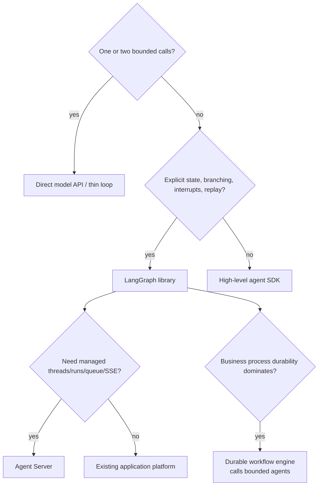

# Selecting LangGraph and Its Alternatives

**Research date:** 2026-08-31
**Status:** Research-backed decision guide

## Choose the smallest layer that proves the requirement

LangGraph is valuable when graph state and recovery are product concerns. It is overhead when the application is one model call, one optional tool call, and no long-lived state.

## Decision ladder

## Use raw LangGraph when

- state transitions and parallel merges must be explicit;
- checkpoint inspection and time travel aid operators;
- interrupt/resume is a product protocol;
- custom multi-stage or multi-agent topology is central;
- the team will own reducer, replay, effect, migration, and security semantics.

## Use LangChain `create_agent` when

- the primary requirement is a conventional model/tool loop;
- model/tool middleware and integrations remove real plumbing;
- custom graph topology is not yet needed;
- the team still accepts the underlying LangGraph runtime semantics.

Drop to raw LangGraph only for a specific control requirement. Do not start with a custom graph merely to imitate the high-level agent.

## Use Deep Agents when

- planning, filesystem/context offload, memory files, subagents, and sandbox adapters form the intended harness;
- you have independently selected a hard sandbox and permission model;
- you accept a more opinionated abstraction above LangChain and LangGraph.

Do not use it as another spelling for a generic state graph.

## Use Agent Server when

- the assistant/thread/run resource model fits;
- built-in queue, leases, per-thread serialization, SSE, and server persistence avoid duplicating platform work;
- deployment tier, data flow, auth customization, and backing-store operations meet requirements.

Prefer an existing internal service/job platform around the library when it already supplies stronger identity, scheduling, tenancy, SLOs, and operational expertise—and the team is willing to implement the missing graph server APIs.

## Prefer a durable workflow engine when

Temporal, Restate, DBOS, Dapr Workflow, or another durable engine may be the outer coordinator when the dominant needs are:

- years-long processes;
- schedules/timers and business SLAs;
- explicit activity retries and compensation;
- workflow versioning and operational repair;
- cross-service orchestration;
- strong ownership of non-agent business state.

Call a bounded LangGraph run as an activity or child service. Do not run an unbounded autonomous loop inside a retried activity without effect and timeout controls.

## Prefer ordinary code when

A normal state machine, queue consumer, or service handler is clearer for deterministic business rules. LLMs should supply classification/generation where needed, not own routing that code can decide exactly.

## Comparison matrix

| Dominant need | Start with | What to prove |
|---|---|---|
| Single structured response | Direct model API | Validation, timeout, provider error handling |
| Simple tool loop | Thin/high-level agent SDK | Turn/tool budget, approval, effect safety |
| Explicit graph and checkpoint inspection | LangGraph | Reducers, replay, state growth |
| Typed Python validation is central | Pydantic AI or typed custom loop | Retry taxonomy and durable integration |
| Web/TypeScript UI streaming is central | TypeScript-native SDK or LangGraph.js | Protocol, provider, and recovery parity |
| Opinionated coding/research harness | Deep Agents or another harness | Sandbox, files, subagent budgets |
| Managed LangGraph serving | Agent Server | Queue/lease/auth/data-plane operations |
| Long-lived business workflow | Durable workflow engine + bounded agent | Versioning, effects, compensation |
| Batch/data pipeline | Data orchestrator | Data lineage, scheduling, backfill |

## Adoption proof

Before selecting LangGraph, build one vertical slice that contains:

1. typed state with a parallel reducer;
2. a real durable checkpointer;
3. one interrupt and restart/resume;
4. one external effect with idempotency and reconciliation;
5. stream disconnect/rejoin;
6. a subgraph if composition is a requirement;
7. old-checkpoint migration;
8. trace/evaluation;
9. tenant isolation and negative auth tests;
10. crash injection at effect/checkpoint boundaries.

Compare the code and operational burden with a thin loop and with the team's existing workflow/job platform.

## Cost model

Include more than model tokens:

- graph and state schema maintenance;
- checkpoint storage, IOPS, retention, restore;
- queue/API/worker/Redis/PostgreSQL operations;
- trace/evaluation storage;
- state and interrupt migrations;
- incident response for ambiguous effects;
- framework and provider upgrade conformance;
- developer cognitive load.

LangGraph can reduce custom orchestration code while increasing runtime concepts. That trade is worthwhile only when the concepts map to real requirements.

## Exit strategy

Keep domain state and effects outside framework-specific messages. Define provider-neutral tool and effect contracts. Export audit records and artifacts independently. This makes it possible to replace:

- the model provider;
- LangChain model/tool integrations;
- the checkpointer/store backend;
- Agent Server with a custom platform;
- LangGraph itself for deterministic workflow segments.

## Sources and related guides

- [LangGraph overview](https://docs.langchain.com/oss/python/langgraph/overview)
- [Ecosystem boundaries](ecosystem-boundaries.md)
- [Agent Server](https://docs.langchain.com/langsmith/agent-server)
- [LangGraph v1](https://docs.langchain.com/oss/python/releases/langgraph-v1)
- [Repository framework overview](../langchain-langgraph-and-deep-agents.md)
- [Temporal for agent workflows](../temporal-for-agent-workflows.md)
- [Restate for agent workflows](../restate-for-agent-workflows.md)
- [DBOS for agent workflows](../dbos-for-agent-workflows.md)

Return to the [LangGraph playbook index](README.md).
